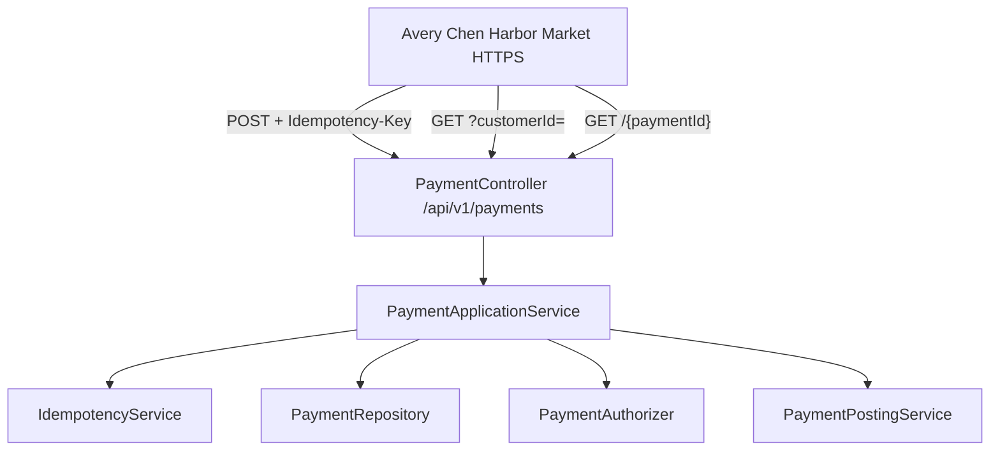

# CAPSTONE-1 — Build BayPay

**Type:** CAPSTONE  
**After:** Modules 1–3  
**Duration:** 4–8 hours  
**Cost:** **$0**  
**awsLab:** no  
**hideAnswerUpfront:** false (Hidden section is a checklist, not a dump)  
**Diagram:** AEJE-D-071 (current WebSphere estate — you are **not** rebuilding it)  
**Reference app:** [reference-apps/baypay](../../reference-apps/baypay)  
**Worksheet:** [student/worksheets/PF-service.md](../../student/worksheets/PF-service.md)  
**Topology (locked names only):** [datasets/baypay-cell/TOPOLOGY.md](../../datasets/baypay-cell/TOPOLOGY.md)

This capstone is the Modules 1–3 **quality bar** plus one missing read API. Harbor Market already has `POST /api/v1/payments` and `GET /api/v1/payments/{id}`. Avery Chen’s statements need `GET /api/v1/payments?customerId=`. You work in the existing Spring Boot 3.5.5 modular monolith on Java 21. You do **not** stand up `BayPayCell`, `dmgr-east`, or `PaymentCluster`. Traditional ND is the **source estate** drawn on AEJE-D-071. This delivery is the Boot teaching runtime.

---

## Scenario

Riley Okonkwo opened Harbor Market’s merchant console and found create-and-fetch. Finance asked for Avery Chen’s payment list on one screen. Jordan Voss will not accept a second Spring Initializr project. Priya Nair will not accept a list that drops `Idempotency-Key` from POST “to keep the controller small.” Sam Okada will not accept a card number in a log line because “the list is only for Avery.”

Your job is to prove the reference app, add list-by-customer with tests and Bean Validation, keep the create contract, refuse PAN in logs, and write PF-service.md in your own words.

---

## Business context

BayPay Financial Services (fictional) moves money for small merchants. Harbor Bike Co / Harbor Market charges Avery Chen through `POST /api/v1/payments`. A retry with the same `Idempotency-Key` must not debit her twice. The frozen USD account must not authorize.

| Role | Synthetic id |
|---|---|
| Customer Avery Chen | `11111111-1111-1111-1111-111111111111` |
| Active USD account | `22222222-2222-2222-2222-222222222221` |
| Frozen USD account | `22222222-2222-2222-2222-222222222222` |

The teaching process is `payment-service` (Java 21, Spring Boot 3.5.5) in `reference-apps/baypay`. Use `JAVA_HOME` and `./mvnw`. You do not need a global Maven install.

`PaymentController` today has **POST create** and **GET by id**. It does **not** have list-by-customer. That gap is this capstone. AEJE-D-071 still shows merchants → `ihs-east` → `PaymentCluster` → `db-east`. That drawing is the leftover cell. Do not rebuild ND to “make the list enterprise.” Do not recommend a new ear on `PaymentCluster` for a read that belongs on Boot.

Finance treats a second completed payment for one `Idempotency-Key` as a Sev-2. Compliance treats a PAN, CVV, or full track in application logs as an incident, not a debug convenience.

---

## Learning objectives

- Prove `reference-apps/baypay` on your machine with `./mvnw test` before you change behavior.
- Add `GET /api/v1/payments?customerId=` so Avery’s payments list, with Bean Validation on the query and tests that would fail if the method were missing.
- Keep `Idempotency-Key` required on POST: `201` first create, `200` identical replay, `409` key reuse with a new body, `400` when the header is absent, `422` + `DECLINED` for the frozen account.
- Keep `GET /api/v1/payments/{paymentId}` as a single-resource read (`200` / `404`).
- Refuse PAN, CVV, and raw card-shaped payloads in logs. Prefer `paymentId`, `X-Correlation-Id`, and status.
- Fill PF-service.md so a Staff engineer can brief the list contract in five minutes.
- Name AEJE-D-071 as the current ND estate you are **not** rebuilding.

---

## Architecture

Course diagram **AEJE-D-071** is the **current** WebSphere topology (merchants → `ihs-east` → `PaymentCluster` / `RefundCluster` → `db-east`). You cite it so you can say what this capstone is **not**. The work runs here:



Alt text: Harbor Market calls the Spring Boot payment-service. POST create still goes through idempotency, authorization, and ledger posting. GET by id loads one payment. GET with customerId lists Avery Chen’s payments. The leftover BayPayCell on AEJE-D-071 is not in this request path.

Constructor injection only. No `new PaymentApplicationService`. Bean Validation already sits on `CreatePaymentRequest`. The list query needs the same discipline: a missing or unparseable `customerId` is `400`, not an empty array you invent to look friendly.

---

## Prerequisites

- Modules 1–3, especially BUILD-101 (domain), BUILD-102 (validation), and BUILD-301 (payment REST + `PaymentApiIT`).
- Java 21 on `PATH` or `JAVA_HOME` (example `/opt/homebrew/opt/openjdk@21`).
- Maven Wrapper in `reference-apps/baypay`. You do **not** need a global `mvn`.
- Comfort with Avery’s demo ids in [GETTING_STARTED.md](../../GETTING_STARTED.md).
- Ability to read `PaymentController`, `PaymentApplicationService`, and `PaymentRepository` without opening `solutions/`.

You do **not** need WebSphere ND, Docker, Kubernetes, or AWS. You do not apply anything in `us-west-2`.

---

## Environment setup

Pin the JDK, then prove the estate **before** you add the list:

```bash
export JAVA_HOME="${JAVA_HOME:-/opt/homebrew/opt/openjdk@21}"
java -version
cd reference-apps/baypay
./mvnw test
```

Expect the existing suite green, including `PaymentApiIT` (create, replay, conflict, frozen decline, missing key, OpenAPI). If that bar is red, fix your environment or your earlier Module 3 work. Do not start the list on a broken tree.

Optional local run (not the grade path):

```bash
./mvnw -pl payment-service -am spring-boot:run
```

API: `http://localhost:8080` · OpenAPI: `http://localhost:8080/swagger-ui.html` · Health: `http://localhost:8080/actuator/health`.

Work on a branch. Leave the class tree explainable. Do not create a second Boot app. Do not set `-Xmx` equal to a container or cgroup limit if you experiment with Docker later — this capstone is a laptop JVM and H2.

Do not open `solutions/CAPSTONE-1/` until your list tests have failed or passed on **your** code.

---

## Challenge/tasks

1. **Prove the reference app.** From `reference-apps/baypay`, run `./mvnw test`. Record the command and the result on PF-service.md. If `PaymentApiIT` is red, stop. The list is not a substitute for a broken create path.
2. **Read the gap.** Open `PaymentController`. Confirm POST create and GET by id. Confirm there is **no** `GET /api/v1/payments?customerId=`. Confirm `PaymentRepository` has `findById` / `findByIdempotencyKey` and not a customer list. Write that observation on the worksheet before you code.
3. **Add list-by-customer.** Implement `GET /api/v1/payments?customerId=` for Avery’s UUID. Return `200` and a JSON array of `PaymentResponse` (same shape as GET by id: `paymentId`, `customerId`, `accountId`, `amount`, `currency`, `status`, `reference`, timestamps). Newest first is the teaching order (`createdAt` descending). An existing customer with no payments is `200` and `[]`, not `404`.
4. **Bean Validation on the query.** `customerId` is required. Missing query → `400` with a validation / `VALIDATION_FAILED` envelope (ProblemDetail is fine). Unparseable UUID → `400`. Unknown customer UUID → `404` `CUSTOMER_NOT_FOUND`. Do not treat a missing query as “list everyone.” There is no unfiltered list in this course.
5. **Keep POST contracts.** Do not remove or weaken `Idempotency-Key`. Header may stay `required = false` on the mapping so the service still owns `400 IDEMPOTENCY_KEY_REQUIRED`. Replay, conflict, frozen `422` + `DECLINED`, and GET-by-id `404 PAYMENT_NOT_FOUND` must still pass `PaymentApiIT`.
6. **Tests you write.** Add (or extend) an IT that: creates at least two payments for Avery with distinct keys; lists `?customerId=11111111-1111-1111-1111-111111111111` and finds both `paymentId`s; returns `400` without `customerId`; returns `404` for a random customer UUID that is not seeded; still requires the key on POST. Assert OpenAPI lists the collection path with a `customerId` parameter if you publish `/v3/api-docs`.
7. **No PAN in logs.** Do not log request bodies that could hold a card number. Do not log CVV, expiry, or a “debug PAN” field you invented. Structured fields may include `paymentId`, `customerId` (UUID), status, and `X-Correlation-Id`. Grep your diff for `card`, `pan`, `cvv`, and raw `toString()` of the create body.
8. **Worksheet.** Fill every required section of PF-service.md in your words. Cite AEJE-D-071 as the ND estate you refused to rebuild. Attach a redacted excerpt of the list method, not a dump of the whole module.

---

## Validation

- [ ] `export JAVA_HOME=…` then `cd reference-apps/baypay && ./mvnw test` is green **before** you claim the list is done.
- [ ] Existing `PaymentApiIT` methods still pass: create `201` `COMPLETED`, replay `200` same `paymentId`, conflict `409` `IDEMPOTENCY_CONFLICT`, frozen `422` `DECLINED`, missing key `400` `IDEMPOTENCY_KEY_REQUIRED`, GET by id `200` / `404`.
- [ ] `GET /api/v1/payments?customerId=11111111-1111-1111-1111-111111111111` returns `200` and Avery’s payments after you create them. Both ids appear. Order is newest first (or you documented a stable sort you test).
- [ ] `GET /api/v1/payments` with no query is `400`, not a dump of H2.
- [ ] Unknown `customerId` is `404` `CUSTOMER_NOT_FOUND`, not `200 []` pretending the customer exists.
- [ ] Bean Validation (or equivalent handler) covers missing / invalid `customerId`. You did not hand-roll a silent default UUID.
- [ ] POST still requires `Idempotency-Key`. You did not move the key into the list query “for consistency.”
- [ ] Logs / code review: no PAN, CVV, track, or full create-body dump.
- [ ] You did not install `BayPayCell`, bounce `dmgr-east`, or add an ear to `PaymentCluster` to serve the list.
- [ ] PF-service.md is filled in your words. Instructor scores with [instructor/rubrics/CAPSTONE-1.md](../../instructor/rubrics/CAPSTONE-1.md).

Manual smoke after `spring-boot:run` (optional; tests are the grade path):

```bash
curl -sS -D - -X POST http://localhost:8080/api/v1/payments \
  -H 'content-type: application/json' \
  -H 'Idempotency-Key: cap1-avery-1' \
  -H 'X-Correlation-Id: capstone-1' \
  -d '{
    "customerId":"11111111-1111-1111-1111-111111111111",
    "accountId":"22222222-2222-2222-2222-222222222221",
    "amount":25.00,
    "currency":"USD",
    "reference":"cap1-invoice-1"
  }'

curl -sS "http://localhost:8080/api/v1/payments?customerId=11111111-1111-1111-1111-111111111111"
```

Expect the POST `201` and a list that includes that `paymentId`. Replay the POST with the same key; expect `200` and the same id still on the list once.

---

## Troubleshooting

| Symptom | What to check |
|---|---|
| `./mvnw` not found | You are not in `reference-apps/baypay`. Use the wrapper, not a global Maven you may not have. |
| Wrong Java version | `echo $JAVA_HOME` and `java -version`. Pin 21. Do not run this on 17 “because it compiled once.” |
| `PaymentApiIT` red after your edit | You broke create, replay, or mapping. GET list and GET `{id}` must coexist. Spring matches `/{paymentId}` vs `?customerId=`. |
| List mapping 404 | Collection GET must be `@GetMapping` on `/api/v1/payments` **without** a path id. Do not steal `{paymentId}`. |
| List returns every payment | You forgot `customerId` on the repository query. There is no “admin list all.” |
| Missing `customerId` returns `[]` | That hides a contract break. Required query → `400`. |
| Unknown customer returns `[]` | Look up the customer (or equivalent existence check). Empty list is for a **known** customer with no rows. |
| Replay became `201` | You removed `findReplay` or ignored `CreateResult.replay`. Restore the POST path; the list is not the fix. |
| `409` on identical retry | Canonical hash is `customerId\|accountId\|amount.toPlainString()\|currency\|reference`. Do not hash raw JSON. |
| Frozen account `500` | Decline still persists and returns `422` + payment body. |
| Constraint on query ignored | `@Validated` on the controller (or a dedicated query record) plus a `ConstraintViolationException` handler if `@RequestParam @NotNull` does not hit `MethodArgumentNotValidException`. |
| Tempted to add `-Xmx` equal to a Docker limit | Stop. This capstone is not a cgroup lab. Never set `-Xmx` equal to the container memory limit. |
| Tempted to deploy the list as `payment.ear` on `Pay1` | Wrong estate. AEJE-D-071 is inventory you leave, not this sprint’s runtime. |
| Logged the create body “to debug the list” | Redact and rewrite. PAN in logs fails Security / reliability. |

---

## Expected outcome

`./mvnw test` is green. Harbor Market can create, replay, fetch one payment, and list Avery Chen’s payments by `customerId`. Bean Validation rejects a missing query. POST still owns `Idempotency-Key`. Logs stay free of PAN. PF-service.md explains the gap you found, the contract you added, and why AEJE-D-071 is not the thing you implemented. A reviewer can score you without opening `solutions/CAPSTONE-1/` first.

---

## Interview questions

1. Why does `GET /api/v1/payments/{id}` not replace `GET /api/v1/payments?customerId=` for Harbor Market’s statement screen?
2. Why is a missing `customerId` a `400` rather than an unfiltered list?
3. Why must replay stay `200` with the original `paymentId` after you add the list?
4. Why do you look up the customer before returning `[]` for an unknown UUID?
5. Why is AEJE-D-071 in this capstone if you are not installing `dmgr-east`?
6. What do you refuse to put on a log line when Avery’s list is empty and someone asks you to “dump the request”?

---

## Architecture/trade-off questions

1. Collection GET with a required query versus `GET /api/v1/customers/{id}/payments` — what changes for OpenAPI, authz, and Spring mapping next to `GET /{paymentId}`?
2. Returning `PaymentResponse[]` versus a paginated envelope — when does Avery’s teaching list need a cursor, and why is that out of scope here?
3. Header `Idempotency-Key` versus a body field versus a query on GET — which failure modes belong only to writes?
4. Listing from the payment table versus a separate statement read model — what do you accept in a modular monolith this week?
5. Why is “put the list on `PaymentCluster` so it matches AEJE-D-071” the wrong trade-off after Modules 1–3?

---

## Cleanup

Stop any `spring-boot:run` (`Ctrl+C`). H2 is in-memory; there is nothing to destroy. Delete local scratch copies if you used `/tmp`. Do not commit `target/`, heap dumps, or a log file that contains a card-shaped string.

```bash
# from the repo root, only if you copied work to /tmp
rm -rf /tmp/aeje-capstone-1
```

Leave the class starter explainable. Do not commit `BAYPAY_DB_PASSWORD` or a real PAN. All BayPay data is synthetic.

---

## Cost estimate

**$0.** Local JDK 21, Maven Wrapper, and in-memory H2. No AWS. No Grafana. No licensed WebSphere ND. No required Docker. Optional `spring-boot:run` stays on your laptop and is not the grade path.

---

## Hidden/revealable solution

`hideAnswerUpfront` is false, so this section may be visible. It is still a **checklist**, not a class dump. Implementation sketches live under `solutions/CAPSTONE-1/`. Opening that folder before your list tests exist is a failed Diagnostic method score.

<details>
<summary>Reveal checklist — after you have a failing or passing list test</summary>

Required: `./mvnw test` green on `reference-apps/baypay`; `GET /api/v1/payments?customerId=` for Avery `11111111-1111-1111-1111-111111111111`; `200` array of `PaymentResponse`; newest-first teaching sort; known customer + no rows → `200 []`; missing query → `400`; bad UUID → `400`; unknown customer → `404 CUSTOMER_NOT_FOUND`; POST still requires `Idempotency-Key` (`201` / `200` / `409` / `400` / `422`); GET by id unchanged; Bean Validation (or equivalent) on the query; no PAN/CVV in logs; PF-service.md filled; AEJE-D-071 cited as ND you did **not** rebuild. If any fail, fix your branch before reading Java in `solutions/`.

</details>

---

## What you learned

A production payment API is a status policy, an idempotent write, and the reads a merchant console actually needs. Modules 1–3 already gave you create and get-by-id. The quality bar is proving that estate, then adding list-by-customer without weakening the key, without logging PAN, and without pretending `BayPayCell` on AEJE-D-071 is the runtime. Java 21, Spring Boot 3.5.5, `JAVA_HOME`, and `./mvnw` are how you show the work.

---

## Portfolio deliverable

Complete [student/worksheets/PF-service.md](../../student/worksheets/PF-service.md): baseline `./mvnw test`, the list contract, the POST contracts you refused to drop, the log fields you refused, and a Staff interview snippet. Cite AEJE-D-071 as current ND estate, not as the thing you shipped. Attach a short excerpt of the list method and your IT names — not the entire `payment-service` tree.
