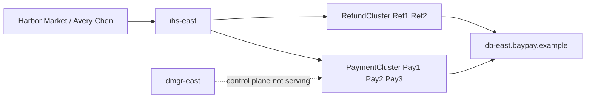
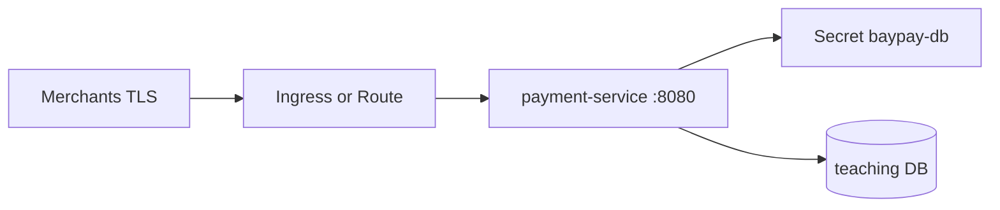

# CAPSTONE-2 — Modernize BayPay

**Type:** CAPSTONE  
**After:** Modules 4–10  
**Duration:** 4–8 hours  
**Cost:** **$0**  
**awsLab:** no  
**hideAnswerUpfront:** false (Hidden section is a checklist, not a dump)  
**Diagrams:** AEJE-D-071 (current ND estate) · AEJE-D-072 (cloud-native target)  
**Locked topology:** [datasets/baypay-cell/TOPOLOGY.md](../../datasets/baypay-cell/TOPOLOGY.md)  
**Cluster notes:** [datasets/baypay-k8s/CLUSTER.md](../../datasets/baypay-k8s/CLUSTER.md)  
**Worksheet:** [student/worksheets/PF-modernize.md](../../student/worksheets/PF-modernize.md)

This capstone is **paper architecture**. You assess the leftover traditional WebSphere ND cell, design Liberty waves (refund first, payment canary), then the container and Kubernetes / OpenShift target. You do **not** install a live cell. You do **not** need Docker, kind, minikube, or a live OpenShift cluster. You do **not** recommend ND-in-Docker or a new `BayPayCell`. Traditional ND is the **source estate**. Liberty or the Spring Boot 3.5.5 reference app is the exit.

---

## Scenario

Morgan Hale can still describe `BayPayCell` from memory. Jordan Voss can install a Liberty directory this quarter. Riley Okonkwo will not let Avery Chen’s `/payment` go dark for a “modernization weekend.” Priya Nair wants rollback sentences she can read at 02:00. Sam Okada will not accept a Dockerfile that packages `dmgr-east` “so we keep the cell.”

Your job is a Staff-readable modernization brief on PF-modernize.md: current estate (AEJE-D-071 + TOPOLOGY.md), Liberty waves, container + `baypay-prod` design (AEJE-D-072), test and rollback. No live ND. No required engine. No AWS apply.

---

## Business context

BayPay Financial Services (fictional) still serves Harbor Bike Co / Harbor Market through the synthetic cell in TOPOLOGY.md. Merchants hit IBM HTTP Server `ihs-east.baypay.example`. The plugin sends `/payment` to `PaymentCluster` (`payment.ear` on `Pay1`, `Pay2`, `Pay3`) and `/refund` to `RefundCluster` (`refund.ear` on `Ref1`, `Ref2`). `dmgr-east` on `was-dmgr-east.baypay.example` is the **management** JVM. It is not throughput. Cell-scoped `jdbc/baypay` and SIBus `BayPayBus` (`jms/paymentEvents`, `jms/refundEvents`) are how those ears grew up.

| Role | Locked name |
|---|---|
| Cell (source) | `BayPayCell` |
| Deployment manager | `dmgr-east` |
| Payment cluster | `PaymentCluster` — `Pay1` @ `node-pay-1`; `Pay2`, `Pay3` @ `node-pay-2` |
| Refund cluster | `RefundCluster` — `Ref1`, `Ref2` @ `node-ref-1` |
| Edge | `ihs-east` |
| Teaching runtime | `reference-apps/baypay` — Java 21, Spring Boot 3.5.5 |
| Liberty packaging | `payment-service.war` / `refund-service.war` |
| Liberty DataSources | `jdbc/baypay-payment`, `jdbc/baypay-refund` |

Demo identities remain:

| Role | Synthetic id |
|---|---|
| Customer Avery Chen | `11111111-1111-1111-1111-111111111111` |
| Active USD account | `22222222-2222-2222-2222-222222222221` |
| Frozen USD account | `22222222-2222-2222-2222-222222222222` |

On-call names: **Priya Nair** (SRE), **Riley Okonkwo** (application), **Morgan Hale** (WAS admin), **Jordan Voss** (release), **Sam Okada** (platform).

AEJE-D-071 is **current**. AEJE-D-072 is **target** (TLS edge → `payment-service` `:8080` → secrets → teaching DB). You do not stand up Fargate or EKS in this capstone. You do not bounce `dmgr-east` to “stabilize a container.” You do not set `-Xmx` equal to a cgroup or container memory limit.

---

## Learning objectives

- Inventory `BayPayCell` with locked names: `dmgr-east`, nodes, `PaymentCluster`, `RefundCluster`, `ihs-east`, JNDI, SIBus — from TOPOLOGY.md, not from memory of a different employer.
- Design Liberty waves 0–3: inventory, **refund first**, **payment canary** (one replica behind `ihs-east`), decommission ND after an SLO hold and a 14-day backup.
- Write rollback that restores `refund.ear` on `RefundCluster` and drains the payment canary to 100% `PaymentCluster`. Never bounce `dmgr-east` as the rollback.
- Design the container: multi-stage JRE image `registry.baypay.example/baypay/payment-service:<tag>`, non-root, `BAYPAY_DB_*` at runtime, `UseContainerSupport`, **not** `-Xmx` = limit.
- Design Kubernetes / OpenShift on paper: namespace / Project `baypay-prod`, Deployment `payment-service`, ClusterIP `8080`, Ingress or Route `payments.apps.baypay.example`, probes, Secret `baypay-db`.
- Name tests (contract, canary hold, probe, rollback drill) without requiring kind or OCP.
- Refuse ND-in-Docker, a new traditional cell, and cell-wide `jdbc/baypay` on Liberty.
- Fill PF-modernize.md and cite AEJE-D-071 and AEJE-D-072.

---

## Architecture

**Current (AEJE-D-071)** — leftover ND. You assess it. You do not rebuild it.



Alt text: Merchants reach ihs-east. The plugin sends payment traffic to PaymentCluster and refund traffic to RefundCluster. Both talk to db-east. dmgr-east is the deployment manager, not the merchant path.

**Target (AEJE-D-072)** — Boot or Liberty process, not a cell in a pod.



Alt text: TLS at the edge. payment-service on port 8080 reads secrets at runtime and talks to the teaching database. No Deployment Manager appears.

Liberty sits **between** those drawings: isolated DataSources, `server.xml` features `servlet-6.0`, `jdbc-4.3`, `jndi-1.0`, `persistence-3.1`, waves from TOPOLOGY.md. Containers package the **process**, not `BayPayCell`.

---

## Prerequisites

- Modules 4–10: Jakarta mapping (ARCHITECT-401), ND inventory (ARCHITECT-501), Liberty assessment and waves (MODERNIZE-601, ARCHITECT-604), JVM cgroup literacy (Modules 7–8), image contract (BUILD-901), kube objects (Module 10).
- [TOPOLOGY.md](../../datasets/baypay-cell/TOPOLOGY.md) and [CLUSTER.md](../../datasets/baypay-k8s/CLUSTER.md) open in another pane.
- Diagrams AEJE-D-071 and AEJE-D-072 (source / alt / SVG under `diagrams/capstones/`).
- Optional: Java 21 and `./mvnw` if you want to compare Boot `application-prod.yml` to Liberty variables. Not required to pass.

You do **not** need IBM Installation Manager, a Deployment Manager, Docker, Podman, kind, minikube, `oc`, or AWS. Paper plus the worksheets is the grade path.

---

## Environment setup

This is a **file-and-worksheet** capstone. Copy nothing into a live cell.

```bash
# optional scratch notes — not required
mkdir -p /tmp/aeje-capstone-2
# read, do not edit the locked sources
# datasets/baypay-cell/TOPOLOGY.md
# datasets/baypay-k8s/CLUSTER.md
# diagrams/capstones/AEJE-D-071.source.md
# diagrams/capstones/AEJE-D-072.source.md
```

Open PF-modernize.md and fill it in your words. You may reuse *your* earlier PF-was-nd.md, PF-liberty-waves.md, PF-container.md, and PF-k8s.md as inputs. Do not paste `solutions/` text.

If you choose to run the reference app to remember the process contract, use the wrapper — it is extra credit:

```bash
export JAVA_HOME="${JAVA_HOME:-/opt/homebrew/opt/openjdk@21}"
cd reference-apps/baypay
./mvnw -pl payment-service -am test
```

Do not install WebSphere ND to “make the assessment real.” Do not `docker build` as a grade gate. Do not apply EKS or ROSA. Do not open `solutions/CAPSTONE-2/` until the wave table and the refuse-ND-in-Docker paragraph exist on your worksheet.

---

## Challenge/tasks

1. **Assess the cell.** From TOPOLOGY.md, inventory `BayPayCell`: `dmgr-east`, `node-pay-1`, `node-pay-2`, `node-ref-1`, node agents, `Pay1`/`Pay2`/`Pay3`, `Ref1`/`Ref2`, `ihs-east` **outside** the cell. Separate the serving path (Avery → `ihs-east` → cluster → `db-east`) from the control path (Morgan Hale → `dmgr-east`). Name `jdbc/baypay`, `jdbc/baypayXA`, `baypayDbAlias`, `BayPayBus`. Mark cell-wide `jdbc/baypay` as a modernization smell.
2. **Cite AEJE-D-071 as current.** In PF-modernize.md, state that this drawing is the leftover estate. Write what you would **not** copy for a new service (second DMGR, new SIBus, sticky `JSESSIONID` on `/payment`, new traditional cell).
3. **Liberty waves (locked).** Wave **0** inventory + compatibility. Wave **1** refund on Liberty (`refund-service.war`, isolated `jdbc/baypay-refund`); rollback restores `refund.ear` on `RefundCluster`. Wave **2** **one** Liberty payment replica behind `ihs-east`; rollback drains the canary; 100% `/payment` stays on `PaymentCluster`. Wave **3** decommission ND nodes after an SLO hold; keep the last ND backup until **wave 3 + 14 days**. Refund is first because Harbor Market refund volume is lower. Payment is a canary because Avery’s volume is not a rehearsal.
4. **Rollback cards.** Write Wave 1 and Wave 2 cards: evidence → drain/restore → confirm edition/JNDI → re-enter only when. **Never** bounce `dmgr-east`. **Never** use sticky `JSESSIONID` as the canary strategy. **Never** stand up `BayPayCell-2` as a “safe rollback environment.”
5. **Container design (paper).** Image `registry.baypay.example/baypay/payment-service:<tag>`. Multi-stage: JDK build, `eclipse-temurin:21-jre` runtime. `EXPOSE 8080`. `USER 10001`. `BAYPAY_DB_*` from env / Secret, never `ENV` in the image. JVM: `UseContainerSupport` and `MaxRAMPercentage` — **never** `-Xmx` equal to the container memory limit. This is not ND-in-Docker. One process, not a profile and a node agent.
6. **Kubernetes / OpenShift (paper).** Namespace / Project `baypay-prod`. Deployment `payment-service`, labels `app=payment-service`, three replicas when healthy. Service ClusterIP `8080`. Ingress host or OpenShift Route `payment-route` on `payments.apps.baypay.example`. ConfigMap `payment-config`. Secret `baypay-db` (`BAYPAY_DB_USER`, `BAYPAY_DB_PASSWORD`). TLS Secret `payment-tls`. Probes: `/actuator/health/liveness`, `/actuator/health/readiness`. Route and Ingress are the same job on two APIs — do not treat them as different products with the same name. Do not schedule `dmgr-east` as a Pod.
7. **Test and rollback for the target.** Name the tests you would run before Wave 1 cut, during Wave 2 canary, and before Wave 3 decommission: contract tests (`./mvnw test` on the Boot app or equivalent WAR tests), idempotent replay, frozen-account decline, plugin/canary error rate, probe fail-closed, rollback drill. Paper is enough. kind/OCP is optional and not scored as a gate.
8. **Cite AEJE-D-072 as target.** Merchants TLS → edge → `payment-service` `:8080` → secrets → DB. Explain how that drawing is not “the cell, but in Kubernetes.”
9. **Worksheet.** Fill every section of PF-modernize.md. No lorem. No TODO. No invented hostnames.

---

## Validation

- [ ] Inventory uses locked names only: `BayPayCell`, `dmgr-east`, `PaymentCluster`, `Pay1`/`Pay2`/`Pay3`, `RefundCluster`, `Ref1`/`Ref2`, `ihs-east`, `jdbc/baypay`, `BayPayBus`.
- [ ] Serving path and control path are distinct. `STARTED` on a JVM is not Harbor Market throughput.
- [ ] AEJE-D-071 is labeled **current**. AEJE-D-072 is labeled **target**.
- [ ] Waves are 0–3. Wave 1 is **refund**. Wave 2 is **one** payment canary, not a cluster flip of `Pay1`/`Pay2`/`Pay3`.
- [ ] Wave 1 rollback restores `refund.ear` on `RefundCluster`. Wave 2 rollback drains the canary; 100% `PaymentCluster`.
- [ ] Wave 3 keeps last ND backup until wave 3 + 14 days. Git is not that backup.
- [ ] Isolated Liberty binds `jdbc/baypay-payment` and `jdbc/baypay-refund`. No cell-wide pool on the target.
- [ ] Container story is Boot/Liberty process + JRE, non-root, secrets at runtime. **Not** ND-in-Docker. **Not** `-Xmx` = cgroup limit.
- [ ] K8s/OCP objects use CLUSTER.md names. OpenShift is Route / SCC / Project overlay, not a second platform you must install.
- [ ] Test list exists (contract, canary hold, probes, rollback drill). No required Docker/kind/OCP.
- [ ] You did not recommend a new traditional ND cell.
- [ ] PF-modernize.md is in your words. Instructor scores with [instructor/rubrics/CAPSTONE-2.md](../../instructor/rubrics/CAPSTONE-2.md).

---

## Troubleshooting

| Symptom | What to check |
|---|---|
| Drew `ihs-east` as a node inside the cell | IHS is the edge. It is outside `BayPayCell` on TOPOLOGY.md. |
| Treated `dmgr-east` as the thing merchants hit | Control plane. Avery’s POST does not go through the DMGR. |
| Wave 1 is payment “because that is the product” | Refund is lower volume. TOPOLOGY.md locks Wave 1 as refund. |
| Wave 2 flips all of `PaymentCluster` | That is a big-bang Sev-1. Canary is **one** Liberty replica behind `ihs-east`. |
| Rollback says “bounce `dmgr-east`” | Wrong. Restore the ear or drain the canary. |
| New cell `BayPayCell-2` as rollback | Forbidden. ND is what you roll back **onto**, then leave. |
| Liberty keeps `jdbc/baypay` | Isolated names only. Cell-wide pool is the smell you are leaving. |
| Dockerfile “solution” is WAS + nodeagent in one image | That is ND-in-Docker. Fail Production awareness. Package `payment-service`. |
| `-Xmx` set to the container limit | Never. Heap is not the only native consumer. Use container support + a percentage. |
| Required `oc new-project` or `kind create` to pass | Paper is the grade path. Optional engines do not raise the score. |
| Copied Module 11 Fargate / NAT / EKS | Wrong capstone. AEJE-D-072 here is the process target, not an AWS apply. |
| Sticky `JSESSIONID` to make the canary “simple” | `/payment` is sessionless for this course. Plugin weight or header route, not sticky. |
| Opened `solutions/CAPSTONE-2/` to start the table | Failed Diagnostic method. Write waves from TOPOLOGY.md first. |

---

## Expected outcome

A brief a Staff engineer could run a steering meeting from: AEJE-D-071 inventory with locked names, Liberty waves with refund-first and payment-canary rollback, a container and `baypay-prod` design that matches AEJE-D-072, and tests that do not require a live cell or a paid cluster. The page refuses ND-in-Docker and refuses a new traditional cell. Cost remains $0.

---

## Interview questions

1. Why is `dmgr-east` down a change-freeze and not a merchant outage?
2. Why is Wave 1 refund even though Harbor Market talks about pay?
3. What is the first sentence you say if the payment canary 5xx’s and someone asks to bounce `Pay1`?
4. Why is “put `BayPayCell` in Docker” not modernization?
5. What does OpenShift Route `payment-route` do that Ingress on `payments.apps.baypay.example` already does?
6. Why must `-Xmx` not equal the container memory limit on the Wave 2 Liberty or Boot canary?

---

## Architecture/trade-off questions

1. Liberty `refund-service.war` versus a Boot rewrite of refund for Wave 1 — speed this quarter versus long-term shape?
2. Canary at `ihs-east` versus a DNS cut — blast radius and who can roll back at 02:00 without Morgan Hale?
3. Fourteen days of ND backup versus “we have Git” — what Git cannot restore (`plugin-cfg.xml` generation, cell JNDI, LTPA)?
4. Isolated DataSources versus keeping `jdbc/baypay` “until Wave 3” — whose pool saturates when reporting joins payment?
5. Ingress versus Route versus a future AWS ALB (CAPSTONE-3) — what this paper must decide now versus what it must not apply?
6. Why keep ND installed through Wave 2 instead of deleting `RefundCluster` the morning Wave 1 looks green?

---

## Cleanup

No cloud resources. No clusters to delete. No ND uninstall. If you used `/tmp/aeje-capstone-2`, remove it. Leave TOPOLOGY.md and CLUSTER.md untouched. Leave any optional local Docker images off the grade path; do not push to a public registry.

```bash
rm -rf /tmp/aeje-capstone-2
```

Do not commit secrets. Do not commit a worksheet that recommends a second `BayPayCell`.

---

## Cost estimate

**$0.** Paper assessment, locked synthetic topology, worksheets, and diagrams on disk. No licensed WebSphere ND. No required Docker, kind, or OpenShift. No AWS. Optional local engines stay on your machine and do not change the score.

---

## Hidden/revealable solution

`hideAnswerUpfront` is false, so this section may be visible. It is still a **checklist**, not a steering-deck dump. The scored narrative lives under `solutions/CAPSTONE-2/`. Opening that folder before you write waves and the ND-in-Docker refusal is a failed Diagnostic method score.

<details>
<summary>Reveal checklist — after you have attempted PF-modernize.md</summary>

Required: AEJE-D-071 current inventory with `BayPayCell` / `dmgr-east` / `PaymentCluster` / `ihs-east`; AEJE-D-072 target (`payment-service` `:8080` + secrets + DB); waves 0–3 from TOPOLOGY.md; Wave 1 refund + restore `refund.ear` on `RefundCluster`; Wave 2 one payment canary + drain to 100% `PaymentCluster`; Wave 3 + 14-day ND backup; isolated `jdbc/baypay-payment` and `jdbc/baypay-refund`; no DMGR bounce; no sticky payment sessions; container is JRE process not ND-in-Docker; no `-Xmx` = cgroup; `baypay-prod` objects from CLUSTER.md; paper tests + rollback drill; **no new traditional cell**. If Wave 1 is payment, Wave 2 is a cluster flip, or the image is a cell, fix the worksheet before `solutions/`.

</details>

<details>
<summary>Reveal compact wave table — after you have attempted the plan</summary>

| Wave | Scope | Rollback |
|---|---|---|
| 0 | Inventory + compatibility assessment | N/A |
| 1 | Refund on Liberty (lower volume) | Restore `refund.ear` on `RefundCluster` |
| 2 | Payment canary (one Liberty replica behind IHS) | Drain canary; 100% `PaymentCluster` |
| 3 | Decommission ND nodes after SLO hold | Keep last ND backup until wave 3+14 days |

This table is the lock, not the scored cards.

</details>

---

## What you learned

Modernization is a sequence of reversible serving-path changes, not a new cell and not a Deployment Manager in a container. AEJE-D-071 is the estate you can operate and leave. Liberty waves move refund first and payment as a canary. AEJE-D-072 is a process with secrets and a database, scheduled in `baypay-prod` if you choose Kubernetes or OpenShift. Tests and rollback are part of the design. Cost is $0 because you did not need live ND, Docker, or OCP to say that out loud.

---

## Portfolio deliverable

Complete [student/worksheets/PF-modernize.md](../../student/worksheets/PF-modernize.md): current-estate inventory, Liberty waves and rollback cards, container and K8s/OCP design, test plan, AEJE-D-071 / AEJE-D-072 citations, and the paragraph that refuses ND-in-Docker and a new `BayPayCell`. This is the Modules 4–10 synthesis artifact. You may attach mermaid you drew; you must not attach a live cluster kubeconfig or a cell password.
