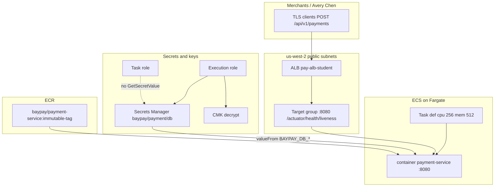
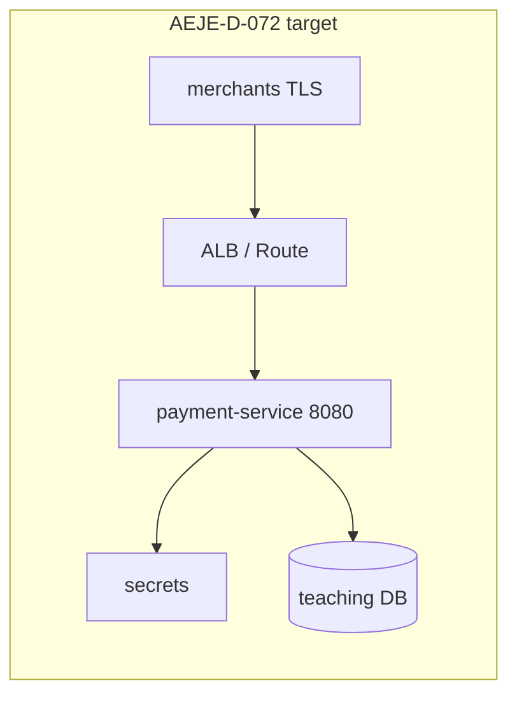

# CAPSTONE-3 — Cloud BayPay

**Type:** CAPSTONE (`awsLab`: true)  
**After:** Modules 11–12  
**Duration:** 4–8 hours  
**Cost:** **$0** paper + `terraform validate`; **real AWS bills if you apply**  
**Diagram:** [AEJE-D-072](../../diagrams/capstones/AEJE-D-072.source.md) (cloud-native target). Contrast [AEJE-D-071](../../diagrams/capstones/AEJE-D-071.source.md) (ND source estate).  
**Account notes:** [datasets/baypay-aws/ACCOUNT.md](../../datasets/baypay-aws/ACCOUNT.md)  
**Ops SLO contract:** [datasets/baypay-ops/OBSERVABILITY.md](../../datasets/baypay-ops/OBSERVABILITY.md) — **99.9%**, not 99.99%  
**Healthy IaC skeleton:** [infrastructure/terraform/baypay-ecs](../../infrastructure/terraform/baypay-ecs/)  
**Prior labs:** [BUILD-1101](../../labs/BUILD-1101/README.md) · [ARCHITECT-1102](../../labs/ARCHITECT-1102/README.md) · [SECURITY-1103](../../labs/SECURITY-1103/README.md) · [COST-1105](../../labs/COST-1105/README.md) · [BUILD-1201](../../labs/BUILD-1201/README.md) · [BUILD-1202](../../labs/BUILD-1202/README.md) · [BUILD-1204](../../labs/BUILD-1204/README.md)  
**Worksheet:** [student/worksheets/PF-cloud.md](../../student/worksheets/PF-cloud.md)  
**Rubric:** [instructor/rubrics/CAPSTONE-3.md](../../instructor/rubrics/CAPSTONE-3.md)

This capstone is the **cloud delivery** of BayPay, not a fifth Module 11 lab. You synthesize ECS/Fargate, immutable ECR, ALB health on port **8080**, Secrets Manager + KMS, Terraform modules, a 99.9% SLO, scaling, resilience, and a same-day destroy. `terraform validate` is the grade bar. Live `apply` is useful extra credit you **destroy the same day**.

Do **not** apply a NAT Gateway, EKS, or RDS Multi-AZ. EKS and OpenShift remain valid **design** answers ([ARCHITECT-1102](../../labs/ARCHITECT-1102/README.md)). Do not bounce `dmgr-east` as a cloud stabilize. Do not open `solutions/CAPSTONE-3/` first.

---

## Scenario

Sam Okada wants `payment-service` in `us-west-2` behind an ALB that Finance can find on the bill and Priya Nair can page from. Jordan Voss can ship an immutable ECR tag from the Module 12 pipeline. Riley Okonkwo already has a Deployment and a Route in `baypay-prod` and will not accept a slogan that “AWS is the only correct platform.” Avery Chen’s client still POSTs `$25.00` through `/api/v1/payments`.

Harbor Market will not wait for a second control plane. Finance will not pay for an idle ALB over a weekend, a curiosity NAT, or an EKS cluster “so we look production.” You write the **target state** (AEJE-D-072), the **files** a Staff engineer could `validate`, and the **operations contract** (99.9% on payment create) — then you refuse the expensive extras.

If you apply, you are spending dollars. If you only validate, you still owe the same architecture sentences.

---

## Business context

BayPay Financial Services is fictional. The invoice is not. Avery Chen (`11111111-1111-1111-1111-111111111111`, active USD account `22222222-2222-2222-2222-222222222221`) retries when a create does not return. A 502 from `pay-alb-student.baypay.example` is not a domain decline. Harbor Bike Co does not care whether the process started as a Module 10 Pod or as an ECS task. They care that port **8080** answers and that `/actuator/health/liveness` is what the edge probes.

The application is still `reference-apps/baypay` (Java 21, Spring Boot 3.5.5). The student apply profile is `local` (in-memory H2) so this capstone does not create RDS. `BAYPAY_DB_*` come from Secrets Manager — never from task-def JSON in git (SECURITY-1103). Image coordinates stay `baypay/payment-service:<immutable-tag>`, never `:latest`.

AEJE-D-071 is the **source estate** (IHS → PaymentCluster / RefundCluster → `db-east`). AEJE-D-072 is the **cloud-native target**: merchants over TLS → ALB or Route → `payment-service` on 8080 → secrets → a teaching database. Traditional ND remains the leftover cell. You do not apply NAT, EKS, or RDS Multi-AZ “for realism.” You do not treat ECS as the only home — you treat it as the **student apply default**.

Teaching ALB host: `pay-alb-student.baypay.example`. A real apply uses the AWS-generated DNS name.

---

## Learning objectives

- Draw and defend AEJE-D-072: ECS/Fargate `payment-service` in **`us-west-2`**, ECR immutable tags, ALB health **`/actuator/health/liveness`** on **8080**.
- Assemble (or point at) Terraform modules for ECR and the service contract — [BUILD-1201](../../labs/BUILD-1201/README.md) / [BUILD-1202](../../labs/BUILD-1202/README.md) / [infrastructure/terraform/baypay-ecs](../../infrastructure/terraform/baypay-ecs/) — and make `terraform validate` exit 0.
- Split execution vs task IAM; inject `BAYPAY_DB_*` via Secrets Manager + a named KMS CMK; refuse `AdministratorAccess` and plaintext passwords.
- Keep the ops SLO at **99.9%** successful `POST /api/v1/payments` (server failures). Name 99.99% as the later architecture conversation — do not silently upgrade the tile.
- Write scaling and resilience on paper: tiny Fargate (256/512), task replace, last-healthy tag rollback; refuse CPU-only autoscaling as the payment SLO.
- Price the idle ALB before any apply. Refuse NAT, EKS, and RDS Multi-AZ as apply. Destroy the same day if you spend.
- Record the packet on [PF-cloud.md](../../student/worksheets/PF-cloud.md). Tags: `Course=AEJE`, `Module=Capstone`, `Lab=CAPSTONE-3`, `Environment=student`, `Expiration=<ISO date>`.

---

## Architecture

Course diagram **AEJE-D-072** is this target. Until the PNG is on disk, use the mermaid plus ACCOUNT.md. AEJE-D-071 is the ND starting picture — do not “stabilize” the cloud path by bouncing `dmgr-east`.

**Duration:** 4–8 hours. Paper + validate can finish in the low end. Optional apply + destroy needs a same-day window and a cost briefing first.

**Region:** `us-west-2` only. Do not “fix” a starter that still says `us-east-1` by applying in two regions.

### Service list (student apply subset vs design)

| Service | Student apply? | Why |
|---|---|---|
| ECR `baypay/payment-service` | Yes (cheap) — or paper the module | Immutable tags; scan-on-push |
| ECS on Fargate | Optional apply; **default compute** | Task 0.25 vCPU / 512 MiB; `desired_count = 1` in a lab |
| ALB + target group + HTTP listener | Optional apply | Health `/actuator/health/liveness` on **8080**, matcher `200` |
| VPC, IGW, **two public subnets** | Optional apply | AZ spread for the ALB; `assign_public_ip = true` |
| IAM execution role + separate task role | Paper JSON required; apply optional | Least privilege — not `AdministratorAccess` |
| Secrets Manager `baypay/payment/db` + KMS CMK | Paper required; apply optional | `valueFrom` JSON keys; no `changeme` in git |
| CloudWatch log group | If you apply | 3–7 day retention; Container Insights **off** |
| NAT Gateway | **No** | Dollars/hour + data; locked student shape is public + IGW |
| EKS / ROSA | **No apply** | Valid **design** home (ARCHITECT-1102) |
| OpenShift Route / SCC | **No apply** | Valid **design** home (Module 10) |
| RDS / RDS Multi-AZ | **No** | Use `local` / H2; Multi-AZ is literacy, not this invoice |
| Route 53 hosted zone / ACM / OpenSearch | **No** | Teaching DNS name is enough |



Alt text: Merchants reach an Application Load Balancer in us-west-2 public subnets. The target group health-checks /actuator/health/liveness on port 8080. A Fargate task (256 CPU, 512 MiB) runs payment-service from an immutable ECR tag. The execution role reads one Secrets Manager secret and decrypts one KMS key. No NAT Gateway, no EKS, and no RDS appear on the student apply path.



Alt text: AEJE-D-072 cloud-native BayPay target: TLS edge, payment-service on 8080, secrets, teaching database.

**Least privilege:** the execution role uses ECR pull + logs + `GetSecretValue` on **one** secret ARN + `kms:Decrypt` on **one** CMK. The task role is a **different** principal and stays empty (or narrowly named) for this app — ECS injects `valueFrom`, so the JVM does not need `GetSecretValue`. Do not attach `AdministratorAccess` to either role. Your console/sandbox user is a third identity — do not copy that admin policy onto the task. Never commit access keys.

**Failure scenario:** merchants see 502/503 on the ALB while ECS tasks stay `RUNNING` because the target group still probes `/` (INCIDENT-1104), or because a green pipeline pushed a tag that fails liveness (INCIDENT-1205). That is not a reason to open 8080 to the world, add a NAT Gateway, attach `AdministratorAccess`, or bounce `dmgr-east`. A second failure mode is an idle ALB left overnight — Finance pages you, not Priya’s SLO board.

**IaC bar:** `terraform validate` (after `terraform init -backend=false`) on **your** working copy. You may compose from BUILD-1101 (ALB + Fargate shape), BUILD-1201/1202 (provider pin + modules), and the course skeleton `infrastructure/terraform/baypay-ecs`. Apply is optional. A hollow `modules/` directory with ECR inlined and no port/health variables is not a passing module story.

---

## Prerequisites

- [ACCOUNT.md](../../datasets/baypay-aws/ACCOUNT.md) open beside your working tree. Region `us-west-2`. Port `8080`. Liveness `/actuator/health/liveness`.
- Modules 11–12 attempted: BUILD-1101 (Fargate + ALB), ARCHITECT-1102 (ECS vs EKS vs OpenShift), SECURITY-1103 (roles + secrets + KMS), COST-1105 (idle ALB arithmetic), BUILD-1201/1202 (root + modules). You may re-read those labs; you do not have to re-apply them.
- Terraform CLI **1.5+**. You do **not** need AWS credentials to `validate`.
- Optional student **sandbox** account you are allowed to spend in. Not required to pass.
- [OBSERVABILITY.md](../../datasets/baypay-ops/OBSERVABILITY.md) for the 99.9% SLI/SLO. Module 13 labs are not a prerequisite; the locked numbers are.
- Ability to read HCL and IAM JSON. Least-privilege note: do not use production account keys. Do not commit access keys.
- Prior worksheets [PF-aws-platform.md](../../student/worksheets/PF-aws-platform.md), [PF-aws-cost.md](../../student/worksheets/PF-aws-cost.md), [PF-iac.md](../../student/worksheets/PF-iac.md) if you filled them — synthesize onto **PF-cloud.md**; do not paste instructor RCAs.

---

## Environment setup

Confirm the locked notes and a healthy skeleton. You do **not** have to call AWS.

```bash
test -f datasets/baypay-aws/ACCOUNT.md && echo "account notes present"
test -f datasets/baypay-ops/OBSERVABILITY.md && echo "slo contract present"
test -f infrastructure/terraform/baypay-ecs/ecr.tf && echo "course skeleton present"
test -f labs/BUILD-1202/starter/main.tf && echo "module starter present"
test -f student/worksheets/PF-cloud.md && echo "worksheet present"
```

Copy **your** working tree — do not “fix” class starters in place:

```bash
mkdir -p /tmp/aeje-capstone-3
# Option A — course skeleton (provider + tags + one ECR):
cp infrastructure/terraform/baypay-ecs/*.tf /tmp/aeje-capstone-3/
# Option B — BUILD-1202 modules (preferred module story):
# cp -R labs/BUILD-1202/starter/. /tmp/aeje-capstone-3/
# Option C — BUILD-1101 Fargate+ALB shape if you already completed it (keep a copy, retag Lab=CAPSTONE-3)
```

Paper validate (no spend):

```bash
cd /tmp/aeje-capstone-3
terraform init -backend=false
terraform validate
```

`init` downloads the AWS provider. It does not create an ALB. `apply` is extra credit — read **Cost estimate** first.

If you apply, lock this shape before you type `yes`:

```text
region:           us-west-2
subnets:          public only (two AZs)
assign_public_ip: true
compute:          ECS on Fargate 256/512
health:           /actuator/health/liveness on 8080 matcher 200
image:            baypay/payment-service:<immutable-tag>   # never :latest
forbidden:        NAT Gateway, EKS, RDS, RDS Multi-AZ, always-on EC2
tags:             Course=AEJE Module=Capstone Lab=CAPSTONE-3 Environment=student Expiration=<ISO date>
```

The instructor key is `solutions/CAPSTONE-3/`. Do not open it until your checklist is green.

---

## Challenge/tasks

1. **Read the contracts.** Open ACCOUNT.md, AEJE-D-072, and OBSERVABILITY.md. List the locked names (region, port, health path, image, SLO **99.9%**, tags) before you edit files. Write the AEJE-D-071 → AEJE-D-072 sentence: ND is the source estate; Fargate + ALB is the student target; EKS/OpenShift remain homes.
2. **Architecture page.** On PF-cloud.md, expand AEJE-D-072 with the service list above. Name who owns the ALB (Sam), the image tag (Jordan), the health path (Riley), and the SLO tile (Priya). Do not add NAT, EKS, or RDS to the apply column “for completeness.”
3. **Platform decision.** Reuse ARCHITECT-1102: ECS/Fargate is the **student apply default**. Write when EKS still wins (existing Kubernetes estate, CRDs) and when OpenShift still wins (Routes, SCCs, operators). One refusal sentence: you will not apply EKS, ROSA, or NAT for realism in this capstone.
4. **Terraform modules.** Finish or point at a root that calls `modules/ecr` and a service-contract module. ECR: `baypay/payment-service`, `image_tag_mutability = "IMMUTABLE"`. Service module: `container_port` default `8080`, `health_check_path` default `/actuator/health/liveness`. Root: `required_providers.aws`, `variable "region"` default `us-west-2`. You may start from BUILD-1202 or the course skeleton and document the gap to a full BUILD-1101 apply shape.
5. **ALB contract (files or BUILD-1101 copy).** Target group health check path **`/actuator/health/liveness`**, port **8080**, matcher `200`. Never leave path `/`. `containerPort = 8080`. Fargate `cpu = "256"`, `memory = "512"`. Public subnets + IGW. No second ALB.
6. **Secrets and KMS.** Paper (or JSON copies): split execution vs task roles; `secrets.valueFrom` for `BAYPAY_DB_URL` / `USER` / `PASSWORD` including JSON keys; CMK policy names the execution role. Grep your tree for `changeme`, `AdministratorAccess`, and `AKIA`.
7. **Pipeline pin.** State how BUILD-1204’s `${{ github.sha }}` (or another immutable tag) becomes the ECS image input. `:latest` is not the deploy tag. A green test job is a prerequisite for publish (`needs: test`).
8. **Monitoring / SLO.** On PF-cloud.md, write the SLI (successful payment creates / successful + **server** failures), SLO **99.9%**, ~43 minutes of monthly error budget, P99 < 400 ms teaching latency. Page on SLO burn, not “CPU > 80%.” Do **not** change the tile to 99.99% — that is Module 14 architecture (ARCHITECT-1401), and you must say so if you mention it.
9. **Scaling.** Student apply stays `desired_count = 1`. On paper, describe a production scale signal closer to the SLO (in-flight POSTs or ALB request count) plus a **max** replica cap so you cannot stampede a teaching database. CPU autoscaling is literacy, not the payment SLO. Slow scale-down. Heap must never equal the Fargate memory limit.
10. **Resilience.** Two public subnets for the ALB. Unhealthy target → task replace, not a cell bounce. Rollback is the last **healthy** task definition / immutable tag (INCIDENT-1205), not `:latest` and not `dmgr-east`. RDS Multi-AZ is a design sentence you may write; it is **not** an apply.
11. **Cost briefing.** Before any apply, multiply idle ALB (~$0.0225/hour), Fargate 256/512 (~$0.012/hour), refused NAT (~$0.045/hour), refused EKS control plane (~$0.10/hour). Write “destroy the ALB the same day.” Copy headline numbers onto PF-cloud.md.
12. **Validate.** `terraform init -backend=false && terraform validate` on **your** copy. Do not require `apply` to pass. Retag resources `Lab=CAPSTONE-3`, `Module=Capstone`.
13. **Optional apply.** Only in a sandbox, only after the briefing. Then **destroy the same day**. Confirm leftovers in `us-west-2`.
14. **Worksheet.** Complete [PF-cloud.md](../../student/worksheets/PF-cloud.md) in your own words. Attach working `.tf` (not `terraform.tfstate`). No secret values.

---

## Validation

Self-check (this is the grade path — not a green target in the console):

- [ ] Architecture cites **AEJE-D-072** and names region **`us-west-2`**.
- [ ] Service list marks NAT, EKS, and RDS Multi-AZ as **not applied**.
- [ ] ECR image is `baypay/payment-service:<tag>` with **immutable** tags — not `:latest`.
- [ ] `health_check.path` is `/actuator/health/liveness` on port **8080**, matcher includes `200`.
- [ ] `containerPort = 8080` (in Terraform, a module variable, or a cited BUILD-1101 tree).
- [ ] Fargate sizing 256 / 512 for any apply-shaped task.
- [ ] Tags include `Course=AEJE`, `Module=Capstone`, `Lab=CAPSTONE-3`, `Environment=student`, `Expiration`.
- [ ] Execution role ≠ task role; no `AdministratorAccess`; no password / `AKIA` in files.
- [ ] Secrets are `valueFrom` ARNs (paper JSON is enough).
- [ ] SLO is **99.9%** on payment-create SLI; 99.99% is named only as a later architecture target.
- [ ] Scaling paragraph refuses CPU-only as the payment SLO and names a replica cap.
- [ ] Resilience names last-healthy tag rollback and refuses `dmgr-east` as stabilize.
- [ ] Cost briefing shows idle ALB arithmetic; NAT/EKS refused with dollars.
- [ ] `terraform validate` succeeds on your working copy (or you documented a validate-green pointer to BUILD-1202 / `baypay-ecs` **and** the remaining ALB contract).
- [ ] You did **not** require a live `terraform apply` to pass.
- [ ] If you applied: destroy completed the **same day**.

Instructor scores with [instructor/rubrics/CAPSTONE-3.md](../../instructor/rubrics/CAPSTONE-3.md).

**Expected final state (paper):** a Staff-readable PF-cloud.md plus a Terraform tree (or a cited, validate-green composition) that matches ACCOUNT.md — modules, port, health path, tags, least-privilege notes, 99.9% SLO, cost briefing. **Expected final state (if you applied):** one healthy ALB target, one `RUNNING` Fargate task, ECR repo with an immutable tag, secret/CMK only if you created them, then **destroyed the same day**. No NAT, no EKS, no RDS.

---

## Troubleshooting

| Symptom | What to check |
|---|---|
| Tempted to add EKS “so the capstone looks production” | Stop. ARCHITECT-1102 is the design answer. Apply is ECS/Fargate. |
| Tempted to add NAT “for private Fargate” | Locked student shape is public subnet + IGW. COST-1105. |
| Tempted to add RDS Multi-AZ “for HA” | Out of scope for apply. Write it as design; use `local` / H2. |
| Health path still `/` | Provider default. Spring Boot 404s `/`. INCIDENT-1104. |
| Tasks `RUNNING`, merchants 502/503 | Target group unhealthy ≠ process down. Fix the path, not the SG. |
| `:latest` in the module image input | Change it. INCIDENT-1205 exists because of floating tags. |
| Combined `AdministratorAccess` role | SECURITY-1103 defect. Split execution vs task. |
| `changeme` left “for local” | Fail. `valueFrom` or omit prod secrets and keep `local`. |
| SLO tile edited to 99.99% | Wrong module. OBSERVABILITY.md is 99.9%. Say so if you mention 99.99%. |
| `terraform validate` wants init | `terraform init -backend=false` first. That is not `apply`. |
| Duplicate `variable "region"` in one module | Declare it once. |
| Optional apply: cannot pull image | Push to **your** ECR URL or point `container_image` at an image you own. Paper still passes. |
| Optional apply: targets unhealthy | Confirm path and port before opening security groups. A **404** means the packet arrived. |
| Want to set `-Xmx512m` on a 512 MiB task | Forbidden in this course. Heap must not equal the limit. |
| Opened `solutions/CAPSTONE-3/` first | Failed Diagnostic method. Close it and write PF-cloud.md from the contracts. |
| Leftover BUILD-1101 ALB still up | That is already a bill. Jump to **Cleanup**. |

---

## Expected outcome

A cloud delivery packet a Staff engineer could run a working session from: AEJE-D-072, a validate-green Terraform composition (modules + ACCOUNT.md contracts), least-privilege secrets, a 99.9% SLO paragraph, scaling/resilience that do not invent EKS, and a cost briefing that names the idle ALB. Files match the **intent** of `solutions/CAPSTONE-3/` even if resource names or the health variable (`health_path` vs `health_check_path`) differ slightly. Optional apply, if used, was destroyed the same day.

---

## Interview questions

1. Why is an ECS task `RUNNING` a weak sentence if the ALB target is unhealthy?
2. Why does Spring Boot on `payment-service` 404 `/` while `/actuator/health/liveness` returns 200?
3. What does `assign_public_ip = true` on a public subnet replace, and what security trade-off did you accept instead of a NAT Gateway?
4. Why are the ECS **execution** role and **task** role different principals, and who needs `GetSecretValue` when ECS injects `valueFrom`?
5. What is the first sentence you say if someone asks to “just create EKS so we match production”?
6. Why is `terraform validate` the pass bar, and what does it **not** prove about the invoice?
7. Why must the ops SLO stay **99.9%** on this packet, and what conversation is 99.99% reserved for?
8. What still bills after `desired_count = 0`, and why are `Expiration` tags necessary but not sufficient?

---

## Architecture/trade-off questions

1. Public subnet + IGW versus private subnet + NAT for a same-day student lab — cost versus isolation?
2. ECS/Fargate versus EKS versus OpenShift **this quarter** — which did you apply, and which remain honest homes?
3. One `ecs_service` module that publishes port and health versus a live `aws_ecs_service` + ALB in the same root — what did BUILD-1202 postpone on purpose?
4. ALB target-group health versus kubelet probes versus an OpenShift Route — same Actuator URL, different object. Who owns the contract?
5. Injected Secrets Manager `valueFrom` versus the JVM calling the API — rotation, IAM shape, and why the task role stays narrow.
6. CPU target tracking versus SLO-adjacent scaling for Harbor Bike Co bursts — when is CPU the wrong primary signal?
7. Immutable ECR tags versus overwriting `:latest` — storage cost versus incident forensics (INCIDENT-1205).
8. Two-AZ public subnets for the ALB versus RDS Multi-AZ apply — which failure domain did you actually buy this week?

---

## Cleanup

**If you only edited files:** delete `/tmp/aeje-capstone-3` if you used it. Do not “fix” `labs/BUILD-1101/starter/` or `labs/BUILD-1202/starter/` in place for classmates. Leave PF-cloud.md in `student/worksheets/`.

**If you applied:** destroy **the same day**. An idle ALB still bills. Empty ECR still has storage cost. KMS keys you created need a deletion schedule.

```bash
cd /tmp/aeje-capstone-3   # or your apply directory
terraform destroy -auto-approve
```

Then confirm leftovers are gone (console or CLI) in **`us-west-2`**:

- Application Load Balancer, listener, and target group
- ECS service, cluster, and task definition
- ECR repository **and images**
- CloudWatch log groups you created
- Secrets Manager `baypay/payment/db` (and versions) if you created it
- KMS CMK: schedule deletion
- IAM roles/policies you created for this capstone
- VPC, subnets, IGW, security groups you created
- NAT Gateway (should never have existed)
- EKS cluster (should never have existed)
- RDS instances (should never have existed)

Do **not** leave an ALB overnight. Do not leave a Fargate service at `desired_count = 1` after class. `Expiration` tags do not delete resources.

---

## Cost estimate

**Grade path: $0.** Paper + `terraform validate` uses no AWS API that creates an ALB.

**Warning — apply creates a real bill.** Teaching estimates in USD for `us-west-2` (COST-1105 figures). Your invoice can differ.

| SKU | Teaching rate | Same-day (1–4 h) | Overnight idle | Forgotten week |
|---|---|---|---|---|
| ALB | ~$0.0225/hour + LCU | ~$0.02–$0.09 | ~$0.54 | ~$3.78 |
| Fargate 256/512 | ~$0.012/hour | ~$0.01–$0.05 | ~$0.30 | ~$2.07 |
| ECR 2 GB | ~$0.10/GB-month | pennies | pennies | ~$0.05 |
| Secrets Manager + CMK | ~$0.40/secret/month + ~$1/key/month | small / often monthly | — | leftover keys bill |
| NAT (refused) | ~$0.045/hour + data | do not add | ~$1.08/day | week of invoice |
| EKS control plane (refused) | ~$0.10/hour | do not add | ~$2.40/day | ~$17 |

Same-day session (1–4 hours, then destroy): about **$0.15–$2.00** if you apply the BUILD-1101 shape. Overnight idle **ALB alone** is about **$0.54** even with zero Harbor Market traffic. Forgotten ALB + Fargate + leftover ECR for a week: about **$5–$15**. **Do not add a NAT Gateway.** **Do not apply EKS or RDS Multi-AZ.** **Destroy the same day.**

Paper + `$0` validate is the honest path if you cannot spend. Apply = dollars/day ALB + Fargate. Destroy same day.

---

## Hidden/revealable solution

Attempt the architecture, the module/validate tree, the 99.9% SLO paragraph, and the cost briefing on **your** worksheet first. The instructor narrative lives in `solutions/CAPSTONE-3/`. Opening it before you write is a failed Diagnostic method score.

<details>
<summary>Reveal compact contracts — after you have attempted PF-cloud.md</summary>

Required: region `us-west-2`; AEJE-D-072; ECR `baypay/payment-service` immutable tags; ALB health `/actuator/health/liveness` on 8080 matcher 200; Fargate 256/512; execution ≠ task; Secrets Manager + KMS paper; tags `Course=AEJE Module=Capstone Lab=CAPSTONE-3 Environment=student Expiration`; SLO **99.9%** (do not silently write 99.99%); no NAT/EKS/RDS apply; `terraform validate` green; destroy same day if you applied. ECS is the apply default; EKS and OpenShift remain design homes. If any of those fail, fix PF-cloud.md before you read `solutions/CAPSTONE-3/`.

</details>

---

## What you learned

Cloud BayPay is a contract, not a console tour. The process still listens on 8080 and proves liveness at `/actuator/health/liveness`. The image lives in ECR under an immutable tag. The edge is an ALB you must destroy the same day. Secrets Manager and a named CMK replace `changeme` in git. Terraform modules make the port and health path reusable; `validate` is how the course grades without an invoice. The ops SLO is 99.9% until a later architecture lab says otherwise. ECS/Fargate is the cheap, honest apply default; EKS and OpenShift stay valid homes. NAT, EKS, and RDS Multi-AZ are how a capstone becomes a week of bill. Tags do not destroy resources.

---

## Portfolio deliverable

Completed [student/worksheets/PF-cloud.md](../../student/worksheets/PF-cloud.md): architecture (AEJE-D-072), service list, platform decision, Terraform/module notes with a validate result, IAM/secrets/KMS, 99.9% SLO, scaling and resilience, cost briefing, and a destroy checklist. Attach your working `.tf` (or a pointer to a validate-green composition). This is the Module 11–12 portfolio artifact: **Cloud BayPay**. Cite ACCOUNT.md. Do not paste `solutions/CAPSTONE-3/`.
