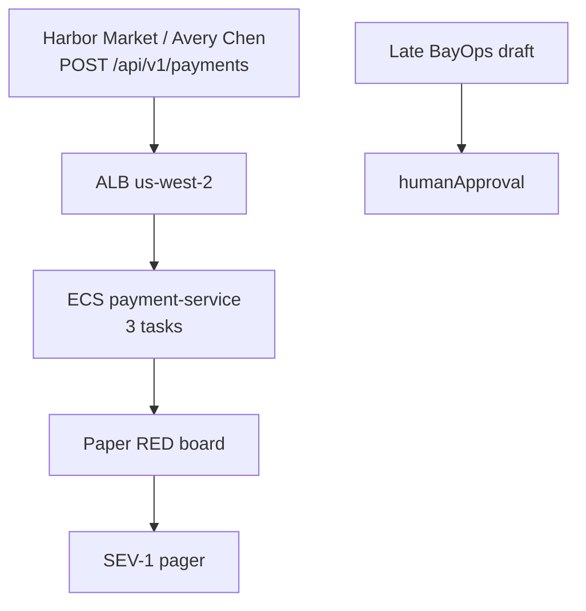

# CAPSTONE-4 — BayPay Production Crisis

**Type:** CAPSTONE  
**After:** Modules 13–15 (observability, security/HA literacy, BayOps four buckets)  
**Duration:** 90–150 minutes of gated diagnosis  
**Cost:** **$0** (pack path). **Real AWS, AMP, or Bedrock bills if you poke a live account.**  
**awsLab:** no — paper plus files; do not apply  
**Region:** `us-west-2`  
**Severity:** SEV-1  
**Pack:** [incidents/production/INC-CAP-4](../../incidents/production/INC-CAP-4/README.md)  
**Ops notes:** [datasets/baypay-ops/OBSERVABILITY.md](../../datasets/baypay-ops/OBSERVABILITY.md)  
**BayOps contract:** [datasets/baypay-ai/BAYOPS.md](../../datasets/baypay-ai/BAYOPS.md)  
**Diagrams:** AEJE-D-071 (initial WebSphere topology) · AEJE-D-072 (cloud-native target)  
**Worksheet (portfolio):** [student/worksheets/PF-crisis.md](../../student/worksheets/PF-crisis.md)

This student guide does **not** contain a root-cause answer. Work the evidence in gate order. Do not open `solutions/CAPSTONE-4/` until the worksheet is filled through RCA draft, prevention, and a BayOps reject.

**Cost warning:** This capstone is synthetic files. Do not create an AMP workspace, do not scrape a paid Prometheus, do not call Bedrock to “confirm,” and do not bounce a live `payment-service` “to reproduce.” If you already have leftover Module 11–12 resources, destroy them on those labs’ cleanup paths — not as an experiment during this page.

---

## Scenario

11:10 Pacific (19:10 UTC) on a synthetic `baypay-prod` evening, **2026-12-22**. Harbor Market reports that `POST /api/v1/payments` is failing for Avery Chen: creates that usually return in about a tenth of a second now return **HTTP 503** or hang long enough that the client gives up. Completions have dropped. The pager names `payment-service` on ECS in `us-west-2` and raises **SEV-1**. Jordan Voss says a canary roll went out on ticket **BAYPAY-CAP41**. Priya Nair wants the RED board before anyone hunts Postgres. Morgan Hale pastes a BayOps draft later in the bridge. You are the engineer on call. The incident pack is synthetic BayPay data.

---

## Business context

Avery Chen’s client (`11111111-1111-1111-1111-111111111111`, active USD account `22222222-2222-2222-2222-222222222221`) retries when a create payment does not return. Example payment `c1404e44-0000-4000-8000-111111111404`. A **503** is a missed authorization window for Harbor Market. Finance does not care that Actuator still answers on some tasks. They care that the golden URI is burning the teaching SLO (P99 **< 400 ms**, availability **99.9%** — OBSERVABILITY.md) during evening volume.

Do not bounce Postgres. Do not bounce `dmgr-east`. Do not disable TLS to “restore HTTP.” Do not scale the service to twenty tasks from your laptop. Do not treat the first red graph as “the database,” and do not treat a fluent BayOps paragraph as a **proven** root cause until a file you have already opened supports that sentence. A live AWS account is **not** required. A live Grafana is **not** required. A live Bedrock call is **not** required.

Traditional ND (`BayPayCell`, `dmgr-east`) is the **source estate** (AEJE-D-071). This page is on the cloud-native path (AEJE-D-072): ECS `payment-service` in `us-west-2`. Leftover cell is not on the merchant path tonight.

---

## Learning objectives

- Run a progressive SEV-1: **triage → stabilize → diagnose → communicate → remediate → recover → RCA → prevention**.
- Follow gated evidence. Write a hypothesis before each later file. Do not skip to the last paste.
- Separate “rate down, P99 up, 5xx/503 present” from “Hikari is the waiter.” Quote the tiles you opened.
- Write stabilization that restores the last healthy image (or removes the change the files support) without inventing a database outage or a leftover-cell bounce.
- Write remediation that belongs in client budgets, canary policy, pipeline smoke, and human approval — not in a one-off console bounce.
- Produce a comms update that does not announce a Multi-AZ failover, a cert miss, or an ALB `Path=/` story the files do not show.
- Evaluate a late BayOps fixture with the **four buckets** (Evidence, Hypotheses, Recommended investigation, Suggested remediation) plus `humanApproval`. **Reject** an uncited “proven RCA” and any auto-approved mutate.
- Record quotes on PF-crisis.md **in your words**, not by pasting the instructor folder.

---

## Architecture

Course diagrams **AEJE-D-071** and **AEJE-D-072** are the estate (source ND versus cloud-native target). This page is the cloud-native path. Until you have the PNGs, use the mermaid below plus OBSERVABILITY.md and BAYOPS.md.



Alt text: Merchants call payment-service on ECS in us-west-2. The paper RED board pages SEV-1. A late BayOps draft still needs a named human approval. The student guide does not name a root cause.

### Service list

| Service | In this pack? | Live apply? |
|---|---|---|
| payment-service (Boot, ECS) | Yes — symptoms, canary board, dump | No |
| Paper Grafana / RED | Yes — gated `dashboards-red.txt` | No |
| Deployment / canary paste | Yes — gated file | No |
| Thread dump | Yes — gated file | Do not attach a profiler to prod |
| Dependency latency paste | Yes — gated file | No |
| BayOps draft JSON | Yes — late gate; evaluate it | Do not call Bedrock |
| RDS / Postgres | No standalone file | Do not bounce |
| `dmgr-east` / Liberty cell | No | Do not bounce |
| AMP / CloudWatch / ACM | Named only | Do not create |

### Region assumptions

`us-west-2`. Cluster `baypay-prod-west`. Service `payment-service`. Golden URI `POST /api/v1/payments`. Teaching SLO: P99 **< 400 ms**, availability **99.9%**. Last healthy image named on the timeline is **3.8.4** before the **3.10.0** canary. Desired count is **3**.

### Least-privilege / security notes

- On-call needs read on dashboards, ECS deployments, and the release ticket. Deploy rollback if you have it. Not `AdministratorAccess`.
- Do not put PAN or a live `BAYPAY_DB_PASSWORD` on the worksheet.
- Do not dump heap or attach a profiler to a paid JVM “to be thorough.”
- Do not send Avery’s PAN, account number, or access keys into a model prompt.

### Failure scenario

Skipping to a late evidence file before a written hypothesis, or “fixing” prod by bouncing Postgres or `dmgr-east`, or accepting a BayOps **proven** stamp with no file you opened, fails Diagnostic method and Production awareness even if your eventual label matches a hallway rumor.

---

## Prerequisites

- Modules **13–15** completed, or read in the same sitting: RED/USE/SLO names, incident worksheet habit, BayOps four buckets.
- [OBSERVABILITY.md](../../datasets/baypay-ops/OBSERVABILITY.md) and [BAYOPS.md](../../datasets/baypay-ai/BAYOPS.md).
- Incident worksheet: [student-worksheet.md](../../incidents/production/INC-CAP-4/student-worksheet.md).
- INC-PROD-1301, INC-SEC-1402, and AI-1504 literacy helps as **method** contrast. Do not paste those packs’ instructor labels into this page.
- Optional PAKS: `docs/19-observability/overview.md`, `docs/27-production-failures/overview.md`, `docs/23-agentic-ai-architecture/agent-governance-and-safety.md`. Lessons stand alone without them.

---

## Environment setup

No runtime required. Open the pack:

```text
incidents/production/INC-CAP-4/
  README.md
  timeline.json
  student-worksheet.md
  evidence/          # gated — see timeline.json "gates"
```

This pack is a **gated subset**. Gate 1 is timeline plus merchant/comms impact. Later files unlock only after you write. The pack README documents what shipped and what was omitted.

Do not open `solutions/CAPSTONE-4/` until you have filled the worksheet through RCA draft, prevention, and the BayOps reject.

Do not run `aws` or `kubectl` against a paid account. The files are the cluster.

---

## Challenge/tasks

Work this as a page, not as a trivia quiz. Quote times in UTC or Pacific; stay consistent.

1. **Triage.** Read the pack README and `timeline.json`. Note who shipped, which image is on the board, when Harbor Market called, and the payment id `c1404e44-0000-4000-8000-111111111404`. Open **gate 1** only: `evidence/comms-and-impact.txt`. Record impact. Write a first hypothesis and the next investigation.
2. **After that hypothesis, gate 2:** open `evidence/dashboards-red.txt`. Record rate, P99, whether 5xx/503 dominate, and whether Hikari is quiet. Update the hypothesis. Write the next investigation.
3. **After that next, gate 3:** open `evidence/deployment-history.txt`. Note desired/running, how many tasks sit on **3.10.0** versus **3.8.4**, and the ticket. Update the hypothesis. A “bad deploy” sentence is not enough by itself — write what you still need to see.
4. **After that next, gate 4:** open `evidence/thread-dump.txt`. Quote thread state and the waiter frames. Update the hypothesis. Write the next investigation.
5. **After that next, gate 5:** open `evidence/dependency-latency.txt` **and** `evidence/bayops-draft.json`. Quote dependency numbers. Then evaluate the BayOps draft against BAYOPS.md: four buckets, no uncited proven RCA, `humanApproval` not auto.
6. **Stabilize** on the worksheet. Name what restores the merchant path *now*. Name what you explicitly will not do (Postgres bounce, `dmgr-east`, TLS-off, blind scale).
7. **Communicate.** Write a five-line update for merchant success, release, and SRE. No unsupported cause.
8. **Remediate** and **recover**. What remains after the page is quiet? What would you measure to say the SLO is healing?
9. **RCA draft** and **prevention.** In your words, from files you quoted. Then what you will change so the next canary cannot repeat this class of page.
10. **BayOps reject.** Rewrite the late fixture into four buckets. Set `humanApproval` to a named **rejected** (or pending) — not `BayOps-auto`. Copy your quotes onto [PF-crisis.md](../../student/worksheets/PF-crisis.md).

---

## Validation

A complete worksheet has: hypothesis (updated per gate), evidence, next investigation, stabilization, remediation, comms, RCA draft, prevention, and a BayOps reject. A lucky “database,” “just a bad deploy,” or a fluent mechanism sentence with no quoted **rate / P99 / 503**, no quoted **canary fraction**, no quoted **thread state / waiter**, and no quoted **dependency hang** scores low on Diagnostic method (see rubric). Skipping to `thread-dump.txt` or `bayops-draft.json` before a written question also scores low. Opening the solution first fails Diagnostic method. Accepting the BayOps **proven** stamp without a file you opened fails Diagnostic method and Production awareness.

Instructor scores with [instructor/rubrics/CAPSTONE-4.md](../../instructor/rubrics/CAPSTONE-4.md).

---

## Troubleshooting

- You jumped to later files: stop, write what you *would* have asked, then continue.
- Rate is down and 5xx/503 are loud: the error tile is part of this page. Still quote Hikari before you bounce a writer.
- Hikari pending is ~0: that is a measurement. Do not invent a Multi-AZ failover to fill the gap.
- You want to bounce Postgres or `dmgr-east`: re-read OBSERVABILITY.md and AEJE-D-072. This pack omitted database metrics on purpose. Leftover ND is not on the path.
- You want to scale to 20 tasks from your laptop: write the blast radius. Prefer the last healthy image named on the timeline.
- You copied INC-PROD-1301’s “5xx are quiet” story: this pack’s RED paste will tell you whether 5xx moved. Quote *this* board.
- You copied a Module 8 dump story, a Module 11 target-health story, a Module 12 port story, or a Module 14 handshake story: those packs are not this folder. Quote files you opened here.
- A BayOps draft says **proven** and auto-approves a leftover-cell bounce: that is an evaluation task, not an order. Cite the missing or invented source.
- You want a live Prometheus or Bedrock to “confirm”: write the numbers from the paste. This capstone does not require AMP or a model API.

---

## Expected outcome

A written diagnosis path an instructor can score. You may be wrong on the first hypothesis; you may not skip gates. The student guide will not tell you which waiter, which dependency, or which client budget broke. You will have a stabilize sentence, a remediate sentence, a recover check, an RCA draft, a prevention note, and a BayOps reject that keeps hypotheses **unproven** until cited.

---

## Interview questions

1. Why can P99 and throughput move together while Hikari pending stays near zero?
2. What does a canary of one task in three change about the first five minutes of a SEV-1?
3. When do you roll back to the last healthy image versus “tune the new image” during the page?
4. Why is “the deploy is bad” a weak sentence if you cannot quote a file?
5. How do the four BayOps buckets stop a fluent “proven RCA” from bouncing leftover ND?
6. What belongs in a five-line comms update before you have a waiter quote?
7. How would you tell Harbor Market the page is recovering without promising a cause you have not cited?

---

## Architecture/trade-off questions

1. Stop the canary / roll back to **3.8.4** versus disable a flag on **3.10.0** and stay on the new image — who is faster, what do you still owe merchants?
2. Timeouts and a circuit breaker on an outbound client versus a larger Tomcat pool — what fails first under hang?
3. Canary percent and a pipeline smoke versus “ship Friday and watch the pager” — who signs?
4. Should on-call page on SLO burn and saturation, or on “log line contains ERROR”?
5. Why is “take a heap dump now” a poor next step when the omitted-evidence table already said heap dump is out of scope?
6. Why is bouncing `dmgr-east` unrelated even if Liberty still exists in the estate (AEJE-D-071)?
7. Paper BayOps JSON versus a live Bedrock call during SEV-1 — what does the model add that a missing `source` cannot?

---

## Cleanup

None for the pack. Do not delete the evidence files. No cloud resources to tear down on the grade path.

If you ignored the cost warning and touched a live account, destroy leftover AMP workspaces, Grafana Cloud trials, Bedrock test stacks, and ECS experiments in `us-west-2` now.

---

## Cost estimate

**Grade path: $0.** Synthetic files only. No AWS API. No required Grafana. No required Bedrock.

**Misuse path:** live AMP, Managed Grafana, Bedrock, or “reproduce on prod” are dollars per day. Do not do that for this capstone.

---

## Hidden/revealable solution

The student guide does not include the answer. Submit the worksheet first. Instructors use `solutions/CAPSTONE-4/` and `instructor/rubrics/CAPSTONE-4.md`. Opening the solution before you write is a failed diagnostic method score. This capstone is `hideAnswerUpfront: true`.

---

## What you learned

A SEV-1 is a **method**: triage, gated evidence, stabilize before a fluent label, communicate without inventing a writer outage, remediate what you will not ship next time, recover against the SLO, then write RCA and prevention. BayOps is four buckets and a named approval, not an authority. A lucky “database” or “bad deploy” label does not replace gate order. AEJE-D-072 is the path merchants are on; AEJE-D-071 is not a bounce target.

---

## Portfolio deliverable

Attach the completed INC-CAP-4 worksheet. The capstone portfolio artifact is [student/worksheets/PF-crisis.md](../../student/worksheets/PF-crisis.md): record **your** quotes, stabilize versus remediate, BayOps reject, RCA draft, and prevention **in your words**, not by pasting the instructor RCA.
