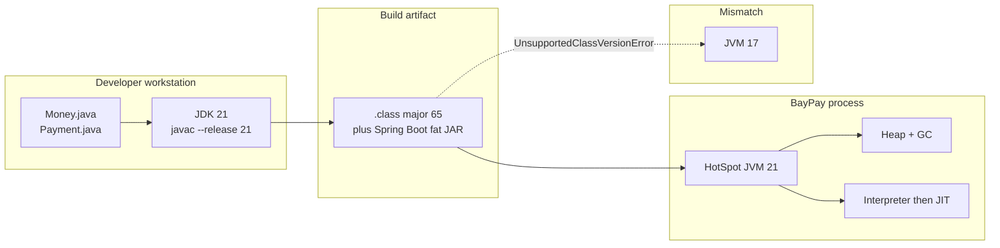

# L-1.1 — Modern Java, JDK and JVM overview

**Module:** 1 — Enterprise Java Engineering  
**Duration:** 30 minutes  
**BayPay case:** why the payment platform pins Java 21 LTS and ships a Maven Wrapper

---

## Why this matters

BayPay’s on-call engineer does not debug “Java.” They debug a **specific JDK build**, a **specific bytecode target**, and a **specific JVM** that loaded five Maven modules into one process. If a laptop runs 17, CI runs 21, and a leftover container image still has 11, you get `UnsupportedClassVersionError` on Monday and a silent behavioral change on Tuesday.

Payments code is unusually sensitive to that mismatch. `Money` uses `BigDecimal` scale rules that have been stable for years, but preview APIs, incubator modules, and “it compiled on my machine” language features are not. This lesson gives you a mental model of the toolchain so later labs fail for domain reasons, not because the wrong `java` is on `PATH`.

---

## Learning objectives

- Separate the language, the JDK, bytecode, and the JVM, and say what each one owns.
- Explain why BayPay standardizes on Java 21 LTS rather than “whatever is newest.”
- Read a class-file version error and map it to a compile/runtime mismatch.
- Describe the JVM subsystems that later modules (GC, threads, containers) will specialize.
- Run the BayPay reference app’s tests with the same JDK the course expects.

---

## Concept explanation

**Java the language** is the syntax you type: classes, records, sealed types, pattern matching. **The JDK** is the kit that compiles and ships that language: `javac`, `java`, `jlink`, `jpackage`, the standard library, and the `jmods`. **Bytecode** is the stable contract `javac` emits into `.class` files. **The JVM** is the process that loads those class files, verifies them, interprets or JIT-compiles them, and manages memory.

A useful sequence:

1. You write `Money.java`.
2. `javac --release 21` emits bytecode whose major version is 65 (Java 21).
3. A Java 21 JVM verifies and loads the class.
4. A Java 17 JVM refuses it: major 65 is newer than it understands.
5. A Java 21 JVM will still load Java 17 bytecode (major 61). Forward compatibility is not symmetric.

**JRE versus JDK.** Historically a JRE was a runtime-only install. Production images still sometimes ship a slim runtime (`jlink` custom image). Development and CI need a JDK. BayPay’s Maven Wrapper invokes `javac` through the compiler plugin, so a runtime-only image in CI will fail the build, not the tests.

**LTS versus non-LTS.** Java 21 is a Long-Term Support release. Java 22–24 add language polish, but BayPay’s risk profile (money movement, multi-year support, container base images) favors an LTS that vendors patch. The course uses 21 because that is the version the reference app declares in every `pom.xml`.

**HotSpot versus other VMs.** The reference app assumes HotSpot (the OpenJDK default). GraalVM native image is a later architectural option, not a Module 1 requirement. Do not treat “Java 21” and “Graal native” as the same decision.

**`--release` versus `source`/`target`.** `--release 21` compiles against the Java 21 API surface. Setting only `-source` and `-target` can still let you call APIs that do not exist on the target JDK. Enterprise builds use `--release`.

---

## Visual explanation



Alt text: Source files compile with JDK 21 into class files of major version 65. A Java 21 HotSpot JVM loads them into heap and JIT. A Java 17 JVM rejects the same bytes.

---

## Architecture

BayPay is one JVM process. The Maven modules are compile-time and package boundaries, not OS processes. `payment-service` is the composition root: it depends on `shared`, `refund-service`, `transaction-worker`, and `notification-service`. At runtime the JVM sees a single classpath (or layered Boot loader) and one heap.

That choice is deliberate. Authorization, ledger posting, and the first notification currently share a database transaction. Splitting them into three JVMs would turn a local method call into a distributed saga before the domain model is even solid. Module 1 therefore treats “the platform” as **one JDK, one bytecode target, one JVM**. Later modules teach when to break that.

What the JVM owns for BayPay, even before you study GC:

| Subsystem | Why a payments engineer cares |
|---|---|
| Class loading | A stale `shared` JAR on the classpath silently old-behaviors `Money` |
| Bytecode verifier | Corrupted or hand-edited class files fail closed |
| Heap | `Money`, `Payment`, and ledger rows live here; later GC labs start from this fact |
| JIT | Hot authorize/post path is compiled; first requests are slower |
| Threads | HTTP workers and later virtual-thread labs share this process |

---

## Production example (BayPay)

The reference app lives at `reference-apps/baypay/`. Every module’s `pom.xml` sets `java.version` to 21. The Maven Wrapper (`mvnw`) pins the Maven distribution so students do not mix Maven 3.8 and 3.9 plugin behavior.

Local run (from the app root):

```bash
export JAVA_HOME="${JAVA_HOME:-/opt/homebrew/opt/openjdk@21}"
./mvnw -pl payment-service -am test
```

If `java -version` prints 17, the compiler plugin may still succeed if `JAVA_HOME` points at 21 — or fail if it does not. **Trust `JAVA_HOME` and `./mvnw -version`**, not the first `java` on `PATH`.

Avery Chen’s payment does not care which laptop compiled the JAR. It cares that the class that validates `amount > 0` and currency `USD|EUR|GBP` is the one CI tested. Version pinning is how BayPay makes that true.

---

## Code/configuration example

This snippet is ordinary Java 21. It compiles with `javac --release 21` and prints the runtime version the JVM actually launched — the check you want in a boot log, not a comment in a README.

```java
package com.baypay.shared.runtime;

public final class JvmBanner {

    private JvmBanner() {
    }

    public static String describe() {
        Runtime.Version version = Runtime.version();
        return "BayPay JVM feature=" + version.feature()
                + " vendor=" + System.getProperty("java.vendor")
                + " vm=" + System.getProperty("java.vm.name");
    }

    public static void assertLts21() {
        int feature = Runtime.version().feature();
        if (feature != 21) {
            throw new IllegalStateException(
                    "BayPay requires JDK 21 LTS; this process is Java " + feature);
        }
    }

    public static void main(String[] args) {
        assertLts21();
        System.out.println(describe());
    }
}
```

`Runtime.version().feature()` is the integer 21, not the marketing string `"21.0.6"`. Compare integers in guards; parse strings only when you must show them to a human.

---

## Trade-offs

- **Pin 21 LTS versus track non-LTS.** Newer language features arrive faster on 22+. BayPay pays for fewer “does our base image exist?” surprises and a longer vendor patch window.
- **`--release 21` versus multi-release JARs.** Multi-release JARs let one artifact use newer APIs when the JVM supports them. They also create two code paths for `Money`. Payments teams almost never want that in the domain layer.
- **Full JDK in the image versus `jlink`.** A full JDK makes crash dumps and `jcmd` easy. A custom runtime shrinks attack surface and image size. BayPay’s local profile uses a normal JDK; container hardening is Module 9.
- **One JVM modular monolith versus many JVMs.** One heap and one GC for authorize-plus-post is simpler and cheaper. Independent scale and failure isolation come later, when a module has earned them.

---

## Failure modes

- **Wrong major version.** CI compiles with 21; a developer runs the JAR on 17. Symptom: `UnsupportedClassVersionError: class file version 65.0`. Fix the runtime, not the domain.
- **PATH/JAVA_HOME split.** `java -version` is 21, Maven still uses 11 because `JAVA_HOME` is stale. Symptom: the IDE and the terminal disagree.
- **Preview flags in production.** `--enable-preview` on a laptop, absent in the container. Symptom: `Preview features are not enabled` at startup, or worse, a class compiled with preview that never loads.
- **Mixed bytecode on the classpath.** An old `shared` snapshot next to a new `payment-service`. Symptom: a constructor that “used to accept null currency” reappears.
- **Container `JAVA_TOOL_OPTIONS` surprises.** An inherited `-Xmx` from a shared base image starves the JVM before the first payment posts. You will treat this as a performance incident in Module 7; know that the knob exists now.

---

## Security/reliability implications

An unpatched JDK is a production defect. BayPay’s threat model in this module is not PCI scoping; it is **running a maintained runtime**. Serialization gadgets, zlib issues, and TLS defaults are JVM-level. You cannot unit-test your way out of an abandoned Java 8 host.

Reliability follows the same pin. If every environment cannot state “Java 21.0.x from vendor Y,” you cannot attribute a `BigDecimal` or timezone bug to application code. Record the banner from `JvmBanner.describe()` in boot logs so an incident timeline has the runtime, not a guess.

Do not disable the bytecode verifier to “make a vendor JAR load.” If a library will not verify, it does not ship next to `Payment`.

---

## Interview perspective

**Engineer.** “JDK compiles Java to bytecode; the JVM runs it. BayPay uses 21 because the `pom` says 21. I check `java -version` when I see class-file errors.”

**Senior.** “I separate language level from runtime. I compile with `--release 21`, pin the wrapper, and fail the boot banner if `Runtime.version().feature()` is not 21. I have seen PATH and JAVA_HOME disagree.”

**Staff.** “I treat the JDK as part of the platform contract: base image, CI image, and local SDK are one matrix. I would not adopt a preview API in `Money` because it couples the domain to a flag we cannot guarantee in every region.”

**Principal.** “Runtime choice is a support and risk decision, not a language-fashion decision. I keep BayPay on LTS until a feature (virtual threads at scale, a GC, a container size target) has a measured payoff. I will not fragment the estate onto two JVMs to look modern.”

---

## Key takeaways

- Language, JDK, bytecode, and JVM are four different contracts. Payments incidents often sit on the seam between them.
- BayPay pins Java 21 LTS and compiles with `--release`, not “whatever the laptop has.”
- Newer bytecode will not run on an older JVM; the reverse usually will.
- The modular monolith is one JVM on purpose. Do not split processes until a module needs its own scale or failure domain.
- Log the actual `Runtime.version()` in production so you are never guessing.

---

## Knowledge check

1. A colleague emails a stack trace: `UnsupportedClassVersionError: com.baypay.shared.domain.Money has been compiled by a more recent version of the Java Runtime (class file version 65.0)`. What went wrong, and what do you change first?
2. Why does BayPay prefer `--release 21` over setting only `-source 21` and `-target 21`?
3. The payment, refund, and worker modules run in one JVM today. Give one reason to keep it that way and one reason you might later extract `transaction-worker`.

<details>
<summary>Answers</summary>

1. `Money` was compiled as Java 21 bytecode (major 65) and loaded on an older JVM (typically 17 or 11). Change the **runtime** (or the container image) to JDK 21 first. Recompiling down to 17 is a product decision, not a first aid step, and it would fight the course’s pin.

2. `--release 21` also restricts the **standard library APIs** you can call. `source`/`target` alone can let you compile a call that does not exist on the target JDK.

3. Keep one JVM while authorize and ledger post must share a single database transaction and one team owns the lifecycle. Extract the worker when posting needs a different scale, a different store, or an independent release train — not to draw more boxes.

</details>

---

## Related lab

No lab is attached to L-1.1 alone. Confirm your JDK, then continue to L-1.2. You will apply this runtime discipline in [BUILD-101](../../../../labs/BUILD-101/README.md) when you compile the domain model with Java 21.

---

## Related PAKS deep dive

Optional: `docs/09-transactions/overview.md` on [paks.bayareala8s.com](https://paks.bayareala8s.com) discusses transactional boundaries once more than one resource is involved. This lesson does not require it. You already have enough to pin a JDK and explain a class-file error.
