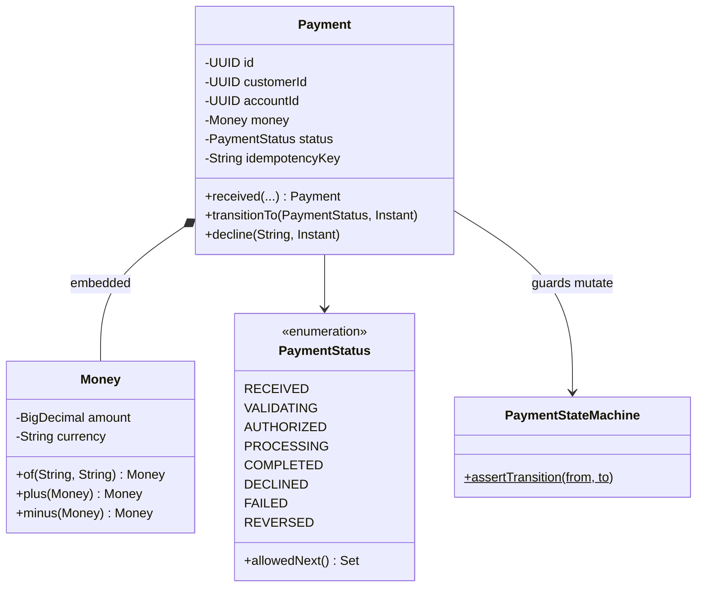

# L-1.2 — Object design, SOLID and immutability

**Module:** 1 — Enterprise Java Engineering  
**Duration:** 30 minutes  
**BayPay case:** `Money` as a value object and `Payment` as an entity that owns its state machine

---

## Why this matters

A BayPay payment that can jump from `RECEIVED` to `COMPLETED` in a setter is not a model. It is a bag of fields that will eventually post a ledger row without authorization. Avery Chen’s frozen account (`22222222-2222-2222-2222-222222222222`) must fail closed because `Account` and `Payment` refuse illegal combinations, not because a controller remembered an `if`.

Immutability and SOLID are not style points. They are how you keep **money, identity, and lifecycle** from leaking into every service class. Module 1’s domain lives in `reference-apps/baypay/shared`. If that package is sloppy, every later Spring lesson inherits the sloppiness.

---

## Learning objectives

- Distinguish value objects (`Money`) from entities (`Payment`, `Account`, `Customer`).
- Place invariants in constructors and factories, not in setters after the object exists.
- Apply each SOLID letter to a payments example you can point at in the reference app.
- Explain why `Money` operations return new instances and why `Payment.transitionTo` is the only legal mutator for status.
- Recognize a God object and a leaked setter as review comments you would block.

---

## Concept explanation

**Value object.** Two `Money` instances with `10.00` and `USD` are interchangeable. Equality uses `compareTo` so `10.0` and `10.00` are one key. There is no setter. `plus` / `minus` return a new `Money`. Scale is two decimals; extra scale throws.

**Entity.** Two `Payment` instances with the same amount are not the same payment. Identity is the UUID. Status may change along a documented path; `customerId`, `accountId`, and `Money` must not change after `Payment.received(...)`.

**Invariants belong in the type.** `amount > 0` and `currency ∈ {USD, EUR, GBP}` are not Bean Validation decorations that a future caller might skip. They are constructor rules. Bean Validation still helps at the HTTP boundary in Module 3; it does not replace the domain.

**SOLID, in BayPay words:**

| Letter | Meaning here |
|---|---|
| S | `Payment` does not send email. `NotificationListener` does. |
| O | New payment states are added to `PaymentStatus.allowedNext()`, not by editing every `if` in the API. |
| L | Any `PaymentAuthorizer` implementation must honor “frozen means decline.” A test double that always approves is a lying subtype. |
| I | Callers that only need `account.isActive()` should not depend on a 40-method `AccountGod`. |
| D | `PaymentApplicationService` depends on `PaymentAuthorizer`, not on a concrete card-network SDK. |

**Immutability is a spectrum.** `Money` is immutable. `Payment` is *selectively* mutable: status, `failureReason`, `updatedAt`. That is honest for a JPA entity with `@Version`. Replacing the whole entity on every transition is possible; BayPay does not need that yet.

---

## Visual explanation



Alt text: Payment embeds Money, holds a PaymentStatus, and may change status only through PaymentStateMachine.assertTransition.

---

## Architecture

Domain types sit in `com.baypay.shared.domain`. Application services orchestrate; they do not re-implement currency rules. JPA annotations live on the same types so you can read one file. A larger estate might split a persistence model; BayPay’s size does not justify that yet.

`PaymentAuthorizer` is the SOLID seam: frozen accounts, currency mismatch, and amounts above `1000000.00` decline. Tests inject a different implementation. The domain does not import HTTP. `LedgerTransaction` is named to avoid colliding with `jakarta.transaction.Transaction`.

---

## Production example (BayPay)

Avery Chen (`11111111-1111-1111-1111-111111111111`) holds two USD accounts. The active one may originate a `Payment.received(...)`. The frozen one must never reach `AUTHORIZED`. The check is not a comment in a wiki: `Account.isActive()` and `PaymentAuthorizer.DefaultPaymentAuthorizer` both treat `FROZEN` as a decline.

A retry with the same `Idempotency-Key` returns the original entity. The value `25.00 USD` can repeat; the payment id must not.

Read `Money`, `Payment`, `PaymentStatus`, and `PaymentStateMachine` under `reference-apps/baypay/shared/src/main/java/com/baypay/shared/domain/` before the lab.

---

## Code/configuration example

The following compiles as ordinary Java 21. It is the teaching shape of the reference `Money` and a fragment of `Payment` — invariants in the constructor, new instances for arithmetic, no public status setter.

```java
package com.baypay.shared.domain;

import java.math.BigDecimal;
import java.math.RoundingMode;
import java.util.Objects;
import java.util.Set;

public final class Money {

    private static final Set<String> SUPPORTED = Set.of("USD", "EUR", "GBP");

    private final BigDecimal amount;
    private final String currency;

    public Money(BigDecimal amount, String currency) {
        if (amount == null || amount.signum() <= 0) {
            throw new IllegalArgumentException("amount must be greater than zero");
        }
        if (currency == null || !SUPPORTED.contains(currency)) {
            throw new IllegalArgumentException("currency must be one of " + SUPPORTED);
        }
        this.amount = amount.setScale(2, RoundingMode.UNNECESSARY);
        this.currency = currency;
    }

    public Money plus(Money other) {
        if (!currency.equals(other.currency)) {
            throw new IllegalArgumentException("currency mismatch");
        }
        return new Money(amount.add(other.amount), currency);
    }

    public BigDecimal amount() { return amount; }
    public String currency() { return currency; }

    @Override
    public boolean equals(Object o) {
        return o instanceof Money m
                && amount.compareTo(m.amount) == 0
                && currency.equals(m.currency);
    }

    @Override
    public int hashCode() {
        return Objects.hash(amount.stripTrailingZeros(), currency);
    }
}
```

A `Payment` does not expose `setStatus`. It exposes `transitionTo`, which asks the state machine first. That is Open/Closed: new legal edges are data in `allowedNext()`, not new setters.

---

## Trade-offs

- **Rich domain versus anemic DTO plus service.** Anemic types move every invariant into `PaymentApplicationService`. Faster to type on day one; every new caller forgets a check. BayPay keeps rules on `Money` and `Payment`.
- **Immutable entity versus mutable JPA entity.** Fully immutable `Payment` records play badly with `@Version` and dirty checking. BayPay mutates status on one instance and keeps money immutable.
- **Checked exceptions versus unchecked domain errors.** The reference uses unchecked `DomainValidationException` so application services stay readable. Callers still must not swallow them (FIX-103 will punish that habit).
- **SOLID everywhere versus a small teaching app.** Do not extract an interface for every class. Extract `PaymentAuthorizer` because tests and a future card network need a seam. Do not extract `MoneyReader`.

---

## Failure modes

- **Public setters on `status`.** A migration script or a desperate “just complete it” admin path skips `VALIDATING`. Ledger and payment disagree.
- **`double` money.** `0.1 + 0.2` is not `0.3`. Authorization ceilings drift. Use `BigDecimal` with explicit scale.
- **Currency-blind `plus`.** Adding `USD` to `EUR` and storing the number produces a ledger fiction.
- **Equals on `BigDecimal` without `compareTo`.** `10.0` and `10.00` break `Set` and idempotency maps.
- **God service.** One class that validates, authorizes, posts, emails, and writes audit will be the class nobody can change during an incident.

---

## Security/reliability implications

A mutable `Money` sitting on a shared `Payment` is a reliability bug that looks like fraud. If one thread scales the amount while another posts the ledger, you have neither an accurate book nor a trustworthy audit line. Immutability of money is a concurrency control you get before Module 2.

Constructor validation is a security control against **confused amounts**: negative refunds, zero-value noise that still triggers notifications, and novelty currencies that bypass FX policy. Fail closed with a domain error code (`VALIDATION_FAILED`, `CURRENCY_MISMATCH`), not with a 500 and a stack trace that mentions Avery’s identifiers in logs without a correlation id (L-1.5).

Do not log full PAN-like data. BayPay’s synthetic references (`invoice-1001`) are safe to store; treat real card numbers as out of scope and out of the domain object.

---

## Interview perspective

**Engineer.** “`Money` is immutable and validates amount and currency. `Payment` uses a factory and `transitionTo` so I cannot set `COMPLETED` from `RECEIVED`.”

**Senior.** “I would fail a PR that adds `setStatus`. Invariants belong in the type. I use `compareTo` for money equality and I keep `PaymentAuthorizer` as the test seam rather than mocking the database for every decline reason.”

**Staff.** “I decide what is a value and what is an entity before I name tables. I accept JPA on the domain type at this size, and I will split a persistence model when the domain starts serving two store shapes. I watch for anemic services as the default Spring style.”

**Principal.** “Object design is how we encode policy that regulators and auditors will ask about: you cannot complete what you did not authorize. I fund time to keep the state machine in one place so product cannot invent a ‘shortcut status’ in a controller during a launch.”

---

## Key takeaways

- `Money` is a value object: no identity, no setters, arithmetic returns new instances.
- `Payment` is an entity: identity is the UUID; status changes only through the state machine.
- SOLID is a review vocabulary for seams (`PaymentAuthorizer`) and responsibilities (do not email from `Payment`).
- `double` is not money. `BigDecimal` with enforced scale is.
- A public `setStatus` is a production defect, not a convenience.

---

## Knowledge check

1. Why does `Money.equals` use `amount.compareTo` instead of `amount.equals`?
2. A developer adds `public void setStatus(PaymentStatus status)` to ship a support tool. What reliability failure does that create, and what API should the tool call instead?
3. Which SOLID letter is `PaymentAuthorizer` primarily demonstrating, and what would a violating implementation look like?

<details>
<summary>Answers</summary>

1. `BigDecimal.equals` requires the same scale (`10.0` ≠ `10.00`). Payments care about numeric value. `compareTo` treats those amounts as equal; `hashCode` uses `stripTrailingZeros` to stay consistent.

2. The tool can mark a payment `COMPLETED` without `VALIDATING` or `AUTHORIZED`, so the ledger and audit trail no longer match the lifecycle. The tool should go through `transitionTo` / `decline` / `fail`, or through an application service that applies the same machine.

3. Dependency Inversion (and Liskov, if you discuss test doubles). A violating implementation always returns `approve()` even for `FROZEN`, or the service depends on a concrete SDK type it cannot replace in tests.

</details>

---

## Related lab

[BUILD-101 — Build BayPay transaction domain model](../../../../labs/BUILD-101/README.md). You will write or extend `Money`, `Payment`, and the state machine so illegal amounts and illegal transitions cannot be constructed.

---

## Related PAKS deep dive

Optional: `docs/09-transactions/overview.md` (PAKS / [paks.bayareala8s.com](https://paks.bayareala8s.com)) on what a “transaction” means once persistence is involved. The domain rules in this lesson still apply if you never open that document.
