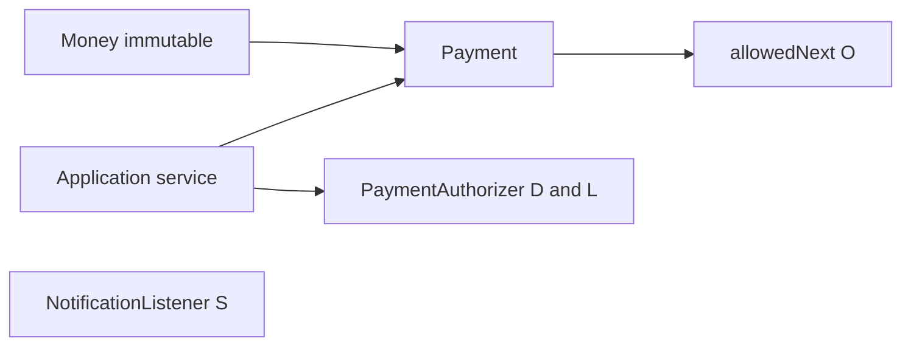

# L-1.2 — Object design, SOLID and immutability

**Module:** 1 — Enterprise Java Engineering  
**Duration:** 30 minutes  
**BayPay case:** `Money` as a value object and `Payment` as an entity that owns its state machine

---

## Why this matters

A BayPay payment that can jump from `RECEIVED` to `COMPLETED` in a setter is not a model. It is a bag of fields that will eventually post a ledger row without authorization. Avery Chen’s frozen account (`22222222-2222-2222-2222-222222222222`) must fail closed because `Account` and `Payment` refuse illegal combinations, not because a controller remembered an `if`.

Immutability and SOLID are not style points. They are how you keep **money, identity, and lifecycle** from leaking into every service class. Module 1’s domain lives in `reference-apps/baypay/shared`. If that package is sloppy, every later Spring lesson inherits the sloppiness.

---

## Learning objectives

- Distinguish value objects (`Money`) from entities (`Payment`, `Account`, `Customer`).
- Place invariants in constructors and factories, not in setters after the object exists.
- Name each SOLID letter, say what it requires, and point at a BayPay keep and a BayPay violation.
- Explain why `Money` operations return new instances and why `Payment.transitionTo` is the only legal mutator for status.
- Recognize a God object and a leaked setter as review comments you would block.

---

## Concept explanation

**Value object.** Two `Money` instances with `10.00` and `USD` are interchangeable. Equality uses `compareTo` so `10.0` and `10.00` are one key. There is no setter. `plus` / `minus` return a new `Money`. Scale is two decimals; extra scale throws.

**Entity.** Two `Payment` instances with the same amount are not the same payment. Identity is the UUID. Status may change along a documented path; `customerId`, `accountId`, and `Money` must not change after `Payment.received(...)`.

**Invariants belong in the type.** `amount > 0` and `currency ∈ {USD, EUR, GBP}` are constructor rules, not Bean Validation a future caller might skip.

**SOLID** is five object-design rules (Robert C. Martin): Single responsibility, Open/closed, Liskov substitution, Interface segregation, Dependency inversion. BayPay uses them so money policy has one owner.

- **S — Single responsibility.** One reason to change. `Payment` owns lifecycle. Completion email is `NotificationListener`. A God `Payment` that validates, authorizes, posts, and emails is the class nobody can change during an incident.
- **O — Open/closed.** Extend without editing every caller. New legal edges live in `PaymentStatus.allowedNext()`. A public `setStatus` or a controller `if` to “just complete it” reopens every path.
- **L — Liskov substitution.** A subtype must honor the parent contract. Any `PaymentAuthorizer` must decline a frozen account. A test double that always `approve()`s is a lying subtype: tests pass, Avery’s frozen account (`…2222`) authorizes in production.
- **I — Interface segregation.** Depend only on methods you use. Callers that need `account.isActive()` must not take a 40-method `AccountGod`. Fat interfaces force mocks to lie about methods they do not care about.
- **D — Dependency inversion.** Depend on abstractions, not concretions. `PaymentApplicationService` depends on `PaymentAuthorizer`, not a card-network SDK. That is the test seam and the future-network seam. Do not extract `MoneyReader`.

**Immutability is a spectrum.** `Money` is immutable. `Payment` is *selectively* mutable: status, `failureReason`, `updatedAt`. That is honest for a JPA entity with `@Version`.

---

## Visual explanation



Alt text: Immutable Money feeds Payment. The application service calls Payment and PaymentAuthorizer. NotificationListener is a separate S-shaped responsibility. allowedNext is the Open/Closed table. BayPay is a fictional payment platform used for instruction.

---

## Architecture

Domain types sit in `com.baypay.shared.domain`. Application services orchestrate; they do not re-implement currency rules. JPA annotations live on the same types so you can read one file.

`PaymentAuthorizer` is the D and L seam: frozen accounts, currency mismatch, and amounts above `1000000.00` decline. Tests inject a different implementation that still honors “frozen means decline.” The domain does not import HTTP. `LedgerTransaction` is named to avoid colliding with `jakarta.transaction.Transaction`.

---

## Production example (BayPay)

Avery Chen (`11111111-1111-1111-1111-111111111111`) holds two USD accounts. The active one may originate a `Payment.received(...)`. The frozen one must never reach `AUTHORIZED`. The check is not a wiki comment: `Account.isActive()` and `PaymentAuthorizer.DefaultPaymentAuthorizer` both treat `FROZEN` as a decline.

A retry with the same `Idempotency-Key` returns the original entity. The value `25.00 USD` can repeat; the payment id must not.

Read `Money`, `Payment`, `PaymentStatus`, and `PaymentStateMachine` under `reference-apps/baypay/shared/src/main/java/com/baypay/shared/domain/` before the lab.

---

## Code/configuration example

Invariants in the constructor, new instances for arithmetic, no public status setter. This is the teaching shape of reference `Money`.

```java
package com.baypay.shared.domain;

import java.math.BigDecimal;
import java.math.RoundingMode;
import java.util.Objects;
import java.util.Set;

public final class Money {

    private static final Set<String> SUPPORTED = Set.of("USD", "EUR", "GBP");

    private final BigDecimal amount;
    private final String currency;

    public Money(BigDecimal amount, String currency) {
        if (amount == null || amount.signum() <= 0) {
            throw new IllegalArgumentException("amount must be greater than zero");
        }
        if (currency == null || !SUPPORTED.contains(currency)) {
            throw new IllegalArgumentException("currency must be one of " + SUPPORTED);
        }
        this.amount = amount.setScale(2, RoundingMode.UNNECESSARY);
        this.currency = currency;
    }

    public Money plus(Money other) {
        if (!currency.equals(other.currency)) {
            throw new IllegalArgumentException("currency mismatch");
        }
        return new Money(amount.add(other.amount), currency);
    }

    public BigDecimal amount() { return amount; }
    public String currency() { return currency; }

    @Override
    public boolean equals(Object o) {
        return o instanceof Money m
                && amount.compareTo(m.amount) == 0
                && currency.equals(m.currency);
    }

    @Override
    public int hashCode() {
        return Objects.hash(amount.stripTrailingZeros(), currency);
    }
}
```

`Payment` does not expose `setStatus`. It exposes `transitionTo`, which asks the state machine first. That is Open/Closed: new legal edges are data in `allowedNext()`, not new setters.

---

## Trade-offs

- **Rich domain versus anemic DTO plus service.** Anemic types move every invariant into `PaymentApplicationService`. Faster on day one; every new caller forgets a check. BayPay keeps rules on `Money` and `Payment`.
- **Immutable entity versus mutable JPA entity.** Fully immutable `Payment` records play badly with `@Version` and dirty checking. BayPay mutates status on one instance and keeps money immutable.
- **SOLID everywhere versus a small teaching app.** Extract `PaymentAuthorizer` because tests and a future card network need a seam. Do not extract `MoneyReader`. A lying always-approve double is worse than no interface.

---

## Failure modes

- **Public setters on `status`.** A support tool marks `COMPLETED` without `AUTHORIZED`. Ledger and payment disagree.
- **`double` money.** `0.1 + 0.2` is not `0.3`. Use `BigDecimal` with explicit scale.
- **Currency-blind `plus`.** Adding `USD` to `EUR` produces a ledger fiction.
- **Equals on `BigDecimal` without `compareTo`.** `10.0` and `10.00` break `Set` and idempotency maps.
- **SOLID violations.** Email from `Payment` (S). New states as controller `if`s (O). Always-approve test double (L). `AccountGod` (I). Service constructs a card SDK (D).

---

## Security/reliability implications

A mutable `Money` on a shared `Payment` is a reliability bug that looks like fraud. Immutability of money is a concurrency control you get before Module 2.

Constructor validation is a security control against confused amounts: negative refunds, zero-value noise, novelty currencies that bypass FX policy. Fail closed with `VALIDATION_FAILED` or `CURRENCY_MISMATCH`, not a 500 that logs Avery’s identifiers without a correlation id (L-1.5).

Do not log full PAN-like data. BayPay’s synthetic references (`invoice-1001`) are safe; treat real card numbers as out of scope.

---

## Interview perspective

**Engineer.** “SOLID is SRP, OCP, LSP, ISP, DIP. `Money` is immutable. `Payment` uses `transitionTo`. `Payment` does not send email. The service depends on `PaymentAuthorizer`.”

**Senior.** “I fail a PR that adds `setStatus` or an always-approve authorizer double. Invariants belong in the type. I use `compareTo` for money equality.”

**Staff.** “I decide value versus entity before I name tables. I extract a seam when tests or a second network need it. I will split a persistence model when the domain serves two store shapes.”

**Principal.** “Object design encodes policy auditors will ask about: you cannot complete what you did not authorize. I fund one state machine so product cannot invent a shortcut status in a controller.”

---

## Key takeaways

- SOLID is five letters: one reason to change, extend without editing callers, honest subtypes, small interfaces, depend on abstractions.
- `Money` is a value object: no identity, no setters, arithmetic returns new instances.
- `Payment` is an entity: identity is the UUID; status changes only through the state machine.
- `PaymentAuthorizer` is the D/L seam. Do not email from `Payment`.
- `double` is not money. A public `setStatus` is a production defect.

---

## Knowledge check

1. Why does `Money.equals` use `amount.compareTo` instead of `amount.equals`?
2. A developer adds `public void setStatus(PaymentStatus status)` to ship a support tool. What reliability failure does that create, and what API should the tool call instead?
3. Spell SOLID, then say which letter `PaymentAuthorizer` primarily demonstrates and what a violating implementation looks like.

<details>
<summary>Answers</summary>

1. `BigDecimal.equals` requires the same scale (`10.0` ≠ `10.00`). Payments care about numeric value. `compareTo` treats those amounts as equal; `hashCode` uses `stripTrailingZeros` to stay consistent.

2. The tool can mark a payment `COMPLETED` without `VALIDATING` or `AUTHORIZED`, so the ledger and audit trail no longer match the lifecycle. The tool should go through `transitionTo` / `decline` / `fail`, or through an application service that applies the same machine.

3. Single responsibility, Open/closed, Liskov substitution, Interface segregation, Dependency inversion. `PaymentAuthorizer` is primarily D (and L for test doubles). A violating implementation always `approve()`s a `FROZEN` account, or the service depends on a concrete SDK it cannot replace in tests.

</details>

---

## Related lab

[BUILD-101 — Build BayPay transaction domain model](../../../../labs/BUILD-101/README.md). You will write or extend `Money`, `Payment`, and the state machine so illegal amounts and illegal transitions cannot be constructed.

---

## Related PAKS deep dive

Optional: `docs/09-transactions/overview.md` (PAKS / [paks.bayareala8s.com](https://paks.bayareala8s.com)) on what a “transaction” means once persistence is involved. The domain rules in this lesson still apply if you never open that document.
