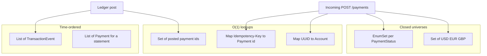

# L-1.3 — Collections and generics

**Module:** 1 — Enterprise Java Engineering  
**Duration:** 30 minutes  
**BayPay case:** `EnumSet` transition tables, currency `Set`, and type-safe ledgers

---

## Why this matters

BayPay’s state machine is a collection. `PaymentStatus.allowedNext()` returns an `EnumSet` of legal successors. The supported currencies are a `Set<String>` that `Money` consults on every construction. If those collections are raw `List`s of `Object`, a typo (`"USDD"`) or a wrong enum (`COMPLETED` from `RECEIVED`) becomes a runtime surprise in the authorize path.

Generics are how the compiler refuses to put a `Refund` in a `List<Payment>`. Raw types are how FIX-103 will later hide that mistake. This lesson is the last chance to treat collections as **part of the domain model**, not as a dumping ground.

---

## Learning objectives

- Choose `List`, `Set`, `Map`, and `EnumSet`/`EnumMap` for payment-shaped data.
- Write generic methods that keep money and identifiers typed end to end.
- Explain erasure well enough to avoid `List<Money>` versus `List` bugs and illegal casts.
- Use `Set.of` and `EnumSet` for small closed universes (currencies, statuses).
- Spot N+1-style list scans that CHALLENGE-104 will force you to replace with maps.

---

## Concept explanation

**List** is ordered, allows duplicates, and is the right shape for “events in time”: `TransactionEvent` rows for one ledger id, or a page of payments returned to a client. It is the wrong shape for “is this currency allowed?” and “have I already posted this payment id?”

**Set** is membership. `Set.of("USD", "EUR", "GBP")` is the currency universe. A `HashSet<UUID>` of already-posted payment ids is how you stop a naive posting loop from scanning the entire ledger for every incoming id.

**Map** is lookup by key. Account id → account, idempotency key → payment id, currency → scale rules. If you write a `for` loop whose only job is “find the matching id,” you wanted a `Map`.

**EnumSet and EnumMap.** `PaymentStatus` has eight values. `allowedNext()` returns `EnumSet.of(...)` or `EnumSet.noneOf(...)`. That is compact, typed, and faster than a `HashSet<PaymentStatus>` for a tiny enum. An `EnumMap<PaymentStatus, Set<PaymentStatus>>` is the same table if you prefer data over a `switch`.

**Generics and erasure.** `List<Money>` and `List<Refund>` are the same list at runtime. The compiler still erases to `List`, so you cannot overload two methods that differ only by generic parameter, and you cannot do `new T[]`. You *can* keep the source typed so you never insert a `String` into a money list. Raw `List` opts out of that help.

**Bounded types.** `Money.plus` does not need a type parameter; both sides are `Money`. You will want bounds later for repositories (`Optional<Payment>`). Wildcard `List<? extends Money>` is for producers; `List<? super Money>` is for consumers. Do not sprinkle `?` because it looks advanced. Use it when a method must accept a typed collection it will only read or only write.

**Unmodifiable views.** `Set.of` and `List.copyOf` throw on mutation. That is what you want for the currency universe. A `new HashSet<>(SUPPORTED)` that a caller can `add("JPY")` is how an unsupported currency sneaks in.

---

## Visual explanation



Alt text: Incoming payments consult a currency set, an EnumSet of next statuses, and maps for account and idempotency. Posting uses a set of posted ids and a list of events.

---

## Architecture

In the reference app, collections appear at three layers:

1. **Domain constants** — `Money.SUPPORTED`, `PaymentStatus.allowedNext()`.
2. **Persistence** — Spring Data returns `Optional<Payment>` and `List<...>` from repositories. The domain does not expose a raw `EntityManager` query of `List`.
3. **Application** — idempotency lookup is a map-shaped store (a table with a unique key), not a list scan.

CHALLENGE-104’s starter pretends layer 3 was written as nested loops over `List`. That is a realistic failure: the model was correct and the batch job still went quadratic. Architecture includes **access patterns**, not only class diagrams.

Do not use `Hashtable` or `Vector` in new BayPay code. They are synchronized leftovers. Do not use `ConcurrentHashMap` yet unless you have a concurrency story (Module 2). In Module 1, pick the sequential collection that matches the access pattern.

---

## Production example (BayPay)

`PaymentStatus.allowedNext()` is the production collection:

```text
RECEIVED    → {VALIDATING}
VALIDATING  → {AUTHORIZED, DECLINED}
AUTHORIZED  → {PROCESSING, FAILED}
PROCESSING  → {COMPLETED, FAILED}
COMPLETED   → {REVERSED}
DECLINED, FAILED, REVERSED → {}
```

That table is the product. A `List<String>` of status names would accept `"compleeted"` and would not survive refactoring. An `EnumSet` will not compile if you misspell the constant.

Currency is similarly closed. Avery’s accounts are USD. A `JPY` payment is rejected when `Money` is constructed, before authorization. The set is small on purpose: FX and settlement for other currencies are out of scope for this platform version.

Idempotency is a map in spirit: `(operation, key) → record`. Replays do not iterate all payments looking for a matching header.

---

## Code/configuration example

This compiles on Java 21. It shows an `EnumSet` state table, a generic helper that never returns a raw list, and a map index you would use instead of scanning.

```java
package com.baypay.shared.domain;

import java.util.Collection;
import java.util.EnumMap;
import java.util.EnumSet;
import java.util.HashMap;
import java.util.Map;
import java.util.Set;
import java.util.UUID;

enum PaymentStatus { RECEIVED, VALIDATING, AUTHORIZED, PROCESSING, COMPLETED, DECLINED, FAILED, REVERSED }

public final class PaymentIndexes {

    private static final EnumMap<PaymentStatus, Set<PaymentStatus>> NEXT =
            new EnumMap<>(PaymentStatus.class);

    static {
        NEXT.put(PaymentStatus.RECEIVED, EnumSet.of(PaymentStatus.VALIDATING));
        NEXT.put(PaymentStatus.VALIDATING, EnumSet.of(PaymentStatus.AUTHORIZED, PaymentStatus.DECLINED));
        NEXT.put(PaymentStatus.AUTHORIZED, EnumSet.of(PaymentStatus.PROCESSING, PaymentStatus.FAILED));
        NEXT.put(PaymentStatus.PROCESSING, EnumSet.of(PaymentStatus.COMPLETED, PaymentStatus.FAILED));
        NEXT.put(PaymentStatus.COMPLETED, EnumSet.of(PaymentStatus.REVERSED));
        NEXT.put(PaymentStatus.DECLINED, EnumSet.noneOf(PaymentStatus.class));
        NEXT.put(PaymentStatus.FAILED, EnumSet.noneOf(PaymentStatus.class));
        NEXT.put(PaymentStatus.REVERSED, EnumSet.noneOf(PaymentStatus.class));
    }

    private PaymentIndexes() {
    }

    public static Set<PaymentStatus> allowedNext(PaymentStatus from) {
        return Set.copyOf(NEXT.get(from));
    }

    public static <T> Map<UUID, T> byId(Collection<T> values, java.util.function.Function<T, UUID> id) {
        Map<UUID, T> index = HashMap.newHashMap(values.size());
        for (T value : values) {
            T previous = index.put(id.apply(value), value);
            if (previous != null) {
                throw new IllegalArgumentException("duplicate id " + id.apply(value));
            }
        }
        return Map.copyOf(index);
    }
}
```

`byId` is generic so you can index accounts or payments without a raw `Map`. Duplicate keys throw; silent overwrite is how a batch job “loses” a ledger row.

---

## Trade-offs

- **`EnumSet` versus `switch`.** The reference `PaymentStatus` uses `switch` to build the set. An `EnumMap` table is easier to print and test as data. Both are fine; two sources of truth are not.
- **`Set<String>` currencies versus a `Currency` enum.** An enum is safer. ISO-4217 is larger than BayPay’s three codes, and product may add one later. `Set.of` is the honest teaching compromise; do not accept free-text.
- **Unmodifiable copies versus mutable domain lists.** Copying every event list is safer and allocates. For request-scoped data, prefer unmodifiable. For a hot posting loop, allocate the index once (CHALLENGE-104).
- **Guava / Eclipse Collections versus `java.util`.** BayPay stays on the JDK. Extra collection libraries need a dependency and a training cost the course will not pay in Module 1.

---

## Failure modes

- **Raw types.** `List payments = ...; payments.add("oops");` compiles. The next cast explodes in the worker, not at the call site.
- **`IdentityHashMap` by accident.** You wanted value equality for `Money` keys. Identity compares object headers. Do not use `Money` as a `HashMap` key unless `equals`/`hashCode` are value-based (they are, in the reference).
- **Mutable keys.** If `Money` were mutable, a `Map<Money, Payment>` would lose entries after `amount` changed. Another reason money has no setters.
- **List scan in a loop.** For each of N payments, scan M ledger rows. That is O(N×M). It passes a 10-row unit test and dies at 100_000 rows.
- **`Arrays.asList` then `add`.** The list is fixed-size. You get `UnsupportedOperationException` far from the construction.

---

## Security/reliability implications

A typed collection is an authorization boundary when it holds **account ids Avery is allowed to use**. A raw list that later gets a second customer’s UUID mixed in is an IDOR waiting for Module 14. Generics will not save you from loading the wrong row, but they will save you from stuffing a `Payment` into a list of `UUID`s.

Unmodifiable currency and status sets prevent a request from widening policy (“just add JPY for this merchant”) without a release. That is change control, not pedantry.

Hash-based maps inherit `hashCode` quality. `Money.hashCode` uses `stripTrailingZeros` so equal amounts land in the same bucket. A broken `hashCode` is a reliability incident that looks like a missing payment.

---

## Interview perspective

**Engineer.** “I use `Set` for currencies, `EnumSet` for status transitions, and `Map` when I look up by id. I do not use raw `List`.”

**Senior.** “I index first, then iterate. I treat a nested loop over ledger rows as a defect. I know erasure well enough not to promise a `List<Money>` at runtime, and I still keep the source typed.”

**Staff.** “I design the collection around the access pattern and the cardinality. Eight statuses are an `EnumSet`. A million posted ids are a `HashSet` or a database unique key, not a list. I will not add a collection library for one method.”

**Principal.** “Collection choice shows up as cost and as incident shape: CPU in a nested scan, memory in an unbounded list, a consistency bug from a mutable key. I ask teams to document the expected N and M, not just the type.”

---

## Key takeaways

- Closed universes (`PaymentStatus`, three currencies) belong in `EnumSet` / `Set.of`, not free-text lists.
- If you look up by id, build a `Map` once. Nested list scans are a later performance incident.
- Generics are a compile-time contract; erasure means you still do not cast blindly.
- Unmodifiable copies protect policy sets from a casual `add`.
- Raw types are a review blocker on a payments codebase.

---

## Knowledge check

1. Why is `EnumSet` a better return type for `allowedNext()` than `List<String>`?
2. You need to know whether a payment id was already posted to the ledger. Which collection do you build, and what failure do you avoid?
3. Why can you not reliably write `if (list instanceof List<Money>)` at runtime?

<details>
<summary>Answers</summary>

1. The compiler rejects unknown statuses, membership tests are O(1), and you cannot sneak `"DONE"` into the machine. A `List<String>` accepts typos and duplicates.

2. A `Set<UUID>` (or a unique index in the database). You avoid an O(N×M) scan that misses duplicates under load — the shape CHALLENGE-104 starts from.

3. Erasure: at runtime the list is just a `List`. The generic parameter is not available for `instanceof`. Keep the variable typed from the start instead of recovering the type with a cast.

</details>

---

## Related lab

[BUILD-101 — Build BayPay transaction domain model](../../../../labs/BUILD-101/README.md). Your `allowedNext()` implementation should use `EnumSet` (or an equivalent typed set), not a list of strings.

---

## Related PAKS deep dive

Optional: `docs/09-transactions/overview.md` on [paks.bayareala8s.com](https://paks.bayareala8s.com) when you want the persistence meaning of “transaction.” Collection choice in this lesson is independent of that reading.
