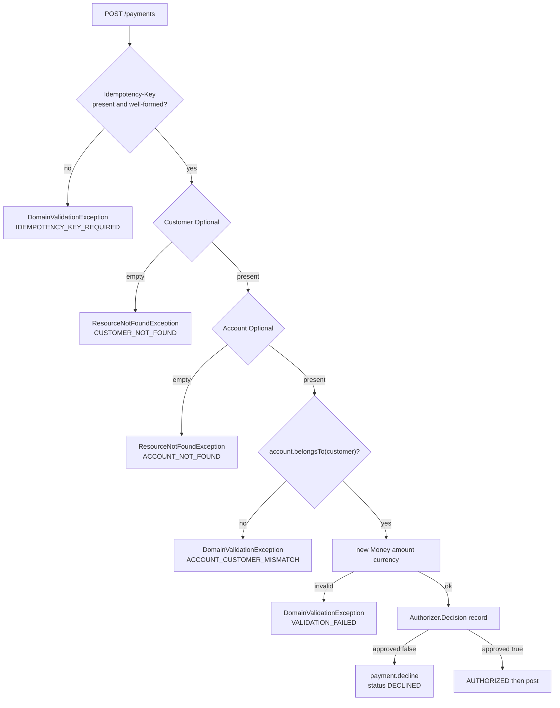

# L-1.4 — Exceptions, records, streams and Optional

**Module:** 1 — Enterprise Java Engineering  
**Duration:** 30 minutes  
**BayPay case:** domain errors, `PaymentAuthorizer.Decision`, repository `Optional`, and stream-free money math

---

## Why this matters

When Avery Chen’s frozen account is used, BayPay must **decline** with `AUTHORIZATION_DECLINED`, not return `null`, not return an empty payment, and not log-and-continue. Swallowed exceptions are how a validator reports `true` after a `ClassCastException`. That is the defect FIX-103 plants on purpose.

Records, streams, and `Optional` are the modern Java tools that sit next to exceptions. Used well, they make decisions explicit. Used as fashion, they hide control flow in `map` chains and turn a missing customer into an empty stream that looks like success.

---

## Learning objectives

- Separate domain validation, not-found, and illegal state, and map each to a BayPay error code.
- Use records for immutable decisions and HTTP-adjacent payloads without making `Payment` a record.
- Read and write `Optional` from repositories without `get()` or `orElse(null)`.
- Know when a stream helps (filtering a page) and when a for-loop is clearer (state transitions).
- Refuse to swallow exceptions or use `Optional` as a field on an entity.

---

## Concept explanation

**Exceptions are control flow for the unexpected-to-this-layer.** `Money` throws `DomainValidationException` when amount is not positive. `PaymentStateMachine` throws `BayPayException` with `ILLEGAL_STATE_TRANSITION`. `PaymentApplicationService` throws `ResourceNotFoundException` when Avery’s id is wrong. These are unchecked so service methods stay linear. They are still **part of the API**: the Module 3 exception handler will map them to HTTP, but the domain must throw them even if no HTTP exists.

**Do not use exceptions for expected local decisions** when a type is clearer. `PaymentAuthorizer.Decision` is a record `(approved, reason)`. Authorization can decline without unwinding the stack; the service then calls `payment.decline(...)`. That is a business outcome, not a crashed JVM.

**Records** are transparent carriers: `CreateResult(Payment payment, boolean replay)`, `Decision`, event types. They give you accessors, `equals`, and `hashCode`. They are a poor fit for `Payment`, which has a lifecycle, a protected JPA constructor, and `@Version`.

**Optional** means “a repository lookup may miss.” `customers.findById(...).orElseThrow(...)` is the BayPay pattern. `orElse(null)` reintroduces null. `Optional` fields on `Payment` are not used; a missing `failureReason` is a nullable `String` documented as empty on success. Do not wrap every getter.

**Streams** shine for bulk transformation: map a list of payments to ids, filter `COMPLETED`. They are the wrong tool for “transition this one payment through four states,” and they are easy to misuse with side effects (`peek` that posts a ledger row). Prefer a loop when each step can fail differently.

**Checked versus unchecked.** BayPay’s domain errors extend `RuntimeException`. A checked `IOException` still exists at the edges (filters, files). Do not wrap everything in `throws Exception`. Do not catch `Exception` unless you are at a boundary that must translate.

---

## Visual explanation



Alt text: Payment creation either throws a typed domain error, declines with a Decision record, or authorizes. Optional customer and account lookups become not-found exceptions, not null.

---

## Architecture

Errors live in `com.baypay.shared.error`: `ErrorCode`, `BayPayException`, `DomainValidationException`, `ResourceNotFoundException`. Application services throw. `ApiExceptionHandler` (Module 3) translates. The domain module does not import Spring HTTP.

Records live next to the code that needs them: `PaymentApplicationService.CreateResult`, `PaymentAuthorizer.Decision`. Domain events (`PaymentCompletedEvent`) are records published in-process. That keeps the worker and notifier decoupled without a message broker yet.

`Optional` appears at repository boundaries only. Once the service has a `Customer`, later methods take `Customer`, not `Optional<Customer>`. Forcing every layer to unwrap Optional is contagious noise.

---

## Production example (BayPay)

Frozen-account path for Avery:

1. Customer `11111111-1111-1111-1111-111111111111` loads (`Optional` present).
2. Account `22222222-2222-2222-2222-222222222222` loads and `belongsTo` Avery.
3. `Money` of `25.00 USD` constructs cleanly.
4. `DefaultPaymentAuthorizer` returns `Decision.decline("account is not ACTIVE")`.
5. `payment.decline(reason, now)` transitions `VALIDATING → DECLINED`.
6. No exception is thrown for the decline. The HTTP layer will later return a client error with the reason.

Wrong customer id is a different path: `Optional.empty()` → `ResourceNotFoundException` → `CUSTOMER_NOT_FOUND`. Do not collapse “missing” and “declined” into one `null`. Operations cannot tell a typo from a freeze.

---

## Code/configuration example

Compilable Java 21. A validator that throws typed errors, a decision record, and an `Optional` lookup — no `get()`, no swallowed `Exception`.

```java
package com.baypay.payment.application;

import java.math.BigDecimal;
import java.util.Optional;
import java.util.Set;
import java.util.UUID;

public final class PaymentValidation {

    public record Decision(boolean approved, String reason) {
        public static Decision approve() {
            return new Decision(true, null);
        }

        public static Decision decline(String reason) {
            return new Decision(false, reason);
        }
    }

    public record Money(BigDecimal amount, String currency) {
    }

    public record AccountView(UUID id, UUID customerId, String currency, String status) {
        boolean active() {
            return "ACTIVE".equals(status);
        }

        boolean belongsTo(UUID customerId) {
            return this.customerId.equals(customerId);
        }
    }

    private static final Set<String> CURRENCIES = Set.of("USD", "EUR", "GBP");

    private PaymentValidation() {
    }

    public static Money requireMoney(BigDecimal amount, String currency) {
        if (amount == null || amount.signum() <= 0) {
            throw new IllegalArgumentException("amount must be greater than zero");
        }
        if (currency == null || !CURRENCIES.contains(currency)) {
            throw new IllegalArgumentException("currency must be USD, EUR, or GBP");
        }
        return new Money(amount, currency);
    }

    public static AccountView requireAccount(Optional<AccountView> found, UUID customerId) {
        AccountView account = found.orElseThrow(
                () -> new IllegalArgumentException("account not found"));
        if (!account.belongsTo(customerId)) {
            throw new IllegalArgumentException("account does not belong to customer");
        }
        return account;
    }

    public static Decision authorize(AccountView account, Money money) {
        if (!account.active()) {
            return Decision.decline("account is not ACTIVE");
        }
        if (!account.currency().equals(money.currency())) {
            return Decision.decline("account currency does not match payment");
        }
        return Decision.approve();
    }
}
```

`requireMoney` uses the reference `Money` type when you compile inside `shared`. In BUILD-102 you will write the production version against the real `Account` and `ErrorCode` types.

---

## Trade-offs

- **Throw versus `Decision`.** Throw when the request cannot be interpreted (bad money, missing customer). Return a decision when the request is well-formed but the business says no. Mixing them makes HTTP mapping guess.
- **Record versus class for `Money`.** A record would be shorter. BayPay’s `Money` is an `@Embeddable` with a protected no-arg constructor for JPA. Records and JPA embeddables can work; this codebase keeps an explicit class.
- **Stream versus loop.** A stream of payments to sum refundable amounts is fine. A stream that mutates status in `peek` is a defect.
- **`Optional` versus null on `failureReason`.** Null means “no failure.” `Optional` on every column makes JPA and JSON worse. Use Optional at the edges.

---

## Failure modes

- **`catch (Exception e) { return false; }`.** The validator lies. FIX-103.
- **`optional.get()`.** Throws `NoSuchElementException` with no error code. Always `orElseThrow` with a domain exception.
- **`orElse(null)`.** The next line NPEs and becomes a 500.
- **Empty catch around `transitionTo`.** An illegal transition is dropped; the payment stays `AUTHORIZED` while the worker thinks it posted.
- **Stream with side effects.** A failed mid-stream post leaves half the batch done and no exception at the call site you expected.

---

## Security/reliability implications

Error messages go to clients and to logs. `Customer not found: <uuid>` is acceptable for synthetic ids. Do not put balances, emails, or stack traces of other customers into the reason string. `Decision.reason` is stored on `Payment.failureReason` (256 chars) — treat it as customer-visible.

Failing closed on missing `Optional` prevents **IDOR-shaped guesses**: a random account UUID must not become a `null` account that later NPE-skips the ownership check. `requireAccount` checks ownership after presence, never before.

Reliability: retries will re-enter this logic. Exceptions that happen after a side effect (save, then throw) need a transaction (Module 3). In this module, keep the validator **pure** so retries are safe.

---

## Interview perspective

**Engineer.** “I throw on bad input and missing rows. I use a `Decision` record for approve/decline. I unwrap `Optional` with `orElseThrow`, not `get`.”

**Senior.** “I classify errors: validation, not-found, illegal state, and business decline are four outcomes. I would fail a PR that catches `Exception` in a validator. I use streams for maps/filters, not for workflows.”

**Staff.** “I design the error code catalog so support and the API handler stay aligned. I keep records at the edges and entities in the middle. I care about whether a decline is idempotent and replayable.”

**Principal.** “Exception strategy is an operations contract: what pages, what the customer sees, what the audit row stores. I will not accept a platform where ‘null means declined’ because it cannot be monitored.”

---

## Key takeaways

- Typed exceptions for malformed or missing data; records for expected business decisions.
- `Optional` is a return type from lookups, not a field and not a substitute for exceptions.
- `orElseThrow` with an error code; never `get()` or `orElse(null)`.
- Streams are for transformations. Lifecycle steps stay explicit.
- Swallowing exceptions is a reliability incident, not a cleanup style.

---

## Knowledge check

1. Avery’s frozen account is used with a valid amount. Should the code throw, or return a `Decision`? Why?
2. What is wrong with `account = accounts.findById(id).orElse(null); if (account.status == ACTIVE)`?
3. Give one good use of a stream in BayPay and one use you would reject in review.

<details>
<summary>Answers</summary>

1. Return a `Decision.decline(...)`. The request was interpretable; the business refused it. The payment row should exist in `DECLINED` so a replay and an auditor can see the outcome. Throwing is for missing customers or illegal money.

2. You reintroduced null. If the id is unknown, the next field access NPEs and you never emit `ACCOUNT_NOT_FOUND`. Ownership checks can also be skipped if you shuffle the statements. Use `orElseThrow`.

3. Good: map a list of completed payments to their ids for a statement. Rejected: `payments.stream().peek(p -> p.transitionTo(COMPLETED, now)).toList()` as the posting workflow.

</details>

---

## Related lab

[BUILD-102 — Implement payment validation](../../../../labs/BUILD-102/README.md) and [FIX-103 — Refactor deliberately poor Java](../../../../labs/FIX-103/README.md). BUILD-102 asks you to throw and decline correctly. FIX-103 starts from swallowed exceptions, raw types, and a God method.

---

## Related PAKS deep dive

Optional: `docs/09-transactions/overview.md` ([paks.bayareala8s.com](https://paks.bayareala8s.com)) when you reach “throw after a write.” This lesson’s exception vocabulary stands alone.
