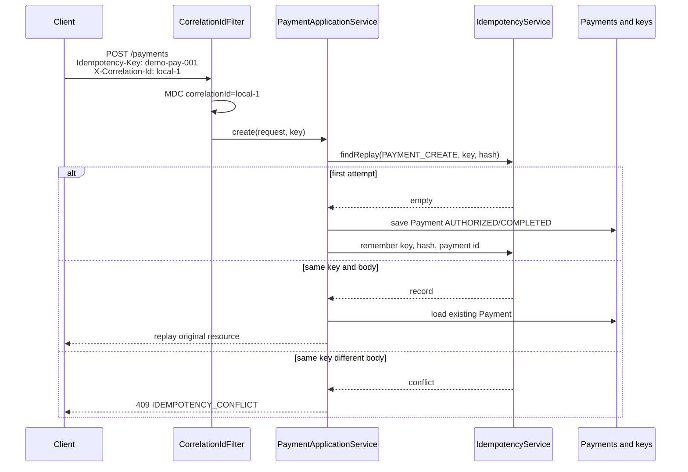

# L-1.5 — Enterprise coding practices

**Module:** 1 — Enterprise Java Engineering  
**Duration:** 30 minutes  
**BayPay case:** idempotency keys, correlation ids, packages, and review habits on a payments team

---

## Why this matters

Avery Chen’s phone retries `POST /api/v1/payments` when a tunnel drops. Without an `Idempotency-Key`, BayPay would authorize twice, post two ledger rows, and send two notifications — then spend an incident arguing whether the merchant was billed once or twice. Enterprise practice is the set of habits that make that story boring: required keys, correlation ids on every log line, packages that match ownership, names that match the domain, and reviews that block “we will clean it up later.”

This lesson is the bridge from Java-the-language to Java-the-job. BUILD-102, FIX-103, and CHALLENGE-104 all grade these habits, not just whether the happy path compiles.

---

## Learning objectives

- Explain why writes require `Idempotency-Key` and how BayPay hashes the canonical body.
- Propagate `X-Correlation-Id` into logs via MDC and never log secrets.
- Place types in packages that match module ownership (`shared.domain` versus `payment.api`).
- Name methods after domain events (`received`, `decline`, `postAuthorized`), not `doStuff2`.
- Review for God methods, raw types, allocations in loops, and tests that only cover the sunlit path.

---

## Concept explanation

**Idempotency.** Repeating a write with the same key and body returns the same resource. BayPay requires the header on payment and refund creates. `IdempotencyKeys.require` enforces 8–128 characters of `[A-Za-z0-9._-]`. Same key and hash: replay. Same key, different hash: `IDEMPOTENCY_CONFLICT`. Missing key: `IDEMPOTENCY_KEY_REQUIRED`.

**Correlation.** `X-Correlation-Id` is not idempotency. It is how you stitch HTTP, worker, and notification lines for one attempt. `CorrelationIdFilter` accepts a client id or generates a UUID, puts it in SLF4J MDC, and echoes it on the response. A retry may keep the same idempotency key and use a **new** correlation id. That is correct: two attempts, one payment.

**Package by capability, not by layer-only.** BayPay has both. `com.baypay.shared.domain` is the model. `com.baypay.payment.api` is HTTP. `com.baypay.payment.application` is use cases. A new `util` package that contains money math, string padding, and date hacks is how ownership dies. Put money rules next to `Money`.

**Naming.** Factories read as domain sentences: `Payment.received`, `LedgerTransaction.payment`, `Refund.requested`. Error codes are stable tokens (`ACCOUNT_NOT_ACTIVE`), not sentences. Log messages include the payment id, not Avery’s email.

**Structured logging.** `log.info("Posted payment {} as ledger {}", payment.id(), posted.id())` keeps the message constant so log systems can count it. Do not concatenate a JSON blob of the whole request. Do not log the raw idempotency key if your estate treats keys as sensitive; the course’s synthetic keys are fine to mention in labs.

**Tests as documentation.** `MoneyTest` and `PaymentStateMachineTest` name the invariant. Parameterized transition tests beat twenty copy-pasted `test1` methods.

**Efficiency as a habit.** Do not micro-optimize `Money.plus`. Do not box `double` amounts in a per-row loop when a `Map` and long cents exist. CHALLENGE-104 is that habit under a time box.

---

## Visual explanation



Alt text: A payment POST carries an idempotency key and a correlation id. The filter stores the correlation id in MDC. The service replays, stores, or conflicts based on key plus body hash.

---

## Architecture

Enterprise practice shows up as **seams in the modular monolith**:

| Concern | Where it lives | Why not elsewhere |
|---|---|---|
| Domain invariants | `shared.domain` | Every module must share one machine |
| Idempotency store | `shared.idempotency` | Payments and refunds reuse the same rules |
| HTTP mapping | `payment.api` | Domain must test without a servlet |
| Correlation | `CorrelationIdFilter` | One place to accept, generate, echo, and clear MDC |
| Posting | `transaction-worker` | Extractable later; still in-process today |

Clearing MDC in `finally` is not polish. A pooled thread that keeps the previous request’s correlation id will attach Avery’s payment logs to the next merchant. That is an enterprise defect.

`Clock` is injected into `PaymentApplicationService` and `PaymentPostingService`. Tests freeze time. `Instant.now()` sprinkled in the domain makes incident replay harder. Prefer a clock at the boundary; pass `Instant now` into factories.

---

## Production example (BayPay)

Create a payment for Avery’s active account:

```bash
curl -sS -X POST http://localhost:8080/api/v1/payments \
  -H 'content-type: application/json' \
  -H 'Idempotency-Key: demo-pay-001' \
  -H 'X-Correlation-Id: local-1' \
  -d '{
    "customerId":"11111111-1111-1111-1111-111111111111",
    "accountId":"22222222-2222-2222-2222-222222222221",
    "amount":25.00,
    "currency":"USD",
    "reference":"invoice-1001"
  }'
```

Run the same command again. You should receive the **same payment id** (replay). Change `amount` to `26.00` and keep the key: conflict. Omit the key: validation error. Those three outcomes are the enterprise contract for writes.

The canonical string hashed for payments is `customerId|accountId|amount|currency|reference`. Field order is part of the contract. A future developer who hashes JSON with unordered keys will break replays.

---

## Code/configuration example

Compilable Java 21 illustrating key validation and a clock-aware factory call. The real `IdempotencyKeys` class in `shared` is the production version.

```java
package com.baypay.shared.idempotency;

import java.nio.charset.StandardCharsets;
import java.security.MessageDigest;
import java.security.NoSuchAlgorithmException;
import java.util.HexFormat;
import java.util.Locale;

public final class IdempotencyKeys {

    public static final int MIN_LENGTH = 8;
    public static final int MAX_LENGTH = 128;

    private IdempotencyKeys() {
    }

    public static String require(String raw) {
        if (raw == null || raw.isBlank()) {
            throw new IllegalArgumentException("Idempotency-Key header is required");
        }
        String key = raw.trim();
        if (key.length() < MIN_LENGTH || key.length() > MAX_LENGTH
                || !key.matches("[A-Za-z0-9._-]+")) {
            throw new IllegalArgumentException(
                    "Idempotency-Key must be 8-128 characters of [A-Za-z0-9._-]");
        }
        return key;
    }

    public static String sha256(String operation, String canonicalBody) {
        try {
            MessageDigest digest = MessageDigest.getInstance("SHA-256");
            String material = operation.toLowerCase(Locale.ROOT) + "\n" + canonicalBody;
            return HexFormat.of().formatHex(digest.digest(material.getBytes(StandardCharsets.UTF_8)));
        } catch (NoSuchAlgorithmException e) {
            throw new IllegalStateException("SHA-256 not available", e);
        }
    }
}
```

Review checklist for FIX-103 and CHALLENGE-104: can the method lie after an exception; raw types or `double` money; O(N×M) where a `Map` is O(N+M); retry creating a second ledger row; one correlation id to find the attempt.

---

## Trade-offs

- **Required idempotency versus optional.** Optional keys make first integrations easy and duplicates inevitable. BayPay requires the header.
- **Hash of canonical fields versus hash of raw JSON.** Raw JSON treats whitespace as a new payment. Canonical fields ignore formatting and fail on real semantic change.
- **MDC versus passing correlation as a method argument.** MDC is implicit and easy to forget in a new thread (Module 2). Arguments are explicit and noisy. BayPay uses MDC on the HTTP thread today.
- **Utility classes versus domain methods.** `IdempotencyKeys` is a small focused utility. A `StringUtils` of 200 methods is not enterprise practice.

---

## Failure modes

- **Missing key accepted.** Mobile retries create two `COMPLETED` payments and two ledger posts.
- **Key reused with a new body, treated as replay.** The client thinks `25.00` posted; the server returns the old `10.00`. Always hash the body.
- **MDC not cleared.** Thread pool contamination; support reads the wrong merchant’s trail.
- **`System.out.println` in the worker.** Unstructured, no correlation, gone in a container. A `com.baypay.utils` dump of money math plus HTTP helpers has the same ownership problem.

---

## Security/reliability implications

Idempotency is a **financial control**. It is also a security control against replay gadgets that spray the same body. Pair it with authentication in later modules; a key alone is not identity.

Correlation ids must not become access tokens. Echoing the header is fine; trusting it for authorization is not.

Canonical hashes should not include secrets. If a future field is a callback URL with a token, strip it from the hash material or you will store a password equivalent in the idempotency table.

Reliability reviews look for **exactly-once effects**: one ledger row per successful payment, one audit row per state change that finance cares about, notifications that can be retried without double-emailing because the record is keyed.

---

## Interview perspective

**Engineer.** “Writes need `Idempotency-Key`. I put correlation ids on requests so I can grep logs. I name factories after the domain and I do not swallow exceptions.”

**Senior.** “I distinguish replay from conflict by hashing a canonical body. I clear MDC in `finally`. I inject `Clock`. I treat a God method and a nested list scan as review blockers, not nits.”

**Staff.** “I define the write contract for the platform: required headers, error codes, and what is stored on replay. I keep packages aligned with extractable modules so `transaction-worker` can leave the process later without a rewrite.”

**Principal.** “Enterprise practice is how we stay auditable under retry, failover, and staff turnover. I will fund idempotency and correlation before I fund a new framework. I judge teams on whether a new engineer can find one payment across API, ledger, and notify using one id and one correlation id.”

---

## Key takeaways

- `Idempotency-Key` is required on BayPay writes; same key plus same body replays, same key plus different body conflicts.
- Correlation ids stitch logs; they are not authorization and they are not idempotency.
- Packages and names should match the domain and the module boundaries.
- Inject `Clock`, log with `{}` slots, test the illegal paths.
- Review for lies (swallowed exceptions), raw types, and quadratic loops before you review for style.

---

## Knowledge check

1. A client retries a successful `POST /payments` with the same `Idempotency-Key` and the same JSON. What must BayPay return, and what must it not create?
2. The same client then sends a different `amount` with that key. What error code, and why is a silent replay worse?
3. Why does `CorrelationIdFilter` remove the MDC key in a `finally` block?

<details>
<summary>Answers</summary>

1. Return the original payment (replay). Do not create a second `Payment`, ledger row, or notification. The HTTP status remembered on the first attempt is part of the replay.

2. `IDEMPOTENCY_CONFLICT`. A silent replay would tell the client their new amount posted when the original amount did. That is a money bug, not a convenience.

3. HTTP threads are reused. Leaving `correlationId` in MDC attaches the next request’s logs to Avery’s attempt and poisons support investigations.

</details>

---

## Related lab

[BUILD-102](../../../../labs/BUILD-102/README.md) (validation that fails closed), [FIX-103](../../../../labs/FIX-103/README.md) (refactor the anti-pattern file), and [CHALLENGE-104](../../../../labs/CHALLENGE-104/README.md) (make posting scale without changing the business result).

---

## Related PAKS deep dive

Optional: `docs/09-transactions/overview.md` on [paks.bayareala8s.com](https://paks.bayareala8s.com) for how idempotency interacts with database transactions. You can finish Module 1 without it; Module 3 will make the database part explicit.
