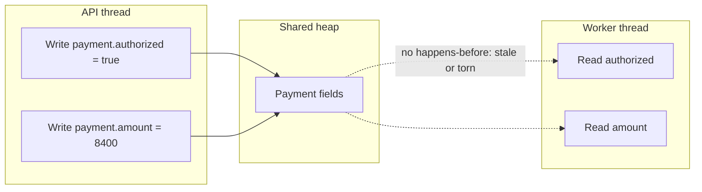

# L-2.1 — Threads and Java memory visibility

**Module:** 2 — Advanced Java Concurrency  
**Duration:** 30 minutes  
**Case study:** BayPay Financial Services (fictional)

## Why this matters

BayPay’s `transaction-worker` does not see a payment because a field was assigned. It sees a payment when the Java Memory Model (JMM) says that assignment is visible. Without a happens-before edge, a worker can spin on `authorized == false` after the API thread already set it to `true`. That bug does not throw. It does not appear in a unit test that runs on one core. It shows up on a busy authorize node as “the ledger never posted” while the HTTP response already returned `AUTHORIZED`.

Visibility is the first concurrency skill because locks, atomics, and concurrent collections are all ways to create those edges. If you only memorize “use `synchronized`,” you will still ship a flag, a cache, or a hand-off that is invisible.

## Learning objectives

- Describe a Java thread, a stack, and why heap writes are not automatically global.
- State the happens-before rules that BayPay actually relies on: monitor unlock/lock, volatile write/read, thread start/join.
- Recognize a visibility bug that is not a data race on a counter.
- Explain why “it works on my laptop” is not evidence that a publication is safe.

## Concept explanation

A **thread** is a unit of execution with its own program counter and stack. BayPay’s servlet container, executor, and virtual-thread scheduler all run your code on threads. Local variables live on the stack and are private. `Payment` objects, idempotency maps, and “ready” flags live on the heap and are shared.

The JMM does not require that a write performed by thread A become visible to thread B in program order. Compilers, JITs, and CPUs may reorder independent reads and writes and may keep a working copy of a field in a register or cache. Thread B is allowed to see a stale value until a **happens-before** relationship exists.

Important happens-before edges for this course:

1. **Program order** inside one thread: actions in a single thread happen-before later actions in that thread.
2. **Monitor**: an unlock of monitor M happens-before a subsequent lock of M.
3. **Volatile**: a write to a volatile field happens-before a subsequent read of that same field.
4. **Thread start**: `Thread.start()` happens-before the first action in the started thread.
5. **Thread join**: the last action in a thread happens-before `join()` returns in the waiter.
6. **Safe publication** through the above (and through concurrent collections, which document their own edges).

Those edges are not abstract. BayPay creates them with three APIs. They are not interchangeable.

**`volatile`.** A write to a `volatile` field happens-before a later read of *that same field*. Use it for a one-bit publication (`authorized`, a drain flag) or a hand-off of a fully constructed `Payment`. Compilers and CPUs may not keep a working copy of that field in a register across the read. `volatile` does **not** make `authorized++` or `balance += amount` atomic. Two workers can both read `100`, both add `84`, and both write `184`.

**`synchronized` (monitor lock / unlock).** `synchronized (lock) { ... }` *locks* when the thread enters the block and *unlocks* when it leaves — including by exception. Unlock of monitor M happens-before the next lock of M. You get visibility of everything written inside the block *and* mutual exclusion: only one thread is in. You cannot time out or interrupt a wait for this intrinsic lock. Do not lock on a customer-id `String`.

**`Lock.lock()` / `unlock()`.** `ReentrantLock` is the same pair, written out. `lock()` acquires; `unlock()` releases and is the happens-before. Always `unlock()` in `finally` or a later exception skips the release and every other worker waits forever. `tryLock` is why you pick an explicit `Lock` over `synchronized` (L-2.2). The JMM name is still “monitor unlock/lock.”

A **data race** is two conflicting accesses (at least one a write) with no happens-before. Java allows surprising results for racy `long` and `double` (they may tear) and for racy references (you may see a null, or an object whose fields are not initialized). `Payment.status` flipping to `AUTHORIZED` without a barrier can leave the worker reading `VALIDATING` forever.

Immutability helps publication: if every field of `Money` is `final` and the constructor does not leak `this`, a safely published `Money` is visible in full. That is why Module 1 treated `Money` as a value object. It does not make a mutable `Payment` safe to hand across threads by assignment alone.

## Visual explanation



With a volatile write or an unlock that the worker later locks, the dotted edge becomes a solid happens-before edge. The worker then sees both `authorized` and `amount` as the API thread left them — not an older `authorized` paired with a newer `amount`, and not the reverse.

Diagram **AEJE-D-005** (Java memory visibility) is the course asset for this picture.

## Architecture

In the BayPay modular monolith, three heaps-worth of sharing happen inside one process:

| Shared thing | Writer | Reader | Visibility requirement |
|---|---|---|---|
| `Payment` entity | API request thread | `PaymentPostingService` | Must see `AUTHORIZED` and money together |
| In-memory idempotency map | First `POST /payments` | Retry `POST` | Must see the stored resource id |
| “Drain” flag on a worker | Admin / actuator | Worker loop | Must observe stop without restarting the JVM |

The production path persists through JPA and a transaction commit. The database log is a happens-before that other JVMs can rely on after commit. This lesson is about the **in-process** path: caches, flags, and teaching ledgers that never reach SQL. BREAKFIX-201’s starter is that in-process path. If it is racy, two authorizes can both believe they are first.

## Production example

Harbor Bike Co’s checkout client retries `POST /api/v1/payments` with `Idempotency-Key: harbor-8841` after a 2-second client timeout. The first request set `inFlight = true` on a non-volatile field and started authorization. The retry thread read `inFlight == false`, started a second authorization, and both posted `$84.00`. Support saw two `COMPLETED` rows and one customer complaint. CPU was fine. Tests on a single-thread mock authorizer were green.

The on-call engineer who said “the map is a `ConcurrentHashMap`, so we are fine” was talking about the wrong edge. The flag that gated “already started” was an ordinary `boolean`. The map never saw the second key because the second request used the same key and raced the first write.

## Code/configuration example

```java
public final class AuthorizationGate {
    private boolean authorized; // not volatile

    public void markAuthorized() {
        authorized = true;
    }

    public void awaitAuthorized() {
        while (!authorized) {
            Thread.onSpinWait();
        }
    }
}
```

A worker calling `awaitAuthorized()` may never leave the loop, even after `markAuthorized()`, because there is no happens-before between the write and the read. The fix that matches the intent of a one-bit publication is `volatile boolean authorized`, or a `CountDownLatch`, or an unlock/lock on a shared monitor. `volatile` does **not** make `authorized++` atomic. It only publishes the write.

Safe publication of a new `Payment` to a worker:

```java
public final class PaymentHandoff {
    private volatile Payment ready;

    public void publish(Payment payment) {
        ready = payment; // volatile write
    }

    public Payment take() {
        return ready; // volatile read sees the object and its safely constructed fields
    }
}
```

If `Payment` leaked `this` from its constructor, even this pattern is unsafe. BayPay’s `Payment.received(...)` factory assigns fields before returning; do not publish the instance from the constructor.

The same publication, written as unlock/lock:

```java
public final class PaymentHandoffLock {
    private final Object lock = new Object();
    private Payment ready;

    public void publish(Payment payment) {
        synchronized (lock) { // lock
            ready = payment;
        }                     // unlock — happens-before the next lock
    }

    public Payment take() {
        synchronized (lock) {
            return ready;
        }
    }
}
```

`ReentrantLock` is the same shape with `lock.lock()` and `lock.unlock()` in `finally`. Use that API when the waiter must `tryLock` or interrupt; use `volatile` when you only need the one-field edge.

## Trade-offs

| Approach | Strength | Cost |
|---|---|---|
| `volatile` flag | Cheap publication of one value | No atomic compound update |
| `synchronized` on the payment | Visibility + mutual exclusion | Contended lock, easy to over-synchronize |
| Persist then read from DB | Cross-process truth | Latency; still need in-process care for caches |
| Immutable snapshot + volatile ref | Readers never see partial updates | Extra allocations; writers must swap the ref |

Prefer the weakest tool that creates the edge you need. A volatile hand-off is enough for “the payment is ready.” It is not enough for “increment the ledger and append a journal row.”

## Failure modes

- **Infinite wait:** worker reads a stale `false`.
- **Partial publication:** worker sees `authorized == true` and `amount == 0` because the fields were written without a common barrier.
- **Stale cache:** a request thread reads yesterday’s account status from a racy `HashMap`.
- **“Works in test”:** JUnit on one core never reorders; staging with many cores does.

These failures rarely throw `ConcurrentModificationException`. They look like missed posts, duplicate posts, or “stuck AUTHORIZED.”

## Security/reliability implications

Visibility bugs in payments are integrity bugs. A duplicate debit is an unauthorized transfer of customer funds. A missed debit can be exploited as a free purchase if the HTTP layer already told the merchant “approved.” Do not treat a racy flag as an authorization control. Persist the decision with a unique idempotency key and a transactional ledger post. In-memory visibility is necessary for caches and workers; it is not the system of record.

Logging a correlation id (`X-Correlation-Id`) on both threads is how you prove two posts are the same customer click. Without it, support cannot distinguish a visibility race from a client that sent two keys.

## Interview perspective

**Engineer:** “`volatile` makes the latest write visible. I would put it on the authorized flag so the worker sees the update.”

**Senior:** “I would name the happens-before edge. Volatile write/read is one. Unlock/lock is another. I would not use volatile for a balance increment.”

**Staff:** “I would ask whether this state should be in the JVM at all. If two pods serve authorize, volatile cannot help. I would publish through the database commit or a queue and keep in-process flags for single-instance workers only.”

**Principal:** “I would treat visibility as part of the consistency model. BayPay’s API promise is ‘at most one post per idempotency key.’ That promise is a product SLO, not a field modifier. The JVM edge is one layer; unique constraints and exactly-once posting are the ones auditors care about.”

## Key takeaways

- Threads share the heap; they do not share a coherent view until happens-before says so.
- A visibility bug can look like a hang or a missed ledger post, not an exception.
- `volatile` publishes one field. `synchronized` and `Lock.lock`/`unlock` publish a critical section and exclude other threads. They are not a ledger.
- Tests that never run two cores do not test visibility.
- Production truth for BayPay is the committed row, not the in-memory flag.

## Knowledge check

1. Thread A sets `authorized = true` on a non-volatile field. Thread B spins on that field. Must B eventually see `true`?
2. Why can a worker see `authorized == true` and a zero amount if both fields are ordinary (non-volatile) writes?
3. Does making `Payment` fields `final` remove the need to publish the `Payment` reference safely? What is the unlock/lock pair that *does* publish it?

<details>
<summary>Answers</summary>

1. No. Without a happens-before edge, B may see `false` indefinitely.
2. The writes can become visible in any order to B. There is no barrier that publishes them as a pair.
3. No. `final` fields are visible after the constructor finishes **and** the reference is published through a safe edge. A racy assignment of the reference can still leak a stale or null view. The unlock/lock pair is `synchronized (lock)` enter/exit, or `lock.lock()` / `lock.unlock()` in `finally`. A `volatile` write of the reference is the other common edge.

</details>

## Related lab

Work [BREAKFIX-201](../../../../labs/BREAKFIX-201/README.md) after L-2.2 and L-2.6. The starter ledger is an in-process publication problem under parallel `authorize`. Use [INCIDENT-202](../../../../labs/INCIDENT-202/README.md) to practice reading evidence when workers stop making progress. Do not open `solutions/` first.

## Related PAKS deep dive

Optional: `docs/01-computer-architecture/memory-ordering-and-concurrency.md` in the Principal Architect Knowledge System. It explains store buffers and memory orders beneath the JMM. This lesson is complete without it.
