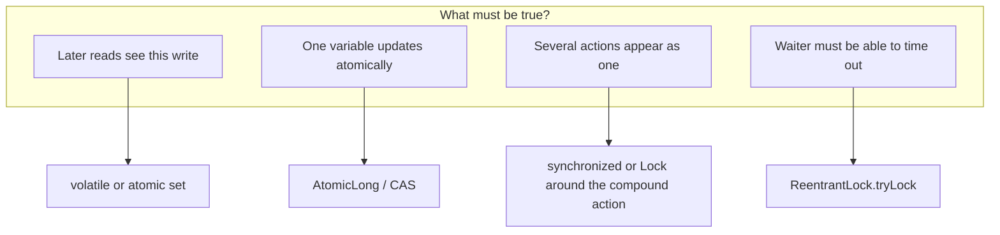

# L-2.2 — synchronized, volatile, locks and atomics

**Module:** 2 — Advanced Java Concurrency  
**Duration:** 30 minutes  
**Case study:** BayPay Financial Services (fictional)

## Why this matters

BayPay engineers reach for `synchronized` the way they reach for a try/catch: it feels like it will cover the problem. Sometimes it does. Sometimes it serializes the entire authorize path and the p99 explodes. Sometimes they use `volatile` on a balance and still lose updates. The primitives in this lesson are not interchangeable. Each one buys a specific guarantee — visibility, atomicity, exclusion, or a wait/notify protocol — and each one fails in a specific way when you pick the wrong one.

The duplicate-payment lab is a compound update: “have we seen this key, add to the balance, append the journal.” That is not a volatile write. It is also not a reason to lock the whole JVM.

## Learning objectives

- Match `volatile`, `synchronized`, `java.util.concurrent.locks`, and `java.util.concurrent.atomic` to an invariant.
- Write a monitor-protected ledger increment and an `AtomicLong` increment and say what each does not do.
- Use `tryLock` with a timeout when a refund path must not wait forever.
- Avoid locking on a mutable or interned object such as `accountId` as a `String`.

## Concept explanation

**`volatile`** creates a happens-before edge from a write to a later read of the *same* field. It is the right tool for a published flag, a safe hand-off of a reference, or a shutdown bit. It does not make `balance += amount` atomic. Two threads can both read `100`, add `84`, and both write `184`.

**`synchronized`** (and the equivalent `force` of entering a `ReentrantLock`) provides mutual exclusion *and* visibility. Unlock happens-before the next lock on the same monitor. Everything written before the unlock is visible to the thread that next acquires the lock. That is why a synchronized `authorize` can safely do check-then-act on an ordinary `HashMap` — not because `HashMap` is concurrent, but because only one thread is in the critical section.

**Intrinsic locks** (`synchronized` on `this` or a private `final Object lock`) are simple and reentrant. They cannot be interrupted while waiting, cannot time out, and cannot be acquired in a non-blockingly polled way. **`ReentrantLock`** can. **`ReentrantReadWriteLock`** helps when many threads read a rate-limit snapshot and few update it. **`StampedLock`** is an advanced optimistic reader; do not use it as your first BayPay lock.

**Atomics** (`AtomicLong`, `AtomicReference`, `LongAdder`, `VarHandle` CAS) give lock-free atomic updates to a single variable (or a single reference). `compareAndSet` is the primitive behind “set this status from AUTHORIZED to PROCESSING only if it is still AUTHORIZED.” `LongAdder` is a better write-heavy counter than `AtomicLong` when many threads increment a metric. Atomics do not protect two variables. “Increment balance and append journal” still needs one lock, one `compute` on a combined structure, or a database transaction.

**Condition waits** (`wait`/`notify`, `Condition`) are for “the payment is not ready yet,” not for exclusion. Forgetting `notify` is a hang. Using `notify` without a while-loop predicate is a lost wakeup.

## Visual explanation



If you need C and T together, use an explicit `Lock`, not `synchronized`. If you only need V, do not take a lock on every read.

## Architecture

BayPay’s authorize path has three layers of exclusion in production:

1. **Request thread:** bean validation and idempotency lookup.
2. **Database:** unique constraint on `idempotency_key` plus a row lock or serializable transaction when posting the ledger.
3. **In-process:** optional stripe of locks for an in-memory teaching ledger or a local cache.

This lesson is about layer 3. Layer 2 is the real control for two JVM instances. Layer 3 is what BREAKFIX-201 asks you to repair, and what INCIDENT-202 asks you to reason about when two workers take more than one lock.

A private final lock per concern is easier to review than `synchronized` methods on a service that also talks to the network:

```text
PaymentLedger
  lock: journalLock   // protects journal + in-memory balance together
  // do not lock, then call PaymentAuthorizer (external I/O)
```

Never hold a monitor across a card-network HTTP call. You will serialize throughput and invite deadlock if the callback needs another lock.

## Production example

A BayPay payments engineer added `private volatile long availableCents` to an in-memory hold table so “the refund worker sees the latest hold.” During a flash sale, two captures read `availableCents = 8400`, both subtracted `8400`, and both wrote `0`. The volatile reads were visible. The updates were not atomic. Harbor Bike Co’s account showed two captures and a later reconciliation break.

The fix that shipped was not “more volatile.” It was `AtomicLong` for the single counter, then — when a journal row had to be written in the same act — a single `synchronized (journalLock)` around decrement-plus-append. Metrics stayed on `LongAdder`, which does not need to be in that lock.

## Code/configuration example

```java
public final class HoldTable {
    private final Object journalLock = new Object();
    private final AtomicLong authorizedCount = new AtomicLong();
    private long availableCents;
    private final java.util.ArrayList<String> journal = new java.util.ArrayList<>();

    public boolean capture(String paymentId, long amountCents) {
        synchronized (journalLock) {
            if (availableCents < amountCents) {
                return false;
            }
            availableCents -= amountCents;
            journal.add(paymentId + ":" + amountCents);
        }
        authorizedCount.incrementAndGet();
        return true;
    }

    public boolean tryRefund(String refundId, long amountCents, java.util.concurrent.locks.Lock lock)
            throws InterruptedException {
        if (!lock.tryLock(50, java.util.concurrent.TimeUnit.MILLISECONDS)) {
            return false; // caller retries or fails the refund request; do not hang the worker
        }
        try {
            availableCents += amountCents;
            journal.add(refundId + ":refund:" + amountCents);
            return true;
        } finally {
            lock.unlock();
        }
    }
}
```

`authorizedCount` is a metric: atomic, not part of the money invariant. `availableCents` and `journal` share one monitor so a reader of the journal never sees a decrement without a row (and the reverse). `tryLock` is for paths that must shed load.

Do **not** write `synchronized (accountId)` when `accountId` is a `String`. Two interned strings can collide; two equal-but-not-identical strings do not share a monitor. Use a striped `ConcurrentHashMap<String, ReentrantLock>` or lock a private object you own.

## Trade-offs

| Primitive | Use when | Avoid when |
|---|---|---|
| `volatile` | One-value publication | Compound money updates |
| `synchronized` | Short critical sections you control | I/O, callbacks, multiple lock orders |
| `ReentrantLock` | Timeouts, fairness, multiple conditions | Simple one-lock methods (more error-prone unlock) |
| `Atomic*` | Single-variable CAS loops | Multi-field invariants |
| `LongAdder` | Hot metrics | Values you must read exactly on every increment |

Fair locks reduce tail latency for some workers and reduce throughput for everyone. BayPay’s default is non-fair unless a review shows starvation.

## Failure modes

- **Lost update** on a volatile or unsynchronized read-modify-write.
- **Forgotten unlock** after an exception: use `try/finally`, or prefer `synchronized` when you do not need `tryLock`.
- **Locking on `this`** of a public service: callers can take the same monitor and deadlock you.
- **Nested locks** acquired in different orders: INCIDENT-202’s shape. This lesson does not name a root cause in that lab; it tells you two locks need a policy.
- **CAS retry storms** under contention: an `AtomicLong` increment can lose to a short critical section if you also touch a list.

## Security/reliability implications

Mutual exclusion around money is a reliability control. It is not authentication. A correctly locked ledger still needs authorization checks and audit rows. A lock timeout that returns `false` must be mapped to a defined API error (`503` + retry guidance), not a silent drop. Otherwise a refund disappears and the customer is charged twice in spirit if not in the journal.

Fairness and timeout policy belong in a runbook: how long a worker waits, what it logs, which correlation id it attaches. `tryLock` without a metric is an invisible failure.

## Interview perspective

**Engineer:** “I would synchronize the method that updates the balance so two threads cannot interleave.”

**Senior:** “I would lock the smallest state that must be atomic — balance and journal together — and leave metrics on atomics. I would never lock during the HTTP authorize call.”

**Staff:** “I would ask how many JVM instances exist. If the answer is two, I would move the invariant to the database and use in-process locks only for a local cache with a defined TTL.”

**Principal:** “I would make lock policy a design artifact: one lock, a documented order, or no in-process locks. I would budget lock hold time as part of the SLO. A primitive that cannot time out is a denial-of-service if a bug holds it.”

## Key takeaways

- `volatile` publishes; it does not compose two writes into one act.
- `synchronized` and `Lock` give exclusion plus visibility; atomics give single-variable atomicity.
- Hold locks for memory work, not for network authorize.
- Lock on a private final object you own, not on a customer id string.
- Timeouts belong on paths that must keep the worker alive.

## Knowledge check

1. Two threads execute `availableCents -= amount` on a `volatile long`. Can both captures succeed against the same funds?
2. Why does `AtomicLong.incrementAndGet()` not make “increment and `journal.add`” safe?
3. When is `ReentrantLock.tryLock` a better fit than `synchronized` for a BayPay refund worker?

<details>
<summary>Answers</summary>

1. Yes. Volatile does not make the read-modify-write atomic. Both threads can read the same starting value.
2. The atomic increment and the list add are still two actions. Another thread can interleave between them.
3. When the worker must bound wait time, interrupt, or fail the request instead of blocking indefinitely on a second lock.

</details>

## Related lab

[BREAKFIX-201](../../../../labs/BREAKFIX-201/README.md) needs a compound-action fix, not a volatile field. [INCIDENT-202](../../../../labs/INCIDENT-202/README.md) needs you to reason about more than one lock. Read evidence before you open the instructor pack.

## Related PAKS deep dive

Optional: `docs/01-computer-architecture/memory-ordering-and-concurrency.md`. Use it if you want the hardware reason a CAS is visible. The Java rules in this lesson are enough to complete the labs.
