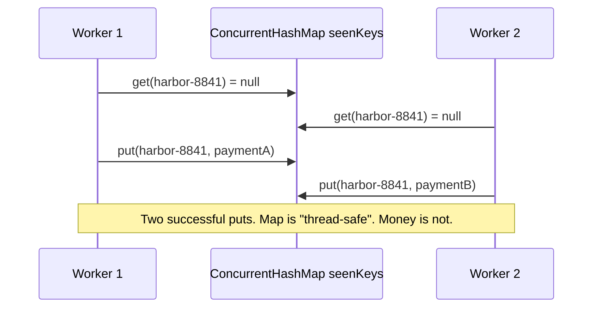

# L-2.3 — Concurrent collections

**Module:** 2 — Advanced Java Concurrency  
**Duration:** 30 minutes  
**Case study:** BayPay Financial Services (fictional)

## Why this matters

`ConcurrentHashMap` is the most misquoted class in BayPay code reviews. Engineers put one in a ledger, call `get` and `put` from eight workers, and conclude the class made authorize atomic. It did not. Concurrent collections make *individual* operations thread-safe and define happens-before for those operations. They do not make your business sequence atomic. A concurrent map plus an `ArrayList` journal is a classic way to lose money and lose rows at the same time.

This lesson is how you pick a collection that matches the operation, and how you notice when you still need `compute`, a queue, or a lock around two structures.

## Learning objectives

- Choose `ConcurrentHashMap`, `ConcurrentLinkedQueue`, `CopyOnWriteArrayList`, and `BlockingQueue` for BayPay jobs.
- Use `putIfAbsent`, `compute`, and `merge` so check-then-act is one map operation.
- Explain why `Collections.synchronizedMap` still fails for compound actions.
- Avoid iterating a shared `ArrayList` journal from a second thread.

## Concept explanation

**`ConcurrentHashMap`** allows concurrent retrievals and updates. `get`, `put`, `putIfAbsent`, `compute`, `merge`, and `computeIfAbsent` are the operations you should think in. `get` followed by `put` is two operations. Two threads can both `get` `null` and both `put` a new payment. `putIfAbsent` returns the previous value atomically: the first caller inserts, the second sees the existing one — that is the in-memory shape of an idempotency key.

`compute` and `merge` run your remapping function as part of the atomic update for that key. Keep the function short and do not call into other locks or blocking I/O from it. A slow `compute` stalls other updates to that key.

**`ConcurrentLinkedQueue`** is an unbounded, non-blocking queue. It is the right journal stand-in when you only append and later drain. Size is not constant-time; do not call `size()` on the hot path.

**`BlockingQueue`** (`LinkedBlockingQueue`, `ArrayBlockingQueue`) adds take/put with optional timeouts. BayPay workers that pull “authorized payments ready to post” should use a bounded blocking queue so a stuck poster applies backpressure to authorize.

**`CopyOnWriteArrayList`** snapshots on write. It is for rarely written, often iterated listener lists (notification hooks), not for a payment journal that appends on every capture.

**`Hashtable`** and **`Collections.synchronizedMap`** lock the entire map on each call. They still do not make `if (!map.containsKey(k)) map.put(k, v)` atomic unless you synchronize on the map for the whole sequence. Prefer `ConcurrentHashMap` and its atomic compound methods.

**`HashMap`** is not safe for concurrent mutation. You can lose entries, loop forever on a corrupted tree (historical), or throw `ConcurrentModificationException` during iteration. Do not use it as a shared ledger.

## Visual explanation



Replace the pair with `putIfAbsent`. One worker inserts. The other receives the existing value and replays.

## Architecture

A teaching in-memory BayPay slice has three collections. They must not be updated as if they were one:

| Structure | Type | Atomic operation |
|---|---|---|
| Idempotency | `ConcurrentHashMap<String, UUID>` | `putIfAbsent(key, paymentId)` |
| Account totals | `ConcurrentHashMap<String, Long>` | `merge(accountId, amount, Long::sum)` |
| Journal | `ConcurrentLinkedQueue<Entry>` | `offer(entry)` |

Even then, “insert key, add money, append journal” is three operations. A crash between them (or a throw) leaves a hole. ARCHITECT-203 asks you to design that composition. Production BayPay uses one database transaction and a unique index on `idempotency_key` so the three become one commit. The concurrent collections are for caches, inflight de-dupe inside a single JVM, and lab reproductions.

Bounded `BlockingQueue` sits between authorize and post when you extract `transaction-worker` to its own thread pool. Capacity is a reliability control: when the queue is full, authorize fails fast instead of allocating until the heap dies.

## Production example

During a load test, BayPay’s notification module stored completion listeners in an `ArrayList`. A deploy added a listener while a completion event iterated the list. The JVM threw `ConcurrentModificationException` on a fraction of `COMPLETED` payments. Merchants saw missing emails, not failed charges. The fix was `CopyOnWriteArrayList` for the rare-write listener set — the right collection, not a bigger lock around the whole payment service.

A second incident used `ConcurrentHashMap` for “payments in flight.” The code did `if (!inFlight.containsKey(key)) { inFlight.put(key, id); authorize(); }`. Under parallel retries, both calls authorized. The map never threw. The ledger gained two rows. That is the shape you will debug in BREAKFIX-201’s starter, and the design you must not repeat in ARCHITECT-203.

## Code/configuration example

```java
public final class InFlightPayments {
    private final ConcurrentHashMap<String, String> keys = new ConcurrentHashMap<>();
    private final ConcurrentHashMap<String, Long> totals = new ConcurrentHashMap<>();
    private final ConcurrentLinkedQueue<String> journal = new ConcurrentLinkedQueue<>();

    public boolean tryBegin(String idempotencyKey, String paymentId, String accountId, long amountCents) {
        String existing = keys.putIfAbsent(idempotencyKey, paymentId);
        if (existing != null) {
            return false; // replay — caller loads the original payment
        }
        totals.merge(accountId, amountCents, Long::sum);
        journal.offer(paymentId + ":" + amountCents);
        return true;
    }

    public Long total(String accountId) {
        return totals.getOrDefault(accountId, 0L);
    }
}
```

`putIfAbsent` and `merge` are the correct map verbs. The method as a whole is still not crash-atomic. For a lab, document that. For production, persist first.

Iteration:

```java
for (String row : journal) {
    // ConcurrentLinkedQueue weakly consistent iteration — no CME, may miss an add that happens after this iterator is created
}
```

Do not drain with `journal.size()` in a for-loop; use `poll` until null.

## Trade-offs

| Collection | Strength | Cost |
|---|---|---|
| `ConcurrentHashMap` | Fine-grained concurrent updates | Compound multi-key updates need more design |
| `ConcurrentLinkedQueue` | Fast append, no CME | Unbounded; `size()` is expensive |
| `ArrayBlockingQueue` | Backpressure | Blocking; capacity is a product decision |
| `CopyOnWriteArrayList` | Safe iteration | Copy on every write |
| Synchronized wrapper | Simple | Coarse lock; compound actions still racy |

Unbounded concurrent structures turn a slow consumer into a memory incident. Prefer a bound and a 503.

## Failure modes

- **Check-then-act** on a concurrent map: duplicates, not exceptions.
- **Shared `ArrayList` journal:** lost adds, `ArrayIndexOutOfBoundsException`, `ConcurrentModificationException`.
- **`compute` that does I/O:** stalled buckets, thread starvation, nested deadlock if the I/O callback takes another lock.
- **Using `size()` for flow control** on `ConcurrentLinkedQueue`: the number is stale before you act on it.
- **`HashMap` as a cache** “because we only write at startup”: a later feature writes at runtime and corrupts the map.

## Security/reliability implications

An idempotency map is an authorization-adjacent control: it decides whether money moves again. If it is racy, you double-charge. If it grows without a TTL or a backing store, it becomes a heap exhaustion denial-of-service — an attacker with unique keys can fill the map. Production BayPay stores keys in the database with a unique constraint and a retention policy. An in-memory map is a single-instance accelerator, not the control.

Do not log full idempotency keys if they are secrets in your threat model; BayPay teaching keys are synthetic and non-secret (`harbor-8841`). Still log a hash or suffix in production-like designs.

## Interview perspective

**Engineer:** “I would use `ConcurrentHashMap` so multiple threads can update the ledger.”

**Senior:** “I would use `putIfAbsent` for keys and `merge` for totals, and I would not use `ArrayList` for the journal. I would still say the three calls are not one transaction.”

**Staff:** “I would bound the inflight map and the work queue. I would define what happens when `putIfAbsent` loses: return the original payment, and 409 if the body hash differs — matching `IdempotencyService`.”

**Principal:** “I would ask why this state is in the heap. If the answer is ‘so we can go faster,’ I would compare that to a unique index and a cache-aside. Collections are not a consistency model.”

## Key takeaways

- Thread-safe collection ≠ atomic business method.
- Prefer `putIfAbsent`, `compute`, and `merge` over `get`/`put`.
- Journals belong on concurrent queues or inside the same locked structure as the total.
- Bound queues and maps; unbounded growth is an incident.
- Production idempotency is a unique row, not only a heap map.

## Knowledge check

1. Is `ConcurrentHashMap.get` + `put` enough to implement “create payment if absent”?
2. Why is `ArrayList` a poor shared journal even if balances live in `ConcurrentHashMap`?
3. When would you pick `ArrayBlockingQueue` over `ConcurrentLinkedQueue` for posting work?

<details>
<summary>Answers</summary>

1. No. Two threads can both see absence and both put. Use `putIfAbsent` or `computeIfAbsent`.
2. `ArrayList.add` is not atomic or even safe under concurrent mutation. You can lose entries or throw while the map totals look “almost right.”
3. When you need a capacity limit and backpressure so authorize cannot outrun post until the heap fails.

</details>

## Related lab

[ARCHITECT-203](../../../../labs/ARCHITECT-203/README.md) asks you to design (and write a small slice of) safe concurrent payment processing using these collections. Apply the same verbs when you repair [BREAKFIX-201](../../../../labs/BREAKFIX-201/README.md) after you have diagnosed it.

## Related PAKS deep dive

Optional background only. This lesson does not require a PAKS note. If you are also reading OS scheduling, `docs/02-operating-systems/processes-threads-and-scheduling.md` explains why a blocked consumer makes an unbounded queue grow.
