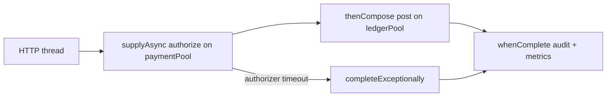

# L-2.4 — Executors and CompletableFuture

**Module:** 2 — Advanced Java Concurrency  
**Duration:** 30 minutes  
**Case study:** BayPay Financial Services (fictional)

## Why this matters

BayPay does not create a `new Thread()` per payment. A raw thread has no bound, no shared uncaught-exception handler, and no shutdown protocol. Under a retry storm you get thousands of OS threads, a collapsing scheduler, and an authorize path that still is not faster. Executors put a name, a limit, and a queue on that work. `CompletableFuture` composes “authorize, then post, then notify” without nesting callbacks by hand — and without swallowing the failure that should have marked the payment `FAILED`.

This lesson is how those tools fail in production: unbounded pools, forgotten shutdown, `get()` on the request thread, and `thenApply` that runs on the common ForkJoinPool when you needed the payment pool.

## Learning objectives

- Choose a bounded `ExecutorService` and explain queue vs reject policy.
- Compose authorize → post with `CompletableFuture` and handle failure without losing the exception.
- Use `orTimeout` / `completeOnTimeout` so a stuck authorizer cannot hold a request forever.
- Shut down a pool so a Spring Boot process can exit.

## Concept explanation

An **executor** accepts tasks. A **thread pool** is an executor that reuses workers. BayPay-relevant factories:

- `Executors.newFixedThreadPool(n)` — n workers, unbounded queue. Easy to OOM the queue.
- `new ThreadPoolExecutor(core, max, keepAlive, TimeUnit, queue, factory, handler)` — the real API. You pick the bound.
- `Executors.newCachedThreadPool()` — unbounded threads. Dangerous for authorize fan-out.
- `Executors.newSingleThreadExecutor()` — serialized journal drain.
- `Executors.newVirtualThreadPerTaskExecutor()` — covered in L-2.5.

**Rejection policy** matters. `AbortPolicy` throws `RejectedExecutionException` (map it to 503). `CallerRunsPolicy` runs the task on the caller — it can stall the HTTP thread and create hidden coupling. `DiscardPolicy` drops work: unacceptable for money.

**`CompletableFuture`** is a completion stage. `supplyAsync(fn, executor)` runs `fn` on *your* pool. `thenApply` continues on the same stage’s executor unless you use `thenApplyAsync(..., executor)`. `thenCompose` flattens a future-returning call (authorize returns a future of an approval). `exceptionally` / `handle` / `whenComplete` are where you record `FAILED` and metrics. `join()` unwraps without checked exceptions; `get()` times out if you pass a duration — use a timeout.

`allOf` waits for several independent authorizations (a batch). `anyOf` is rarely right for money: the first success is not “the” payment if two started.

Do not call `CompletableFuture.get()` on a Tomcat/Jetty request thread without a timeout. You convert a thread pool into a smaller thread pool.

## Visual explanation



Two pools keep a slow ledger drain from consuming every authorize worker. The HTTP thread only waits if you `join` it; the better API design is to return `202` plus a status resource, or to wait with a bounded timeout.

## Architecture

In the modular monolith, Spring MVC already has a request pool. Adding a second pool is justified when you fan out or isolate blocking work:

| Pool | Size idea | Work |
|---|---|---|
| servlet | container default | `POST /payments` orchestration |
| `paymentPool` | ~cores to 2× cores for CPU; larger only if blocking | synthetic authorizer, CPU validation |
| `ledgerPool` | small and bounded | journal append / JPA post |
| `notifyPool` | bounded, discard-oldest only for non-money mail | emails |

`PaymentApplicationService` today posts in the same transaction as authorize. That is a deliberate monolith choice. This lesson prepares the *extraction* shape: publish a `PaymentAuthorizedEvent`, consume it on `ledgerPool`. ARCHITECT-203 asks you to draw that and write a small executor-backed slice.

Shutdown: register a Spring `DisposableBean` or `@PreDestroy` that calls `shutdown()` then `awaitTermination`. `shutdownNow()` interrupts; your tasks must honor interruption or you will leak during deploy.

## Production example

A BayPay batch job used `newCachedThreadPool()` to “speed up” 50,000 historical replays. Each task opened a JDBC connection. The pool grew to thousands of threads, the datasource maxed at 20, and the process spent its life blocked on `getConnection`. Throughput fell. The fix was a `ThreadPoolExecutor` of 8 threads, an `ArrayBlockingQueue` of 256, and `AbortPolicy` with a retry/backoff at the submitter. The job finished faster because it stopped thrashing.

A second bug: `authorizeAsync.thenApply(this::post)` ran `post` on the common ForkJoinPool. A blocking JPA call stalled FJP worker threads used by other parallel streams. Isolation is not optional once you leave `supplyAsync(..., paymentPool)`.

## Code/configuration example

```java
public final class AsyncAuthorizeService implements AutoCloseable {
    private final ExecutorService paymentPool = new ThreadPoolExecutor(
            4, 4, 0, TimeUnit.MILLISECONDS,
            new ArrayBlockingQueue<>(128),
            Thread.ofPlatform().name("baypay-auth-", 0).factory(),
            new ThreadPoolExecutor.AbortPolicy());

    public CompletableFuture<String> authorizeThenPost(String key, String accountId, long amountCents) {
        return CompletableFuture
                .supplyAsync(() -> authorize(key, accountId, amountCents), paymentPool)
                .orTimeout(2, TimeUnit.SECONDS)
                .thenApply(approval -> post(approval))
                .whenComplete((id, error) -> {
                    if (error != null) {
                        // structured log with correlation id; mark FAILED — do not swallow
                    }
                });
    }

    private String authorize(String key, String accountId, long amountCents) {
        return key + ":" + accountId + ":" + amountCents;
    }

    private String post(String approval) {
        return "ledger-" + approval.hashCode();
    }

    @Override
    public void close() {
        paymentPool.shutdown();
        try {
            if (!paymentPool.awaitTermination(5, TimeUnit.SECONDS)) {
                paymentPool.shutdownNow();
            }
        } catch (InterruptedException e) {
            paymentPool.shutdownNow();
            Thread.currentThread().interrupt();
        }
    }
}
```

Map `RejectedExecutionException` and `TimeoutException` to API errors. Never use `exceptionally(ex -> null)` on a payment future.

## Trade-offs

| Choice | Gain | Cost |
|---|---|---|
| Bounded pool + bounded queue | Predictable memory and latency | Need a 503 / retry story |
| Unbounded queue | Absorb bursts | Hidden latency, OOM |
| `CallerRuns` | Natural backpressure | Couples caller thread to worker slowness |
| Compose on one pool | Simple traces | No isolation |
| `join()` on HTTP thread | Simple code | Holds a request worker for the whole chain |

Synchronous authorize-and-post in one transaction (today’s BayPay) is simpler and safer than two pools plus an outbox. Use async when you have a measured reason: independent I/O, a separate SLO, or an extracted worker.

## Failure modes

- **Thread leak:** `new Thread` or a pool that is never shut down. Deploy hangs.
- **Saturation:** all workers blocked on I/O; queue fills; API 503s. Looks like “the site is down” with low CPU.
- **Lost failure:** `exceptionally` maps to a success value; merchant believes `COMPLETED`.
- **Timeout without cancel:** `orTimeout` completes the future; the task may still run and post unless you cooperate with interruption or a deadline flag.
- **`get()` deadlock:** task submitted to the same single-thread executor you are waiting on.

## Security/reliability implications

A pool that silently discards payment tasks is a reliability and integrity incident. Rejection must be visible (metric + log + API error). Thread names (`baypay-auth-0`) belong in dumps so INCIDENT-style labs are diagnosable. Uncaught exceptions need a handler that logs the correlation id.

Do not pass customer PAN or raw secrets into task wrappers that might log `toString()`. Teaching payloads are synthetic amounts and ids only.

## Interview perspective

**Engineer:** “I would submit authorize work to an `ExecutorService` and use `CompletableFuture` to post after it completes.”

**Senior:** “I would size the pool and the queue, set a rejection policy that fails the request, and `orTimeout` the authorizer. I would shut the pool down on context close.”

**Staff:** “I would isolate blocking post from authorize. I would trace stages with the same correlation id. I would not use the common FJP for JPA.”

**Principal:** “I would ask whether async is earning its complexity versus one transaction. If we keep a pool, its saturation is an SLO signal, not an implementation detail. I would treat discarded money work as a Sev-1 class bug.”

## Key takeaways

- Name, bound, and reject — do not use cached pools for payments.
- Pass *your* executor into `supplyAsync` and `*Async` continuations.
- Time out, log, and fail the payment; do not swallow.
- Shutdown is part of the design.
- Sync-in-one-transaction remains a valid architecture.

## Knowledge check

1. Why is `Executors.newCachedThreadPool()` a poor default for parallel authorize?
2. What goes wrong if `thenApply(this::post)` blocks on JPA after `supplyAsync(..., paymentPool)` without `thenApplyAsync(..., ledgerPool)`?
3. Why is `DiscardPolicy` unacceptable for a payment executor?

<details>
<summary>Answers</summary>

1. It can create an unbounded number of threads under a retry storm, exhausting memory and the scheduler.
2. `thenApply` may run on `paymentPool` (or the common pool, depending on completion) and block those workers on JPA, starving authorize. Isolation needs an explicit executor.
3. It drops money work without an error to the caller. The merchant may retry blindly or believe nothing happened.

</details>

## Related lab

[ARCHITECT-203](../../../../labs/ARCHITECT-203/README.md) includes an executor / completion-stage slice. Use a bounded pool and a defined rejection story in the design, not an unbounded cached pool.

## Related PAKS deep dive

Optional: `docs/02-operating-systems/processes-threads-and-scheduling.md` if you want the OS view of too many runnable threads. Not required for the lab.
