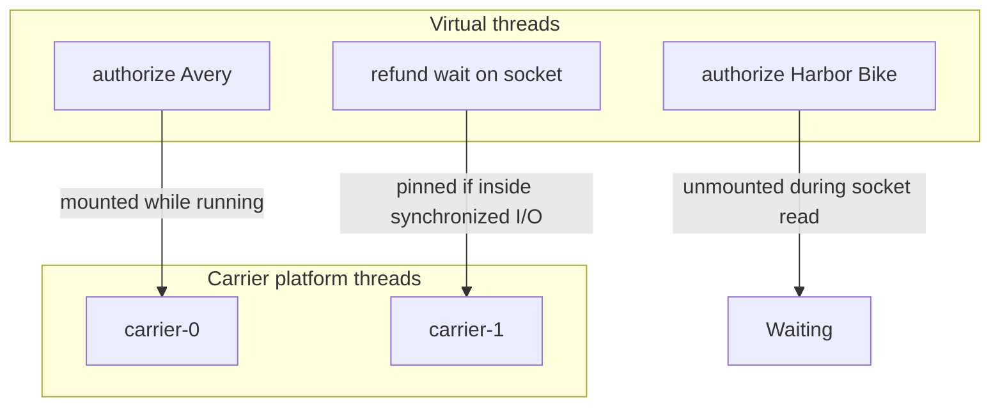

# L-2.5 — Virtual threads

**Module:** 2 — Advanced Java Concurrency  
**Duration:** 30 minutes  
**Case study:** BayPay Financial Services (fictional)

## Why this matters

BayPay’s authorizer is a blocking HTTP call. A platform thread that waits on it occupies about a megabyte of stack and a scarce OS thread. A few hundred concurrent authorizations already force a pool-size argument that is really an admission-control argument. Virtual threads (Java 21) flip the default: you can start a virtual thread per blocking task, and the JVM mounts it on a small set of carrier platform threads while the call waits.

Virtual threads do not make shared ledgers safe. They do not remove the need for bounds. They do not stay cheap if you pin a carrier with a long `synchronized` section or a native call. Used well, they let ARCHITECT-203 look like straightforward blocking Java instead of a `CompletableFuture` nest. Used poorly, they hide a million blocked tasks behind a healthy-looking CPU graph.

## Learning objectives

- Contrast platform threads and virtual threads and say which BayPay jobs fit each.
- Write `Executors.newVirtualThreadPerTaskExecutor()` for blocking authorize I/O.
- Explain carrier **pinning** and why a long `synchronized` journal update fights virtual threads.
- Place a bound (semaphore, queue, or gateway timeout) in front of “a thread per request.”

## Concept explanation

A **platform thread** is a 1:1 wrapper around an OS thread. A **virtual thread** is a lightweight task scheduled by the JVM onto **carrier** platform threads (the ForkJoinPool used as the virtual-thread scheduler). When a virtual thread hits a blocking JDK call that the runtime can unmount (socket read, `LockSupport.park`, many `j.u.c` locks), the carrier is free to run another virtual thread.

Java 21’s `synchronized` **pins** the carrier: the virtual thread stays mounted for the critical section. A short synchronized block is fine. A synchronized block that calls the network is a disaster — you have recreated a small platform pool and lost the unmount. `ReentrantLock` in current JDKs is generally friendlier to unmounting than intrinsic locks; still, do not hold any lock across I/O.

CPU-bound work (crypto at large scale, big in-memory reports) does not get faster with millions of virtual threads. You will oversubscribe cores. Keep CPU work on a sized platform pool.

**Structured concurrency** (`StructuredTaskScope`, preview in Java 21) treats a set of virtual threads as a unit with cancellation. Mention it; do not depend on preview APIs in BayPay production code until the course runtime adopts a final version.

Tomcat and Jetty can run requests on virtual threads (container configuration). That is an architecture choice: the request thread may now block on JPA without occupying an OS thread, but you still need a connection pool bound.

## Visual explanation



Pinning turns C2 into a dedicated OS thread for the duration of the pin. A fleet of pinned virtual threads is a platform pool with extra ceremony.

## Architecture

Where virtual threads fit BayPay:

| Path | Fit | Why |
|---|---|---|
| Outbound authorize HTTP | Good | Blocking, lots of wait |
| JDBC with a 20-connection pool | Mixed | Virtual threads wait; the pool is the real bound |
| In-memory ledger `merge` | Neutral | Too short to matter; correctness still from L-2.3 |
| Long `synchronized` journal + I/O | Bad | Pins carriers |
| ForkJoin parallel streams of CPU work | Prefer platform pool | Avoid oversubscription |

ARCHITECT-203 should show virtual threads *behind* an admission control: a semaphore of N in-flight authorizations, or a bounded HTTP client pool, or both. “Unlimited virtual threads” is not a capacity plan.

The modular monolith can adopt virtual threads incrementally: worker executor first, then the servlet thread pool. Do not mix a huge virtual-thread fan-out with an unbounded `ConcurrentLinkedQueue` of posts.

## Production example

BayPay load-tested a prototype that used `newVirtualThreadPerTaskExecutor()` for the card-network client. At 5,000 concurrent checkouts, CPU stayed modest and latency looked fine — until the in-memory ledger, still using `synchronized (this)` around a second HTTP “fraud check,” pinned carriers. Throughput collapsed to the number of carriers. A thread dump showed thousands of virtual threads, many in `BLOCKED` or runnable-but-pinned states, and a small set of carriers stuck in the fraud call.

The follow-up was: fraud HTTP *outside* any lock; ledger update with `ConcurrentHashMap.merge` or a short `ReentrantLock`; a semaphore of 500 in-flight authorizations matching the downstream quota. Virtual threads stayed. The bound moved to the place that actually constrained money movement.

## Code/configuration example

```java
public final class VirtualAuthorizeGateway implements AutoCloseable {
    private final ExecutorService virtuals = Executors.newVirtualThreadPerTaskExecutor();
    private final Semaphore inFlight = new Semaphore(500);

    public CompletableFuture<String> authorize(String idempotencyKey, String accountId, long amountCents) {
        return CompletableFuture.supplyAsync(() -> {
            try {
                inFlight.acquire();
                try {
                    return callNetwork(idempotencyKey, accountId, amountCents);
                } finally {
                    inFlight.release();
                }
            } catch (InterruptedException e) {
                Thread.currentThread().interrupt();
                throw new java.io.UncheckedIOException(
                        new java.io.IOException("interrupted waiting for authorize slot", e));
            }
        }, virtuals);
    }

    private String callNetwork(String key, String accountId, long amountCents) {
        // blocking HTTP — do not hold a ledger lock here
        return "AUTH-" + key + "-" + accountId + "-" + amountCents;
    }

    @Override
    public void close() {
        virtuals.close();
    }
}
```

Name virtual threads when you need dumps you can read: `Thread.ofVirtual().name("baypay-vt-auth-", 0).factory()` passed to `Executors.newThreadPerTaskExecutor(factory)`.

## Trade-offs

| Approach | Gain | Cost |
|---|---|---|
| Virtual thread per blocking call | Simple blocking style, high concurrency | Need explicit admission control |
| Sized platform pool | Familiar limits | Idle stacks waste RAM; sizing debates |
| Reactive / `CompletableFuture` nest | Explicit stages | Harder to read; still needs bounds |
| Virtual threads + synchronized I/O | None | Pinning; worst of both models |

Prefer virtual threads for *many blocked* tasks. Prefer platform pools for *few busy* CPU tasks. Prefer neither without a bound that matches a downstream quota.

## Failure modes

- **Pinning:** `synchronized` + I/O, or some JNI. Carriers vanish; latency explodes.
- **Unbounded create:** millions of virtual threads waiting on a 20-connection pool. Heap and metaspace pressure; thread dumps become unreadable.
- **Thread-local caches:** a virtual thread per request explodes thread-local memory if you store buffers or JPA sessions that way.
- **Assuming dumps look like platform dumps:** you must enable virtual-thread visibility in `jcmd` / thread dump options; otherwise INCIDENT-style analysis misses the crowd.
- **`join` without timeout** on a virtual thread that waits for a peer: you can still deadlock (L-2.6).

## Security/reliability implications

Admission control is a reliability and abuse control. Without it, a client retry storm creates unbounded in-flight authorizations and can overwhelm a card network — a self-inflicted availability incident. Semaphores and HTTP client limits belong in the design, not as an afterthought.

Do not treat virtual-thread IDs as audit identity. Audit the payment id, customer id, and correlation id. Virtual threads are recycled as tasks complete; they are not a session.

## Interview perspective

**Engineer:** “I would use virtual threads so each authorize can block on HTTP without a huge platform pool.”

**Senior:** “I would keep the ledger update off the synchronized-plus-I/O path so I do not pin. I would cap in-flight calls with a semaphore that matches the vendor limit.”

**Staff:** “I would measure carrier pinning and connection-pool wait. I would not enable virtual threads on the servlet container until the datasource max and the authorizer quota are documented.”

**Principal:** “I would treat virtual threads as a concurrency *style*, not a scaling strategy. Capacity is still the scarcest downstream resource. I would refuse a design that says ‘unlimited virtual threads’ in an architecture review.”

## Key takeaways

- Virtual threads are for blocked I/O, not for infinite work.
- Do not hold `synchronized` across network or JDBC.
- Bound in-flight work to the real quota.
- CPU-heavy work stays on a sized platform pool.
- Correctness of money still comes from L-2.1–L-2.3.

## Knowledge check

1. Why can a virtual thread that calls HTTP inside `synchronized (ledger)` collapse throughput?
2. If you have 10,000 virtual threads and a JDBC pool of 20, what actually limits posting?
3. Are virtual threads a substitute for `ConcurrentHashMap.merge` on the in-memory total?

<details>
<summary>Answers</summary>

1. `synchronized` pins the carrier for the I/O wait, so you only run as many such calls as you have carriers.
2. The 20 connections. The other 9,980 tasks wait. You need that wait to be visible and bounded.
3. No. They change how you schedule waiting, not how you make a compound update atomic.

</details>

## Related lab

[ARCHITECT-203](../../../../labs/ARCHITECT-203/README.md) expects you to choose virtual threads or a platform pool *on purpose* and to show a bound. Do not propose unlimited thread create as the architecture.

## Related PAKS deep dive

Optional: `docs/02-operating-systems/processes-threads-and-scheduling.md`. Useful for contrasting OS threads with JVM-scheduled virtual threads. The lesson stands alone.
