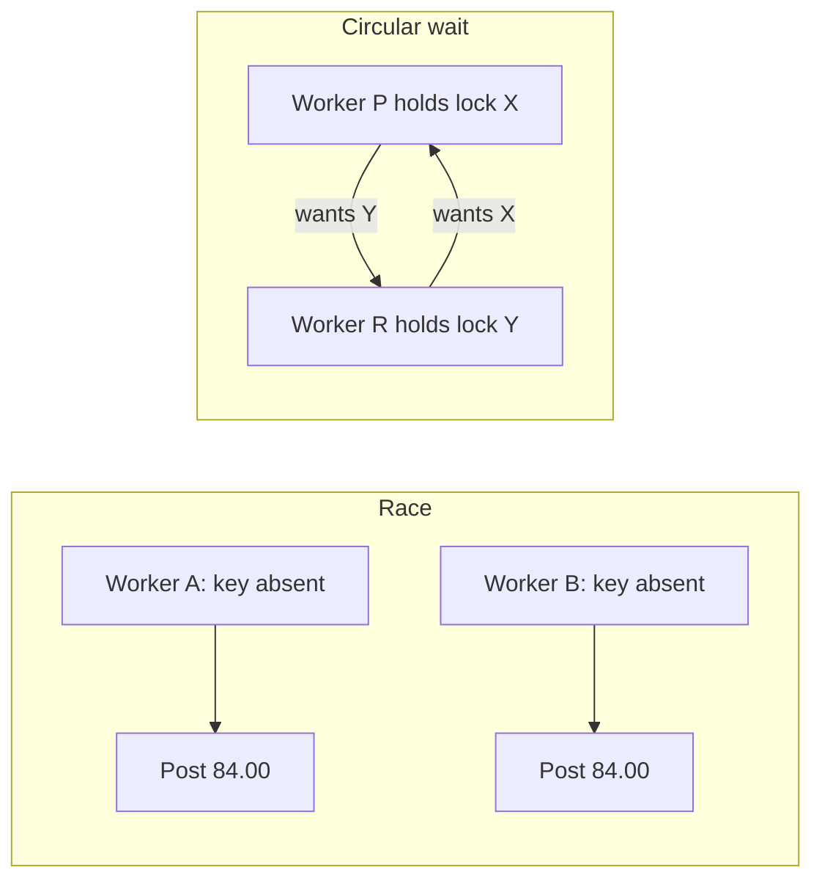

# L-2.6 — Race conditions and deadlocks

**Module:** 2 — Advanced Java Concurrency  
**Duration:** 30 minutes  
**Case study:** BayPay Financial Services (fictional)

## Why this matters

Two BayPay incidents in this module look like opposites. One completes too much work: Harbor Bike Co is charged twice. The other completes nothing: payment and refund workers sit in a JVM that still answers `/actuator/health`. Both are concurrency failures. A **race** is “the outcome depends on unlucky interleaving.” A **deadlock** is “nobody can proceed because each side waits for the other.” If you cannot tell them apart from evidence, you will restart a box that needed a code fix, or you will add locks until the box never moves again.

This lesson teaches the patterns and the investigation habit. The labs hide the specific root causes on purpose. You will write a hypothesis, then request evidence.

## Learning objectives

- Distinguish a race, a deadlock, a livelock, and a starvation hang.
- Describe check-then-act and read-modify-write races on a payment path.
- List the four Coffman conditions and which one BayPay designs usually break.
- Read a thread dump for `BLOCKED` / `WAITING` without leaping to a root cause in the student guide.

## Concept explanation

A **race condition** exists when the correctness of a result depends on timing. The important BayPay races:

- **Check-then-act:** `if (!seen.contains(key)) { seen.add(key); post(); }` Two threads pass the check.
- **Read-modify-write:** `balance = get(); put(balance + amount)` Two threads lose an increment (L-2.2).
- **Lost increment on a collection:** two `ArrayList.add` calls under no lock (L-2.3).
- **TOCTOU with I/O:** check idempotency in memory, then crash before persist; retry posts again. In-memory “seen” is not the control.

A **deadlock** requires four conditions at once (Coffman): mutual exclusion, hold-and-wait, no preemption, and circular wait. BayPay cannot drop mutual exclusion on a ledger row. Designs break **circular wait** (one global lock order) or **hold-and-wait** (take all locks up front via a sorter; or take only one lock; or use `tryLock` and release).

**Livelock** is two workers politely backing off forever. **Starvation** is a fair-lock or notify policy that never wakes a refund thread. **Health-check lies:** a process with deadlocked workers can still serve `/health` if that endpoint does not try to run a payment.

Detection: races show *wrong counts* and *duplicate ids* in logs. Deadlocks show *no completions*, *growing queues*, *low CPU*, and a dump where threads wait for monitors owned by each other. `jstack` can print a “Found one Java-level deadlock” section. That is evidence, not a finished RCA. You still need the policy that will prevent the next circle.

## Visual explanation



Do not assume which pair of names X and Y are in INCIDENT-202 until the dump says so. The diagram is the shape, not the lab answer.

## Architecture

BayPay’s payment and refund modules share account and ledger concerns. A safe architecture picks **one** of these policies and writes it down:

1. **Single lock** (or single DB transaction) for a money movement.
2. **Documented lock order** used by every module.
3. **No in-process multi-lock:** each JVM does lock-free collection updates; the database serializes.

The modular monolith makes (3) the production default: `@Transactional` on `PaymentApplicationService.create` and a unique idempotency row. Teaching ledgers and extracted workers re-introduce (1) or (2). When two teams add a second lock “just for the refund cache,” circular wait becomes possible.

Stabilization is part of architecture. A deadlock that is already happening is not fixed by a lecture. You shed load, bounce *one* instance if the dump confirms no progress, then ship the policy. BREAKFIX-201’s race is not fixed by a bounce; it will happen again on the next parallel retry.

## Production example

On a Saturday sale, BayPay’s dashboard showed authorize throughput at 1,200 rps and a rising “duplicate payment” counter. Health was UP. The race lab’s incident pack is that shape: logs still flow, money is wrong.

On a later weekday, throughput for both payments and refunds fell toward zero, queue depth climbed, and CPU sat near idle. Health stayed UP. The hung-worker incident pack is that shape: logs stop in the middle of a pair of operations. You will request the dump when the timeline tells you to, not before.

Neither story is “the JVM is broken.” Both are application protocols for shared state.

## Code/configuration example

Race (do not ship):

```java
if (!seen.containsKey(key)) {
    seen.put(key, paymentId);
    journal.add(entry); // second thread can be here too
}
```

Deadlock *shape* (two locks, two orders — illustrative, not the lab’s write-up):

```java
void pathA() {
    synchronized (lockX) {
        synchronized (lockY) {
            /* money */
        }
    }
}

void pathB() {
    synchronized (lockY) {
        synchronized (lockX) {
            /* money */
        }
    }
}
```

A prevention sketch you may use in designs (ARCHITECT-203):

```java
boolean transfer(Object first, Object second, Runnable body) {
    Object a = first;
    Object b = second;
    if (System.identityHashCode(a) > System.identityHashCode(b)) {
        Object tmp = a;
        a = b;
        b = tmp;
    }
    synchronized (a) {
        synchronized (b) {
            body.run();
            return true;
        }
    }
}
```

Identity-hash ordering is a last resort and fails on hash collisions; a named order (`account` then `ledger`) or a single lock is clearer. `tryLock` with a timeout plus retry/jitter breaks hold-and-wait at the cost of extra failure handling.

## Trade-offs

| Policy | Prevents | Cost |
|---|---|---|
| One lock / one transaction | Circular wait | Coarser exclusion |
| Global lock order | Circular wait | Every team must obey; reviews must check |
| `tryLock` + timeout | Permanent hang | Need retry/idempotency; can livelock if naive |
| Bounce the pod | Unsticks *this* circle | Recurs if the code remains |
| More locks around a race | Sometimes the race | Creates the hang if orders disagree |

Adding locks to a race without a policy is how you travel from BREAKFIX-201 to INCIDENT-202.

## Failure modes

- **Duplicate or lost money** with healthy latency (race).
- **Zero throughput, low CPU, full queue** (deadlock or pool exhaustion — dump tells them apart).
- **False deadlock diagnosis:** all threads waiting on a lock held by a thread in GC or a native call. Read the owner stack.
- **False race diagnosis:** two legitimate payments with two keys. Check the idempotency key, not only the customer.
- **Fix that hides evidence:** catching `ConcurrentModificationException` and retrying forever.

## Security/reliability implications

Races on money are integrity failures and customer-trust failures. They can also be abused: an attacker who can parallelize the same idempotency key (or omit it) will try. BayPay requires the key and a unique store.

Deadlocks are availability failures. A health check that only pings the JVM will lie. Readiness should attempt a cheap, lock-safe probe — not take the ledger lock. Communication during an incident must not claim a root cause you have not evidenced; say what is stopped, what you are collecting, and what you have stabilized.

## Interview perspective

**Engineer:** “A race is a bad interleaving. A deadlock is two threads waiting on each other’s locks. I would look at a thread dump.”

**Senior:** “I would reproduce the race with a parallel harness and the hang with a dump plus queue metrics. I would fix races with atomic compound operations or one transaction, and hangs with a lock policy or `tryLock`.”

**Staff:** “I would separate stabilization from remediation. I would not bounce first on a duplicate-charge incident. I would add a readiness probe that detects ‘no completions’ and a metric for duplicate keys.”

**Principal:** “I would make lock policy and idempotency part of the architecture review, not a hero fix. I would score an engineer on evidence order. Guessing the circle from the lab title is not diagnosis.”

## Key takeaways

- Races finish with the wrong money. Deadlocks finish with no money moving.
- Check-then-act and read-modify-write are the usual payment races.
- Break circular wait or hold-and-wait; write the policy down.
- Health UP is not “payments are completing.”
- Labs do not include the RCA in the student guide — earn it from evidence.

## Knowledge check

1. Two threads both pass `if (!seen.contains(key))` and both post. Race or deadlock?
2. Why can `/actuator/health` stay UP during a worker deadlock?
3. Name one design that prevents circular wait without using `tryLock`.

<details>
<summary>Answers</summary>

1. Race (check-then-act). Work completed twice.
2. The health endpoint may not take the same locks or run the same workers. The process is alive; the money path is not.
3. A single lock (or single transaction), or one documented acquisition order used by every path.

</details>

## Related lab

[BREAKFIX-201](../../../../labs/BREAKFIX-201/README.md) (duplicate payments) and [INCIDENT-202](../../../../labs/INCIDENT-202/README.md) (workers not completing). Request evidence in order. Do not open `solutions/` until you have a written hypothesis, supporting evidence, and a proposed stabilize/remediate split.

## Related PAKS deep dive

Optional: `docs/01-computer-architecture/memory-ordering-and-concurrency.md` and `docs/02-operating-systems/processes-threads-and-scheduling.md`. They deepen “why interleavings exist” and “why a blocked thread still holds a lock.” The labs are completable without them.
