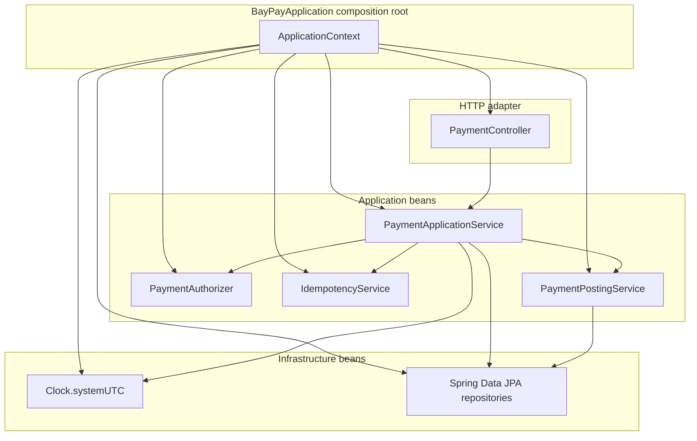

# L-3.1 — IoC and dependency injection

**Module:** 3 — Spring Boot Engineering  
**Duration:** 30 minutes  
**BayPay case:** how the payment process is assembled without `new PaymentApplicationService(...)` in a controller

---

## Why this matters

BayPay’s HTTP process is one JVM and five Maven modules. `PaymentController` must call `PaymentApplicationService`. That service needs repositories, `IdempotencyService`, `PaymentAuthorizer`, `PaymentPostingService`, and a `Clock`. If every class constructs its own collaborators, you cannot swap the authorizer in a test, you cannot freeze time for Avery Chen’s payment, and you cannot extract `transaction-worker` later without rewriting constructors by hand.

Inversion of Control (IoC) is the rule that **the container, not the domain class, decides how collaborators are created and injected**. Dependency injection (DI) is the mechanism. This is not a style preference. It is how BayPay keeps authorize, post, and notify as replaceable beans inside one modular monolith.

---

## Learning objectives

- Distinguish IoC, the ApplicationContext, a bean, and a dependency.
- Read constructor injection on `PaymentController` and `PaymentApplicationService` and say why field injection is the weaker default.
- Explain how `@SpringBootApplication(scanBasePackages = "com.baypay")` finds beans across Maven modules.
- Register infrastructure with `@Configuration` `@Bean` when a type is not yours to annotate (`Clock`).
- Predict the failure you get from a missing bean, a circular dependency, or a `@Transactional` JDK proxy.

---

## Concept explanation

**Inversion of Control** means `PaymentApplicationService` does not look up a `PaymentRepository`. It declares the need in its constructor. **The ApplicationContext** is Spring’s registry: type (and optional name) to instance. A **bean** is an object the context manages: create, inject, and eventually destroy.

Spring Boot’s composition root for BayPay is `BayPayApplication`. It is not a “microservice class.” It is the process that scans `com.baypay` and starts one web server.

Stereotypes in the app: `@RestController` (`PaymentController`, thin adapter), `@Service` (use cases), `@Component` (filter, notification listener), `@Configuration` `@Bean` for `Clock` and `PaymentAuthorizer`, Spring Data repositories for persistence.

**Constructor injection** is the course default. Required dependencies are `final`. The class is useless if the container cannot satisfy the constructor, which is what you want at boot, not at the first `POST /payments`. Setter injection is for optional collaborators. Field `@Autowired` hides the graph, breaks immutability, and makes unit tests use reflection.

**Component scanning across modules.** `payment-service` depends on `refund-service`, `transaction-worker`, `notification-service`, and `shared`. `@SpringBootApplication(scanBasePackages = "com.baypay")` plus `@EntityScan` and `@EnableJpaRepositories` with the same base package are required because the default scan of `com.baypay.payment` would miss `com.baypay.refund` and `com.baypay.shared`.

**JDK proxies and `@Transactional`.** Spring typically wraps `@Transactional` beans in a proxy. Self-invocation (`this.create(...)` from another method on the same class) does not go through the proxy, so it does not start a transaction. Call transactional methods from another bean, the way `PaymentController` calls `PaymentApplicationService`.

---

## Visual explanation



Alt text: BayPayApplication builds one ApplicationContext. PaymentController depends on PaymentApplicationService, which depends on authorizer, idempotency, posting, repositories, and a Clock bean. The container wires the graph; classes do not call new on each other.

---

## Architecture

BayPay remains a **modular monolith**. IoC does not make `notification-service` a network hop. `NotificationListener` is a `@Component` that receives in-process `PaymentCompletedEvent`s. `PaymentPostingService` is a `@Service` in another Maven module, called on the same thread and — today — the same database transaction.

What IoC owns:

- Object graph, scopes (BayPay uses singleton beans), and lifecycle.
- Profile-specific beans (`DemoDataSeeder` is `@Profile("!prod")`).
- Test replacements (`@MockBean` / `@TestConfiguration` in later lessons).

What IoC must **not** own:

- Payment invariants. `Money` and `PaymentStateMachine` stay plain Java.
- HTTP status policy as a hidden AOP trick. Controllers return `201` / `200` / `422` explicitly.

When you extract `transaction-worker` in a later module, you change **one bean** from a local `PaymentPostingService` to a publisher. You do not rewrite `PaymentController`. That is the architectural payoff of constructor injection.

---

## Production example (BayPay)

`PaymentController` takes its service in the constructor. There is no `@Autowired` on the field. Spring satisfies it because `PaymentApplicationService` is a `@Service` in the scanned package.

`PaymentApplicationService` lists eight constructor parameters on purpose: customer, account, payment, audit, idempotency, authorization, posting, and time. A ninth collaborator is a split signal, not a reason to call `ApplicationContext.getBean`.

`Clock` is a `@Bean` so tests can freeze `createdAt`. `PaymentAuthorizer` is an interface; `BayPayConfig` exposes `DefaultPaymentAuthorizer`. A later test can bind a stub without editing the service.

---

## Code/configuration example

This is the composition style BayPay uses. The controller stays an HTTP adapter. The configuration class owns types you cannot annotate.

```java
@RestController
@RequestMapping("/api/v1/payments")
public class PaymentController {

    private final PaymentApplicationService payments;

    public PaymentController(PaymentApplicationService payments) {
        this.payments = payments;
    }

    @PostMapping
    public ResponseEntity<PaymentResponse> create(
            @Valid @RequestBody CreatePaymentRequest request,
            @RequestHeader(name = "Idempotency-Key", required = false) String idempotencyKey) {
        PaymentApplicationService.CreateResult result = payments.create(request, idempotencyKey);
        PaymentResponse body = PaymentResponse.from(result.payment());
        if (result.replay()) {
            return ResponseEntity.ok(body);
        }
        if (result.payment().status() == PaymentStatus.DECLINED) {
            return ResponseEntity.status(HttpStatus.UNPROCESSABLE_ENTITY).body(body);
        }
        return ResponseEntity.created(URI.create("/api/v1/payments/" + result.payment().id()))
                .body(body);
    }
}
```

```java
@Configuration
public class BayPayConfig {

    @Bean
    Clock clock() {
        return Clock.systemUTC();
    }

    @Bean
    PaymentAuthorizer paymentAuthorizer() {
        return new PaymentAuthorizer.DefaultPaymentAuthorizer();
    }
}
```

```java
@SpringBootApplication(scanBasePackages = "com.baypay")
@EntityScan(basePackages = "com.baypay")
@EnableJpaRepositories(basePackages = "com.baypay")
public class BayPayApplication {
    public static void main(String[] args) {
        SpringApplication.run(BayPayApplication.class, args);
    }
}
```

Constructor parameters are the API of the class. If you cannot construct `PaymentApplicationService` in a unit test with fakes, the design is already wrong.

---

## Trade-offs

- **Constructor versus field injection.** Constructors make the graph visible. Field injection is shorter and worse for tests.
- **Stereotypes versus `@Bean`.** Stereotypes sit next to BayPay code. `@Bean` is for `Clock` and for choosing a `PaymentAuthorizer`.
- **Scan versus `@Import`.** Scan keeps the monolith one process. Explicit imports wait until JARs deploy separately.
- **Interface versus concrete `@Service`.** Authorizer is an interface because it will be replaced. `PaymentApplicationService` is concrete. Do not interface-wash every type.

---

## Failure modes

- **Missing bean.** `NoSuchBeanDefinitionException: Clock` — forgot `@Bean clock()` or scanned the wrong package.
- **Too-narrow scan.** `404` on `/api/v1/refunds` — `scanBasePackages` left at `com.baypay.payment`.
- **Circular dependency.** Payment ↔ posting → `BeanCurrentlyInCreationException`. Break it with `PaymentCompletedEvent` or move work to `shared`.
- **Self-invocation skips `@Transactional`.** `this.create` is not a proxy call. Partial ledger writes. FIX-304 lives nearby.
- **Two `PaymentAuthorizer` beans without `@Primary`.** `NoUniqueBeanDefinitionException` when a test stub is added.

---

## Security/reliability implications

Treat the ApplicationContext as immutable after boot — no writable admin/restart endpoints. Do not inject `DataSource` or `EntityManager` into a controller; that skips the refund transaction boundary and authorization. Controllers depend on application services; services depend on repositories.

`DemoDataSeeder` is `@Profile("!prod")`. Seeding Avery Chen into production PostgreSQL is a data incident. Reliability includes **which beans exist in which profile**.

---

## Interview perspective

**Engineer.** “Spring creates beans and injects them. BayPay uses constructor injection on `PaymentController`. I would add `@Service` on a new class so the controller can take it.”

**Senior.** “I want required collaborators in the constructor and `final`. I register `Clock` as a `@Bean` so tests can freeze time. I have seen `@Autowired` fields hide a twelve-dependency service that should have been split.”

**Staff.** “The composition root is `BayPayApplication` scanning `com.baypay`. Package scan is an architecture control: miss a package and refunds disappear from the process. I use events to avoid cycles between payment and notification.”

**Principal.** “IoC is how we keep a modular monolith extractable. I will not split `transaction-worker` into a JVM until the bean boundary is already clean. I also will not let the container own money invariants — those stay in `shared` so they survive a framework change.”

---

## Key takeaways

- IoC inverts creation; DI is how BayPay passes repositories, the authorizer, and a `Clock` into use cases.
- Constructor injection is the default. Field injection is a review comment.
- Scan `com.baypay`, not only `com.baypay.payment`, or sibling modules never become beans.
- `@Bean` is for types you do not own and for choosing an implementation.
- `@Transactional` is a proxy. Self-invocation is not a transaction.

---

## Knowledge check

1. `PaymentApplicationService` has eight constructor parameters. A teammate wants to replace them with `ApplicationContext.getBean(PaymentRepository.class)` inside `create`. What do you say?
2. The process starts, payments work, refunds return 404 from the dispatcher (no handler). Which configuration mistake is the first place you look?
3. Why is `Clock` a `@Bean` instead of `Instant.now()` inside `PaymentApplicationService`?

<details>
<summary>Answers</summary>

1. Refuse the locator. It hides dependencies and forces a context to unit-test. If eight parameters hurt, split the use case.
2. Component scan. `BayPayApplication` must scan `com.baypay` so `RefundController` is registered.
3. Time is infrastructure. A `Clock` bean freezes `createdAt` in tests. `Instant.now()` inside the service makes replay tests flake.

</details>

---

## Related lab

Rebuild constructor-injected adapters in [BUILD-301](../../../../labs/BUILD-301/README.md) and [BUILD-302](../../../../labs/BUILD-302/README.md). Do not `new` the application service from the controller.

---

## Related PAKS deep dive

Optional: `docs/14-microservices/overview.md` on [paks.bayareala8s.com](https://paks.bayareala8s.com). This lesson does not require it. BayPay stays one process until a module earns extraction.
