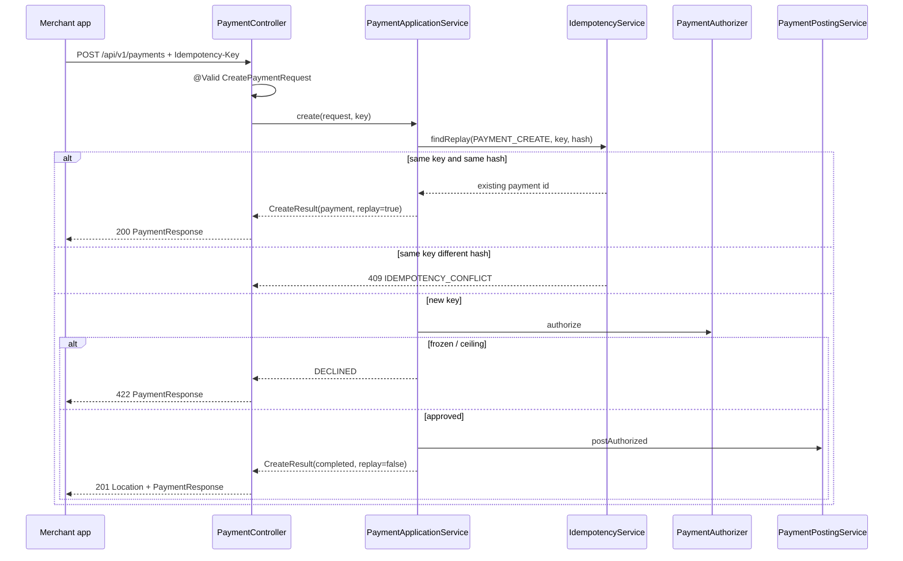

# L-3.2 — REST APIs and validation

**Module:** 3 — Spring Boot Engineering  
**Duration:** 30 minutes  
**BayPay case:** `POST /api/v1/payments` must not debit Avery Chen twice when the merchant app retries

---

## Why this matters

A BayPay merchant client will retry. Timeouts happen between the load balancer and `payment-service`. If `POST /api/v1/payments` is “insert a row and return 201” with no key, Avery Chen is charged twice and the dispute team inherits your design. If every retry also returns `201`, operators cannot tell create from replay. If a frozen account returns `500`, on-call pages for a business decline.

This lesson is the HTTP contract you will implement in BUILD-301 and BUILD-302: **Bean Validation on the body, `Idempotency-Key` on the write, status codes that mean something, OpenAPI that matches the running app.**

---

## Learning objectives

- Map `PaymentController` and `RefundController` to resources, not verbs-as-paths.
- Apply Jakarta Bean Validation on request records and explain `400` versus domain `422`.
- Implement `Idempotency-Key` so the same key and body replay as `200` and a different body conflicts as `409`.
- Choose `201` (created), `200` (replay), and `422` (declined) on payment writes.
- Publish the contract at `/v3/api-docs` and keep it honest.

---

## Concept explanation

BayPay’s public write surface is two resources:

| Method | Path | Required header | Success |
|---|---|---|---|
| `POST` | `/api/v1/payments` | `Idempotency-Key` | `201` new, `200` replay, `422` body with `DECLINED` |
| `GET` | `/api/v1/payments/{id}` | none | `200` |
| `POST` | `/api/v1/refunds` | `Idempotency-Key` | `201` new, `200` replay |
| `GET` | `/api/v1/refunds/{id}` | none | `200` |

**Bean Validation** runs before the application service when the controller parameter is `@Valid @RequestBody`. `CreatePaymentRequest` is a record with `@NotNull` ids, `@DecimalMin("0.01")` amount, `@Pattern(regexp = "USD|EUR|GBP")` currency, and `@Size(max = 64)` reference. Failures become `MethodArgumentNotValidException` → HTTP `400` with `ErrorCode.VALIDATION_FAILED`. That is **syntactic**. “Account does not belong to customer” is **domain** and returns `422` from `ApiExceptionHandler`.

**Idempotency** is not caching. `IdempotencyService` stores operation + key + request hash + resource id. `IdempotencyKeys.require` rejects missing, short, or illegal keys (`[A-Za-z0-9._-]`, length 8–128). Replay of the same hash returns the original payment. A different hash with the same key throws `IdempotencyConflictException` (`409`).

**Status policy on create:**

1. Missing/invalid key → `400` `IDEMPOTENCY_KEY_REQUIRED`.
2. Replay → `200` and the original resource. No second ledger post.
3. Frozen account / authorizer decline → persist `DECLINED`, remember the key, return `422` with the payment body (not an empty error).
4. Happy path → authorize, post, `201` with `Location: /api/v1/payments/{id}`.

`GET` is safe and idempotent by HTTP rules. It does not take an idempotency key.

**OpenAPI.** springdoc serves `/v3/api-docs` and Swagger UI at `/swagger-ui.html`. `PaymentApiIT.openApiContractIsPublished` asserts both payment and refund paths exist. If you add a field and forget the annotation, the UI lies to the next team.

---

## Visual explanation



Alt text: A payment POST is validated, then checked against the idempotency store. Replay returns 200. Key reuse with a new body returns 409. A decline returns 422. A new approved payment posts to the ledger and returns 201.

---

## Architecture

The controller is an adapter. It does not load `Account` or decide authorization. It:

1. Binds JSON to a record.
2. Runs Bean Validation.
3. Forwards the raw `Idempotency-Key` (optional at the HTTP layer so a missing header becomes a domain `400`, not a servlet `400` with no `code`).
4. Translates `CreateResult` into HTTP status and `Location`.

Keeping the header `required = false` is deliberate. A required Spring header yields a generic missing-header error. BayPay wants `ProblemDetail` with `IDEMPOTENCY_KEY_REQUIRED`.

Version the public URL (`/api/v1/...`). Do not version by adding `/api/v1/createPayment`. Resources evolve; RPC paths fossilize.

Correlation is orthogonal: `X-Correlation-Id` is applied by `CorrelationIdFilter` and echoed on every response, including validation failures. Idempotency keys are **not** correlation ids. A key identifies a write intent. A correlation id identifies a trace.

---

## Production example (BayPay)

Avery Chen (`11111111-1111-1111-1111-111111111111`) pays `25.00` USD from the active account. First `POST` with `Idempotency-Key: pay-key-invoice-1001` returns `201` and `status=COMPLETED`. The same key and body return `200` and the same `paymentId`. Changing the amount to `11.00` with that key returns `409` and `IDEMPOTENCY_CONFLICT`. The frozen account returns `422` and `status=DECLINED`.

Refunds follow the same header rules. Extra domain rules: the payment must be `COMPLETED` or `REVERSED`, and the sum of completed refunds cannot exceed the payment amount (`REFUND_EXCEEDS_REMAINING`). A full refund transitions the payment to `REVERSED`.

These behaviors are locked in `PaymentApiIT` and `RefundApiIT`. If your rebuild “looks right” in curl but fails those tests, the contract is wrong.

---

## Code/configuration example

```java
public record CreatePaymentRequest(
        @NotNull UUID customerId,
        @NotNull UUID accountId,
        @NotNull @DecimalMin(value = "0.01", inclusive = true) BigDecimal amount,
        @NotBlank @Pattern(regexp = "USD|EUR|GBP") String currency,
        @Size(max = 64) String reference
) {
}
```

```java
@PostMapping
@Operation(summary = "Create a payment. Idempotency-Key is required.")
public ResponseEntity<PaymentResponse> create(
        @Valid @RequestBody CreatePaymentRequest request,
        @RequestHeader(name = "Idempotency-Key", required = false) String idempotencyKey) {
    PaymentApplicationService.CreateResult result = payments.create(request, idempotencyKey);
    PaymentResponse body = PaymentResponse.from(result.payment());
    if (result.replay()) {
        return ResponseEntity.ok(body);
    }
    if (result.payment().status() == PaymentStatus.DECLINED) {
        return ResponseEntity.status(HttpStatus.UNPROCESSABLE_ENTITY).body(body);
    }
    return ResponseEntity.created(URI.create("/api/v1/payments/" + result.payment().id())).body(body);
}
```

Canonical hash material in the service is explicit: customer, account, amount (`toPlainString()`), currency, reference. Do not hash the raw JSON string; key order and whitespace would false-conflict.

---

## Trade-offs

- **`Idempotency-Key` header versus a key in the JSON body.** Headers keep the resource representation clean and match common payment APIs. A body field is easier to log accidentally. BayPay uses the header.
- **`422` with a payment body versus `422` ProblemDetail only.** Returning the `DECLINED` resource lets the client store an id and reason. A ProblemDetail-only decline hides the persisted payment. BayPay persists declines so a replay still returns the same decline.
- **Optional Spring header versus `required = true`.** Required is less code and a worse error envelope. BayPay prefers a stable `code`.
- **OpenAPI from code versus a hand-written spec first.** Code-first stays in sync if tests assert paths. Spec-first is better when external partners version independently. BayPay is an internal platform API in this course, so springdoc plus ITs is enough.

---

## Failure modes

- **Missing key treated as a new payment.** Two charges, two ledger rows. The worst failure this lesson exists to prevent.
- **Replay returns `201`.** Clients that key on “created” insert duplicate local rows. Operators lose the create/replay distinction.
- **Hashing pretty-printed JSON.** Same payment, different whitespace, `409`. Use a canonical string.
- **Validating money only in the controller.** A future batch job posts `amount=0`. Keep `Money` invariants in `shared`.
- **Stale OpenAPI.** A new required field ships; `/v3/api-docs` still omits it because nobody ran `PaymentApiIT.openApiContractIsPublished`.

---

## Security/reliability implications

Do not put PAN, CVV, or a real account number in `reference`. BayPay’s `reference` is a merchant string (`invoice-1001`), size-capped. Validation is a reliability control: illegal currency never reaches the authorizer.

Idempotency records are sensitive in the sense that they map keys to payment ids. They live in the same database as payments. Do not log the full key next to customer PII in a shared debug channel; correlation id is the public handle.

`400` for syntax and `422` for domain keep WAF and client metrics useful. Collapsing everything to `400` makes a frozen-account decline look like a bad deploy.

---

## Interview perspective

**Engineer.** “I put `@Valid` on the request and `@NotNull` on fields. Writes need `Idempotency-Key`. First create is 201, retry is 200.”

**Senior.** “I separate Bean Validation (400) from domain rules (422). I hash a canonical body, not the raw JSON. Decline is persisted so replay stays stable. I would fail a PR that returns 201 on replay.”

**Staff.** “Idempotency is a store with a uniqueness key per operation, not a cache TTL guess. I would discuss key expiry, conflict (`409`), and whether GET should ever be keyed. I keep controllers from loading entities.”

**Principal.** “The HTTP contract is a product surface. I will not let a framework default (required header, generic 400) define BayPay’s error vocabulary. I also will not split payment and refund into two deployables until the idempotency and ledger story is single-transaction simple.”

---

## Key takeaways

- `@Valid` records catch syntax. Domain exceptions catch business rules. Different HTTP statuses.
- `Idempotency-Key` is mandatory on payment and refund writes. Same key + same hash = `200`. Same key + different hash = `409`.
- New completed payment: `201` + `Location`. Authorizer decline: `422` + `DECLINED` body.
- Publish OpenAPI from the running app and lock it with a test.
- Controllers adapt HTTP. Application services own the use case.

---

## Knowledge check

1. A client retries `POST /api/v1/payments` with the same key and body after a timeout. What status and body must BayPay return, and what must not happen in the ledger?
2. Why is `Idempotency-Key` `required = false` on the controller parameter if the API says the header is required?
3. Amount `0` and currency `USDT` both fail. Which layer should reject each, and with which status?

<details>
<summary>Answers</summary>

1. `200` and the original `PaymentResponse` (same `paymentId`, same status). The ledger must not receive a second `PAYMENT` row. A second `201` or a second post is a defect.

2. So a missing header is handled by `IdempotencyKeys.require` and `ApiExceptionHandler` as `400` with `IDEMPOTENCY_KEY_REQUIRED`, not as a generic Spring missing-header response.

3. `USDT` fails Bean Validation (`@Pattern`) → `400`. `0` fails `@DecimalMin("0.01")` → `400`. If a caller bypassed HTTP, `Money` in `shared` must still reject non-positive amounts. Frozen-account decline is not validation; it is `422` after authorization.

</details>

---

## Related lab

Implement the payment contract in [BUILD-301](../../../../labs/BUILD-301/README.md), then the refund contract in [BUILD-302](../../../../labs/BUILD-302/README.md). Both labs use this app, not a new stack.

---

## Related PAKS deep dive

Optional: `docs/15-api-and-integration-architecture/overview.md` on [paks.bayareala8s.com](https://paks.bayareala8s.com) covers idempotent writes and correlation as integration concerns. This lesson already specifies BayPay’s HTTP rules; PAKS is background, not a prerequisite.
