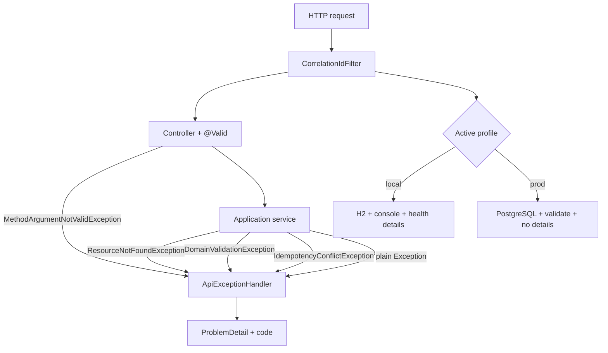

# L-3.3 — Exception handling and configuration

**Module:** 3 — Spring Boot Engineering  
**Duration:** 30 minutes  
**BayPay case:** a missing payment, a bad key, and a bug must not share one JSON shape or one Spring profile

---

## Why this matters

When Avery Chen’s app asks for a payment id that does not exist, the client needs `404` and `PAYMENT_NOT_FOUND`, not a Hibernate stack trace. When a developer leaves `spring.jpa.show-sql=true` and the H2 console enabled in a `prod` profile, you have leaked schema and a browser onto a payments database. Exception handling and configuration are the same production skill: **make failure explicit, make environments honest, and never ship local conveniences to PostgreSQL.**

---

## Learning objectives

- Map BayPay domain exceptions to RFC 7807 `ProblemDetail` with a stable `code`.
- Separate `400` (syntax / missing key), `404`, `409`, `422`, and `500`.
- Use `@RestControllerAdvice` as the single HTTP error adapter.
- Explain `local`, `test`, and `prod` profiles: H2 versus PostgreSQL, health details, H2 console.
- Propagate `X-Correlation-Id` on success and on ProblemDetail responses.

---

## Concept explanation

BayPay’s error types live in `shared` and are runtime exceptions:

| Type | Typical HTTP | Example |
|---|---|---|
| `DomainValidationException` | `400` if `IDEMPOTENCY_KEY_REQUIRED`, else `422` | account/customer mismatch, over-refund |
| `ResourceNotFoundException` | `404` | unknown payment or refund id |
| `IdempotencyConflictException` | `409` | same key, different body |
| `BayPayException` (other) | `409` | illegal state that is a conflict |
| `MethodArgumentNotValidException` | `400` | Bean Validation |
| Unhandled `Exception` | `500` | bug; log the stack, hide the detail |

`ApiExceptionHandler` builds `ProblemDetail` with `title`, `detail`, `type` (`https://baypay.example/errors/{CODE}`), `instance` (request URI), and property `code`. Clients key off `code`, not English `detail`.

**Configuration** is how the same JAR behaves in three worlds:

| Profile | Database | `ddl-auto` | Health details | H2 console |
|---|---|---|---|---|
| `local` (default) | H2 `MODE=PostgreSQL` | `update` | `always` | enabled |
| `test` | H2 mem `baypaytest` | `create-drop` | (test defaults) | disabled |
| `prod` | PostgreSQL env vars | `validate` | `never` | disabled |

`application.yml` sets application name, Jackson dates, Actuator exposure, springdoc paths, and a console log pattern that includes `correlationId`. Profile files override datasource and safety switches. `open-in-view: false` in both local and prod — that is not a profile debate.

**Correlation.** `CorrelationIdFilter` (`@Order(HIGHEST_PRECEDENCE)`) reads `X-Correlation-Id`, generates a UUID if absent, puts it in MDC, and echoes it on the response. The log pattern is `%X{correlationId:-none}`. Advice handlers run inside the filter, so errors still carry the id.

---

## Visual explanation



Alt text: Every request passes CorrelationIdFilter. Controller validation and domain exceptions meet ApiExceptionHandler, which returns ProblemDetail. The active profile selects H2 or PostgreSQL and whether health details or the H2 console exist.

---

## Architecture

Treat `@RestControllerAdvice` as part of the HTTP adapter layer, sitting next to controllers, not next to JPA entities. It must not catch exceptions in order to **succeed**. Catching to return `200` after a ledger failure is a different defect — you will diagnose that class of bug in FIX-304 without this lesson spoiling it.

Configuration architecture:

- **One JAR**, three profiles. Do not maintain a “prod fork” of `BayPayApplication`.
- **Environment variables** for secrets (`BAYPAY_DB_PASSWORD`). Defaults in `application-prod.yml` are for laptop PostgreSQL, not a license to commit real passwords.
- **Fail closed on schema in prod.** `ddl-auto: validate` means a missing column stops the process. `update` in prod is how you get a silent column add at 02:00.

Jackson writes ISO-8601 instants so clients and tests compare `createdAt` as text.

---

## Production example (BayPay)

A GET for a random UUID returns:

```json
{
  "type": "https://baypay.example/errors/PAYMENT_NOT_FOUND",
  "title": "PAYMENT_NOT_FOUND",
  "status": 404,
  "detail": "Payment not found: ...",
  "instance": "/api/v1/payments/...",
  "code": "PAYMENT_NOT_FOUND"
}
```

A missing `Idempotency-Key` returns `400` / `IDEMPOTENCY_KEY_REQUIRED`. Reusing `pay-key-conflict` with a new amount returns `409` / `IDEMPOTENCY_CONFLICT`. An unhandled `NullPointerException` in a future change must hit `unknown(...)`, log at error with the correlation id, and return `500` with detail `An unexpected error occurred` — never the exception message, which might include a SQL string.

Locally you may open `/h2-console` against `jdbc:h2:mem:baypay`. That endpoint is off in `prod`. Health `show-details` is `always` in local and `never` in prod (`when_authorized` in the base file). Lesson L-3.5 specializes Actuator; here the point is that **profile files exist to change those knobs.**

---

## Code/configuration example

```java
@RestControllerAdvice
public class ApiExceptionHandler {

    @ExceptionHandler(ResourceNotFoundException.class)
    public ResponseEntity<ProblemDetail> notFound(ResourceNotFoundException ex, HttpServletRequest request) {
        return problem(HttpStatus.NOT_FOUND, ex, request);
    }

    @ExceptionHandler(DomainValidationException.class)
    public ResponseEntity<ProblemDetail> validation(DomainValidationException ex, HttpServletRequest request) {
        HttpStatus status = ex.code() == ErrorCode.IDEMPOTENCY_KEY_REQUIRED
                ? HttpStatus.BAD_REQUEST
                : HttpStatus.UNPROCESSABLE_ENTITY;
        return problem(status, ex, request);
    }

    @ExceptionHandler(Exception.class)
    public ResponseEntity<ProblemDetail> unknown(Exception ex, HttpServletRequest request) {
        log.error("Unhandled error on {}", request.getRequestURI(), ex);
        ProblemDetail problem = ProblemDetail.forStatusAndDetail(
                HttpStatus.INTERNAL_SERVER_ERROR, "An unexpected error occurred");
        problem.setTitle("Internal error");
        problem.setInstance(URI.create(request.getRequestURI()));
        return ResponseEntity.status(HttpStatus.INTERNAL_SERVER_ERROR).body(problem);
    }

    private static ResponseEntity<ProblemDetail> problem(
            HttpStatus status, BayPayException ex, HttpServletRequest request) {
        ProblemDetail problem = ProblemDetail.forStatusAndDetail(status, ex.getMessage());
        problem.setTitle(ex.code().name());
        problem.setType(URI.create("https://baypay.example/errors/" + ex.code().name()));
        problem.setProperty("code", ex.code().name());
        problem.setInstance(URI.create(request.getRequestURI()));
        return ResponseEntity.status(status).body(problem);
    }
}
```

```yaml
# application-prod.yml — excerpt
spring:
  datasource:
    url: ${BAYPAY_DB_URL:jdbc:postgresql://localhost:5432/baypay}
    username: ${BAYPAY_DB_USER:baypay}
    password: ${BAYPAY_DB_PASSWORD:changeme}
  jpa:
    hibernate:
      ddl-auto: validate
    open-in-view: false
  h2:
    console:
      enabled: false
management:
  endpoint:
    health:
      show-details: never
```

---

## Trade-offs

- **One advice class versus per-controller handlers.** One class keeps `code` stable. BayPay uses one `@RestControllerAdvice`.
- **Exceptions versus Result types.** Advice matches MVC. Do not also return `Optional` for the same not-found.
- **`ddl-auto: update` locally versus Flyway.** Update is for the teaching app. Prod pin is `validate`.
- **Generate correlation ids versus require them.** BayPay generates and always echoes so curl still traces.

---

## Failure modes

- **Unhandled exception returns Hibernate’s message.** The catch-all must sanitize SQL out of the 500 body.
- **Catching `Exception` in a service to “return a default.”** HTTP never sees the failure; a half-write may commit.
- **Wrong profile in a container.** Default `local` means H2, vanished data, console on. Set `SPRING_PROFILES_ACTIVE=prod`.
- **`open-in-view=true`.** Lazy loads hold connections across JSON. BayPay sets `false`.
- **Logging payloads in the advice.** Log `code`, URI, and correlation id — not the request body.

---

## Security/reliability implications

4xx `detail` may name a missing id. `500` detail must be generic — reliability lives in logs (`log.error` + MDC), not the HTTP body. Profiles are a security boundary: H2 console, health details, and `changeme` stay local. Inject `BAYPAY_DB_PASSWORD` in prod. Keep `/v3/api-docs` for engineers; L-3.5 lists which actuators stay off the public internet.

---

## Interview perspective

**Engineer.** “`@RestControllerAdvice` turns exceptions into ProblemDetail. Missing payment is 404. I use `local` for H2 and `prod` for Postgres.”

**Senior.** “I keep a stable `code` property. Missing idempotency key is 400, domain rules are 422, key conflict is 409. I never return exception messages on 500. I set `open-in-view` false and `ddl-auto: validate` in prod.”

**Staff.** “Error vocabulary is part of the public API. I test ProblemDetail fields, not only status ints. I treat profiles as an allow-list of beans and endpoints. I would fail a review that enables H2 console outside local.”

**Principal.** “I want one error envelope across payment and refund so edge and client SDK work is not per-resource. Configuration is an operational contract: schema validate-on-boot, secrets from the environment, no local diagnostics in prod. Framework defaults are not an architecture.”

---

## Key takeaways

- One advice class, RFC 7807 bodies, machine-readable `code`.
- `400` / `404` / `409` / `422` / `500` mean different things in BayPay. Do not collapse them.
- `500` logs the stack and hides the message.
- `local` is H2 convenience. `prod` is PostgreSQL, `validate`, no console, no health details.
- Correlation id is on every response, including errors.

---

## Knowledge check

1. A client sends `POST /api/v1/refunds` without `Idempotency-Key`. Which exception, status, and `code` should they see?
2. Why must the catch-all handler log the exception and still return a generic detail string?
3. Name two settings that must differ between `application-local.yml` and `application-prod.yml`, and why.

<details>
<summary>Answers</summary>

1. `DomainValidationException` from `IdempotencyKeys.require`, mapped to `400` with `IDEMPOTENCY_KEY_REQUIRED`.

2. Operators need the stack in logs (with correlation id) to fix the bug. Clients and attackers must not receive SQL, class names, or internal messages. Reliability and security split across channels.

3. Datasource (H2 versus PostgreSQL), `ddl-auto` (`update` versus `validate`), H2 console on versus off, health `show-details` always versus never. Any of those pairs is a correct answer; the reason is “local convenience must not ship next to money in PostgreSQL.”

</details>

---

## Related lab

You will hit these statuses while rebuilding [BUILD-301](../../../../labs/BUILD-301/README.md) and [BUILD-302](../../../../labs/BUILD-302/README.md). Configuration and schema discipline continue in [BUILD-303](../../../../labs/BUILD-303/README.md).

---

## Related PAKS deep dive

Optional: `docs/15-api-and-integration-architecture/overview.md` on [paks.bayareala8s.com](https://paks.bayareala8s.com) discusses stable error contracts across integrations. This lesson already defines BayPay’s ProblemDetail shape.
