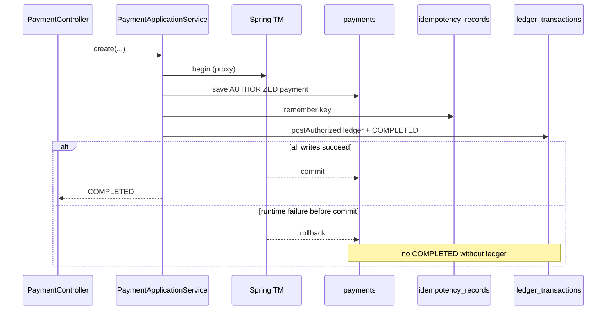

# L-3.4 — JPA and transaction management

**Module:** 3 — Spring Boot Engineering  
**Duration:** 30 minutes  
**BayPay case:** authorize, ledger post, and audit must commit together — or not at all

---

## Why this matters

A payment that is `COMPLETED` in `payments` without a row in `ledger_transactions` is not a style bug. It is a reconciliation incident. BayPay’s create path is one `@Transactional` method on `PaymentApplicationService` that saves the payment, remembers the idempotency key, and calls `PaymentPostingService.postAuthorized` in-process. Refunds do the same with a refund row, a ledger refund, and a possible transition to `REVERSED`.

If the transaction boundary is wrong, or if a failure is hidden from Spring, finance and the API disagree. BUILD-303 makes the mappings real. FIX-304 asks you to diagnose a refund path that reports success when the ledger does not.

---

## Learning objectives

- Read BayPay JPA mappings: `@Entity`, `@Embedded Money`, `@Enumerated(STRING)`, `@Version`.
- Use Spring Data repositories as ports (`PaymentRepository`, `RefundRepository`) without leaking `EntityManager` into controllers.
- Place `@Transactional` on the use case, not on the controller, and use `readOnly = true` for gets.
- Explain H2 `MODE=PostgreSQL` locally versus PostgreSQL `ddl-auto: validate` in prod.
- State Spring’s default rollback rules and why an exception must propagate to trigger them.

---

## Concept explanation

**Entities in `shared`.** `Payment`, `Refund`, `LedgerTransaction`, `Account`, `Customer`, `IdempotencyRecord`, and audit/event types are JPA entities. They are not anemic bags only: `Payment.transitionTo` goes through `PaymentStateMachine`. The no-arg constructor is `protected` for Hibernate. Factory methods (`Payment.received`, `LedgerTransaction.refund`) are how application code creates instances.

**Money** is `@Embedded` with `@AttributeOverrides` so amount and currency columns stay explicit (`precision = 19`, `scale = 2`). **Status** is `@Enumerated(EnumType.STRING)`, never ordinal — a reordered enum must not silently rewrite `COMPLETED` to another code. **`@Version`** on payment and refund supports optimistic locking if two refunds race.

**Repositories** extend `JpaRepository<Payment, UUID>`. Extra finders are derived: `findByIdempotencyKey`, `findByPaymentIdAndStatus`. No custom JPQL is required for Module 3.

**Transactions.** `PaymentApplicationService.create` is `@Transactional`. `get` is `@Transactional(readOnly = true)`. `PaymentPostingService.postAuthorized` is **not** independently annotated in the reference app; it joins the caller’s transaction. That is why a failure during ledger save rolls back the `AUTHORIZED` payment as well — unless something prevents the exception from leaving the boundary.

Spring rolls back on **unchecked** exceptions by default (`RuntimeException` and `Error`). Checked exceptions do not roll back unless you declare `rollbackFor`. Catching an exception inside the service and returning a success result **commits** whatever was flushed.

**Open session in view is off.** Serialization uses `PaymentResponse.from(payment)` on already-loaded state. No lazy surprises after the service returns.

---

## Visual explanation



Alt text: The create-payment use case starts one Spring transaction. Payment, idempotency, and ledger writes commit together. A runtime failure before commit rolls every table back so a completed payment cannot exist without a ledger row.

---

## Architecture

Persistence is shared because the modular monolith shares a database. `payment-service` is the only process. Tables are not “owned per Maven module” at runtime. That is acceptable while authorize and post must be atomic. When you extract `transaction-worker` later, you give up this single-transaction diagram and design a saga or an outbox. Do not extract first and discover atomicity afterward.

Layering:

| Layer | Persistence rule |
|---|---|
| Controller | No repositories, no `EntityManager` |
| Application service | `@Transactional` use cases; load aggregates; call domain methods |
| Domain entity | Invariants and transitions; no repository calls |
| Spring Data repo | Find and save only |

H2 is a **local stand-in** with `MODE=PostgreSQL;DATABASE_TO_LOWER=TRUE`. It is not “close enough forever.” `PostgresCompatibilityIT` starts `postgres:16-alpine` with `@ServiceConnection` when Docker is available and checks that Hibernate created `payments`. Prod uses `PostgreSQLDialect` and `ddl-auto: validate`.

---

## Production example (BayPay)

Happy path for a `$25` payment: insert `payments` (`RECEIVED` → `VALIDATING` → `AUTHORIZED` → `PROCESSING` → `COMPLETED`), insert `idempotency_records` for `PAYMENT_CREATE`, insert `ledger_transactions` type `PAYMENT`, insert `transaction_events` and `audit_events`. One commit.

Decline path: persist `DECLINED`, remember the key with status `422`, **do not** post a ledger payment. That is still one transaction.

Refund path: persist `Refund` `COMPLETED`, post `LedgerTransaction.refund`, optionally set payment `REVERSED` when remaining amount hits zero, remember `REFUND_CREATE`. If the ledger insert fails and that failure is visible to the proxy, **none** of those rows remain. If the failure is not visible, you get the incident FIX-304 is built around.

Avery Chen’s seeded rows (`Customer`, active and frozen `Account`) come from `DemoDataSeeder` on non-prod profiles. Tests use `create-drop` so each JVM is a clean schema.

---

## Code/configuration example

```java
@Entity
@Table(name = "payments")
public class Payment {

    @Id
    private UUID id;

    @Embedded
    @AttributeOverrides({
            @AttributeOverride(name = "amount", column = @Column(name = "amount", nullable = false, precision = 19, scale = 2)),
            @AttributeOverride(name = "currency", column = @Column(name = "currency", nullable = false, length = 3))
    })
    private Money money;

    @Enumerated(EnumType.STRING)
    @Column(nullable = false, length = 16)
    private PaymentStatus status;

    @Column(nullable = false, unique = true, length = 128)
    private String idempotencyKey;

    @Version
    private long version;

    protected Payment() {
    }
    // factory + transitionTo omitted
}
```

```java
@Service
public class PaymentApplicationService {

    @Transactional
    public CreateResult create(CreatePaymentRequest request, String rawIdempotencyKey) {
        // load customer/account, authorize, save, remember, post
        Payment posted = posting.postAuthorized(payment);
        return new CreateResult(posted, false);
    }

    @Transactional(readOnly = true)
    public Payment get(UUID paymentId) {
        return payments.findById(paymentId)
                .orElseThrow(() -> new ResourceNotFoundException(
                        ErrorCode.PAYMENT_NOT_FOUND, "Payment not found: " + paymentId));
    }
}
```

```yaml
# application-local.yml — excerpt
spring:
  datasource:
    url: jdbc:h2:mem:baypay;MODE=PostgreSQL;DATABASE_TO_LOWER=TRUE;DEFAULT_NULL_ORDERING=HIGH
  jpa:
    hibernate:
      ddl-auto: update
    open-in-view: false
```

---

## Trade-offs

- **One transaction for authorize + post versus async post.** One transaction gives GET-after-POST `COMPLETED` and a consistent ledger. Async post scales the worker independently and introduces “authorized but not posted.” BayPay chooses the first until extraction is earned.
- **H2 for all tests versus Testcontainers always.** H2 is fast and offline. It will not catch every PostgreSQL constraint. BayPay uses H2 by default and an optional container IT.
- **`STRING` enums versus a dedicated code table.** Strings are reviewable in SQL. A lookup table is stricter and heavier. Teaching app uses strings.
- **Optimistic `@Version` versus `SELECT FOR UPDATE` on remaining refundable amount.** Version helps lost updates on the aggregate. Remaining-amount checks still need a transactional read of completed refunds. Under extreme write contention you lock; you do not drop the check.

---

## Failure modes

- **Exception swallowed inside `@Transactional`.** Spring commits. API success, ledger missing. Diagnose this class of bug in FIX-304.
- **Self-invocation.** `@Transactional` on a private helper called as `this.saveAll()` does nothing. The controller-to-service call is the boundary that matters.
- **Lazy `LazyInitializationException` after the transaction.** Usually a JSON serializer touching a relation with OSIV off. BayPay avoids relations on `Payment` for this reason; ids are stored, not object graphs.
- **Ordinal enums.** A new `PaymentStatus` inserted in the middle remaps old rows. Never.
- **H2-only uniqueness.** A constraint that H2 accepts and PostgreSQL rejects appears first in `prod`. Run the compatibility IT before you call the mapping done.

---

## Security/reliability implications

`ddl-auto: update` in production can add or alter columns under live traffic. BayPay forbids it in `prod`. Reliability is “boot fails if the schema does not match,” not “Hibernate will fix it.”

Do not log full entity `toString()` dumps that include customer email from `Customer`. Audit rows record actor, action, and resource id.

Optimistic locking failures must surface as `409` or a retryable 5xx you have chosen — not as an unhandled `OptimisticLockingFailureException` with a SQL body. The catch-all will hide the body; you should still map the case if refunds collide.

Transactions are a reliability control against partial money movement. They are not a substitute for idempotency: a client retry after commit must hit the idempotency store, not “run the transaction again and hope uniqueness saves you.” Both are required.

---

## Interview perspective

**Engineer.** “`@Transactional` on the service method opens a transaction. Repositories save entities. I use H2 locally and Postgres in prod.”

**Senior.** “I put the boundary on the use case so payment + ledger + idempotency commit together. I use `readOnly` on gets, STRING enums, embedded money, and `open-in-view: false`. I know rollback happens on runtime exceptions that escape the proxy.”

**Staff.** “I can draw when we would break the single transaction (outbox, worker extraction) and what we lose. I treat H2 as a compatibility-mode stand-in and keep a Postgres IT. I look for swallowed exceptions when API and ledger disagree.”

**Principal.** “Atomicity is an architecture choice, not a default annotation. I will not split BayPay’s post path across JVMs until we have an explicit consistency model. I also will not let Hibernate own production schema evolution.”

---

## Key takeaways

- Entities in `shared` own transitions; repositories persist; services define transaction boundaries.
- Create-payment and create-refund are single transactions on purpose.
- Runtime exceptions must leave the `@Transactional` proxy to roll back.
- H2 `MODE=PostgreSQL` is local. Prod validates against PostgreSQL.
- `open-in-view` stays false. Controllers never hold an `EntityManager`.

---

## Knowledge check

1. `PaymentPostingService.postAuthorized` is not marked `@Transactional`. Why can it still write the ledger atomically with the payment?
2. Spring’s default rollback policy: which exceptions roll back, and what happens if you catch them and return a result object?
3. Why is `ddl-auto: update` acceptable in `local` and unacceptable as a prod copy-paste?

<details>
<summary>Answers</summary>

1. It runs in the same thread inside `PaymentApplicationService.create`, which is `@Transactional`. The posting service joins that transaction. Atomicity is the caller’s boundary, not a second annotation.

2. Unchecked exceptions (`RuntimeException`, `Error`) roll back if they propagate. If you catch them and return success, Spring commits the work already flushed (for example a refund row) and the ledger can be missing.

3. Local `update` keeps the teaching app moving without a migration tool. In prod, silent DDL under traffic is an availability and data-risk event. `validate` fails boot when mappings and PostgreSQL disagree.

</details>

---

## Related lab

Map and prove persistence in [BUILD-303](../../../../labs/BUILD-303/README.md). Then diagnose the refund/ledger disagreement in [FIX-304](../../../../labs/FIX-304/README.md). The student guide for FIX-304 does not state the root cause.

---

## Related PAKS deep dive

Optional: `docs/14-microservices/overview.md` on [paks.bayareala8s.com](https://paks.bayareala8s.com) is useful when you later decide to break this single-transaction design. This lesson stands alone.
