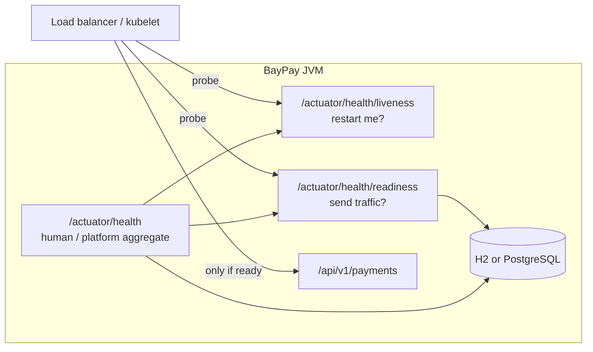

# L-3.5 — Actuator and production health

**Module:** 3 — Spring Boot Engineering  
**Duration:** 30 minutes  
**BayPay case:** the load balancer must not send Avery Chen’s payment to a JVM that cannot reach its database

---

## Why this matters

“The service is up” is not one question. **Liveness** asks whether the JVM should be killed and replaced. **Readiness** asks whether it should receive traffic. **Health** is the aggregate operators look at. If BayPay answers `200` on a single `/health` while PostgreSQL is down, Kubernetes (Module 10) will keep routing `POST /api/v1/payments` into connection errors. If you expose `heapdump` and `env` on the public port, health tooling becomes an attack surface.

The reference app already enables probes and publishes `health`, `info`, and `metrics`. BUILD-305 makes you prove liveness and readiness against this app — not a second actuator demo.

---

## Learning objectives

- Distinguish liveness, readiness, and the aggregated `/actuator/health` document.
- Read BayPay’s Actuator configuration: exposed endpoints, probes, `show-details`.
- Explain why `local` shows health details and `prod` does not.
- Choose what a payments process should expose, and what it must never expose on the application port.
- Verify probes with the same contract `HealthApiIT` uses.

---

## Concept explanation

Spring Boot Actuator adds operational HTTP endpoints under `/actuator`. BayPay’s base `application.yml` includes:

```yaml
management:
  endpoints:
    web:
      exposure:
        include: health,info,metrics
  endpoint:
    health:
      probes:
        enabled: true
      show-details: when_authorized
  health:
    livenessstate:
      enabled: true
    readinessstate:
      enabled: true
```

**Liveness** (`/actuator/health/liveness`) should fail only when the process is so sick that a restart helps: deadlocked startup, broken internal state. It should **not** fail because PostgreSQL is briefly unreachable — that restart storm makes the outage worse.

**Readiness** (`/actuator/health/readiness`) should fail when the process must not receive traffic: datasource down, schema validation failed, a required bean missing after a broken deploy. A pod can be alive and not ready.

**Aggregated health** (`/actuator/health`) combines contributors (db, liveness, readiness, disk). `HealthApiIT` asserts `$.status` is `UP` and that both probe URLs return `200` under the `test` profile.

**`show-details`.** Base: `when_authorized`. Local profile: `always` (you are on a laptop). Prod: `never` (do not advertise datasource URLs to whoever can hit the port). Later security modules add a real actuator user; do not pretend `when_authorized` is enough if every request is anonymous.

**Exposure.** `include: health,info,metrics` is an allow-list. The default Boot set is larger. `shutdown`, `heapdump`, `threaddump`, `env`, `configprops`, and `beans` stay off the web exposure until you have a locked-down management port.

---

## Visual explanation



Alt text: A load balancer probes liveness and readiness separately. Traffic reaches the payment API only when readiness is up. Readiness and aggregated health depend on the database. Liveness answers whether the JVM should be restarted.

---

## Architecture

Actuator is part of `payment-service` because that module is the process. Refunds do not get a second health port. In a modular monolith, **one process, one probe surface**.

Later modules reuse these URLs: container `HEALTHCHECK` (Module 9), Kubernetes probes (Module 10), metrics dashboards (Module 13). Mis-mapping liveness to the database recreates a restart storm. Do not invent a `baypay-ops` app; a later `management.server.port` is a network control, not a new service. Keep custom indicators cheap and quiet — probes should not log `ERROR` on every success.

---

## Production example (BayPay)

Local:

```bash
curl -sS http://localhost:8080/actuator/health
curl -sS http://localhost:8080/actuator/health/liveness
curl -sS http://localhost:8080/actuator/health/readiness
```

Under `local`, health details include the `db` component because `show-details: always`. Under `prod`, you should see status without a datasource URL. `HealthApiIT` uses the `test` profile and only asserts `UP` plus probe `200`s — it does not require details.

`info` can carry build coordinates later (Maven resource filtering). Empty info is acceptable in Module 3; lying info (`version=1.0.0` when the JAR is a snapshot) is worse than none.

If PostgreSQL is down in `prod`, readiness should go `DOWN` and the process should stop taking payments. Liveness may stay `UP` so the platform does not kill the pod every 10 seconds during a database failover. That distinction is the whole lesson.

---

## Code/configuration example

```yaml
# application.yml — Actuator excerpt
management:
  endpoints:
    web:
      exposure:
        include: health,info,metrics
  endpoint:
    health:
      probes:
        enabled: true
      show-details: when_authorized
  health:
    livenessstate:
      enabled: true
    readinessstate:
      enabled: true
```

```java
@SpringBootTest
@AutoConfigureMockMvc
@ActiveProfiles("test")
class HealthApiIT {

    @Autowired
    private MockMvc mvc;

    @Test
    void livenessAndReadinessAreUp() throws Exception {
        mvc.perform(get("/actuator/health"))
                .andExpect(status().isOk())
                .andExpect(jsonPath("$.status").value("UP"));
        mvc.perform(get("/actuator/health/liveness"))
                .andExpect(status().isOk());
        mvc.perform(get("/actuator/health/readiness"))
                .andExpect(status().isOk());
    }
}
```

A later custom `HealthIndicator` should run `select 1` (or the default `db` indicator), not `count(*)` on `ledger_transactions`. Do not put connection strings in `withDetail` in prod.

---

## Trade-offs

- **Probes on the application port versus a management port.** One port is simple for local and for early containers. A separate port lets you firewall `/actuator` from the public listener. BayPay starts with one port; Module 9–10 can split.
- **Readiness includes DB versus liveness includes DB.** Including DB on liveness causes restart loops. Including DB on readiness is usually correct for a monolith that cannot serve without SQL.
- **`show-details: always` versus `never`.** Always helps laptop labs. Never reduces information disclosure. `when_authorized` is the compromise once you have actuator security.
- **Custom indicators versus default `db` indicator.** Default is enough for Module 3. Custom indicators earn their keep when “DB up” is not “ledger writable.”

---

## Failure modes

- **One `/health` used as both kube probes.** Database blip → liveness fail → kill pod → thundering herd → longer outage.
- **Expensive health query.** `count(*)` on `ledger_transactions` every 2 seconds under load becomes self-DoS.
- **Exposed `heapdump`.** A heap dump of BayPay contains payment ids, keys, and emails. That is a data breach, not an ops convenience.
- **`local` profile in a prod container.** Health details on, H2 console on, in-memory data. You already saw this in L-3.3; Actuator makes it visible to scanners.
- **Probes disabled (`probes.enabled: false`).** `/liveness` and `/readiness` 404. The platform falls back to TCP checks that cannot see a stuck dispatcher.

---

## Security/reliability implications

Actuator is production surface. Treat exposure as an allow-list. Metrics are relatively safe; env and heapdump are not. `info` must not include secret-bearing Git URLs or internal hostnames you do not want in a browser.

Reliability: probes must be cheaper than the API they protect. They must distinguish “restart me” from “stop sending me payments.” They must not require `Idempotency-Key`. They should not create rows.

When you add authentication later, keep probes reachable to the kubelet (often a network allow from the node network, or an unauthenticated liveness on a management port). Do not lock yourself out of the only signal that prevents a crash loop.

---

## Interview perspective

**Engineer.** “Actuator serves `/actuator/health`. BayPay also has liveness and readiness. I curl them after boot.”

**Senior.** “Liveness is restart; readiness is traffic. I enable probes explicitly and expose only health, info, and metrics. Prod hides details. I would not put the database on the liveness probe.”

**Staff.** “I design probe policy with the platform team: startup probe for slow Hibernate validate, readiness for DataSource, liveness for deadlocks only. I budget probe QPS. I refuse heapdump on the public listener.”

**Principal.** “Health is part of the availability design, not a Boot checkbox. I will not let a monolith advertise ready while its only database is down, and I will not let probe misconfiguration page the payments team for a restart storm. Management port and allow-lists are security architecture.”

---

## Key takeaways

- Liveness ≠ readiness ≠ “the homepage loaded.”
- BayPay exposes `health`, `info`, `metrics` and enables group probes.
- Prod hides health details; local may show them.
- Never expose heapdump/env/shutdown on the payment port.
- `HealthApiIT` is the contract; curl is the smoke test.

---

## Knowledge check

1. PostgreSQL in `prod` is unreachable for 30 seconds. Which probe should go down, which should stay up, and what should the load balancer do?
2. Why is `include: health,info,metrics` safer than `include: '*'`?
3. A teammate wants `/actuator/health` to run `SELECT count(*) FROM payments`. What do you change?

<details>
<summary>Answers</summary>

1. Readiness (and likely aggregated health) down. Liveness up if the JVM is otherwise fine. The load balancer stops sending `POST /payments` to this instance; it does not restart it every few seconds.

2. `*` publishes heapdump, env, shutdown, and beans. Those leak secrets, memory, and a kill switch. An allow-list matches a payments threat model.

3. Replace it with a cheap connectivity check (`select 1`) or the default `db` indicator. Counts grow with table size and turn the probe into load.

</details>

---

## Related lab

Configure and prove the probes in [BUILD-305](../../../../labs/BUILD-305/README.md). Use the BayPay process, not a new Spring initializr app.

---

## Related PAKS deep dive

Optional: `docs/14-microservices/overview.md` on [paks.bayareala8s.com](https://paks.bayareala8s.com) discusses health at service boundaries. This lesson is about one JVM. You do not need PAKS to pass BUILD-305.
