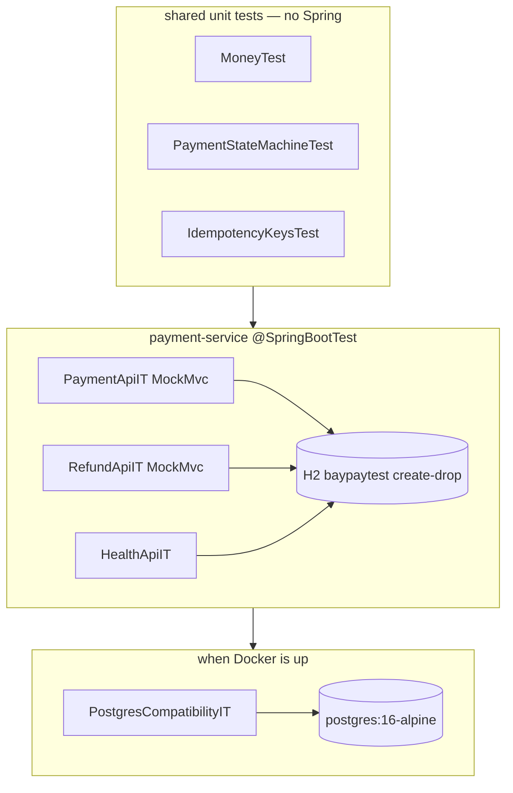

# L-3.6 — Testing

**Module:** 3 — Spring Boot Engineering  
**Duration:** 30 minutes  
**BayPay case:** if `PaymentApiIT` does not fail, you do not get to say the payment API works

---

## Why this matters

BayPay’s contracts are easy to demo with curl and easy to break with a “small” status-code change. Replay that returns `201`, a decline that returns `400`, a refund that exceeds remaining and still posts, a health path that 404s — none of those show up in a unit test that mocks `PaymentRepository` and asserts `save` was called. This lesson is the test pyramid as BayPay actually runs it: **domain unit tests in `shared`, full-stack MockMvc ITs on `payment-service`, optional Testcontainers PostgreSQL.**

You will use these tests as the acceptance bar for every Module 3 lab.

---

## Learning objectives

- Choose unit, slice, and `@SpringBootTest` tests for a payments change.
- Read and extend `PaymentApiIT`, `RefundApiIT`, and `HealthApiIT`.
- Test idempotency: create, replay, conflict, missing key, frozen decline.
- Explain why the default suite uses H2 and when `PostgresCompatibilityIT` must run.
- Keep tests deterministic with `DemoIds`, `test` profile, and no real network authorizer.

---

## Concept explanation

**Unit tests in `shared`** (already in the repo): `MoneyTest`, `PaymentStateMachineTest`, `IdempotencyKeysTest`. They start no Spring context. They are the right place for transition tables and key syntax.

**Application ITs** use:

```java
@SpringBootTest
@AutoConfigureMockMvc
@ActiveProfiles("test")
```

`MockMvc` hits the full DispatcherServlet: filters (`CorrelationIdFilter`), `@Valid`, advice, transactions, H2. That is why `createsCompletedPaymentAndReplaysIdempotentRetry` can assert `201`, then `200` with the same `paymentId`, then `GET` by id.

**What the payment IT locks:**

| Test | Contract |
|---|---|
| `createsCompletedPaymentAndReplaysIdempotentRetry` | `201` + `COMPLETED`, replay `200`, GET matches |
| `rejectsReusedKeyWithDifferentBody` | `409` `IDEMPOTENCY_CONFLICT` |
| `declinesFrozenAccount` | `422` `DECLINED` |
| `requiresIdempotencyKey` | `400` `IDEMPOTENCY_KEY_REQUIRED` |
| `openApiContractIsPublished` | `/v3/api-docs` lists payments and refunds |

**Refund IT:** partial refund `201`, replay `200`, over-refund `422` `REFUND_EXCEEDS_REMAINING`, full refund flips payment to `REVERSED`.

**Health IT:** `/actuator/health` is `UP`; liveness and readiness are `200`.

**Test profile.** `application-test.yml` uses a separate H2 database (`baypaytest`), `create-drop`, no H2 console. Tests do not share the `local` in-memory database you browse by hand.

**Testcontainers.** `PostgresCompatibilityIT` is `@EnabledIf("dockerAvailable")`. It uses `@ServiceConnection` and `postgres:16-alpine`. If Docker is down, the default suite still passes. That is intentional: laptops without Docker can complete BUILD-301. It is not permission to skip Postgres before you claim prod-ready mappings.

---

## Visual explanation



Alt text: Domain unit tests run without Spring. Payment, refund, and health ITs boot the application against H2. An optional Testcontainers test checks Hibernate mappings on PostgreSQL 16 when Docker is available.

---

## Architecture

The runnable module is `payment-service`. ITs live there even when they exercise `RefundController`, because that is the composition root. Do not start a second Spring Boot test app for refunds.

**Slice tests** (`@WebMvcTest`, `@DataJpaTest`) are useful when you want a controller in isolation or a repository against H2. BayPay’s Module 3 bar is the full IT: idempotency plus JPA plus advice is the behavior that loses money when it drifts. Add slices when a full boot becomes too slow — measure first.

**Fakes at the edges.** `PaymentAuthorizer.DefaultPaymentAuthorizer` is deterministic (frozen account, currency mismatch, ceiling). You do not need WireMock for Module 3. When an external card network appears later, stub that authorizer bean; do not stub `PaymentRepository` in the API IT or you will stop testing the transaction.

**Data.** Use `DemoIds.CUSTOMER_AVERY`, `ACCOUNT_ACTIVE`, `ACCOUNT_FROZEN`. Unique `Idempotency-Key` values per test method. Shared keys across tests are flake.

---

## Production example (BayPay)

Read `PaymentApiIT.createsCompletedPaymentAndReplaysIdempotentRetry` until you can rewrite it from memory: `POST` → `201` + `COMPLETED` + echoed `X-Correlation-Id`; same key and body → `200` and the same `paymentId`; then `GET` by id. The GET is not optional — “create returned JSON” is not “the resource is loadable.”

Run from `reference-apps/baypay`:

```bash
export JAVA_HOME="${JAVA_HOME:-/opt/homebrew/opt/openjdk@21}"
./mvnw -pl payment-service -am test
```

---

## Code/configuration example

```yaml
# application-test.yml
spring:
  datasource:
    url: jdbc:h2:mem:baypaytest;MODE=PostgreSQL;DATABASE_TO_LOWER=TRUE;DEFAULT_NULL_ORDERING=HIGH
    driver-class-name: org.h2.Driver
  jpa:
    hibernate:
      ddl-auto: create-drop
    open-in-view: false
  h2:
    console:
      enabled: false
```

```java
@SpringBootTest
@ActiveProfiles("test")
@EnabledIf("dockerAvailable")
class PostgresCompatibilityIT {

    @ServiceConnection
    static final PostgreSQLContainer<?> POSTGRES = dockerAvailable()
            ? new PostgreSQLContainer<>("postgres:16-alpine")
            : null;

    @Autowired
    private JdbcTemplate jdbc;

    @Test
    void hibernateCreatedPaymentTable() {
        Integer tables = jdbc.queryForObject(
                "select count(*) from information_schema.tables where table_name = 'payments'",
                Integer.class);
        assertEquals(1, tables);
    }
}
```

A useful extra assertion for BUILD-303: after a successful payment, `SELECT count(*) FROM ledger_transactions` is 1, and after a replay it is still 1. API status codes alone can miss a double post if someone “fixes” replay by returning 200 without consulting the store.

---

## Trade-offs

- **Full `@SpringBootTest` versus `@WebMvcTest`.** Full tests catch advice, filters, and JPA. Prefer them while the API surface is small.
- **H2 always versus Testcontainers always.** Containers are more honest and more fragile. BayPay gates Postgres.
- **JSON paths versus raw bodies.** `jsonPath("$.code")` survives field order.
- **Transactional test rollback versus `create-drop`.** BayPay ITs commit against throwaway H2 so flush bugs show up.

---

## Failure modes

- **Testing the mock.** `@MockBean PaymentApplicationService` plus a controller test that returns 201 proves annotations, not idempotency.
- **Fixed idempotency keys across the class.** Second method fails with `409` or unexpected replay. Name keys after the test.
- **Relying on wall-clock order.** Do not sleep to “wait for async” — posting is in-process. If you later extract a worker, use Awaitility against a query, not `Thread.sleep`.
- **CI green without Docker, prod red on reserved words.** Someone named a column `user` or `transaction`. Run `PostgresCompatibilityIT` in CI when Docker is available.
- **Flaky seed.** Tests that assume Avery Chen exists must run with `DemoDataSeeder` (`!prod`, includes `test`). A `@Profile("local")` seeder would break ITs.

---

## Security/reliability implications

Tests that print full `MvcResult` bodies into CI logs can leak synthetic PII patterns that later become real. Prefer assertions on `code` and ids.

A test suite that only hits happy-path `201` will not protect decline, conflict, or missing-key paths — the ones attackers and broken clients hit. Reliability is the **negative** cases in `PaymentApiIT`.

Do not disable `HealthApiIT` because “actuators are ops.” Probe regressions ship as silent 404s in Kubernetes.

Never `@Disabled` a failing idempotency test to merge. That is how double-charge defects ship.

---

## Interview perspective

**Engineer.** “I use `@SpringBootTest` and MockMvc. I assert 201 then a replay 200. I run `./mvnw test`.”

**Senior.** “I lock the status matrix: 201, 200, 409, 422, 400, 404. I use DemoIds and unique keys. I keep domain tests in `shared` without Spring. I add a ledger-count assertion so replay cannot hide a second post.”

**Staff.** “I design the test pyramid so API ITs own the money contract and units own the state machine. I gate Testcontainers, and I make CI run it when Docker exists. I refuse tests that mock the repository and claim the API is proven.”

**Principal.** “Test strategy is part of the consistency model. If we extract the worker, I change the IT first: the assertion becomes ‘authorized plus outbox’ not ‘COMPLETED in one call.’ I will not accept a coverage percentage in place of the idempotency matrix.”

---

## Key takeaways

- `shared` units for invariants; `payment-service` ITs for HTTP + JPA + idempotency.
- The payment matrix is 201 / 200 / 409 / 422 / 400 — all required.
- `test` profile is a separate H2 `create-drop` database.
- Testcontainers PostgreSQL is optional locally and mandatory in spirit before prod mappings.
- Labs in this module are done when the ITs say so, not when curl looks fine.

---

## Knowledge check

1. Which existing test would fail if replay of an identical payment returned `201` instead of `200`?
2. Why does `PostgresCompatibilityIT` use `@EnabledIf("dockerAvailable")` instead of failing the default suite?
3. A developer writes `@WebMvcTest(PaymentController.class)` and mocks `PaymentApplicationService` to prove decline is `422`. What did they not prove?

<details>
<summary>Answers</summary>

1. `PaymentApiIT.createsCompletedPaymentAndReplaysIdempotentRetry` expects `status().isOk()` on the second POST.

2. So students and CI agents without Docker can still validate the API against H2. The test documents a Postgres check; it does not make Docker a Module 3 prerequisite.

3. They did not prove the authorizer, persistence of `DECLINED`, idempotency remember for that decline, or the advice path from a real service exception. Only the controller’s `if (DECLINED)` branch.

</details>

---

## Related lab

Every Module 3 lab: [BUILD-301](../../../../labs/BUILD-301/README.md), [BUILD-302](../../../../labs/BUILD-302/README.md), [BUILD-303](../../../../labs/BUILD-303/README.md), [FIX-304](../../../../labs/FIX-304/README.md), [BUILD-305](../../../../labs/BUILD-305/README.md). Run the matching ITs as your validation section.

---

## Related PAKS deep dive

Optional: `docs/15-api-and-integration-architecture/overview.md` on [paks.bayareala8s.com](https://paks.bayareala8s.com) discusses contract testing between systems. This lesson is in-process ITs for one modular monolith and does not require PAKS.
