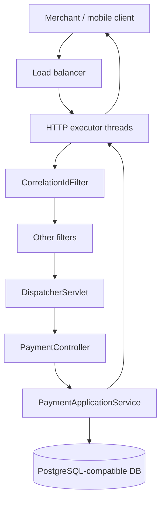

# L-4.1 — Servlet and Jakarta EE model

**Module:** 04 — Jakarta EE and Enterprise Runtime Concepts  
**Duration:** 30 minutes  
**Diagram:** AEJE-D-014 (concept)  
**Case study:** BayPay Financial Services (fictional)

---

## Why this matters

Every `POST /api/v1/payments` BayPay accepts is a servlet request. Spring MVC’s `DispatcherServlet` is a `jakarta.servlet.http.HttpServlet`. The correlation-id filter you already ran locally is a `jakarta.servlet.Filter`. If you only know `@RestController`, a WebSphere thread dump, a Liberty `server.xml`, or a “stuck request” incident will look like another product’s problem. It is the same model: a container thread, a filter chain, a servlet, a request, a response.

---

## Learning objectives

- Name the servlet container’s job versus Spring’s job on a BayPay payment request.
- Trace one HTTP call through filter → `DispatcherServlet` → controller → service.
- Contrast Jakarta Servlet / JAX-RS with Spring MVC without treating either as obsolete.
- Explain why thread-per-request plus a blocking JDBC call is the default BayPay failure shape.

---

## Concept explanation

Jakarta EE is a set of **specifications**. An **application server** or **servlet container** implements some or all of them. Spring Framework *uses* those contracts. Spring Boot *embeds* a container (Tomcat, Jetty, or Undertow) so you do not install a separate server for local BayPay.

Core HTTP types:

| Contract | Role on a payment request |
|---|---|
| `Servlet` | Receives `HttpServletRequest` / `HttpServletResponse` |
| `Filter` | Wraps the chain (auth, correlation, logging) |
| `ServletContext` | One per web application; shared attributes, not a database |
| `HttpSession` | Server-side conversation; BayPay APIs should stay nearly stateless |
| `AsyncContext` | Releases the container thread while waiting; BayPay does not use this yet |

Spring MVC registers `DispatcherServlet` as *the* servlet. Controllers are not servlets. They are handler methods the dispatcher finds by mapping. JAX-RS (`@Path`, `@POST`) is the Jakarta REST spec. Same HTTP, different programming model. A Liberty or traditional WAS app might expose payments with JAX-RS; BayPay’s reference app uses `@RestController`. The runtime underneath both is still a servlet container (or a reactive alternative you should not pretend BayPay has adopted).

Jakarta EE also names CDI, JPA, JTA, JMS, and JNDI. Those arrive in L-4.2. This lesson stays on the HTTP edge because that is where capacity, timeouts, and correlation are decided.

The **thread-per-request** model: the container borrows a thread from its HTTP pool, runs the filter chain and servlet, and returns the thread when the response is committed. If `PaymentApplicationService.create` blocks on JDBC, that HTTP thread is occupied. Exhaust the HTTP pool *or* the JDBC pool and clients see timeouts even though the JVM is “up.”

---

## Visual explanation



Alt text: A BayPay payment request crosses a load balancer into an HTTP thread pool, then a Jakarta filter chain, Spring’s DispatcherServlet, PaymentController, PaymentApplicationService, and the database, then returns on the same thread.

---

## Architecture

BayPay’s payment-service is a **modular monolith** with one HTTP entrypoint. The servlet container is the process’s front door. Spring Boot auto-configures the embedded container and registers filters as beans. You do not write `web.xml` for the reference app. A legacy BayPay EAR on an application server *did* declare servlets, filters, and resource-refs in descriptors and then bound those refs in the server.

Two layers people collapse:

1. **Container:** threads, sockets, TLS termination (sometimes), session store, deployment of a WAR/EAR.
2. **Framework:** routing, JSON, validation, dependency injection, transaction demarcation.

`CorrelationIdFilter` sits in layer 1’s programming model (Jakarta Servlet) and writes into layer 2’s logging (SLF4J MDC). That is the whole point of this module: Spring did not replace Jakarta; it sits on it.

---

## Production example

On-call gets “payments are slow.” Actuator says the process is up. The useful question is *which pool*. If HTTP threads are all in `socketRead` on PostgreSQL, you have a database or connection-pool problem (L-4.3, INCIDENT-402). If HTTP threads are idle and the load balancer still 502s, you may have deployed a context root the balancer does not know, or the listener is bound to the wrong port. Servlet literacy keeps you from restarting the JVM for a mapping mistake.

BayPay’s demo customer Avery Chen (`11111111-1111-1111-1111-111111111111`) retries `POST /api/v1/payments` when the app hangs. Idempotency protects the ledger *after* the request is processed. It does not protect the HTTP pool from a client that opens ten connections and waits. Filters that do I/O (remote auth) make this worse: they hold the container thread before the controller runs.

---

## Code/configuration example

BayPay already ships a Jakarta filter. This is the runtime, not a Spring annotation trick:

```java
@Component
@Order(Ordered.HIGHEST_PRECEDENCE)
public class CorrelationIdFilter extends OncePerRequestFilter {
    public static final String HEADER = "X-Correlation-Id";

    @Override
    protected void doFilterInternal(
            HttpServletRequest request, HttpServletResponse response, FilterChain chain)
            throws ServletException, IOException {
        String correlationId = request.getHeader(HEADER);
        if (correlationId == null || correlationId.isBlank()) {
            correlationId = UUID.randomUUID().toString();
        }
        MDC.put("correlationId", correlationId);
        response.setHeader(HEADER, correlationId);
        try {
            chain.doFilter(request, response);
        } finally {
            MDC.remove("correlationId");
        }
    }
}
```

The same payment create, expressed as JAX-RS instead of Spring MVC, would look like this on a Liberty or historical WAS module. It is a mapping, not a migration mandate:

```java
@Path("/api/v1/payments")
@Consumes(MediaType.APPLICATION_JSON)
@Produces(MediaType.APPLICATION_JSON)
public class PaymentResource {
    @POST
    public Response create(CreatePaymentRequest body, @HeaderParam("Idempotency-Key") String key) {
        Payment payment = payments.create(body, key);
        return Response.created(URI.create("/api/v1/payments/" + payment.id())).entity(payment).build();
    }
}
```

`OncePerRequestFilter` exists because the servlet spec allows a filter to run more than once when the request is dispatched internally. Spring’s helper is still a `Filter`.

---

## Trade-offs

| Choice | Gain | Cost |
|---|---|---|
| Embedded Tomcat (BayPay today) | One artifact, local `./mvnw spring-boot:run` | You operate the container inside the JVM |
| External servlet container / Liberty | Server-managed listeners, features in `server.xml` | Two artifacts; ops owns the server |
| JAX-RS | Spec-portable resources | BayPay’s OpenAPI and tests are Spring MVC |
| Async servlet | Free HTTP threads during I/O | Harder transaction and security context |

Do not “upgrade” BayPay to JAX-RS for purity. Do learn to read JAX-RS so Module 5’s ears are not foreign.

---

## Failure modes

- Filter throws before `chain.doFilter`: controller never runs; client sees 500; payment is not created. Good. Idempotency key is unused.
- Filter swallows the exception and commits 200: client believes success; ledger never posted. Catastrophic.
- Blocking work in a filter (LDAP, remote risk score) holds an HTTP thread for every request, including health checks if the filter is mapped to `/*`.
- `HttpServletRequest` accessed after the container recycles it (async mistake): wrong correlation id, or a `IllegalStateException` in logs that looks random.

---

## Security/reliability implications

Filters are a trust boundary. Authentication and tenant identity belong here or in a gateway, not in random service methods. Correlation ids must be treated as **untrusted labels**, not authorization. A client can send `X-Correlation-Id: admin`; BayPay copies it into logs and the response. That is correct for tracing and dangerous if someone later authorizes on it.

The servlet thread is a reliability budget. A payment that holds the thread for 30 seconds is a capacity attack even when the JSON is valid. Timeouts belong on HTTP, JDBC, and outbound calls independently.

---

## Interview perspective

**Engineer.** Spring Boot includes Tomcat. `@RestController` methods handle HTTP. A `Filter` wraps every request. BayPay’s correlation filter is an example.

**Senior.** `DispatcherServlet` *is* a servlet. I can draw filter → dispatcher → handler → `@Transactional` service. I know thread-per-request means a blocked JDBC call occupies an HTTP thread. I would not put remote I/O in a catch-all filter.

**Staff.** I compare Spring MVC and JAX-RS as two facades over the same container. I size HTTP and JDBC pools as a pair. I ask whether health endpoints skip the heavy filter chain so a stuck payment path does not fail liveness.

**Principal.** I treat the servlet model as the contract we are modernizing *from* and still running *under*. I will not propose traditional WAS as greenfield. I will require that any new BayPay edge (gateway, Liberty, Boot) preserve correlation, idempotency, and a documented thread/pool story.

---

## Key takeaways

- Jakarta Servlet is the HTTP runtime under Spring MVC.
- Filters run on the container thread; they can starve payments if they block.
- JAX-RS is the spec equivalent of `@RestController`, not a replacement religion.
- Spring Boot embeds a container; application servers externalize it. Same contracts.
- Traditional WAS remains a BayPay *source* estate. It is not the greenfield recommendation.

---

## Knowledge check

1. Is `PaymentController` a servlet?
2. Why must `CorrelationIdFilter` clear MDC in `finally`?
3. A load test hangs on `POST /payments` while `/actuator/health` is fast. Which pool do you inspect first, and why might that be wrong?

<details>
<summary>Spoiler — answers</summary>

1. No. It is a Spring handler. `DispatcherServlet` is the servlet.
2. Container threads are reused. A leftover MDC value attributes the next merchant’s payment to Avery Chen’s correlation id.
3. HTTP threads first if health bypasses the payment filters/datasource. It can still be JDBC pool exhaustion if health does not touch the DataSource. Confirm both. See L-4.3.

</details>

---

## Related lab

[ARCHITECT-401 — Map Spring to Jakarta concepts](../../../../labs/ARCHITECT-401/README.md). Map `RestController` ↔ JAX-RS and walk `CorrelationIdFilter` as evidence that BayPay already is a Jakarta application.

---

## Related PAKS

Optional. This lesson does not require PAKS. If you later read `docs/09-transactions/overview.md`, come back to the servlet thread: a transaction that outlives the HTTP request is a different design than BayPay’s current in-request posting.
