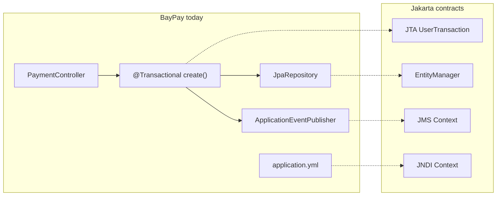

# L-4.2 — JPA, JTA, JMS and JNDI

**Module:** 04 — Jakarta EE and Enterprise Runtime Concepts  
**Duration:** 30 minutes  
**Case study:** BayPay Financial Services (fictional)

---

## Why this matters

`PaymentRepository extends JpaRepository` is not “how databases work.” It is a Spring Data facade over JPA’s `EntityManager`. `@Transactional` on `PaymentApplicationService.create` is Spring’s facade over JTA (or a local resource transaction that *looks* like JTA). Historical BayPay ears looked up the same DataSource and JMS connection factory by JNDI name. If you cannot map these four specs, you cannot explain a completed payment that never wrote a ledger row — and you will walk into Module 5’s WebSphere cell unable to read a resource reference.

---

## Learning objectives

- Map `JpaRepository` → `EntityManager`, `@Transactional` → JTA, `application.yml` → JNDI, in-process events → JMS.
- State what must join **one** transaction for BayPay’s `POST /payments` to be honest.
- Explain JNDI as a **lookup** mechanism, not a greenfield configuration style.
- Recognize a transaction-boundary failure from symptoms (status vs ledger) without naming a root cause yet.

---

## Concept explanation

**JPA (Jakarta Persistence).** An `EntityManager` loads and flushes entities (`Payment`, `LedgerTransaction`) against a persistence unit. Spring Data generates repository methods that call that manager. `@Entity` on `Payment` is already a Jakarta annotation in the reference app. The persistence unit needs a DataSource, a dialect, and a transaction coordinator.

**JTA (Jakarta Transactions).** JTA’s `UserTransaction` and `TransactionSynchronizationRegistry` define *demarcation*: begin, commit, rollback, and synchronization after completion. Spring’s `PlatformTransactionManager` implements the same idea. `@Transactional` on `create()` starts a transaction before validation and commits after `PaymentPostingService.postAuthorized` returns — **if** posting participates in that transaction.

BayPay’s happy path writes, in one unit of work:

1. Payment row (`AUTHORIZED` then `COMPLETED`)
2. Idempotency record
3. Audit events
4. Ledger row and transaction event

If the ledger write runs in a **different** transaction (or after commit, or on a manager that never joins), you can persist `COMPLETED` and still have no `ledger_transactions` row. That is the class of failure INCIDENT-403 investigates.

**JMS (Jakarta Messaging).** Queues and topics with guaranteed delivery. BayPay today publishes `PaymentCompletedEvent` through Spring’s in-process `ApplicationEventPublisher`. That is **not** JMS. It is a teaching stand-in. A later extraction to a worker will need a broker (JMS, Kafka, or SQS) and an outbox. Do not pretend the in-process event survives a crash after commit.

**JNDI (Java Naming and Directory Interface).** A tree of names: `jdbc/baypay`, `jms/paymentEvents`, `ejb/PaymentService`. Traditional application servers bind pools and factories there. Spring Boot prefers `application.yml` and `@Value` / Binder. The *concept* — “the app looks up a resource the operator bound” — remains useful in Kubernetes as a Secret or ConfigMap. JNDI itself is historical plumbing for BayPay’s WAS estate, not a greenfield recommendation.

---

## Visual explanation



Alt text: Spring types on the left map to Jakarta JTA, EntityManager, JMS, and JNDI on the right. Dashed lines are conceptual mappings, not runtime calls in the reference app.

---

## Architecture

`PaymentApplicationService.create` is the composition root for a write. It is `@Transactional`. `PaymentPostingService.postAuthorized` has **no** transaction annotation in the reference app, so it joins the caller’s transaction. That is deliberate: payment status and ledger row commit together.

A common “cleanup” during modernization is to add `@Transactional(propagation = REQUIRES_NEW)` on posting “so the ledger always commits.” That creates two units of work. The payment can commit `COMPLETED` while the ledger rolls back — or the reverse. JTA did not fail. The **boundary** did.

JNDI on the legacy ear:

```text
cell/nodes/node1/servers/pay1
  jdbc/baypay          → XA DataSource
  jms/paymentEvents    → Queue connection factory
  jms/paymentQueue     → Queue
```

Spring Boot prod profile:

```text
BAYPAY_DB_URL / spring.datasource.*
```

Same role: operator-supplied connection. Different binding mechanism. Module 5 shows how ND operators create those JNDI names. Do not recreate that cell for a new service.

---

## Production example

Finance reconciles Tuesday’s book. Avery Chen has a payment `7c2a…` in `COMPLETED`. `ledger_transactions` has no row for that `payment_id`. The API told the merchant success. Notifications may have fired from the in-process event. The ledger is the system of record for money. A status-only success is a **customer-visible lie**.

Possible stories (you will prove one in the incident, not here): posting ran after the transaction closed; posting used `REQUIRES_NEW` and rolled back independently; someone called `entityManager.persist` on a manager that is not JTA-enlisted; an after-commit listener wrote the ledger and the process died.

JMS-shaped version of the same bug: payment commits, `send` happens outside the transaction, broker is down, event is lost, worker never posts. The transactional outbox (PAKS) exists because JTA-across-DB-and-broker is painful.

---

## Code/configuration example

Reference app — one transaction, Spring facade:

```java
@Service
public class PaymentApplicationService {
    @Transactional
    public CreateResult create(CreatePaymentRequest request, String rawIdempotencyKey) {
        // ... validate, authorize, payments.save(payment)
        Payment posted = posting.postAuthorized(payment);
        return new CreateResult(posted, false);
    }
}
```

Jakarta-shaped equivalent an ear might have used:

```java
@Stateless
public class PaymentBean {
    @PersistenceContext
    EntityManager em;

    @Resource
    UserTransaction utx; // only if you demarcate bean-managed

    @TransactionAttribute(TransactionAttributeType.REQUIRED)
    public Payment create(CreatePaymentRequest request, String key) {
        Payment payment = Payment.received(/* ... */);
        em.persist(payment);
        em.persist(LedgerTransaction.payment(/* ... */));
        return payment;
    }
}
```

JNDI lookup you may still see in leftover adapters — literacy, not a template for new BayPay modules:

```java
DataSource ds = (DataSource) new InitialContext().lookup("java:comp/env/jdbc/baypay");
```

Spring Boot’s replacement is configuration, not a directory tree:

```yaml
spring:
  datasource:
    url: ${BAYPAY_DB_URL}
    username: ${BAYPAY_DB_USER}
    password: ${BAYPAY_DB_PASSWORD}
```

---

## Trade-offs

| Approach | When it fits BayPay | When it does not |
|---|---|---|
| Local JDBC transaction (Spring `DataSourceTransactionManager`) | Single database, current monolith | Multiple resource managers |
| JTA / XA | Rare; two DBs or DB + JMS in one commit | Everyday payments — XA is operationally expensive |
| `REQUIRED` (join caller) | Ledger posting in-process | Isolated side effects you *want* to commit independently (audit you can replay) |
| `REQUIRES_NEW` | Short, independent work | Ledger vs payment status |
| In-process events | Same JVM, best-effort notify | Crash-safe extraction of the worker |
| JMS + outbox | Future worker extraction | Adding a broker “because enterprise” |

---

## Failure modes

- Self-invocation: `this.create()` bypasses the Spring proxy; no transaction starts.
- `open-in-view` left true: `EntityManager` stays open for the HTTP view; connections linger (feeds INCIDENT-402).
- `REQUIRES_NEW` on posting: split commit; status and ledger diverge.
- Checked exception not marked `rollbackFor`: Spring commits after a business failure.
- JNDI name typo on WAS: app starts, first payment fails with `NameNotFoundException`.
- Using two `EntityManager` factories without JTA: two local transactions, same divergence.

---

## Security/reliability implications

Transaction boundaries *are* money boundaries. A payment marked `COMPLETED` without a ledger row is an accounting incident, not a “retry later” UX bug. Idempotency keys must be stored in the **same** transaction as the payment insert or a retry can create a second payment after a partial commit.

JNDI and YAML both carry credentials. The lookup name is not a secret; the bound password is. Do not log `InitialContext` dumps in prod. Do not put datasource passwords in a WAR.

JMS without TLS or without authorization on `jms/paymentEvents` lets any ear on the cell publish fake completions. Spring in-process events have a smaller blast radius and a weaker delivery guarantee. Pick the risk you are actually taking.

---

## Interview perspective

**Engineer.** `@Transactional` starts a transaction. JPA saves entities. JNDI is how old servers found the DataSource.

**Senior.** I can rewrite a repository call as `entityManager.find/persist`. I know `REQUIRED` vs `REQUIRES_NEW`. I would put payment + ledger + idempotency in one transaction in the monolith.

**Staff.** I treat Spring and JTA as the same demarcation problem. I look for proxy failures, listener phase (`afterCommit`), and dual `EntityManager`s. I will not enable XA to hide a bad boundary. I can explain why BayPay’s in-process event is not JMS.

**Principal.** I set a house rule: status transitions that mean money must be atomic with the ledger, or we use an explicit outbox and a reconciliation job — never a silent split. JNDI is documented as legacy binding. Greenfield services get env-based config on Boot or Liberty, not a new WAS cell.

---

## Key takeaways

- Spring Data and `@Transactional` are facades over JPA and JTA-like demarcation.
- BayPay’s correctness depends on payment, idempotency, and ledger joining one unit of work.
- JMS is the spec for the worker you may extract; in-process events are not crash-safe.
- JNDI is historical lookup. Learn it for Module 5. Do not design new BayPay services around it.
- A `COMPLETED` payment with no ledger row is a boundary failure until proven otherwise.

---

## Knowledge check

1. Does `PaymentPostingService` start its own transaction in the reference app?
2. Name one Spring mechanism that can commit a payment and skip the ledger without the database being down.
3. Why is `new InitialContext().lookup("jdbc/baypay")` the wrong default for a new BayPay module?

<details>
<summary>Spoiler — answers</summary>

1. No. It has no `@Transactional`; it joins `create()`.
2. `REQUIRES_NEW` on posting, work after commit, a second `EntityManager` that does not join, or a self-invocation that never started a transaction and then “saved” through a different path. INCIDENT-403 asks you to prove which.
3. It couples the module to an application-server directory. Prefer env / `application.yml` or Liberty `server.xml` data sources you can bind without a traditional WAS cell.

</details>

---

## Related lab

[INCIDENT-403 — Transaction boundary failure](../../../../labs/INCIDENT-403/README.md). Also complete [ARCHITECT-401](../../../../labs/ARCHITECT-401/README.md) mappings for `@Transactional` ↔ JTA, `JpaRepository` ↔ `EntityManager`, and `application.yml` ↔ JNDI.

---

## Related PAKS

Optional: `docs/09-transactions/overview.md`, plus ACID/isolation, 2PC, sagas, and transactional outbox in the same PAKS domain. Read them if you want the distributed sequel to this lesson. The lesson is complete without them.
