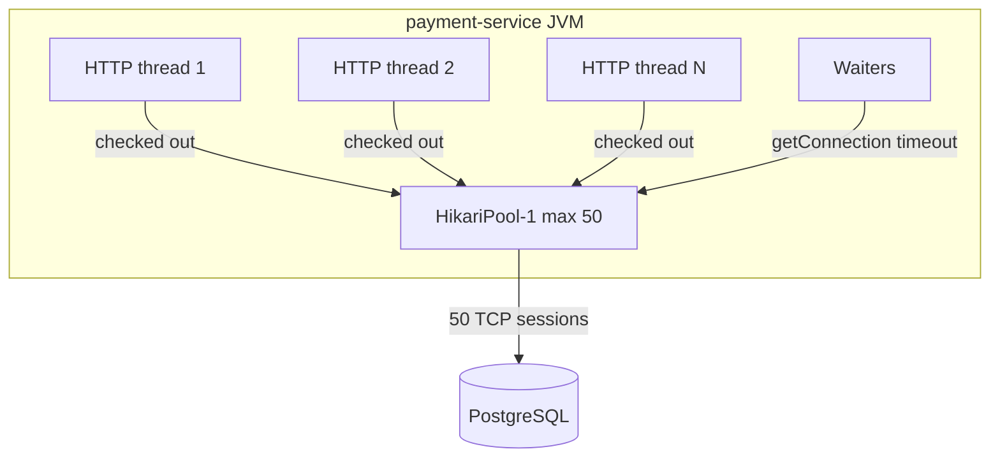

# L-4.3 — DataSources and connection pools

**Module:** 04 — Jakarta EE and Enterprise Runtime Concepts  
**Duration:** 30 minutes  
**Diagram:** AEJE-D-016 (incident, used again in INCIDENT-402)  
**Case study:** BayPay Financial Services (fictional)

---

## Why this matters

BayPay does not open a TCP connection to PostgreSQL per SQL statement. It borrows a `java.sql.Connection` from a **pool** behind `javax.sql.DataSource`. When the pool is empty, `POST /api/v1/payments` waits, then times out. The JVM can be healthy, CPU low, heap fine — and merchants still fail. INCIDENT-402 is this failure class. You must read pool gauges before you bounce “the database.”

---

## Learning objectives

- Explain `DataSource` as the app-facing contract and the pool as the implementation.
- Read in-use, idle, pending, and timeout signals for a pool of size 50.
- Distinguish “the database is slow” from “connections are not returning.”
- Contrast HikariCP (BayPay Boot) with a JNDI-bound server DataSource (legacy WAS) without recommending WAS for new work.

---

## Concept explanation

`DataSource.getConnection()` is the only API most application code should call. HikariCP, Tomcat JDBC, WebSphere’s pool, and Liberty’s `jdbc-4.3` feature all implement that interface. The pool keeps a set of TCP sessions to the database, authenticates them once, and hands them out.

Important numbers:

| Gauge | Meaning |
|---|---|
| `max` | Hard cap. BayPay teaching incidents use **50**. |
| `active` / in-use | Checked out right now |
| `idle` | Sitting in the pool |
| `pending` / waiters | Threads blocked in `getConnection()` |
| `timeout` | How long a waiter will block before the request fails |
| `leakDetectionThreshold` | How long a checkout may last before the pool *logs a candidate* |

A pool at **50/50 with waiters** is exhausted. That is a symptom. Causes include: a slow query holding connections, a sudden traffic spike, pool sized below concurrency, or connections **never returned** (missing `close()`, unclosed `EntityManager`, forgotten `ResultSet` in a utility). A leak-detection line in logs is a **candidate**, not a verdict. Prove it with checkout age, traces, and whether a bounce immediately frees capacity.

Spring Boot auto-configures HikariCP when you set `spring.datasource.*`. Traditional BayPay ears looked up `jdbc/baypay`. The operator sized the WAS pool in the admin console. The math does not change with the vendor.

`open-in-view: false` in BayPay’s YAML is a pool-safety setting: the `EntityManager` (and its connection) must not stay open until the JSON is rendered.

---

## Visual explanation



Alt text: HTTP threads check connections out of a pool of 50. Additional threads wait. The database sees at most 50 sessions from this JVM.

---

## Architecture

Each payment-service instance has **its own** pool. Three replicas at max 50 can open 150 database sessions. The database `max_connections` must outrun `replicas × pool max` plus admin and reporting. Sizing is a platform conversation, not a single YAML key.

BayPay local profile uses H2 in-memory; the pool still exists, but you will not see production waiters there. Prod profile points at PostgreSQL. Legacy WAS cells bound one DataSource per server and sometimes used XA for JMS+DB. New BayPay services should keep a single non-XA DataSource unless a written ADR says otherwise.

Reporting jobs that run **inside** the payment JVM (an anti-pattern) compete for the same 50 connections as `POST /payments`. A merchant batch plus a reconciliation query is a classic exhaustion pair.

---

## Production example

14:05 Pacific. p99 on `POST /api/v1/payments` crosses 8 seconds. Error logs show connection-acquisition timeouts. The dashboard (INCIDENT-402, gate 1) shows Hikari `active=50`, `max=50`, `pending>0`. CPU is 18%. Heap is calm. The database CPU is also calm. That combination argues **the app is not returning connections**, or a few statements are holding them for minutes — not “Postgres is down.”

Avery Chen’s client retries. Each retry is another waiter. Idempotency does not help until a request wins a connection and completes. Stabilization is: shed load, stop the leaking path, bounce *one* instance if you must recover capacity, then cap checkout time so a stuck borrower cannot hold a connection forever.

---

## Code/configuration example

Spring Boot / Hikari (greenfield BayPay style):

```yaml
spring:
  datasource:
    url: ${BAYPAY_DB_URL}
    username: ${BAYPAY_DB_USER}
    password: ${BAYPAY_DB_PASSWORD}
    hikari:
      pool-name: baypay-payment
      maximum-pool-size: 50
      minimum-idle: 10
      connection-timeout: 2000
      idle-timeout: 600000
      max-lifetime: 1800000
      leak-detection-threshold: 20000
```

Borrow and **always** return — try-with-resources — if you ever drop below JPA:

```java
public long countOpenPayments(DataSource ds) throws SQLException {
    String sql = "select count(*) from payments where status <> 'COMPLETED'";
    try (Connection c = ds.getConnection();
         PreparedStatement ps = c.prepareStatement(sql);
         ResultSet rs = ps.executeQuery()) {
        rs.next();
        return rs.getLong(1);
    }
}
```

JPA equivalent: the `EntityManager` must be closed or transaction-scoped. An application-managed manager created with `factory.createEntityManager()` and never closed is a pool leak with extra steps.

Historical JNDI (read-only literacy):

```xml
<resource-ref>
  <res-ref-name>jdbc/baypay</res-ref-name>
  <res-type>javax.sql.DataSource</res-type>
</resource-ref>
```

Do not add this to a new Spring Boot module.

---

## Trade-offs

| Setting | Safer default | Risk if mistuned |
|---|---|---|
| `maximum-pool-size` | Match concurrent in-flight payments, not “as high as the DB allows” | 50 per replica × many pods exhausts Postgres |
| `connection-timeout` | Fail fast (1–3s) | Long timeouts pile waiters and hide the incident |
| `leak-detection-threshold` | Slightly above p99 statement time | Too low: noise. Too high: silent leaks |
| `max-lifetime` | Below the DB or firewall idle kill | Random `connection closed` if the network kills first |
| Shared pool for API + batch | Simple | Batch starves payments |

---

## Failure modes

- Exhaustion by leak: in-use stays at max after traffic drops.
- Exhaustion by load: in-use tracks request concurrency; recovers when traffic falls.
- Exhaustion by long transactions: a few checkouts last tens of seconds; waiters spike.
- Pool vs DB mismatch: app times out while Postgres still has room — or Postgres rejects with `too many connections`.
- Validation query storms: aggressive keepalive on a huge pool DDoSes the database.
- “Fix” of raising max from 50 to 200: moves the outage to the database.

---

## Security/reliability implications

A leaked connection can hold an uncommitted transaction and row locks. That is a reliability incident that looks like “random payment slowness” for Avery Chen’s account. Always-on leak detection in prod is appropriate for a payments pool.

Datasources carry credentials. Pool dumps and JMX must be authenticated. Do not expose Hikari JMX on a public actuator without auth.

Checkout timeouts should become **503/504 with a correlation id**, not a raw stack page. Clients retry; your error envelope and idempotency must survive that.

---

## Interview perspective

**Engineer.** We use a connection pool. If it is full, requests wait and time out. Close connections.

**Senior.** I read `active/max/pending` before I blame the database. I know Hikari settings and try-with-resources. I would not raise `max` as the first fix.

**Staff.** I separate leak, load, and long-query using checkout age and whether in-use stays high after traffic falls. I size `replicas × max` against `max_connections`. I treat leak-detection log lines as candidates.

**Principal.** I require pool metrics on the payment SLO dashboard. I ban unbounded reporting inside the API JVM. Traditional WAS JDBC pools are operated until cutover; new services get Boot or Liberty datasources with the same gauges, not a new ND cell.

---

## Key takeaways

- `DataSource` is the contract; the pool is the scarce resource.
- 50/50 plus waiters means exhaustion — then you prove *why*.
- Leak-detection messages are evidence, not a closed RCA.
- Return connections via try-with-resources or a transaction-scoped `EntityManager`.
- Raising `max` is not a strategy. JNDI-bound WAS pools are legacy binding.

---

## Knowledge check

1. The dashboard shows in-use 50/50 and 40 waiters. Is the database necessarily down?
2. Why can a leak-detection log line be true and still not be the whole story?
3. BayPay has three payment replicas at max 50. What database limit must you check?

<details>
<summary>Spoiler — answers</summary>

1. No. The pool is exhausted. The database may be healthy.
2. A long but legitimate statement can trip the threshold. Confirm checkout age, stack, and whether connections return.
3. `max_connections` (and any PgBouncer pool) must cover at least 150 app sessions plus other users.

</details>

---

## Related lab

[INCIDENT-402 — Connection pool exhaustion](../../../../labs/INCIDENT-402/README.md). Evidence is gated. Write a hypothesis before you open later files.

---

## Related PAKS

Optional: `docs/09-transactions/overview.md`. Long transactions hold pool connections; isolation and MVCC chapters explain why a “simple update” can sit on a connection. Not required to finish the lab.
