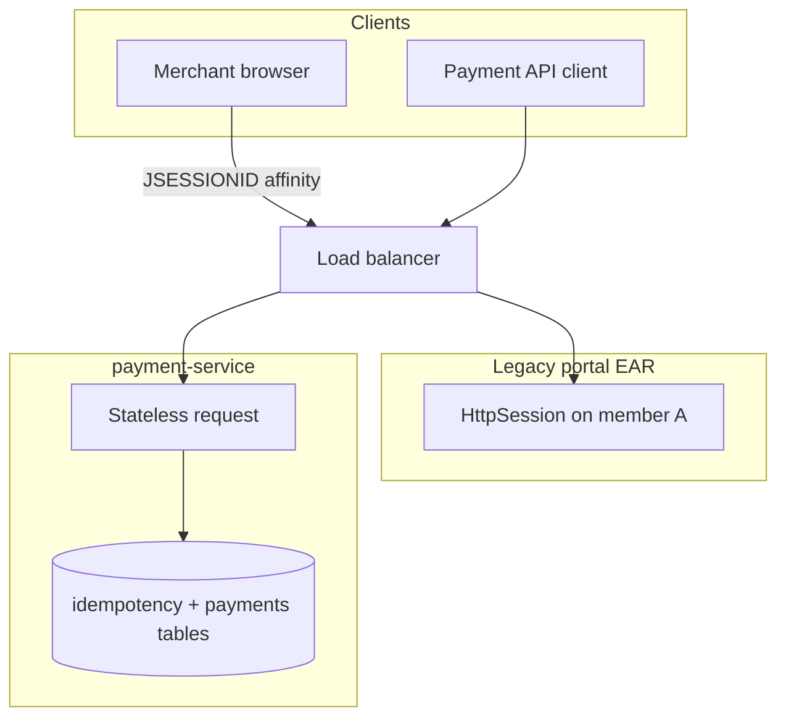
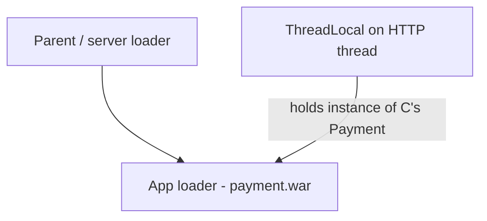

# L-4.4 — Sessions and class loading

**Module:** 04 — Jakarta EE and Enterprise Runtime Concepts  
**Duration:** 30 minutes  
**Case study:** BayPay Financial Services (fictional)

---

## Why this matters

Two “ghost” problems show up on every application-server estate BayPay still runs, and they survive in Spring Boot in quieter forms: **HTTP sessions** that pin a user to a JVM, and **class loaders** that refuse to forget a leaked class. If you do not understand either, you will chase a payment bug on the wrong node, or you will redeploy forever while `MetaSpace` grows and a static `ThreadLocal` holds the old `Payment` class.

---

## Learning objectives

- Decide when BayPay should use an HTTP session — almost never for payment APIs.
- Explain sticky sessions, session replication, and why a stateless `Idempotency-Key` is the better conversation id.
- Sketch parent-first vs parent-last class loading and a typical leak path.
- Relate a “works after bounce, returns after deploy” incident to loader leaks, not business logic.

---

## Concept explanation

**HTTP session.** `HttpServletRequest.getSession()` creates a server-side map keyed by `JSESSIONID`. Traditional WAS apps stored login state, wizard pages, and sometimes even a payment draft in session. That forces **affinity**: the load balancer must return Avery Chen to the same cluster member, or the members must **replicate** session bytes.

BayPay’s payment API is **stateless**. The conversation id is `Idempotency-Key` plus the payment UUID in the database. That is intentional. A session-backed “cart” for a money movement is a reliability and PCI-scope problem.

You will still see sessions on BayPay’s older merchant portal ear. Module 5 covers memory and failover when those sessions are large. This lesson teaches the contract so you do not reintroduce `HttpSession` in the Boot service “for convenience.”

**Class loading.** Each deployed application gets a class loader. A typical Java EE hierarchy:

```text
Bootstrap / platform
        ↓
Server / common (JDBC drivers, server APIs)
        ↓
Application (EAR/WAR classes, Spring Boot nested JARs)
```

**Parent-first** (Java SE default, many WAS apps): if the parent has `org.slf4j.Logger`, the child uses that copy. **Parent-last** (some WAS “application first” settings, some plugin loaders): the WAR’s copy wins. Two copies of the same class are **not** equal. `ClassCastException: Payment cannot be cast to Payment` is the interview classic.

Spring Boot’s fat JAR uses a `LaunchedURLClassLoader` that hides nested jars. Different mechanism, same idea: the loader graph *is* the application’s isolation boundary.

**Leaks.** A class loader can be collected only when nothing in a surviving loader points at its classes. Culprits: static caches, `ThreadLocal` on container threads, JDBC drivers registered in the parent, shutdown hooks, and JMX beans never unregistered. Symptom: each redeploy adds Metaspace; eventually `OutOfMemoryError: Metaspace`. Bounce “fixes” it until the next deploy.

---

## Visual explanation





Alt text: Merchant portal traffic is sticky to a session on one member. Payment API traffic is stateless and keyed in the database. A ThreadLocal on a reused HTTP thread pins the old application class loader after undeploy.

---

## Architecture

In the target BayPay architecture, **session state lives in the database or a dedicated store**, never in the payment JVM heap, if it exists at all. The API cluster can scale without affinity. The legacy portal may still need sticky cookies until it is rewritten; that is a modernization constraint, not a pattern to copy.

Class loading in Boot is simpler (one fat JAR, one main loader) and still leakable: a scheduled executor you never shut down, a JDBC driver `register` without `deregister`, a `MDC` you forget (L-4.1). On WAS, the same bugs are louder because redeploy is a first-class operation.

Shared libraries on a server class loader (a JDBC driver installed *once* for the cell) are why ND operators loved JNDI DataSources. They are also why a driver upgrade requires a node recycle. Liberty and Boot put the driver in the application, which makes upgrades easier and duplicate-driver conflicts your problem.

---

## Production example

A BayPay operator hot-deploys `payment.ear` on a traditional cell (historical path). After the fifth deploy, node agent reports Metaspace pressure. Heap dumps show `Payment` classes loaded by loaders with names like `com.ibm.ws.classloader.CompoundClassLoader@…` — several generations. A `ThreadLocal` on the web container thread still points at an `EntityManager` from deploy 3. New payments intermittently `ClassCastException`.

The Boot analogue: a prototype “report” servlet stored a `Connection` in `HttpSession`. Avery Chen walked away. The connection stayed checked out (L-4.3) and the session pinned a class from a previous hot-reload in dev. Same family of bug, smaller blast radius.

---

## Code/configuration example

Stateless payment API — what BayPay should keep:

```java
@PostMapping
public ResponseEntity<PaymentResponse> create(
        @Valid @RequestBody CreatePaymentRequest request,
        @RequestHeader(name = "Idempotency-Key", required = false) String idempotencyKey) {
    // No request.getSession() — conversation is the key + the payment row.
    PaymentApplicationService.CreateResult result = payments.create(request, idempotencyKey);
    return ResponseEntity.created(URI.create("/api/v1/payments/" + result.payment().id()))
            .body(PaymentResponse.from(result.payment()));
}
```

Anti-pattern (do not add this to payment-service):

```java
HttpSession session = request.getSession(true);
session.setAttribute("draftPayment", payment); // affinity + heap + PCI scope
```

Clear thread state — you already do this for MDC; the same discipline applies to `ThreadLocal`:

```java
private static final ThreadLocal<UUID> CURRENT_CUSTOMER = new ThreadLocal<>();

try {
    CURRENT_CUSTOMER.set(customerId);
    chain.doFilter(request, response);
} finally {
    CURRENT_CUSTOMER.remove();
}
```

WAS-style class-loader note (conceptual, not a greenfield setting):

```text
classloaderMode = PARENT_FIRST   # share server JDBC driver
classloaderMode = PARENT_LAST    # isolate WAR copies of Jackson / SLF4J
```

Pick isolation **or** sharing; do not mix two Jacksons and hope.

---

## Trade-offs

| Choice | Gain | Cost |
|---|---|---|
| Stateless API + DB keys | Any replica can serve Avery Chen | Every request hits the database |
| Sticky sessions | Simple portal login | Uneven load; member death drops sessions |
| Replicated sessions | Survive a member | Memory, serialization, stale objects |
| Parent-first | One JDBC driver per JVM | App cannot upgrade the driver alone |
| Parent-last | App ships its own libs | `ClassCastException`, PermGen/Metaspace leaks |
| Fat JAR | Simple deploy | Duplicate classes if you shade poorly |

---

## Failure modes

- Session stored payment draft; member dies; merchant retries; second payment without idempotency.
- Sticky cookie points at a drained member; 502s that “follow” one merchant.
- Two versions of Jackson: JSON mapping works in unit tests, fails in the ear.
- `ThreadLocal` leak: wrong customer id on a reused thread (authorization bug).
- Redeploy leak: Metaspace climb, then crash, then “fixed by bounce.”

---

## Security/reliability implications

`HttpSession` is a credential store if you put tokens in it. It must be HTTPS-only, `HttpOnly`, and invalidated on logout. For payments, prefer tokens at a gateway and no server session.

`ThreadLocal` customer ids are an authorization foot-gun: one missed `remove()` and the next request on that thread is Avery Chen. That is a data-exposure incident.

Class-loader isolation is a security boundary: a WAR should not be able to reach another ear’s classes. Shared server libraries weaken that boundary. Document what you share.

---

## Interview perspective

**Engineer.** Sessions store user state. Class loaders load classes. Leaks need a restart.

**Senior.** Payment APIs should be stateless; I use idempotency keys. I clear `ThreadLocal` and MDC. I have seen `ClassCastException` from two loaders.

**Staff.** I can explain sticky vs replicated vs external session store. I diagnose Metaspace-after-redeploy as a loader leak and look for statics and `ThreadLocal`. I choose parent-first vs parent-last against a specific conflict.

**Principal.** I will not put money state in `HttpSession`. I treat remaining portal sessions as a migration wave, not a pattern. I will not recommend a new traditional WAS class-loader policy for greenfield BayPay; Boot or Liberty with application-owned dependencies is the default.

---

## Key takeaways

- BayPay payment APIs are stateless; the database holds the conversation.
- Sessions imply affinity or replication — both are costly for money movement.
- Two class loaders mean two types with the same name.
- Redeploy + Metaspace growth is a leak until proven otherwise.
- Parent-last is isolation, not a free upgrade path.

---

## Knowledge check

1. Should `POST /api/v1/payments` call `getSession(true)`? Why?
2. What cookie behavior does a legacy portal session force on the load balancer?
3. Why can `Payment cannot be cast to Payment` be a true error message?

<details>
<summary>Spoiler — answers</summary>

1. No. The idempotency key and payment id are the conversation. A session adds affinity and heap state.
2. Stickiness to the member that holds `JSESSIONID`, or session replication across members.
3. The two `Payment` classes were loaded by different class loaders. The JVM treats them as different types.

</details>

---

## Related lab

[ARCHITECT-401](../../../../labs/ARCHITECT-401/README.md) — include session and class-loader notes in the mapping brief: what Spring Boot embeds versus what a WAS web module configured on the server.

---

## Related PAKS

Optional: `docs/09-transactions/overview.md` (why a cell-wide XA datasource and a shared class loader become one blast radius). No PAKS chapter is required. If you later study JVM internals (Module 7–8), return here: Metaspace and class-loader leaks are the operational sequel.
