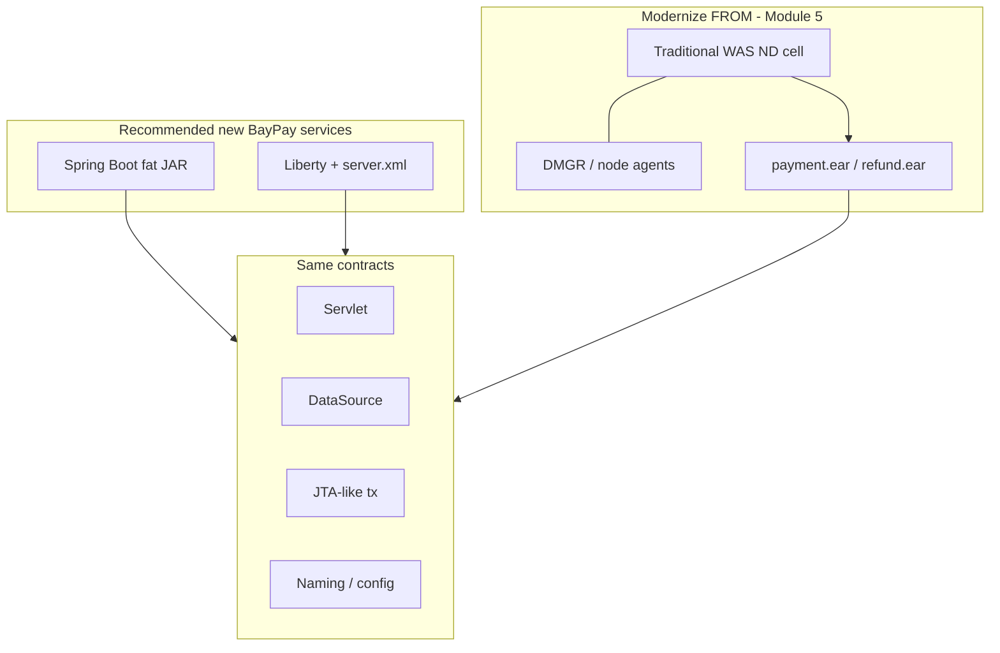

# L-4.5 — Application server fundamentals

**Module:** 04 — Jakarta EE and Enterprise Runtime Concepts  
**Duration:** 30 minutes  
**Case study:** BayPay Financial Services (fictional)

---

## Why this matters

An application server is not “old WebSphere.” It is a **process that implements Jakarta contracts**: HTTP, naming, pools, transactions, messaging, security, and deployment. Spring Boot is a specialized, embeddable slice of that job. BayPay still has ears on a traditional cell (Module 5). The engineers who modernize those ears have to know what the server was *for*, or they will rebuild a cell in Kubernetes by accident — or recommend traditional WAS for a new service, which this course does not.

---

## Learning objectives

- List the services a full application server provides and which of them Spring Boot embeds.
- Contrast traditional WAS, Liberty / Open Liberty, and Spring Boot as *runtimes*, not religions.
- Place JNDI, JTA, JDBC pools, and class loaders in the server’s responsibility box.
- State a greenfield default for BayPay and a modernization default for the existing cell.

---

## Concept explanation

Think of the server as an operator-facing product around the JVM:

| Service | Traditional WAS ND | Liberty | Spring Boot (BayPay today) |
|---|---|---|---|
| HTTP | Web container | `servlet-*` feature | Embedded Tomcat |
| DataSource | JNDI + admin console | `server.xml` + JNDI | `spring.datasource.*` / Hikari |
| Transactions | JTA manager | JTA feature | Spring `PlatformTransactionManager` |
| Messaging | SIBus / MQ via JNDI | JMS feature | In-process events (for now) |
| Security | User registries, LTPA | Features + bind | Spring Security (not yet in reference app) |
| Deployment | EAR/WAR to a **cell** | Drop-in / `server.xml` | Fat JAR |
| Clustering | ND cell, DMGR, nodes | Liberty collectives / K8s | Replicas + a load balancer |
| Class loading | Parent policy per module | Simpler, app-owned | Fat-JAR loader |

**Traditional WebSphere ND** adds a *management plane*: deployment manager, node agents, synchronized nodes, cell-wide JNDI. That is why it appears in Module 5 as BayPay’s **current-state** estate. It is operationally heavy. It is not the recommended place to start a new payment service in 2026.

**Liberty / Open Liberty** implements Jakarta features you enable by name. Configuration is `server.xml`, 12-factor friendly, container friendly. It is a credible modernization *target* when the ear must stay an ear.

**Spring Boot** inverts the packaging: the application *is* the server. BayPay’s reference app chose this for teaching and for greenfield modules. You still owe operators the same gauges: HTTP threads, JDBC pool, transaction timeouts, logs with correlation ids.

The constant across all three: **the application should not open raw sockets to the database or invent its own transaction protocol.** It should ask the runtime for a `DataSource` and a transaction boundary.

---

## Visual explanation



Alt text: Spring Boot and Liberty are recommended runtimes for new BayPay work. Traditional WAS ND is the source estate. All three implement servlet, DataSource, transaction, and naming contracts.

---

## Architecture

BayPay’s **target** for new capabilities: Spring Boot modular monolith first (you have it), extract a worker when JMS or a queue is justified, deploy as containers in later modules. Liberty is the path when an ear cannot be rewritten on the Module 5–6 timeline.

BayPay’s **source**: load balancer → WAS ND cluster → payment and refund applications → enterprise messaging → database → reporting. You will draw this properly in ARCHITECT-501. This lesson only requires you to know *why* that topology existed: the server owned pools, JTA, JNDI, and cluster membership so application code could stay thin.

Do not reproduce DMGR, node agents, and cell-wide JNDI on a blank AWS account. That is nostalgia, not architecture.

---

## Production example

A staff engineer proposes “we understand WAS, so the new real-time FX quote service should be another ear on the payment cluster — the DataSource is already there.” That reuses a pool (L-4.3), a class-loader policy (L-4.4), and a change window owned by ND operators. It also couples a new SLA to a cell you are trying to shrink.

The production-quality answer: deploy a Boot or Liberty service with its **own** pool, its own config, and a defined transaction story. Share the *database* if the bounded context is the same, not the *server*. Keep the payment ear alive until Capstone 2’s waves say otherwise.

When INCIDENT-403’s `COMPLETED` vs missing ledger shows up on the ear, the same JTA questions apply. When INCIDENT-402’s 50/50 pool shows up on Boot, the same DataSource questions apply. Runtime brand is not the diagnosis.

---

## Code/configuration example

Spring Boot — application owns the runtime (BayPay reference):

```yaml
# application-prod.yml
spring:
  datasource:
    url: ${BAYPAY_DB_URL}
    username: ${BAYPAY_DB_USER}
    password: ${BAYPAY_DB_PASSWORD}
```

Liberty — server owns features, app stays a WAR (modernization target):

```xml
<server>
  <featureManager>
    <feature>servlet-6.0</feature>
    <feature>jdbc-4.3</feature>
    <feature>jndi-1.0</feature>
    <feature>persistence-3.1</feature>
  </featureManager>
  <dataSource id="baypay" jndiName="jdbc/baypay">
    <jdbcDriver libraryRef="pg"/>
    <properties.postgresql serverName="${BAYPAY_DB_HOST}" portNumber="5432"
                           databaseName="baypay" user="${BAYPAY_DB_USER}" password="${BAYPAY_DB_PASSWORD}"/>
  </dataSource>
  <webApplication location="payment-service.war" contextRoot="/"/>
</server>
```

Traditional WAS — resources bound in the cell (source estate, not a template):

```text
JDBC provider → DataSource jdbc/baypay → J2C auth alias
SIBus or MQ → QCF jms/paymentEvents
Application installed on cluster PaymentCluster
```

You will configure that topology as a **paper architecture** in Module 5, not as a laptop install.

---

## Trade-offs

| Runtime | Choose when | Do not choose when |
|---|---|---|
| Spring Boot | New BayPay modules, local teaching, containers | You must keep an unchanged ear this quarter |
| Liberty | Ear-compatible Jakarta, faster than ND, `server.xml` | You need ND-only admin features and have no exit plan |
| Traditional WAS ND | You already run it and have not finished cutover | Greenfield, or “the team knows the console” |

---

## Failure modes

- Treating Boot as “no server”: no one owns HTTP/JDBC pool sizing.
- Treating WAS as “the database”: a cell outage is not a Postgres outage.
- Mixing JTA XA and a local Spring transaction in one payment.
- Deploying a fat JAR *into* a full Java EE container and getting two overlapping servers.
- Copying cell-wide JNDI into Kubernetes as a giant directory instead of per-service config.

---

## Security/reliability implications

The server is a trust and availability domain. Whoever can bind `jdbc/baypay` can point payments at a malicious database. Liberty `server.xml` and Boot env vars need the same secret hygiene. ND admin console access is root-equivalent for the cell.

Clustering is not HA by itself. A cell with one database and one MQ is a single-point story with extra processes. Reliability comes from pools, timeouts, idempotency, and data-path redundancy — lessons 4.1–4.3 — not from the product name on the JVM.

---

## Interview perspective

**Engineer.** App servers provide HTTP, JDBC, and JNDI. Spring Boot embeds Tomcat. WAS is what BayPay used to deploy ears.

**Senior.** I can map Boot auto-config to server features. I know JTA, DataSource, and servlet exist in all three. I would not put a new service on ND.

**Staff.** I can explain DMGR vs Liberty `server.xml` vs a fat JAR as operations models. I size pools and transactions the same way on each. I use ND knowledge to plan waves, not to extend the cell.

**Principal.** Greenfield default is Boot or Liberty with externalized config. ND is a shrinking source estate with a written exit. I will not fund a new traditional cell. I will fund the gauges and transaction rules that make any of the three runtimes operable.

---

## Key takeaways

- Application servers implement Jakarta contracts; Spring Boot embeds a subset.
- Traditional WAS ND is BayPay’s source topology (Module 5), not a greenfield target.
- Liberty is the ear-compatible modernization runtime; Boot is the teaching and new-module runtime.
- Pools, JTA, naming, and class loading are server responsibilities whoever packages them.
- Product names do not diagnose INCIDENT-402 or INCIDENT-403 — contracts do.

---

## Knowledge check

1. Name three services a full application server provides that BayPay’s Boot app still needs.
2. When is Liberty a better next step than rewriting an ear as Spring Boot this quarter?
3. Why is “put the new FX service on the existing PaymentCluster” the wrong default?

<details>
<summary>Spoiler — answers</summary>

1. HTTP handling, a DataSource/pool, and transaction demarcation (plus logging/security). Messaging if you extract the worker.
2. When the ear must keep Jakarta APIs and you need a faster, container-friendly server without a full rewrite.
3. It grows the estate you are exiting, shares pools and class loaders, and uses traditional WAS as greenfield.

</details>

---

## Related lab

[ARCHITECT-401](../../../../labs/ARCHITECT-401/README.md) — map Spring to Jakarta and write the greenfield vs source-estate paragraph. Then [INCIDENT-402](../../../../labs/INCIDENT-402/README.md) and [INCIDENT-403](../../../../labs/INCIDENT-403/README.md) to apply pool and transaction contracts on the Boot runtime.

---

## Related PAKS

Optional: `docs/09-transactions/overview.md` (2PC is why WAS cells grew XA DataSources). Useful background before Module 5. Not required to finish ARCHITECT-401.
