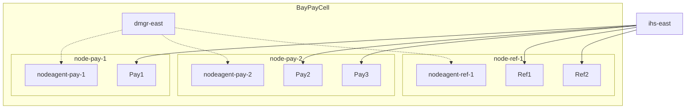

# L-5.1 — Cell, DMGR, node, node agent and server

**Module:** 05 — WebSphere Network Deployment  
**Duration:** 30 minutes  
**Diagram:** AEJE-D-018  
**Case study:** BayPay Financial Services (fictional)

---

## Why this matters

`BayPayCell` is a **management domain**, not a single JVM. Merchants talking to Avery Chen’s active USD account (`22222222-2222-2222-2222-222222222221`) hit `Pay1`, `Pay2`, or `Pay3` — never `dmgr-east`. If you cannot tell the deployment manager from a payment server, you will bounce the process that cannot fix the outage, or you will treat a down node agent as “the cell is dead” while `Pay1` is still posting. Module 4 taught what an application server *owns*. This lesson names the ND processes that own BayPay’s **source** estate so you can operate it and leave it.

---

## Learning objectives

- Define cell, deployment manager, node, node agent, and application server using only locked `BayPayCell` names.
- State which process serves HTTP and which process only replicates configuration.
- Predict what still works when `dmgr-east` is down versus when `nodeagent-pay-2` is down.
- Place this topology as a shrinking source estate, not a greenfield pattern.

---

## Concept explanation

A **cell** is the unit of administration. `BayPayCell` has one master configuration repository. Everything Morgan Hale changes in the admin console is a cell document until it is **synchronized** to nodes.

A **deployment manager** (`dmgr-east` on `was-dmgr-east.baypay.example`) is a JVM that hosts that console, the master repository, and the administrative JMX endpoint. It does **not** run `payment.ear`. Killing `dmgr-east` does not stop Avery Chen’s `POST /payment` if the cluster members are already up.

A **node** is a machine (or VM) that has been federated into the cell: `node-pay-1`, `node-pay-2`, `node-ref-1`. A node is not an application. It is a place where servers and a node agent live.

A **node agent** (`nodeagent-pay-1`, `nodeagent-pay-2`, `nodeagent-ref-1`) is the management daemon on that node. It starts and stops servers on behalf of `dmgr-east`, copies synchronized files into the node repository, and reports server state. If the node agent is down, the application JVMs can keep running — but Morgan cannot reliably sync, start, or stop them from the cell.

An **application server** is the JVM that runs the ear: `Pay1` on `node-pay-1`, `Pay2` and `Pay3` on `node-pay-2`, `Ref1` and `Ref2` on `node-ref-1`. These are the processes Riley Okonkwo pages about.

`ihs-east` is **not** a WAS node. It is IBM HTTP Server plus the WAS plugin. It sits in front of the clusters. Do not draw it inside `BayPayCell` as a federated node.

| Process | Host | Serves merchant HTTP? | Owns master config? |
|---|---|---|---|
| `dmgr-east` | `was-dmgr-east.baypay.example` | No | Yes |
| `nodeagent-pay-1` | `was-pay-1.baypay.example` | No | Node copy only |
| `Pay1` | `was-pay-1.baypay.example` | Yes (`/payment`) | No |
| `Pay2`, `Pay3` | `was-pay-2.baypay.example` | Yes | No |
| `Ref1`, `Ref2` | `was-ref-1.baypay.example` | Yes (`/refund`) | No |

Traditional ND exists in this course because BayPay already runs it. Module 6’s Liberty `server.xml` and today’s Spring Boot fat JAR are the **exit**. Do not propose a second cell for a new FX quote service.

---

## Visual explanation



Alt text: Merchants reach Pay1, Pay2, Pay3, Ref1, and Ref2 through ihs-east; dmgr-east talks only to the three node agents inside BayPayCell.

Diagram AEJE-D-018 is the course drawing of this same split: management plane versus serving JVMs.

---

## Architecture

Read [datasets/baypay-cell/TOPOLOGY.md](../../../../datasets/baypay-cell/TOPOLOGY.md) as the inventory. The HTTP path is merchants → `ihs-east` → cluster members → `jdbc/baypay` and `BayPayBus` → `db-east.baypay.example:5432`. The **control** path is operator → `dmgr-east` → node agent → server.

ARCHITECT-501 asks you to draw both paths on one page and label blast radius. A cell with one DMGR is a single management point, not a single availability point. A cell with one database is still a single data point no matter how many `Pay*` JVMs you add.

Two payment JVMs share `node-pay-2`. That is a capacity choice Morgan Hale made years ago, not a high-availability feature. A host outage on `was-pay-2.baypay.example` removes `Pay2` and `Pay3` together. `Pay1` is the only payment member on a separate node.

Do not federate a laptop into `BayPayCell`. This course never asks you to install ND.

---

## Production example

14:10 Pacific. Priya Nair pages Riley: “the cell is down — I cannot open the admin console.” Avery Chen’s client is still completing payments. Riley checks `Pay1`/`Pay2`/`Pay3` process tables: all STARTED. Morgan Hale confirms `dmgr-east` is the only process that died after a patch window.

The correct first sentence is: **merchant traffic does not require the DMGR to be up.** Restore `dmgr-east` so Jordan Voss can deploy later; do not bounce `Pay1` “to reset the cell.”

A different hour: `nodeagent-pay-2` will not start. `Pay2` and `Pay3` still accept HTTP. Jordan cannot sync a config change to `node-pay-2`. That is a **management** outage on one node, not proof that `PaymentCluster` is offline. You will see a related class of deploy/sync symptoms in INCIDENT-504; diagnose from evidence, do not assume the story.

---

## Code/configuration example

Paper inventory — the only “config” this lesson requires. You copy names; you do not run `manageprofiles`.

```text
Cell:    BayPayCell
DMGR:    dmgr-east          was-dmgr-east.baypay.example
Nodes:   node-pay-1         was-pay-1.baypay.example
         node-pay-2         was-pay-2.baypay.example
         node-ref-1         was-ref-1.baypay.example
Agents:  nodeagent-pay-1, nodeagent-pay-2, nodeagent-ref-1
Servers: Pay1               (node-pay-1)
         Pay2, Pay3         (node-pay-2)
         Ref1, Ref2         (node-ref-1)
Edge:    ihs-east           ihs-east.baypay.example   (not a federated node)
```

A conceptual start order Morgan uses after a cold data-center window (paper only):

```text
1. dmgr-east
2. nodeagent-pay-1, nodeagent-pay-2, nodeagent-ref-1
3. Pay1, Pay2, Pay3, Ref1, Ref2
4. Confirm ihs-east plugin still lists the members you intend
```

Reverse that order only when you are draining for a planned stop. Never start application servers before their node agent if you expect the DMGR to show accurate state.

---

## Trade-offs

| Choice | Why BayPay has it | Cost |
|---|---|---|
| One cell `BayPayCell` | One console, one JNDI tree | One admin outage domain; shared mistakes |
| DMGR separate from app JVMs | Console crash ≠ payment crash | Extra JVM to patch and monitor |
| Two payment JVMs on `node-pay-2` | Fewer hosts in 2014 | Host loss takes `Pay2` and `Pay3` |
| Node agent per node | Remote start/stop and sync | Agent down hides true server control |
| Traditional ND | Already installed | Operationally heavy; not a 2026 greenfield |

Liberty and Boot collapse “node agent + DMGR + server” into one process plus a load balancer. That is the modernization direction, not an insult to Morgan’s cell.

---

## Failure modes

- Treating `dmgr-east` as the payment runtime and bouncing it during a merchant outage.
- Treating a STARTED server as healthy work (INCIDENT-502 investigates members that stop processing — symptoms only in that lab).
- Assuming a dead node agent means the JVMs on that node have stopped.
- Assuming a live node agent means the node repository matches the DMGR.
- Drawing `ihs-east` as a federated WAS node in ARCHITECT-501.
- Recommending a new cell because “we already have ND skills.”

---

## Security/reliability implications

Whoever authenticates to `dmgr-east` can rebind `jdbc/baypay`, stop `Pay1`, and push a new `payment.ear`. Console access is **cell-root**. Restrict it the way you restrict production deploy keys. Node-agent ports are management ports; they are not merchant TLS.

Reliability is not “three payment JVMs.” It is independent failure domains. `Pay2` and `Pay3` share a node. All five app JVMs share one database and one SIBus name. Write that on the architecture page so nobody calls the cell “HA” after counting processes.

When `dmgr-east` is down you cannot change the cell, but you can still drain via `ihs-east` if the plugin file on disk is already correct. Plan that drain **before** the console is unavailable.

---

## Interview perspective

**Engineer.** A cell has a DMGR, nodes, node agents, and servers. `Pay1` runs the ear. `dmgr-east` is the admin JVM. I would not install ND on my laptop for this course.

**Senior.** I can say which process dies when `was-pay-2` is lost (`Pay2`, `Pay3`, `nodeagent-pay-2`) and why Avery Chen can still pay through `Pay1`. I treat ND as source estate.

**Staff.** I separate the HTTP path from the sync path. I will not bounce `dmgr-east` to fix `/payment`. I use node-agent health as a deploy gate, not as a liveness signal for merchant traffic.

**Principal.** I will fund an exit to Liberty or Boot, not a second traditional cell. I require a diagram that shows management versus serving processes and names the shared data plane. ND literacy is a modernization skill.

---

## Key takeaways

- `BayPayCell` is the admin domain; `Pay1`/`Pay2`/`Pay3` are the payment runtime.
- `dmgr-east` owns the master repository and does not serve merchants.
- A node agent can be down while its application servers still run.
- `ihs-east` is edge, not a federated node.
- Traditional WAS is what BayPay is leaving, not what it should start next.

---

## Knowledge check

1. Avery Chen’s payment succeeds while the admin console is unreachable. Which process is most likely down?
2. `nodeagent-pay-2` is stopped. Can `Pay2` still accept HTTP? What can Morgan Hale not do?
3. Why is “add a new ear to `BayPayCell` because we know WAS” the wrong greenfield default?

<details>
<summary>Spoiler — answers</summary>

1. `dmgr-east`. Cluster members do not need the DMGR to keep serving already-started applications.
2. Yes — the server JVM can keep running. Morgan cannot reliably sync, start, or stop servers on `node-pay-2` from the cell until the agent is back.
3. It grows the source estate, shares the cell’s JNDI and blast radius, and treats traditional ND as a platform for new work.

</details>

---

## Related lab

[ARCHITECT-501 — Design WebSphere ND BayPay](../../../../labs/ARCHITECT-501/README.md). Draw cell, DMGR, nodes, agents, servers, and `ihs-east` from [TOPOLOGY.md](../../../../datasets/baypay-cell/TOPOLOGY.md). Paper only.

---

## Related PAKS

Optional: `docs/12-messaging-and-streaming/overview.md` (SIBus / events literacy — not a Kafka mandate) and `docs/27-production-failures/overview.md` (operate-to-leave, not a new cell). Hosted at [paks.bayareala8s.com](https://paks.bayareala8s.com) when your cohort has a login. This lesson stands alone without it.
