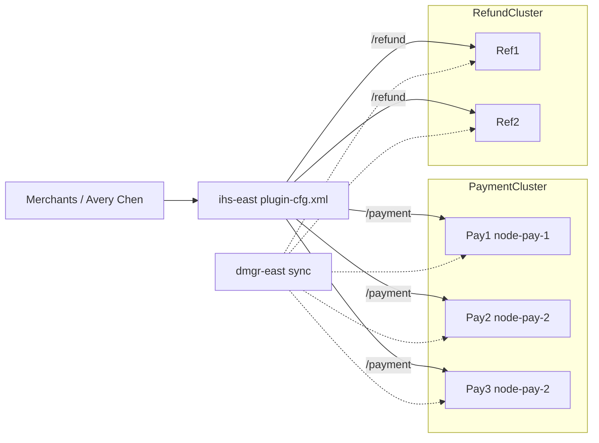

# L-5.2 — Clusters and deployments

**Module:** 05 — WebSphere Network Deployment  
**Duration:** 30 minutes  
**Case study:** BayPay Financial Services (fictional)

---

## Why this matters

`payment.ear` is not “installed on a server.” It is targeted at **`PaymentCluster`**, a set of JVMs that must agree on the same bits and the same bindings. `ihs-east` only knows what `plugin-cfg.xml` last told it. Jordan Voss can click Install and still leave `Pay1` on a different edition than `Pay2`/`Pay3` if **sync** did not finish. Merchants then see intermittent classes or names for the same `Idempotency-Key`. You will diagnose a deployment-shaped incident in INCIDENT-504 from symptoms. This lesson gives you the vocabulary so you do not treat “STARTED” as “same version.”

---

## Learning objectives

- Map `PaymentCluster` (`Pay1`, `Pay2`, `Pay3`) and `RefundCluster` (`Ref1`, `Ref2`) to nodes and ears.
- Explain what the IHS plugin actually load-balances, and when it must be regenerated.
- Contrast a **rolling rollout** of `payment.ear` with a completed **node synchronize**.
- List deploy gates that do not require a live cell: node-agent health, cluster distribution, plugin membership.

---

## Concept explanation

A **cluster** is a target. All members run the same application configuration from the cell’s point of view. BayPay’s locked clusters:

| Cluster | Members | Node | Application | Context |
|---|---|---|---|---|
| `PaymentCluster` | `Pay1` | `node-pay-1` | `payment.ear` | `/payment` |
| `PaymentCluster` | `Pay2` | `node-pay-2` | `payment.ear` | `/payment` |
| `PaymentCluster` | `Pay3` | `node-pay-2` | `payment.ear` | `/payment` |
| `RefundCluster` | `Ref1` | `node-ref-1` | `refund.ear` | `/refund` |
| `RefundCluster` | `Ref2` | `node-ref-1` | `refund.ear` | `/refund` |

Do not install `refund.ear` on `PaymentCluster` to “use spare capacity.” That couples refund SLOs to payment class loaders and pools (L-5.3).

**Deployment** on ND is two different clocks:

1. **Rollout** — which cluster members have been asked to run the new edition, and in what order. Rolling means `Pay1`, then `Pay2`, then `Pay3`, with a health check between. All-at-once means every member is stopped or replaced in one window.
2. **Synchronize** — the node agent has copied the DMGR’s master documents (application binaries, `ibm-web-bnd`, DataSource bindings) into that node’s repository. Until sync completes, the member can be STARTED on **old** files while the console already shows the new install.

Those clocks are not the same. A green console checkbox is not a cluster-wide binary. INCIDENT-504 is the lab where a deploy looks wrong across members; write a hypothesis from the dumps, do not import a story from this lesson.

**IHS plugin.** `ihs-east` reads `plugin-cfg.xml`. The file lists clusters, member host/port, and URI groups (`/payment/*`, `/refund/*`). The plugin is **not** the cell. Regenerating the plugin after you add `Pay3` or change a port is a separate propagate step to `ihs-east.baypay.example`. Stale plugin: traffic still hits a JVM you drained, or never hits a JVM you added.

**Affinity.** The plugin can pin a `JSESSIONID` to one member. L-5.5 explains why the payment API must not need that. Treat sticky routing as a smell on `/payment`, not as a cluster feature to enable by default.

---

## Visual explanation



Alt text: ihs-east splits /payment to Pay1 Pay2 Pay3 and /refund to Ref1 Ref2 while dmgr-east synchronizes the same ears to every member.

---

## Architecture

The serving path and the distribute path cross at the cluster member. Priya Nair owns plugin health and whether `ihs-east` still lists a member. Morgan Hale owns cluster membership and sync. Jordan Voss owns which `payment.ear` edition was selected. Riley Okonkwo owns whether `/payment` behaves.

`Pay2` and `Pay3` share `node-pay-2`. A rolling deploy that stops the **node** is not a rolling deploy; it removes two of three payment members at once. Roll **servers**, not hosts, unless you have drained both members from the plugin first.

`RefundCluster` is a separate target so refund volume and class loaders do not ride inside `payment.ear`. Module 6 will move refund first for that reason. Do not collapse the clusters on the ARCHITECT-501 page to make the drawing smaller.

Greenfield BayPay does not add a third cluster to ND. New work is Boot or Liberty behind a modern load balancer.

---

## Production example

Jordan Voss schedules a new `payment.ear` edition after change review. Morgan starts the install against `PaymentCluster`. Mid-window Priya reports a payment-node agent that is not stable. The console may already show the new edition as the cell target. Riley then hears “works on some requests.” That combination — install plus an unhealthy node agent plus mixed client results — is the **shape** of INCIDENT-504. Stabilize by making the cluster consistent; the lab dumps tell you which way. Do not invent a missing name or member from this paragraph.

A quieter production miss: install succeeds, nobody propagates `plugin-cfg.xml`. `Pay3` is in the cluster and never receives merchant traffic. Capacity planning that counted three members is fiction until the plugin file on `ihs-east` lists three transports.

---

## Code/configuration example

Paper plugin fragment (public `plugin-cfg.xml` shape, not a live generate):

```xml
<Config>
  <ServerCluster Name="PaymentCluster">
    <Server Name="Pay1">
      <Transport Hostname="was-pay-1.baypay.example" Port="9080" Protocol="http"/>
    </Server>
    <Server Name="Pay2">
      <Transport Hostname="was-pay-2.baypay.example" Port="9080" Protocol="http"/>
    </Server>
    <Server Name="Pay3">
      <Transport Hostname="was-pay-2.baypay.example" Port="9081" Protocol="http"/>
    </Server>
  </ServerCluster>
  <UriGroup Name="default_host_PaymentCluster_URIs">
    <Uri Name="/payment/*"/>
  </UriGroup>
</Config>
```

Deploy checklist Jordan and Morgan share (paper gate, no wsadmin):

```text
1. All node agents STARTED (nodeagent-pay-1, nodeagent-pay-2, nodeagent-ref-1)
2. Install payment.ear targeted at PaymentCluster only
3. Synchronize node-pay-1 and node-pay-2; wait for completion, not just "queued"
4. Confirm each member reports the same edition before the next roll step
5. Regenerate plugin-cfg.xml and copy to ihs-east
6. Drain / add members in the plugin before you call the rollout done
```

Step 1 is a **gate**. Installing while a node agent is restarting is how a cell edition and a node edition diverge.

---

## Trade-offs

| Approach | Choose when | Cost |
|---|---|---|
| Rolling member by member | You can drain via plugin and have time | Longer window; mixed versions *during* the roll |
| All-at-once cluster stop | Tiny cluster, accepted downtime | `/payment` is gone until all three return |
| Wait for full sync | Always, before the next member | Slower than “click Install and leave” |
| Skip plugin regenerate | Never after membership or port change | Phantom or orphan members |
| One ear on one cluster | Isolation | More install targets to care for |

Rolling is not safer than all-at-once if you do not **drain** the member you are replacing. Mixed versions plus sticky sessions (L-5.5) pin Avery Chen to the bad edition.

---

## Failure modes

- Console shows installed; a node repository still has the previous ear.
- Plugin still routes to a member you stopped, or never routes to a member you added.
- Rolling `node-pay-2` as if it were one JVM, taking `Pay2` and `Pay3` together.
- Targeting `payment.ear` at the cell instead of `PaymentCluster`, so refund nodes load payment classes.
- Treating cluster “ripple start” as a health check. STARTED is not “processing” (INCIDENT-502).
- Installing a new greenfield service onto `PaymentCluster` because the cluster already exists.

---

## Security/reliability implications

An install is a trust operation. The ear can replace payment code that moves money for Avery Chen. Restrict who can target `PaymentCluster`. Signed bits and a change ticket are not optional because the console made it easy.

Reliability during rollout is **plugin membership**, not hope. Remove `Pay2` from `plugin-cfg.xml` (or mark it down) before you stop that JVM. Put it back only after the new edition answers a synthetic `/payment` health URL you actually trust — L-5.6 talks about what “health” means when the check is only TCP.

Partial distribution is a consistency failure. Fail closed: keep the whole cluster on one edition or take members out of rotation. Do not leave merchants to sample versions.

---

## Interview perspective

**Engineer.** A cluster is several JVMs running the same ear. The IHS plugin sends `/payment` to `Pay1`/`Pay2`/`Pay3`. Sync copies config from the DMGR to the node.

**Senior.** I will not call a deploy done until every member shows the same edition and `ihs-east` has a fresh plugin. I roll servers, not the shared `node-pay-2` host.

**Staff.** I treat rollout and synchronize as different clocks. I gate installs on node-agent health. I can explain mixed-version symptoms without guessing a binding name in an interview.

**Principal.** Clusters are an ND operations model I am exiting. I will not add members to grow the cell. I will fund drain-and-sync discipline until Liberty waves in Module 6 retire `PaymentCluster`.

---

## Key takeaways

- `PaymentCluster` is three members on two nodes; `RefundCluster` stays separate.
- Rollout order and node synchronize are different operations.
- `ihs-east` only routes what `plugin-cfg.xml` lists.
- Gate deploys on node-agent health and full cluster distribution.
- Do not grow ND clusters for new BayPay work.

---

## Knowledge check

1. Which cluster members share a host, and why does that matter for a rolling stop?
2. The console shows a new `payment.ear` edition. Why might `Pay3` still run the previous edition?
3. After adding `Pay3`, merchants still only hit `Pay1` and `Pay2`. What file was probably not updated?

<details>
<summary>Spoiler — answers</summary>

1. `Pay2` and `Pay3` on `node-pay-2`. Stopping the host or the node takes two of three payment members at once.
2. Sync to `node-pay-2` may be incomplete, or that member was not rolled. Console edition is the cell view, not proof of every repository.
3. `plugin-cfg.xml` on `ihs-east` — regenerate and propagate after cluster membership changes.

</details>

---

## Related lab

[ARCHITECT-501](../../../../labs/ARCHITECT-501/README.md) — draw both clusters and the plugin path. Then [INCIDENT-504 — Deployment failure](../../../../labs/INCIDENT-504/README.md): you will diagnose from dumps; the student guide will not hand you the RCA.

---

## Related PAKS

Optional: `docs/12-messaging-and-streaming/overview.md` (SIBus / events literacy — not a Kafka mandate) and `docs/27-production-failures/overview.md` (operate-to-leave, not a new cell). Hosted at [paks.bayareala8s.com](https://paks.bayareala8s.com) when your cohort has a login. This lesson stands alone without it.
