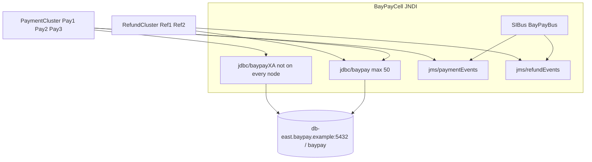

# L-5.3 — JDBC, JNDI and JMS

**Module:** 05 — WebSphere Network Deployment  
**Duration:** 30 minutes  
**Diagram:** AEJE-D-020  
**Case study:** BayPay Financial Services (fictional)

---

## Why this matters

`payment.ear` does not contain a JDBC URL. It looks up **`jdbc/baypay`**. Refund looks up the same name. Payment events look up **`jms/paymentEvents`** on SIBus **`BayPayBus`**. That is convenient for Morgan Hale and dangerous for Riley Okonkwo: one cell-scoped pool is one scarce resource for every ear that learned the name. Module 4 already treated `DataSource` as a contract. This lesson places those contracts on `BayPayCell` so you can read a `NameNotFoundException`, a 50/50 PMI pool, and a modernization smell without treating JNDI as a greenfield style.

---

## Learning objectives

- Bind `jdbc/baypay`, `jdbc/baypayXA`, `jms/paymentEvents`, and `jms/refundEvents` to the locked topology.
- Explain SIBus `BayPayBus` as the cell’s messaging fabric, not as a product you would choose for a new service.
- Contrast **cell-scoped** versus **application-scoped** (or isolated) resources.
- State why a shared `jdbc/baypay` is a source-estate smell, and what Liberty will split in Module 6.

---

## Concept explanation

**JNDI** is a tree. Application code asks for a name; the server returns a live object. Traditional BayPay ears use resource references that the operator binds to cell objects.

| Bind | Type | Scope in current cell | Notes |
|---|---|---|---|
| `jdbc/baypay` | DataSource | Cell-scoped historically | Shared — a modernization smell |
| `jdbc/baypayXA` | XA DataSource | Incomplete | Added in some failed deploys; **not on every node** |
| `jms/paymentEvents` | Queue + connection | Cell / bus | SIBus `BayPayBus` |
| `jms/refundEvents` | Queue + connection | Cell / bus | SIBus `BayPayBus` |
| `baypayDbAlias` | J2C auth alias | Cell | Username/password for the DataSource |

**Cell-scoped** means any server in `BayPayCell` that can see the name can check out a connection from that definition. `Pay1`, `Pay2`, `Pay3`, `Ref1`, `Ref2` — and any later ear someone targeted at a payment node — compete if they all use `jdbc/baypay`. L-4.3 called that “reporting inside the payment JVM.” On ND the anti-pattern is broader: **any application in the cell** can share the pool if the name is global.

**Application-scoped** (or a uniquely named DataSource per ear) means `payment.ear` binds `jdbc/baypay-payment` and `refund.ear` binds `jdbc/baypay-refund`. Module 6’s Liberty target uses those isolated names. That is the direction, not a new cell-wide tree.

**`jdbc/baypayXA`** exists in the inventory because someone needed two-phase commit between JDBC and JMS. It is not bound on every node. Code that expects XA on `Pay1` and a local DataSource on `Pay3` will throw `NameNotFoundException` or enlist the wrong resource. Treat “XA on some members” as a **consistency defect**, not as sophistication.

**SIBus `BayPayBus`** is WebSphere’s built-in messaging engine. Destinations `jms/paymentEvents` and `jms/refundEvents` live on it. It is why the cell grew XA stories. Greenfield BayPay uses in-process events today and an explicit broker later — not a new SIBus.

WAS JDBC pool default in the incident packs: **`maxConnections = 50`**. That is per DataSource definition as configured on the cluster, not “50 for the whole company.” If two ears share one definition, they share the 50.

INCIDENT-503 is a pool-exhaustion lab on this cell. You will diagnose who is holding connections from PMI and installs. This lesson does not name that occupant.

---

## Visual explanation



Alt text: PaymentCluster and RefundCluster both look up cell-scoped jdbc/baypay and BayPayBus queues; the XA DataSource is missing on some nodes.

Diagram AEJE-D-020 is the course component view of this tree.

---

## Architecture

Network path from [TOPOLOGY.md](../../../../datasets/baypay-cell/TOPOLOGY.md):

```text
ihs-east → PaymentCluster / RefundCluster
        → jdbc/baypay  and  BayPayBus
        → db-east.baypay.example:5432 / baypay
        → Reporting (nightly — must not share the payment pool)
```

Reporting is a **consumer of the same database**, not a guest on the payment DataSource. If a nightly job borrows from the same 50 connections as `POST /payment` for Avery Chen, merchants lose. ARCHITECT-501 should show reporting beside the database, not inside `Pay1`.

Spring Boot in `reference-apps/baypay` binds `spring.datasource.*` per process. Three replicas mean three pools. ND’s historical choice was one JNDI name and a hope that operators would not install a second ear against it.

Do not copy the cell tree into Kubernetes as a giant directory. Per-service config and per-service pools replace JNDI for new work.

---

## Production example

Riley Okonkwo gets `NameNotFoundException: jdbc/baypayXA` on some `/payment` requests and a clean authorize on others. That is a **lookup** failure, not a SQL failure. Morgan Hale should list which nodes actually have the XA DataSource bound. Do not “fix” it by adding XA to the whole cell as a reflex — decide whether payment posting needs two-phase commit at all (L-4.2 / L-4.5 said new BayPay work should not grow XA without an ADR).

A second hour: PMI shows `jdbc/baypay` at 50/50, database CPU is low, Avery Chen’s retries pile up. That is exhaustion of the **named pool**, the same class as INCIDENT-402 on Boot and INCIDENT-503 on this cell. Prove who holds the connections. Raising `maxConnections` to 200 before you know the borrower is how you knock over `db-east`.

---

## Code/configuration example

Ear resource reference (what `payment.ear` declares):

```xml
<resource-ref>
  <res-ref-name>jdbc/baypay</res-ref-name>
  <res-type>javax.sql.DataSource</res-type>
  <res-auth>Container</res-auth>
</resource-ref>
<resource-ref>
  <res-ref-name>jms/paymentEvents</res-ref-name>
  <res-type>javax.jms.Queue</res-type>
</resource-ref>
```

Cell binding Morgan documents (paper, not a console script):

```text
JDBC provider  → PostgreSQL-compatible driver on each node
DataSource     → jdbc/baypay
                 J2C alias baypayDbAlias
                 maxConnections = 50
                 url → db-east.baypay.example:5432 / baypay
XA DataSource  → jdbc/baypayXA   (inventory: not guaranteed on node-pay-2)
SIBus          → BayPayBus
Destinations   → jms/paymentEvents , jms/refundEvents
```

Liberty target names you will use in Module 6 — **do not add these to the ND cell** as another shared tree:

```text
jdbc/baypay-payment
jdbc/baypay-refund
```

---

## Trade-offs

| Binding | Why it existed | Why it is a smell |
|---|---|---|
| Cell-scoped `jdbc/baypay` | One place to rotate the password | One pool for every ear that knows the name |
| `jdbc/baypayXA` | JDBC + JMS in one 2PC | Extra failure mode; incomplete across nodes |
| SIBus `BayPayBus` | No external broker in 2014 | Couples messaging to the cell lifecycle |
| App-scoped DataSource | Isolation | More aliases to rotate; the correct default now |
| Boot `application.yml` | Per-process, 12-factor | Not what the ears do until they leave ND |

---

## Failure modes

- `NameNotFoundException` for a name bound on `node-pay-1` but not `node-pay-2`.
- Pool waiters while Postgres is idle — shared or leaked connections, not “DB down.”
- Two ears, one `maxConnections=50`, merchants lose to a batch job.
- XA enlisted on one member, local DataSource on another, in-doubt or missing ledger rows.
- Application code that hard-codes `jdbc/baypay` and cannot be pointed at an isolated pool without a rebuild.
- Inventing a new cell-wide name for a new service instead of giving that service its own runtime.

---

## Security/reliability implications

`baypayDbAlias` is the database password in the cell. Console readers and FFDC that dump DataSource config are credential surfaces. Restrict J2C alias access the way you restrict a Kubernetes Secret.

A shared pool is a **reliability coupling**. Refund lock contention or a reporting cursor can stall payment authorizations for Avery Chen’s frozen-account tests (`22222222-2222-2222-2222-222222222222`) and for live merchants. Fail closed: isolate pools before you add work to `BayPayCell`.

JMS on `BayPayBus` is in the cell’s availability domain. If the messaging engine is on a payment node, a node outage is also a queue outage. Document that on ARCHITECT-501; do not call the bus “HA” because the name includes Bus.

---

## Interview perspective

**Engineer.** The ear looks up `jdbc/baypay` and `jms/paymentEvents`. JNDI is the tree. The pool max is 50. SIBus is `BayPayBus`.

**Senior.** I can explain cell-scoped versus app-scoped and why sharing `jdbc/baypay` is a smell. I treat `jdbc/baypayXA` as incomplete inventory, not a feature.

**Staff.** I read PMI for the named DataSource before I blame `db-east`. I size `members × 50` against Postgres `max_connections`. I will not add another ear to the payment pool.

**Principal.** JNDI is historical plumbing. The exit is isolated DataSources on Liberty or Boot. I will not fund a new SIBus. I will fund pool gauges and a written ban on cell-wide sharing.

---

## Key takeaways

- `jdbc/baypay` is cell-scoped and historically shared — treat that as debt.
- `jdbc/baypayXA` is not on every node; lookups can fail on a subset of members.
- `jms/paymentEvents` and `jms/refundEvents` live on SIBus `BayPayBus`.
- `maxConnections = 50` is the incident-pack pool size; sharing it is the risk.
- New BayPay services do not get a new JNDI name on `BayPayCell`.

---

## Knowledge check

1. Why can `RefundCluster` starve `POST /payment` even when refund URLs are fine?
2. A request on `Pay3` throws `NameNotFoundException` for `jdbc/baypayXA`. `Pay1` does not. What class of defect is that?
3. What DataSource names should Module 6 use instead of one cell-wide `jdbc/baypay`?

<details>
<summary>Spoiler — answers</summary>

1. Both clusters can check out the same cell-scoped `jdbc/baypay` pool of 50.
2. Incomplete binding / node inconsistency — the XA name is not present on every node.
3. Isolated names such as `jdbc/baypay-payment` and `jdbc/baypay-refund` (Liberty), or Boot `spring.datasource` per process.

</details>

---

## Related lab

[ARCHITECT-501](../../../../labs/ARCHITECT-501/README.md) — show JNDI and the bus on the cell drawing. [INCIDENT-503 — JDBC pool exhaustion](../../../../labs/INCIDENT-503/README.md) — diagnose from PMI; do not open `solutions/` first.

---

## Related PAKS

Optional: `docs/12-messaging-and-streaming/overview.md` (SIBus / events literacy — not a Kafka mandate) and `docs/27-production-failures/overview.md` (operate-to-leave, not a new cell). Hosted at [paks.bayareala8s.com](https://paks.bayareala8s.com) when your cohort has a login. This lesson stands alone without it.
