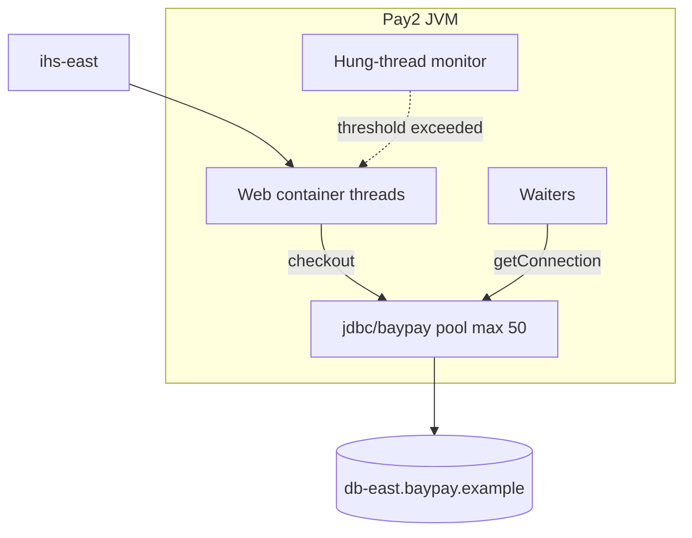

# L-5.4 — JVM configuration and pools

**Module:** 05 — WebSphere Network Deployment  
**Duration:** 30 minutes  
**Case study:** BayPay Financial Services (fictional)

---

## Why this matters

`Pay2` can be **STARTED**, heap can look calm, and Avery Chen still waits on `/payment`. The scarce resources on a WAS application server are **web-container threads** and **JDBC connections** (`jdbc/baypay` at **maxConnections = 50**), not the admin console’s green icon. Hung-thread policy is how the runtime *notices* a thread that has not returned — it is not a diagnosis and not a license to bounce the cell. INCIDENT-502 and INCIDENT-503 are this module’s pool-and-progress labs. Learn the gauges here; name the occupant only from evidence there.

---

## Learning objectives

- Separate heap/GC settings from the two pools that usually page BayPay: HTTP threads and JDBC.
- Use `maxConnections = 50` as the locked PaymentCluster default and do the replica math.
- Describe hung-thread detection as a threshold signal, not a crash.
- Choose a first response that sheds work or isolates a member, not “raise every max.”

---

## Concept explanation

Each application server (`Pay1`, `Pay2`, `Pay3`, `Ref1`, `Ref2`) is a JVM Morgan Hale sizes. Three knobs show up in every BayPay dump:

| Knob | What it limits | Typical miss |
|---|---|---|
| Heap (`-Xms`/`-Xmx`) | Object churn, caches, session bytes | Blame heap for a pool timeout |
| Web container thread pool | Concurrent HTTP work on that JVM | More threads than connections |
| JDBC `maxConnections` | Concurrent SQL on `jdbc/baypay` | 50 shared with another ear |

**Web container threads.** A request from `ihs-east` occupies one thread from arrival until the response is written. If that thread blocks in `DataSource.getConnection()` or on a remote call, it is still occupied. When the thread pool is exhausted, the plugin may still see a TCP accept — L-5.6 — while no worker is free to run `payment.ear`. STARTED plus an idle CPU can still mean **all workers are blocked**.

**JDBC pool.** L-5.3 bound `jdbc/baypay` at **50**. A thread that has a connection is one of those 50. A thread waiting for a connection is a **waiter**. Fifty in-use plus waiters is exhaustion. Causes you already know from L-4.3: leak (never returned), load (concurrency above 50), long transaction, or a noisy neighbor on the same name. This lesson does not pick among them for the incident labs.

**Hung-thread policy.** Traditional WAS watches web-container threads. If a thread runs longer than a configured threshold, the runtime logs a hung-thread warning and may dump stacks. The thread is usually still alive. The server stays STARTED. Hung is a **candidate** for “this request did not finish,” the same way Hikari leak detection is a candidate. Prove the stack. Do not bounce `dmgr-east`. Do not bounce all of `PaymentCluster` because one member logged hung threads.

**Thread-to-connection ratio.** If each JVM has 100 web threads and 50 connections, at least 50 threads can block in `getConnection()` under load. That is a design smell. Prefer fail-fast connection timeout so the thread returns an error to `ihs-east` instead of sitting until hung-thread detection fires.

Heap still matters (Module 7). It is the wrong first dashboard when p99 climbs and PMI already shows JDBC 50/50 or thread pool 100/100.

---

## Visual explanation



Alt text: Pay2 web-container threads borrow from a JDBC pool of 50 while a hung-thread monitor watches threads that do not return.

---

## Architecture

`PaymentCluster` has three JVMs. If each has its **own** pool of 50, `db-east` can see 150 payment sessions plus `RefundCluster` plus admin. If they share one cell definition that is not partitioned, you must read the actual PMI per server — do not assume 150. ARCHITECT-501 should write `3 × 50` as a **question**, not a fact, until Morgan confirms the DataSource scope.

`Pay2` and `Pay3` share `node-pay-2` but they do **not** share a JVM. Two heaps, two thread pools, two JDBC pools (unless the definition is truly process-shared, which it is not). A host-level CPU steal can still couple them.

Hung-thread dumps are per server. Collect `Pay2` before you ask for `Pay1`. Riley’s instinct to “restart the cluster” destroys the stack you need.

Greenfield Boot uses Tomcat threads plus Hikari. Same math, different names. Do not create a new ND JVM custom-property set for a new service.

---

## Production example

14:22 Pacific. Priya Nair: p99 on `/payment` is 12 seconds. Only some plugin members look slow. Riley opens the `Pay2` thread dump: many threads in `getConnection` or in a JDBC driver read. Heap occupancy is 42%. `dmgr-east` is healthy.

First sentences that are allowed: isolate the slow members at `ihs-east` if they are still taking traffic; capture PMI for `jdbc/baypay` and the web container; do not raise `maxConnections` yet. INCIDENT-502 will give you a pack where members **stop processing** while still advertising themselves. INCIDENT-503 will give you a pack where the pool sits at 50/50. This paragraph is not their RCA.

A second anti-pattern: Morgan sets hung-thread threshold to 10 seconds and enables interrupt. Payment posting that legitimately runs 12 seconds on a lock now gets interrupted mid-transaction. Avery Chen retries; idempotency may save the debit, or you may leave a half-written ledger. Tune hung-thread **above** a worst legitimate payment, and prefer connection/query timeouts over interrupting business threads.

---

## Code/configuration example

Paper JVM and pool card for `PaymentCluster` (teaching defaults, not a live console):

```text
Server:           Pay1 / Pay2 / Pay3
Heap:             -Xms1024m -Xmx2048m     (example only; Module 7 sizes for real)
Web container:    min 10  / max 50        (do not exceed JDBC max without a story)
JDBC jdbc/baypay: maxConnections = 50
                  connectionTimeout ~ 2s  (fail fast)
                  aged timeout / unused   (below firewall idle)
Hung thread:      detect after 120s
                  log + stack
                  do not interrupt payment threads as a first setting
```

Conceptual thread-vs-pool check Riley writes on the incident ticket:

```text
if webThreadsInUse == webMax and jdbcInUse < 50:
    blocked on something other than this pool (JMS, DNS, downstream)
if jdbcInUse == 50 and waiters > 0:
    pool exhaustion — prove leak vs load vs neighbor vs long SQL
if hungThreadWarnings > 0:
    stacks are evidence; STARTED is not a counter-argument
```

Do not paste IBM internal property dumps. The public idea is: interval, threshold, then a log. Interrupting is a separate, dangerous switch.

---

## Trade-offs

| Setting | Safer BayPay default | Risk |
|---|---|---|
| JDBC max 50 | Matches incident packs; forces isolation talk | Too small if you *also* share the pool with batch |
| Web max ≤ JDBC max | Threads fail at the pool instead of parking | Under-utilize CPU on a well-tuned SQL path |
| Short connection timeout | Fast 503, idempotent retry | Brief blips surface as errors (good, if clients retry) |
| Hung detect, no interrupt | You get stacks | Logs can be noisy |
| Hung interrupt enabled | Recovers a stuck thread pool | Tears a payment transaction |
| Raise max to 200 | Almost never first | `db-east` `too many connections` |

---

## Failure modes

- STARTED + hung threads + plugin still sending Avery Chen to that member.
- Web pool full, JDBC idle: you bounce “the database.”
- JDBC 50/50, DB CPU low: you bounce `db-east` anyway.
- Hung-thread interrupt mid-`AUTHORIZED` → `COMPLETED` write.
- One heap size copied to `Ref1` and `Pay1` despite different session and cache behavior.
- Treating a hung-thread message as a closed RCA (it is a stack, not a cause).

---

## Security/reliability implications

Thread dumps and PMI include SQL text, JNDI names, and sometimes user identifiers. Treat them as production data. Avery Chen’s customer UUID must not land in an unredacted Slack paste.

Reliability is **timeouts plus isolation**. A member that cannot complete work must leave the plugin. A pool that cannot give a connection must fail the request with a correlation id, not hang until IHS times out. Interrupt is a last resort because money movements are not idempotent at the JDBC driver layer — they are idempotent at the `Idempotency-Key` layer after a clean retry.

Do not expose unauthenticated PMI or admin HTTP on `was-pay-2.baypay.example`. Those ports are operator surface.

---

## Interview perspective

**Engineer.** Each WAS server has a thread pool and a JDBC pool of 50. Hung-thread logs mean a request ran too long. I would look at PMI before I restart.

**Senior.** I compare web-thread use to `jdbc/baypay` in-use. I will not raise max as the first fix. I know hung is not the same as stopped.

**Staff.** I isolate a member at the plugin, collect dumps, and separate leak, load, long SQL, and waiters. I size `members × 50` against Postgres. I disable thread interrupt on payment JVMs unless an ADR says otherwise.

**Principal.** I require thread and JDBC gauges on the payment SLO board. ND pool knobs stay until cutover; new services get Boot/Liberty pools with the same math. I will not fund a cell-wide max increase to hide a shared-pool design.

---

## Key takeaways

- STARTED does not mean the member is making progress.
- `jdbc/baypay` max 50 is the locked incident default; do the replica math.
- Hung-thread policy emits evidence; it does not name a root cause.
- Web threads waiting on JDBC are a ratio problem, not a heap problem.
- Isolate and measure before you bounce or raise limits.

---

## Knowledge check

1. `Pay2` is STARTED, heap is 40% used, and hung-thread warnings are firing. Is the member healthy?
2. Each of `Pay1`/`Pay2`/`Pay3` has a pool of 50. What should you ask about `db-east`?
3. Why is enabling hung-thread *interrupt* dangerous on `payment.ear`?

<details>
<summary>Spoiler — answers</summary>

1. No. STARTED plus hung threads means work is not completing. Health is progress, not process state.
2. Whether `max_connections` covers at least 150 payment sessions plus refund, admin, and other users.
3. It can tear a thread that is mid-SQL or mid-ledger write; retries need a clean failure and `Idempotency-Key`, not an interrupted transaction.

</details>

---

## Related lab

[INCIDENT-502 — Cluster members stop processing](../../../../labs/INCIDENT-502/README.md) and [INCIDENT-503 — JDBC pool exhaustion](../../../../labs/INCIDENT-503/README.md). Both hide the RCA. Use PMI, dumps, and plugin state — not this lesson — to name the occupant.

---

## Related PAKS

Optional: `docs/12-messaging-and-streaming/overview.md` (SIBus / events literacy — not a Kafka mandate) and `docs/27-production-failures/overview.md` (operate-to-leave, not a new cell). Hosted at [paks.bayareala8s.com](https://paks.bayareala8s.com) when your cohort has a login. This lesson stands alone without it.
