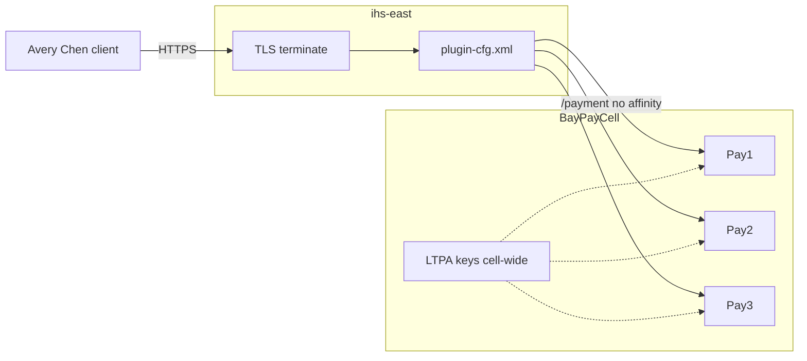

# L-5.5 — Security, SSL and sessions

**Module:** 05 — WebSphere Network Deployment  
**Duration:** 30 minutes  
**Case study:** BayPay Financial Services (fictional)

---

## Why this matters

`ihs-east` is where TLS for merchants should end. `BayPayCell` is where **LTPA** tokens and admin identities live. `payment.ear` is where a session must **not** live. If you terminate SSL on `Pay1` only, or you pin Avery Chen to `Pay2` with a sticky `JSESSIONID` because a draft payment sat in `HttpSession`, you have turned a money API into an affinity problem and widened PCI-shaped scope. L-4.4 already said the payment API is stateless. This lesson puts SSL, LTPA, and sessions on the ND path so ARCHITECT-501 does not draw a lock on the wrong hop.

---

## Learning objectives

- Place TLS termination at `ihs-east` and say what is still encrypted behind the plugin.
- Explain LTPA as cell-wide SSO for *browser* apps, not as an API key for `/payment`.
- Restate why the payment API must stay sessionless and why sticky sessions are a smell.
- Separate merchant TLS, admin-console access, and J2C aliases as different trust problems.

---

## Concept explanation

**IHS SSL.** Clients of Harbor Bike Co hit `https://ihs-east.baypay.example`. The certificate belongs on `ihs-east`. The plugin then forwards to `Pay1`/`Pay2`/`Pay3` on HTTP or HTTPS **inside** the data center. Public WAS practice: terminate at the edge, keep an internal trust story (private TLS or a controlled VLAN), never expose application-server HTTP to the internet.

**LTPA (Lightweight Third Party Authentication).** Traditional WAS issues an `LtpaToken2` cookie after a user registry login. Any server in `BayPayCell` that shares the LTPA keys can accept that cookie. That is how an old merchant **portal** ear single-signed onto a refund admin screen. It is **not** how `POST /payment` should authenticate. A token that is valid on every JVM in the cell is a blast-radius feature: steal the keys from `node-ref-1` and you impersonate on `Pay1`.

**Application identity versus admin identity.** Riley’s `payment.ear` should authenticate callers with an API credential or mTLS that you will design in later security modules — not with the WAS admin user Morgan uses on `dmgr-east`. Mixing those registries is how a console password resets a merchant.

**Sessions.** `HttpServletRequest.getSession()` creates server-side state keyed by `JSESSIONID`. The plugin can apply **affinity** so the same cookie returns to `Pay2`. Cluster members can **replicate** session bytes. Both exist because 2000s portal apps stored wizards in memory.

BayPay’s payment API conversation id is **`Idempotency-Key` plus the payment UUID** in the database. Avery Chen (`11111111-1111-1111-1111-111111111111`) may retry from any member. Sticky sessions on `/payment` are a **smell**: they hide a member that cannot process (INCIDENT-502’s symptom class), they pin a client to a mixed-version member during a roll (L-5.2), and they imply you stored something you should have stored in Postgres.

Portal ears may still need sessions. Draw them on a different URI group. Do not reuse that setting on the payment URI group.

**J2C and SSL keystores.** `baypayDbAlias` and IHS/CMS keystores are secrets. They are not “config.” Rotate them like production credentials. FFDC that prints connection URLs is a leak path (L-5.6).

---

## Visual explanation



Alt text: Merchants terminate TLS at ihs-east and reach Pay1 Pay2 Pay3 without sticky sessions; LTPA keys are cell-wide and are not the payment API credential.

---

## Architecture

ARCHITECT-501 should show three security domains, not one padlock:

| Domain | Where | What fails if it is wrong |
|---|---|---|
| Merchant TLS | `ihs-east` certificate | Clients reject the host; or HTTP leaks card-adjacent traffic |
| Application authn | `payment.ear` | Anyone who can reach the plugin can post a payment |
| Cell admin + LTPA | `dmgr-east`, shared keys | Full cell compromise |
| DataSource secret | `baypayDbAlias` | Payments pointed at an attacker database |

Internal plugin hops: if you leave `Pay*` HTTP open beyond the IHS subnet, SSL at the edge was theater.

Session replication across `PaymentCluster` would copy HttpSession to `Pay1`/`Pay2`/`Pay3`. That is extra heap and a consistency story you do not want for money. The architecture that matches L-4.4 and this cell: **no session on `/payment`**, database as source of truth, plugin load-balance without affinity.

Module 6 Liberty and Boot terminate TLS at a modern ingress. They still must not reintroduce `HttpSession` “for convenience.”

---

## Production example

A staff engineer proposes enabling plugin affinity “so Avery Chen’s retries hit the same JVM and we can keep the authorization draft in session until the merchant confirms.” That creates a draft money movement that dies with `Pay2`, is invisible to `Pay1`, and is invisible to the ledger. The production answer: persist `RECEIVED`/`VALIDATING` in the database with the `Idempotency-Key`. Any member can continue. Sticky is unnecessary.

A second proposal: “share LTPA with the new Spring Boot app so the portal stays logged in.” That exports cell keys into a runtime you are using to *leave* the cell. Prefer an explicit identity protocol (later modules) over stretching LTPA.

A third miss: certificate expires on `ihs-east` at 00:01. `Pay1` is fine. Merchants see a browser error. Priya Nair owns edge cert expiry; Riley does not bounce `payment.ear` for that page.

---

## Code/configuration example

Paper plugin / session stance for the payment URI group:

```text
# ihs-east
Listen 443
SSL certificate: ihs-east.baypay.example
Plugin: /opt/ihs/plugin-cfg.xml

# plugin behavior for /payment/*
Affinity:     off
Health:       HTTP check you will specify in L-5.6 — not TCP-only as a goal
URI group:    /payment/*  → PaymentCluster
              /refund/*   → RefundCluster
              /portal/*   → may use session; not in scope to enlarge
```

What `payment.ear` should *not* contain:

```java
// Smell — do not add this to the payment API
HttpSession session = request.getSession(true);
session.setAttribute("draftPayment", payment);
```

What it should use instead (contract you already have from Modules 1–3):

```text
Header: Idempotency-Key
Body:   customer 11111111-1111-1111-1111-111111111111
        account  22222222-2222-2222-2222-222222222221
Store:  payments table + idempotency record
Authn:  caller credential checked per request (not LtpaToken2)
```

LTPA keys stay in the cell for the legacy portal until that ear is retired. Document them as a **shared secret to revoke on exit**, not as a feature to extend.

---

## Trade-offs

| Choice | When it is acceptable | When it is not |
|---|---|---|
| TLS at IHS only | Internal plugin network is controlled | App HTTP is reachable from the internet |
| TLS IHS + member HTTPS | Extra internal confidentiality | Cert sprawl you never rotate |
| LTPA for portal SSO | Legacy browser ears already on it | Payment API or new Boot services |
| Sticky sessions | Old portal with large HttpSession | `/payment`, `/refund` APIs |
| Session replication | Portal you cannot rewrite this quarter | Money drafts, card data, idempotency |
| Per-request auth + DB | Payment and refund APIs | Never skip for “internal” plugin traffic |

---

## Failure modes

- Sticky `/payment` hides a member that is STARTED but not processing.
- Session-stored draft vanishes when `Pay2` dies; merchant double-clicks; you rely on luck instead of idempotency.
- LTPA keys copied to a jump box “for debugging.”
- Admin registry used as the merchant API user store.
- IHS cert expired; team restarts `dmgr-east`.
- HTTP between IHS and `Pay*` crossing an untrusted network without internal TLS.

---

## Security/reliability implications

TLS at `ihs-east` is the merchant confidentiality boundary. Plugin HTTP behind it is only safe if the network is. Fail closed: do not open application ports to `0.0.0.0/0` because “IHS is in front.”

LTPA and the admin console are **cell-equivalent** credentials. Rotate LTPA keys when an operator leaves. Restrict `dmgr-east` the way you restrict prod deploy.

Sessions enlarge heap (L-5.4) and enlarge PCI-adjacent scope if anyone stuffed an account number into `HttpSession`. Reliability follows: affinity turns a one-member hang into a customer-shaped outage. Sessionless plus `Idempotency-Key` turns a one-member hang into a retry on `Pay1`.

Frozen-account checks (`22222222-2222-2222-2222-222222222222`) must run on every request. A session that cached “this account was fine” is an authorization bug.

---

## Interview perspective

**Engineer.** SSL terminates on `ihs-east`. The payment API should not use HTTP sessions. LTPA is a WAS SSO cookie.

**Senior.** I will not enable sticky sessions on `/payment`. I keep merchant TLS, API auth, and cell admin as separate domains. I know LTPA keys are cell-wide.

**Staff.** I can explain how affinity hides a bad cluster member and how a session draft breaks retries. I terminate TLS at the edge and keep plugin membership drainable.

**Principal.** Sessionless money APIs are a standard, not a preference. I will not extend LTPA to Liberty/Boot as a migration shortcut. I fund edge cert operations and an explicit identity story for the exit.

---

## Key takeaways

- Merchant TLS belongs on `ihs-east`; the plugin path still needs a trust story.
- LTPA is cell-wide SSO for legacy browsers, not the payment API credential.
- `/payment` stays sessionless: `Idempotency-Key` and the database, not `JSESSIONID`.
- Sticky sessions are a smell on the payment URI group.
- Admin console, J2C aliases, and LTPA keys are root-equivalent secrets.

---

## Knowledge check

1. Where should the public certificate for merchant HTTPS live in `BayPayCell`’s path?
2. Why are sticky sessions a smell specifically for `POST /payment`?
3. A proposal shares LTPA keys with a new Boot service so the portal stays signed in. What do you answer?

<details>
<summary>Spoiler — answers</summary>

1. On `ihs-east` (edge termination), not on `dmgr-east` and not only on one `Pay*` JVM.
2. They pin Avery Chen to one member, hide a STARTED-but-stuck JVM, and usually mean you stored a money draft in session instead of the database.
3. No. LTPA is a cell secret. The new service gets its own identity protocol; stretching LTPA grows the estate you are exiting.

</details>

---

## Related lab

[ARCHITECT-501 — Design WebSphere ND BayPay](../../../../labs/ARCHITECT-501/README.md). Mark TLS termination, LTPA scope, and a sessionless `/payment` URI group on the portfolio drawing.

---

## Related PAKS

Optional: `docs/12-messaging-and-streaming/overview.md` (SIBus / events literacy — not a Kafka mandate) and `docs/27-production-failures/overview.md` (operate-to-leave, not a new cell). Hosted at [paks.bayareala8s.com](https://paks.bayareala8s.com) when your cohort has a login. This lesson stands alone without it.
