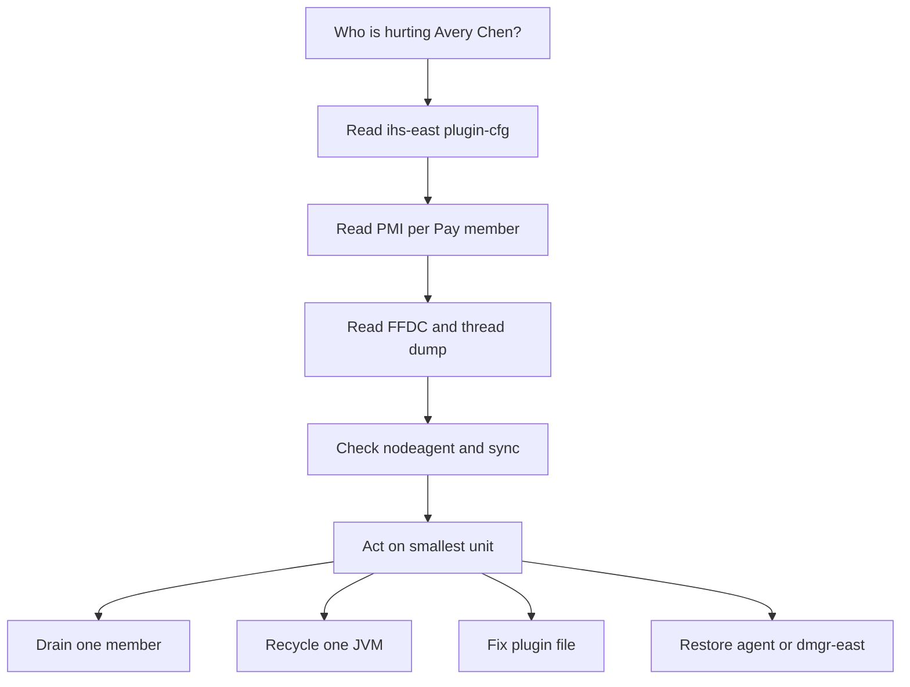

# L-5.6 — Operations and troubleshooting

**Module:** 05 — WebSphere Network Deployment  
**Duration:** 30 minutes  
**Case study:** BayPay Financial Services (fictional)

---

## Why this matters

Priya Nair, Riley Okonkwo, and Morgan Hale do not share one bounce button. `BayPayCell` fails in layers: edge plugin, application JVM, node agent, DMGR, pool, bus, database. The public tools that tell those layers apart are **FFDC**, **PMI**, **node-agent health**, **`plugin-cfg.xml`**, and **synchronize** state. This course gives you dumps, not a laptop cell. If you cannot read those artifacts, you will restart `dmgr-east` while Avery Chen is pinned to a STARTED `Pay2` that is not working. INCIDENT-502, INCIDENT-503, and INCIDENT-504 are where you apply this. The lessons do not hand you those RCAs.

---

## Learning objectives

- Name what FFDC and PMI are for, and what they are not (not a root-cause sentence by themselves).
- Check node-agent health and sync **before** you trust the console edition or bounce a member.
- Read `plugin-cfg.xml` as the file that actually receives merchant traffic.
- Choose a bounce order that preserves evidence and minimizes blast radius.

---

## Concept explanation

**FFDC (First Failure Data Capture).** When a WAS runtime hits certain exceptions, it writes a snapshot: exception text, class names, sometimes JNDI and thread context. You will receive FFDC excerpts in incident packs. Use them as **timestamps and stack evidence**. They are not IBM confidential internals; they are the public idea “the server wrote the first failure.” A pile of FFDC files can be a symptom storm after the first fault. Sort by time. Correlate with Avery Chen’s `Idempotency-Key` if the pack includes it.

**PMI (Performance Monitoring Infrastructure).** Per-server counters: web-container threads, JDBC pool in-use / waiters / max, session counts, SIBus depths if enabled. INCIDENT-503 will show you a pool at its cap. Read **which server** and **which DataSource name**. Cell-wide averages hide `Pay1` healthy / `Pay2` 50/50.

**Node-agent health.** `nodeagent-pay-1`, `nodeagent-pay-2`, `nodeagent-ref-1` must be up for Morgan to sync and for the console to start or stop servers honestly. An agent that is restarting is a **deploy gate** (L-5.2), not proof that `Pay2` is down. If the agent is down and the JVM is up, you can still drain at `ihs-east` using the plugin file already on disk.

**plugin-cfg.xml.** Priya’s source of truth for “who is in rotation.” Compare it to the cluster membership Morgan sees. Drift: extra hosts, missing `Pay3`, wrong ports (`9080` vs `9081` on `was-pay-2`). Health checks matter. A check that only proves TCP accept will keep a member that cannot run `payment.ear`. You will see plugin-versus-JVM disagreement in at least one incident; describe the symptom, then prove it from the pack.

**Synchronize.** After any install or resource change, the node repository must match `dmgr-east`. Incomplete sync is how members disagree (L-5.2). Operations move: check sync **before** you conclude “the ear is bad” or “JNDI is gone.”

**What to bounce** — smallest unit that restores service **after** you have dumps:

| Symptom class | Prefer | Avoid first |
|---|---|---|
| One member not progressing | Drain at plugin, then recycle that JVM | Cluster ripple restart |
| Plugin stale | Regenerate and propagate `plugin-cfg.xml` | Restart `Pay1` |
| Console down, payments up | Restore `dmgr-east` only | Bounce `PaymentCluster` |
| Node agent down, JVM up | Recover the agent; drain if you need a sync | Kill `Pay2`/`Pay3` “to match” |
| Pool 50/50 | Identify the borrower; stop *that* work | Raise max; restart Postgres |
| Unknown | Capture PMI + FFDC + thread dump | `stopServer` on everything |

You do **not** install ND to practice this. You read the files the labs ship.

---

## Visual explanation



Alt text: Operators read plugin, PMI, FFDC, and node-agent sync before they drain or bounce the smallest BayPayCell unit.

---

## Architecture

Operations roles on the locked cell:

| Person | First artifacts |
|---|---|
| Priya Nair (SRE) | `ihs-east` access log, plugin file, edge TLS, synthetic probe |
| Riley Okonkwo (app on-call) | `payment.ear` logs, FFDC, thread dump, correlation id |
| Morgan Hale (WAS admin) | Console/server state, sync, node agents, JNDI bindings, PMI |
| Jordan Voss (release) | Which edition was targeted, whether the window is still open |

ARCHITECT-501 should include an operations inset: where dumps live conceptually (`logs`, `ffdc`, plugin path) even though students never create those directories. Module 6 will replace this with `server.xml` and container logs. Until then, the cell is operable only if these roles do not bounce each other’s layer.

`Pay2` and `Pay3` share `node-pay-2`. A “bounce the node” idea is a two-member outage. Say the server name.

---

## Production example

02:10 Pacific. Merchants report intermittent `/payment` failures. Priya sees `ihs-east` still routing to all three members. Riley sees successes with `Pay1` in the host header and failures without a clear host. Morgan’s console shows every server STARTED.

Legal first moves: pull plugin-cfg, pull per-member PMI, pull FFDC around 02:10, ask whether a deploy or agent restart happened (Jordan’s window). Illegal first move: ripple-stop `PaymentCluster`. That is how you lose the hung stacks and the 50/50 graph the labs are about to give you.

You may find members that do not process, a pool that will not give connections, or a deploy that did not land evenly. Those are the **shapes** of INCIDENT-502, INCIDENT-503, and INCIDENT-504. Stabilize by removing bad members from rotation and making the cluster consistent. The dumps name the mechanism. These sentences do not.

---

## Code/configuration example

Paper evidence bundle the on-call collects (paths are conventional public WAS layout, not a live profile):

```text
# Per server, e.g. Pay2 on node-pay-2
logs/Pay2/SystemOut.log
logs/Pay2/SystemErr.log
logs/ffdc/*Pay2*
thread dump / javacore at time of hang

# PMI snapshot
Server: Pay2
  WebContainer threads: inUse / max
  DataSource jdbc/baypay: inUse / waiters / max=50
  Sessions: live count   (should be ~0 on /payment)

# Edge
ihs-east.baypay.example: plugin-cfg.xml
  PaymentCluster members listed?
  Ports 9080 / 9081 match Pay2 / Pay3?
  Health check type: TCP vs HTTP

# Management
nodeagent-pay-1 / nodeagent-pay-2 / nodeagent-ref-1 : up?
sync status node-pay-1, node-pay-2, node-ref-1
dmgr-east: needed only if you must change config
```

Bounce decision card (print this in the runbook you write for ARCHITECT-501 — synthetic, not an employer doc):

```text
1. Evidence first (above)
2. Drain PayN from plugin-cfg (or mark down)
3. Recycle that one JVM if needed
4. Confirm edition + JNDI on that node after sync
5. Re-add to plugin
Never: bounce dmgr-east to fix merchant HTTP
Never: bounce db-east because a WAS pool is full
```

---

## Trade-offs

| Action | Restores | Destroys |
|---|---|---|
| Drain one member | Stops sending Avery Chen to a bad JVM | Capacity (`Pay2`+`Pay3` drain is large) |
| Recycle one JVM | Clears thread and pool state | In-flight requests; dumps if you skip capture |
| Plugin regenerate | Fixes membership / ports | Bad generate can drop all members |
| Sync now | Aligns node to DMGR | Pushes a bad cell edition to a healthy node |
| Restore DMGR | Admin path | Nothing for in-flight payments — do it off the critical path |
| Ripple cluster | Feels decisive | Evidence, capacity, and often the wrong layer |

---

## Failure modes

- Bouncing `dmgr-east` because the console is the only tool someone knows.
- Trusting STARTED without PMI or a dump.
- Trusting a TCP plugin check as application health.
- Syncing a broken cell edition onto the last good node.
- Restarting `db-east` for a 50/50 WAS pool.
- Pasting unredacted FFDC (aliases, URLs, customer ids) into a public ticket.
- Opening `solutions/` before writing a hypothesis — the labs are gated for a reason.

---

## Security/reliability implications

FFDC, PMI, and javacores are **production data**. They can contain `baypayDbAlias` usage, SQL, and Avery Chen’s identifiers. Redact before they leave the incident channel.

Reliability is drain-then-fix. A member left in rotation after you know it cannot process is a self-inflicted error budget burn. A cluster bounce that takes `Pay1` (the only member on `node-pay-1`) together with the sick node removes your last good payment JVM.

Admin actions on `dmgr-east` during an incident change the evidence. Prefer read-only PMI and file copies until you have a written stabilize step.

This is still a **source** estate. Do not invent a more elaborate ND operations platform. Document enough to survive until Module 6’s waves, then shrink the cell.

---

## Interview perspective

**Engineer.** FFDC is a first-failure file. PMI has thread and JDBC counters. I would look at those before I restart. The plugin file is what IHS uses.

**Senior.** I drain a member at `ihs-east` before I recycle it. I check node agents and sync before I trust a deploy. I will not bounce the DMGR to fix `/payment`.

**Staff.** I can run a layered RCA: plugin membership, per-JVM PMI, FFDC time order, then one bounce. I know STARTED plus TCP health is not progress. I keep incident artifacts redacted.

**Principal.** I staff ND operations as a shrinking skill: gauges, drain discipline, and a written exit. I will not fund a new traditional cell to make troubleshooting “easier.” I judge on-call quality by evidence collected, not by how fast the cluster restarted.

---

## Key takeaways

- FFDC and PMI are evidence; they do not replace a written hypothesis.
- Node-agent health and sync decide whether the console is telling the truth.
- `plugin-cfg.xml` is the merchant rotation file — read it, then drain it.
- Bounce the smallest unit after dumps; never `dmgr-east` first for HTTP.
- Diagnose INCIDENT-502/503/504 from packs, not from this lesson’s examples.

---

## Knowledge check

1. Payments work; the admin console does not. What do you restore, and what do you not bounce?
2. Why is a TCP-only plugin health check a reliability smell for `PaymentCluster`?
3. List the first four artifacts you collect for a “some `/payment` fail” page before any restart.

<details>
<summary>Spoiler — answers</summary>

1. Restore `dmgr-east`. Do not bounce `Pay1`/`Pay2`/`Pay3` — they are already serving.
2. TCP accept can succeed while web threads are stuck or the app cannot complete work, so IHS keeps sending Avery Chen to a dead member.
3. `plugin-cfg.xml` membership, per-member PMI (threads + `jdbc/baypay`), FFDC/logs around the window, node-agent and sync status (plus a thread dump if hung).

</details>

---

## Related lab

[INCIDENT-502](../../../../labs/INCIDENT-502/README.md), [INCIDENT-503](../../../../labs/INCIDENT-503/README.md), and [INCIDENT-504](../../../../labs/INCIDENT-504/README.md) — cluster members stop processing, JDBC pool exhaustion, deployment failure. Write the hypothesis from dumps. Do not open `solutions/` first. ARCHITECT-501’s operations inset is the portfolio home for the bounce card.

---

## Related PAKS

Optional: `docs/12-messaging-and-streaming/overview.md` (SIBus / events literacy — not a Kafka mandate) and `docs/27-production-failures/overview.md` (operate-to-leave, not a new cell). Hosted at [paks.bayareala8s.com](https://paks.bayareala8s.com) when your cohort has a login. This lesson stands alone without it.
