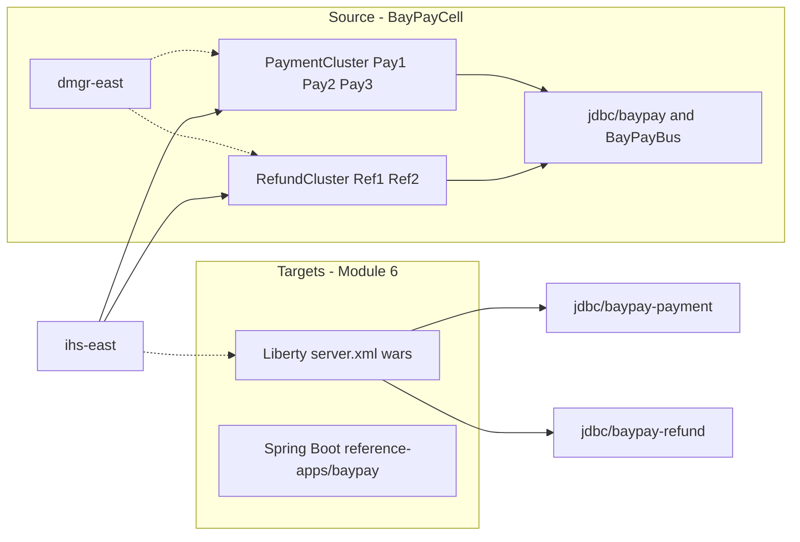

# L-6.1 — Traditional WebSphere vs Liberty

**Module:** 06 — WebSphere Liberty Modernization  
**Duration:** 30 minutes  
**Diagram:** AEJE-D-023  
**Case study:** BayPay Financial Services (fictional)

---

## Why this matters

`BayPayCell` still serves Avery Chen’s active USD account (`22222222-2222-2222-2222-222222222221`) from `payment.ear` on `PaymentCluster`. That is the **source**. Liberty (and the Spring Boot app in `reference-apps/baypay`) is the **target**. If you treat them as the same “WebSphere,” you will copy DMGR, node agents, and cell-wide `jdbc/baypay` into a container platform and call it modernization. This lesson draws the split so Module 6 can move BayPay **from** traditional ND **toward** Liberty without recommending a new cell.

---

## Learning objectives

- Name what traditional ND owns (cell, DMGR, node agents, cluster membership, cell JNDI) versus what Liberty owns (`server.xml`, features, one process).
- Place `BayPayCell` as source estate and Liberty / Boot as the two allowed targets.
- State why `reference-apps/baypay` remains the teaching app while Liberty is the ear-compatible path.
- Refuse a greenfield traditional ND cell for a new BayPay service.

---

## Concept explanation

**Traditional WebSphere ND** is a *management plane plus many JVMs*. `dmgr-east` holds the master repository. Node agents on `node-pay-1`, `node-pay-2`, and `node-ref-1` sync files. `Pay1` / `Pay2` / `Pay3` run `payment.ear`; `Ref1` / `Ref2` run `refund.ear`. Bindings live in a cell tree: `jdbc/baypay`, `jms/paymentEvents` on SIBus `BayPayBus`. Operators use a console. That model is why BayPay still has ears. It is not a 2026 starting position.

**Liberty / Open Liberty** is a *composable Jakarta runtime*. You enable features by name, write `server.xml`, and start one JVM. There is no Deployment Manager in the default story. There is no cell-wide JNDI tree. A payment Liberty process binds `jdbc/baypay-payment`; a refund process binds `jdbc/baypay-refund`. Packaging for the migrated ears is `payment-service.war` / `refund-service.war`. Config is files on disk — the graded artifact in this module.

**Spring Boot** in `reference-apps/baypay` remains the **teaching and greenfield** runtime: Java 21, Boot 3.5.5, fat JAR, `spring.datasource.*`. You do not abandon it because Liberty appears. You use Liberty when the ear must stay an ear (Jakarta APIs, existing WAR structure) on the Module 6 timeline. You use Boot when you are writing or teaching the modular monolith.

| Concern | Traditional ND (source) | Liberty (ear path) | Spring Boot (teaching app) |
|---|---|---|---|
| Process model | DMGR + node agents + servers | One JVM + `server.xml` | Fat JAR embeds Tomcat |
| HTTP | Web container on `Pay*` / `Ref*` | `servlet-6.0` | Embedded servlet container |
| DataSource | Cell `jdbc/baypay` | `jdbc/baypay-payment` / `jdbc/baypay-refund` | `BAYPAY_DB_*` / Hikari |
| Messaging | SIBus `BayPayBus` | JMS feature or leave on ND until a wave | In-process events today |
| Deploy | Ear targeted at a cluster | `webApplication` in XML | JAR + platform start |
| Cluster | `PaymentCluster` / `RefundCluster` | Replicas + `ihs-east` or a mesh | Replicas + a load balancer |

Open Liberty is the open runtime with the same `server.xml` dialect. You may install it locally to sanity-check XML. This course never requires that install, and it never requires licensed ND.

---

## Visual explanation



Alt text: BayPayCell with PaymentCluster and RefundCluster is the ND source; Liberty wars and the Spring Boot teaching app are the targets with isolated DataSources.

Diagram AEJE-D-023 is the course current-state / target-state drawing of this same split.

---

## Architecture

Read [datasets/baypay-cell/TOPOLOGY.md](../../../../datasets/baypay-cell/TOPOLOGY.md). The merchant path today is Harbor Bike Co → `ihs-east` → `PaymentCluster` / `RefundCluster` → `jdbc/baypay` and `BayPayBus` → `db-east.baypay.example:5432`. Module 6 does not delete that path on day one. It adds a Liberty path that `ihs-east` can send **refund** to first (wave 1) and a **payment canary** later (wave 2).

Do not draw a Liberty “cell.” Do not invent `dmgr-liberty`. A Liberty payment replica is a process with files: features, a DataSource name that is **not** `jdbc/baypay`, and `payment-service.war`. Scale by starting another replica, not by federating a node.

The Boot monolith in `reference-apps/baypay` already composes payment and refund modules in one JVM for teaching. That is allowed. Liberty’s job is the **existing ears**, not a rewrite of the course’s reference app.

ARCHITECT-501 asked you to draw the source. This lesson asks you to label the exit. Capstone 2 will assume both pictures.

---

## Production example

Jordan Voss proposes “we understand WebSphere, so the new FX quote service should be another ear on `PaymentCluster` — `jdbc/baypay` is already there.” Morgan Hale can install it by Friday. Priya Nair will then page Riley Okonkwo when quote traffic shares the pool of 50 with Avery Chen’s `POST /payment`.

The production-quality answer: the FX service is **greenfield**. It goes to Boot or Liberty with its own pool and its own config. `BayPayCell` stays on life support until waves 1–3 finish. Adding an ear grows the estate you are exiting.

A second hour: finance asks “are we an IBM WebSphere shop?” BayPay the case study is fictional. The engineering answer is still: we **operate** ND until cutover; we **invest** in Liberty files and the Boot teaching runtime. We do not buy a second traditional cell.

---

## Code/configuration example

Source estate — paper inventory, not a laptop profile:

```text
Cell:     BayPayCell
Clusters: PaymentCluster (Pay1, Pay2, Pay3) → payment.ear /payment
          RefundCluster  (Ref1, Ref2)       → refund.ear  /refund
JNDI:     jdbc/baypay   (shared — smell)
          jms/paymentEvents, jms/refundEvents on BayPayBus
Edge:     ihs-east.baypay.example
```

Liberty target — files on disk (no live server required):

```xml
<server description="baypay-payment-target">
  <featureManager>
    <feature>servlet-6.0</feature>
    <feature>jdbc-4.3</feature>
    <feature>jndi-1.0</feature>
    <feature>persistence-3.1</feature>
  </featureManager>
  <dataSource id="baypayPayment" jndiName="jdbc/baypay-payment">
    <jdbcDriver libraryRef="pg"/>
    <properties.postgresql serverName="${BAYPAY_DB_HOST}" databaseName="baypay"
                           user="${BAYPAY_DB_USER}" password="${BAYPAY_DB_PASSWORD}"/>
  </dataSource>
  <webApplication location="payment-service.war" contextRoot="/payment"/>
</server>
```

Boot teaching app — still the local runtime you run in Modules 1–4:

```text
reference-apps/baypay  →  fat JAR  →  spring.datasource.url=${BAYPAY_DB_URL}
```

---

## Trade-offs

| Choice | Choose when | Do not choose when |
|---|---|---|
| Keep ND serving | Waves 0–2; refund or payment not yet cut over | Greenfield; “the team knows the console” |
| Liberty wars | Ear must stay Jakarta this quarter | You can finish a Boot module and have no ear constraint |
| Spring Boot | Teaching, new modules, already-modular monolith | You must ship the unchanged ear next sprint |
| Shared `jdbc/baypay` | Never as a target | You are copying the cell into Liberty |

Liberty is faster to operate than ND and slower to rewrite than “just Boot.” That is the point of an ear-compatible path.

---

## Failure modes

- Calling Liberty “WebSphere” and recreating DMGR, node agents, and a cell JNDI tree.
- Putting a new service on `PaymentCluster` because the DataSource already exists.
- Treating the Boot teaching app as deprecated once `server.xml` appears.
- Keeping the name `jdbc/baypay` on Liberty so both runtimes share one conceptual pool.
- Requiring a licensed ND install to “practice modernization.”
- Declaring the cell HA because it has five app JVMs and one database.

---

## Security/reliability implications

Whoever binds `jdbc/baypay` on `dmgr-east` can point every ear at a hostile database. Whoever commits a password into Liberty `server.xml` has published the same secret in git. Reliability is not “three `Pay*` members.” It is isolated pools, timeouts, and an exit plan. A Liberty replica behind `ihs-east` is a new failure domain only if its DataSource, threads, and logs are its own.

Do not share `BayPayBus` as a hidden coupling while calling the war “modern.” Messaging moves when a wave says so, not because the HTTP container changed brands.

---

## Interview perspective

**Engineer.** ND is BayPay’s current cell. Liberty uses `server.xml` and features. The teaching app is still Spring Boot. I would not install ND for this course.

**Senior.** I can map DMGR/node agent to “files + one process.” I keep `jdbc/baypay` on the cell and `jdbc/baypay-payment` on Liberty. I would not put a new FX service on `PaymentCluster`.

**Staff.** I treat ND as a shrinking source estate. Liberty is the ear path; Boot is the teaching and greenfield path. I can explain what `ihs-east` will send where during dual-run.

**Principal.** I will not fund a new traditional cell. I will fund `server.xml` on disk, isolated pools, and a written exit. ND literacy is how we leave, not how we grow.

---

## Key takeaways

- `BayPayCell` is source; Liberty and Boot are targets.
- Liberty is the ear-compatible path; `reference-apps/baypay` stays the teaching app.
- Isolated names: `jdbc/baypay-payment` and `jdbc/baypay-refund`, not cell-wide `jdbc/baypay`.
- Paper plus `server.xml` is enough; live ND and live Liberty are not required.
- Traditional ND is not a greenfield recommendation.

---

## Knowledge check

1. Avery Chen still pays through `Pay1`. What is the source runtime, and what are the two allowed targets for new or migrated work?
2. Why is Liberty the path for `payment.ear` this quarter instead of rewriting the teaching Boot app?
3. Why is “add the FX quote ear to `PaymentCluster`” the wrong default?

<details>
<summary>Spoiler — answers</summary>

1. Source is traditional ND (`BayPayCell` / `PaymentCluster`). Targets are Liberty (`server.xml` wars) and Spring Boot (`reference-apps/baypay`).
2. The ear must stay Jakarta-packaged on the Module 6 timeline; Boot remains the teaching monolith, not a forced rewrite of every ear this quarter.
3. It grows the source estate, shares `jdbc/baypay`, and treats traditional ND as greenfield.

</details>

---

## Related lab

[MODERNIZE-601 — WebSphere-to-Liberty assessment](../../../../labs/MODERNIZE-601/README.md). Label source vs target from [TOPOLOGY.md](../../../../datasets/baypay-cell/TOPOLOGY.md). Paper plus files; no cell install.

---

## Related PAKS

Optional: `docs/14-microservices/service-decomposition-and-ddd.md` (why payment and refund are separate targets). This lesson stands alone without a PAKS login.
