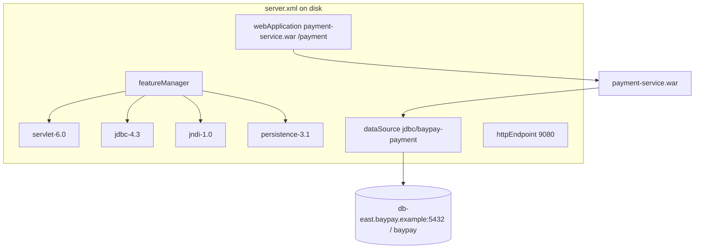

# L-6.2 — Liberty features and server.xml

**Module:** 06 — WebSphere Liberty Modernization  
**Duration:** 30 minutes  
**Diagram:** AEJE-D-024  
**Case study:** BayPay Financial Services (fictional)

---

## Why this matters

On `BayPayCell`, Morgan Hale clicks a JDBC provider and a cluster target. On Liberty, **the file is the server**. If `featureManager` omits `jdbc-4.3`, `payment-service.war` has no DataSource API. If you copy `jdbc/baypay` into that file, you have moved the shared-pool smell from the cell into XML. Avery Chen’s `POST /payment` should look up `jdbc/baypay-payment` on a payment replica — not a cell-wide name. This lesson is the dialect of Module 6: features, DataSource, and `webApplication`, on disk.

---

## Learning objectives

- Enable the locked feature set: `servlet-6.0`, `jdbc-4.3`, `jndi-1.0`, `persistence-3.1`.
- Write a `dataSource` that binds `jdbc/baypay-payment` or `jdbc/baypay-refund`, not `jdbc/baypay`.
- Deploy with `webApplication` to `/payment` or `/refund` using `payment-service.war` / `refund-service.war`.
- Explain why a missing feature is a startup/config defect, not a “WAS console” defect.

---

## Concept explanation

Liberty starts with almost nothing. **`featureManager`** is the contract list. BayPay’s Module 6 set is fixed so assessments stay comparable:

| Feature | What it gives the war |
|---|---|
| `servlet-6.0` | Jakarta Servlet 6 HTTP; `jakarta.servlet.*` |
| `jdbc-4.3` | JDBC driver / DataSource programming model |
| `jndi-1.0` | `InitialContext.lookup` for the names you bind |
| `persistence-3.1` | Jakarta Persistence 3.1 if the war still uses JPA |

You may see other features in vendor samples (`mpConfig`, `jms-3.1`, `appSecurity`). Do not add them in this course unless a lab says so. Extra features enlarge the attack surface and the class space.

**`dataSource`** replaces the cell JDBC document. Attributes that matter here: `id`, `jndiName`, a `jdbcDriver` / `libraryRef` for the PostgreSQL-compatible jar, and `properties.postgresql` (or equivalent) that read **variables**, not committed passwords. `connectionManager maxPoolSize` is the Liberty analogue of WAS `maxConnections = 50`. Do not blindly copy 50 onto a refund replica that never needed it.

**`webApplication`** replaces “install ear on `PaymentCluster`.” `location` is the war file. `contextRoot` must stay `/payment` or `/refund` so `ihs-east` URI groups do not have to be rewritten on day one. Liberty can install an EAR; BayPay’s **target packaging** is still the two wars. The Boot fat JAR is not dropped into this `webApplication`.

**`httpEndpoint`** binds host and ports. That is how a replica becomes a plugin member later. You do not federate a node agent to get a port.

There is no cell-wide tree. If refund XML still says `jndiName="jdbc/baypay"`, you have failed the isolation rule in [TOPOLOGY.md](../../../../datasets/baypay-cell/TOPOLOGY.md).

---

## Visual explanation



Alt text: Liberty server.xml enables four features, binds jdbc/baypay-payment, and deploys payment-service.war at /payment.

Diagram AEJE-D-024 is the course component view of this file.

---

## Architecture

One Liberty **process** equals one war’s runtime. Payment XML lives with `payment-service.war` and `jdbc/baypay-payment`. Refund XML lives with `refund-service.war` and `jdbc/baypay-refund`. They may point at the same database `baypay` on `db-east.baypay.example` — they must not share a pool definition.

`ihs-east` can list a Liberty httpPort next to `Pay1` / `Pay2` / `Pay3` during wave 2. That is a plugin membership change, not a new `PaymentCluster` member inside `BayPayCell`. Do not draw the Liberty JVM under `node-pay-1`.

The teaching app in `reference-apps/baypay` already maps HTTP and JDBC without `featureManager`. When a lab asks you to adapt BayPay for Liberty, you are writing the **ear path** config, not converting the Boot module graph into features.

SIBus is not a Liberty feature you enable to “get `BayPayBus`.” Wave-1 refund HTTP can move while `jms/refundEvents` still lands on the cell, if the assessment says so. Do not invent a silent SIBus clone in `server.xml`.

---

## Production example

Riley Okonkwo deploys `payment-service.war` and gets `ClassNotFoundException: jakarta.servlet.http.HttpServlet`. Morgan looks for a missing shared library on `node-pay-2`. Wrong plane. The Liberty process never had `servlet-6.0` in `featureManager`. Fix the file; do not open the ND console.

A second hour: the war starts, then `NameNotFoundException: jdbc/baypay`. Someone “helped” by copying the cell name into XML so “lookups would not change.” Payment and refund Liberty replicas now contend like INCIDENT-503’s shared pool. Rename to `jdbc/baypay-payment`, change the war’s resource-ref, and keep refund on its own bind.

Jordan Voss asks whether they must start Open Liberty in CI to grade MODERNIZE-602. No. XML on disk plus a review that the four features and isolated JNDI names are present is the course bar. A local Open Liberty start is optional confirmation.

---

## Code/configuration example

Payment replica — the file students should be able to write from memory:

```xml
<server description="baypay-payment">
  <featureManager>
    <feature>servlet-6.0</feature>
    <feature>jdbc-4.3</feature>
    <feature>jndi-1.0</feature>
    <feature>persistence-3.1</feature>
  </featureManager>

  <httpEndpoint id="defaultHttpEndpoint" host="*" httpPort="9080" httpsPort="9443"/>

  <library id="pg">
    <fileset dir="${shared.resource.dir}/jdbc" includes="postgresql-*.jar"/>
  </library>

  <dataSource id="baypayPayment" jndiName="jdbc/baypay-payment">
    <jdbcDriver libraryRef="pg"/>
    <connectionManager maxPoolSize="20"/>
    <properties.postgresql serverName="${BAYPAY_DB_HOST}" portNumber="5432"
                           databaseName="baypay"
                           user="${BAYPAY_DB_USER}"
                           password="${BAYPAY_DB_PASSWORD}"/>
  </dataSource>

  <webApplication location="payment-service.war" contextRoot="/payment"/>
</server>
```

Refund replica — same features, different name and war:

```xml
<dataSource id="baypayRefund" jndiName="jdbc/baypay-refund">
  <jdbcDriver libraryRef="pg"/>
  <connectionManager maxPoolSize="10"/>
  <properties.postgresql serverName="${BAYPAY_DB_HOST}" databaseName="baypay"
                         user="${BAYPAY_DB_USER}" password="${BAYPAY_DB_PASSWORD}"/>
</dataSource>
<webApplication location="refund-service.war" contextRoot="/refund"/>
```

Do not paste passwords into either file. L-6.4 moves them to `server.env`.

---

## Trade-offs

| Choice | Why | Cost |
|---|---|---|
| Minimal four features | Matches Jakarta 10-era wars; reviewable | No JMS/security until you add them on purpose |
| One war per server | Blast radius and pool isolation | Two XML files to keep in sync on features |
| Keep `/payment` context | `ihs-east` URI groups stay stable | War must not assume `/` |
| `maxPoolSize` per replica | Honest capacity | Operators must size *replicas × pool*, not copy WAS 50 |
| XML on disk vs live server | $0 labs, git-reviewable | You will not see Liberty runtime messages unless you opt in |

---

## Failure modes

- Omitting `jndi-1.0` and treating lookup failure as a database outage.
- Enabling every feature in a vendor “full profile” sample and shipping unused security/JMS.
- Binding `jdbc/baypay` on Liberty “for compatibility.”
- Deploying the Boot fat JAR as a `webApplication` and getting two servers in one JVM.
- Copying WAS `maxConnections = 50` onto every replica without a workload story.
- Editing XML on one host and leaving the canary on a different feature set (edition skew, L-5.2 class of bug).

---

## Security/reliability implications

`server.xml` is production config. Commit it; treat a surprise feature add like a surprise ear install. JDBC library paths must point at a pinned driver, not “whatever jar is in the shared folder.” `host="*"` on `httpEndpoint` is a listen-address decision — pair it with `ihs-east` TLS, do not expose the Liberty httpPort as the public merchant edge.

Reliability: a feature mismatch is a **total** outage for that replica (it will not serve `/payment`). That is better than ND’s “STARTED but old bits” if you fail the start, and worse if nobody watches startup. Gate traffic on a successful feature + lookup probe, not on process existence.

---

## Interview perspective

**Engineer.** Liberty config is `server.xml`. I enable `servlet-6.0`, `jdbc-4.3`, `jndi-1.0`, `persistence-3.1`. The war is `payment-service.war` at `/payment`.

**Senior.** I bind `jdbc/baypay-payment`, not `jdbc/baypay`. A missing feature is a config bug. I do not drop the Boot JAR into Liberty.

**Staff.** I size `maxPoolSize` per replica and keep refund on its own XML. I can explain how `ihs-east` will call the httpPort without federating a node.

**Principal.** Features are the runtime bill of materials. I review `server.xml` like I review Terraform. I will not accept a Liberty port that recreates cell-wide JNDI.

---

## Key takeaways

- `featureManager` is the server; the four locked features are the Module 6 bill of materials.
- `dataSource` binds isolated names: `jdbc/baypay-payment` and `jdbc/baypay-refund`.
- `webApplication` deploys the wars at `/payment` and `/refund`.
- Files on disk are the deliverable; Open Liberty is optional.
- Do not import `jdbc/baypay` or the Boot fat JAR into this XML.

---

## Knowledge check

1. Which four features must appear in BayPay’s Module 6 `featureManager`?
2. What JNDI name should a payment Liberty replica bind, and which name is the source-estate smell?
3. Why is deploying `reference-apps/baypay` as a `webApplication` the wrong packaging?

<details>
<summary>Spoiler — answers</summary>

1. `servlet-6.0`, `jdbc-4.3`, `jndi-1.0`, `persistence-3.1`.
2. Bind `jdbc/baypay-payment`. `jdbc/baypay` is the shared cell DataSource you are leaving.
3. The teaching app is a Boot fat JAR with its own embedded server; Liberty’s ear path is `payment-service.war` / `refund-service.war`.

</details>

---

## Related lab

[MODERNIZE-602 — Adapt BayPay for Liberty](../../../../labs/MODERNIZE-602/README.md). Write `server.xml` for the wars. After L-6.3 you will also know which lookups cannot stay as `jdbc/baypay`.

---

## Related PAKS

Optional: `docs/14-microservices/service-decomposition-and-ddd.md` (bounded-context split; Liberty is the exit dialect). This lesson is the `server.xml` dialect and stands alone without a PAKS login.
