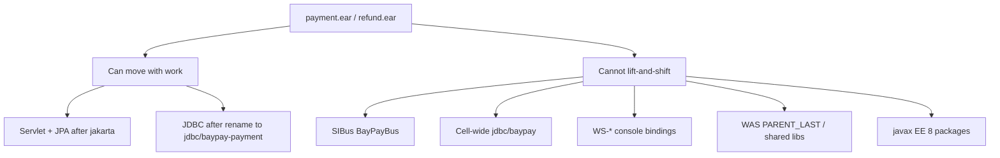

# L-6.3 — Compatibility assessment

**Module:** 06 — WebSphere Liberty Modernization  
**Duration:** 30 minutes  
**Case study:** BayPay Financial Services (fictional)

---

## Why this matters

Wave 0 is not “copy `payment.ear` onto Liberty.” It is an inventory of **what the ear assumes the cell provides**. `jdbc/baypay`, SIBus `BayPayBus`, WAS class-loader policies, `javax.*` packages, and WS-* bindings do not become portable because you wrote a `featureManager`. Avery Chen’s payment must not be the experiment that discovers a `NameNotFoundException` or a `javax.servlet` / `jakarta.servlet` split in production. This lesson is the assessment rubric for MODERNIZE-601.

---

## Learning objectives

- Score an ear against packaging, JNDI, SIBus, WS-*, class loaders, and `javax` vs `jakarta`.
- List what can move with a rename or feature add versus what cannot lift-and-shift.
- Keep `jdbc/baypay` as a source smell and plan `jdbc/baypay-payment` / `jdbc/baypay-refund`.
- Treat wave 0 as the only wave with no runtime rollback — because nothing has moved yet.

---

## Concept explanation

Assess **contracts**, not product loyalty.

**Ears and packaging.** `payment.ear` / `refund.ear` are cluster-targeted archives. Liberty’s target is `payment-service.war` / `refund-service.war`. An EAR that is a thin WAR plus IBM bindings (`ibm-web-bnd.xml`, `ibm-ejb-jar-bnd.xml`) can often become a WAR plus `server.xml` binds. An EAR that embeds EJB 2 entity beans, WAS scheduler, or cell shared libraries is not a copy-paste.

**JNDI.** Code that looks up `jdbc/baypay` will fail or, worse, succeed against the wrong pool if you reuse the name. Plan a resource-ref change to `jdbc/baypay-payment` / `jdbc/baypay-refund`. `jdbc/baypayXA` is **not on every node** today — that incompleteness is a finding, not a Liberty feature to recreate. `jms/paymentEvents` and `jms/refundEvents` are cell/bus names; they have no row in a four-feature `server.xml`.

**SIBus `BayPayBus`.** There is no lift-and-shift for the messaging engine. Options: leave destinations on ND until a later wave, replace with an explicit broker, or keep in-process events like the Boot teaching app. “Enable a JMS feature and hope” is not an assessment.

**WS-*.** JAX-WS that uses standard `jakarta.xml.ws` can move with a web-services feature (out of scope for the default four). Proprietary WAS bindings, `WebSphere:cell/...` endpoint references, WS-AtomicTransaction tied to `jdbc/baypayXA`, and WS-Security configured only in the admin console **cannot** lift-and-shift. Harbor Bike Co SOAP, if present on an old ear, needs a protocol inventory.

**Class loaders.** WAS `PARENT_LAST` / “application first,” server-scoped shared libraries, and isolated module class loaders are cell policy. Liberty’s default is simpler and app-owned (L-4.4). If `payment.ear` only works because it hid a different `slf4j` or JDBC driver from the parent, that is a rewrite of dependencies, not a deploy flag.

**`javax` vs `jakarta`.** `servlet-6.0` and `persistence-3.1` are `jakarta.*`. A Java EE 8 ear still compiling `javax.servlet`, `javax.persistence`, `javax.jms`, `javax.sql` lookups wrapped in EE 8 descriptors will not start on that feature set. Namespace migration is a **compile and descriptor** project. The Boot teaching app is already `jakarta` via Spring Boot 3 — do not use it as proof the ears are ready.

| Asset | Lift-and-shift? | BayPay action |
|---|---|---|
| Servlet HTTP at `/payment` | After `jakarta` + war | `webApplication` |
| `jdbc/baypay` lookup | No (name + scope) | Rename; isolate pools |
| `jdbc/baypayXA` | No | Decide you do not need XA; do not clone the hole |
| `BayPayBus` / JMS names | No | Leave on ND or replace explicitly |
| WS-* admin bindings | No | Inventory; rewrite or retire |
| `PARENT_LAST` tricks | No | Fix the classpath |
| `javax.*` EE 8 ear | No | Namespace + descriptor migration |
| Boot fat JAR | Not an ear path | Keep `reference-apps/baypay` as teaching app |

---

## Visual explanation



Alt text: Ears can move servlet and renamed JDBC after jakarta work; SIBus, cell JNDI, WS-star bindings, WAS loaders, and javax packages cannot lift-and-shift.

---

## Architecture

Wave 0 output is a table, not a cluster. For each ear, list: entry URI, resource-refs, expected JNDI, messaging, WS endpoints, loader policy, EE namespace, and a verdict (`Liberty this quarter`, `Boot rewrite`, `stay on ND until X`).

Payment is higher volume and owns Avery Chen’s authorize path. Refund is lower volume — that is why wave 1 is refund, not because refund is “simple.” A refund ear that is all SIBus and WS-AT can still be a **stay** while a boring servlet refund moves.

Do not assess the Boot monolith as if it were `payment.ear`. Different packaging, already isolated config. Mixing those columns is how staff reviews fail.

Shared database `baypay` is allowed. Shared pool name is not. Reporting must stay off both Liberty pools, same rule as L-5.3.

---

## Production example

Morgan Hale: “We installed a Liberty profile once; drop `payment.ear` in `dropins` and we are modern.” Riley starts the process. `javax.servlet.ServletException` on a `jakarta` feature set, then `NameNotFoundException: jms/paymentEvents`, then a class-cast on a parent-first logger. Priya sees `ihs-east` already weighted toward the new replica. Avery Chen’s client gets 50/50 success — the same *shape* as a partial cluster sync (L-5.2), now across runtimes.

The assessment would have said: namespace first, JNDI rename, **no** SIBus on the four-feature server, loader dependencies flattened, plugin weight zero until probes pass. Wave 0 exists so that afternoon never happens.

A second finding: `jdbc/baypayXA` on `Pay1` only. Mark it **incompatible and incomplete**. Do not add XA to Liberty to “match production.” Matching a defect is not compatibility.

---

## Code/configuration example

Wave 0 worksheet excerpt (paper — this is the assessment artifact):

```text
App: payment.ear → target payment-service.war
URI: /payment
Lookups:
  jdbc/baypay     → BLOCKER (shared). Plan jdbc/baypay-payment
  jdbc/baypayXA   → BLOCKER (not on every node). Do not clone
  jms/paymentEvents → BLOCKER for Liberty-only. Leave on BayPayBus
                     until a messaging wave
Namespace: javax.servlet in ibm-web-bnd → BLOCKER for servlet-6.0
Loaders: PARENT_LAST + shared/slf4j → BLOCKER
WS-*: none on payment API (sessionless REST) → OK
Verdict: Liberty after namespace + JNDI rename; JMS stays on ND
Rollback: N/A (wave 0)
```

Ear snippet that **fails** the servlet-6.0 target:

```xml
<resource-ref>
  <res-ref-name>jdbc/baypay</res-ref-name>
  <res-type>javax.sql.DataSource</res-type>
</resource-ref>
```

Target after assessment (war + Liberty bind):

```xml
<resource-ref>
  <res-ref-name>jdbc/baypay-payment</res-ref-name>
  <res-type>javax.sql.DataSource</res-type>
</resource-ref>
```

`javax.sql.DataSource` is JDK and may stay; `javax.servlet` / `javax.persistence` do not stay on the locked features.

---

## Trade-offs

| Verdict | Meaning | Cost |
|---|---|---|
| Move to Liberty this quarter | War + features + isolated JNDI | Namespace and bind work |
| Stay on ND this quarter | SIBus/WS-*/loader blockers | Longer source-estate life |
| Rewrite on Boot | Teaching-stack alignment | Not an ear anymore; different test story |
| Dual-run later | Wave 2 canary | Two runtimes, one idempotent API |

Honesty is cheaper than a heroic lift-and-shift.

---

## Failure modes

- Calling any ear “compatible” because Liberty can install EARs.
- Reusing `jdbc/baypay` to avoid touching application code.
- Enabling a JMS feature and claiming `BayPayBus` migrated.
- Ignoring `javax` vs `jakarta` because “it compiles on JDK 21.”
- Treating `PARENT_LAST` as a Liberty `classloader` one-liner.
- Assessing Boot and the ears as one column.
- Skipping wave 0 because Jordan already booked a wave-1 window.

---

## Security/reliability implications

An incomplete assessment is a reliability defect. Dual-run with different JNDI or different EE namespaces is intermittent money movement. WS-Security that lived only in the cell is an **authz** hole if you expose the war without an equivalent constraint. Classpath hiding can load an old crypto provider.

Reliability also means *not* moving SIBus on the same night as HTTP. Two cutovers in one window hide the failing contract. Wave 0 should sequence those risks.

---

## Interview perspective

**Engineer.** I list JNDI names, `javax` vs `jakarta`, and whether the app is a WAR. SIBus does not copy to Liberty.

**Senior.** I refuse `jdbc/baypay` on the target. I can explain which blockers are rename vs rewrite. I keep Boot out of the ear scorecard.

**Staff.** I produce a wave-0 table with verdicts and I will not put `ihs-east` weight on a replica that still looks up `jms/paymentEvents` without a plan.

**Principal.** Compatibility is an investment decision. I fund namespace and isolation work; I do not fund lift-and-shift of SIBus, cell JNDI, or a new ND cell.

---

## Key takeaways

- Wave 0 is an inventory of contracts: ears, JNDI, SIBus, WS-*, loaders, namespace.
- Isolated JDBC names are mandatory; `jdbc/baypay` does not travel.
- SIBus, cell JNDI, WAS loader tricks, WS-* console bindings, and `javax` EE APIs cannot lift-and-shift.
- The Boot teaching app is not evidence the ears are ready.
- No traffic moves in wave 0, so rollback is N/A.

---

## Knowledge check

1. Name three BayPay assets that cannot lift-and-shift from `BayPayCell` to a four-feature Liberty server.
2. What JNDI change must the payment war make, and why is keeping `jdbc/baypay` wrong?
3. Why is “the Boot app already runs on Jakarta” not a wave-0 pass for `payment.ear`?

<details>
<summary>Spoiler — answers</summary>

1. Any three of: SIBus `BayPayBus` / JMS names, cell-scoped `jdbc/baypay`, `jdbc/baypayXA` holes, WS-* admin bindings, `PARENT_LAST` / shared libraries, `javax.servlet` / `javax.persistence` ears.
2. Lookup `jdbc/baypay-payment` (refund: `jdbc/baypay-refund`). Reusing `jdbc/baypay` keeps the shared-pool smell and couples runtimes.
3. `reference-apps/baypay` is a different packaging and already-migrated stack; the ear must be scored on its own descriptors and lookups.

</details>

---

## Related lab

[MODERNIZE-601 — WebSphere-to-Liberty assessment](../../../../labs/MODERNIZE-601/README.md). Fill the scorecard from [TOPOLOGY.md](../../../../datasets/baypay-cell/TOPOLOGY.md). Then [MODERNIZE-602](../../../../labs/MODERNIZE-602/README.md) only for items you marked movable.

---

## Related PAKS

Optional: `docs/14-microservices/service-decomposition-and-ddd.md` (payment vs refund as separate bounded contexts — separate verdicts). Not required to finish the assessment.
