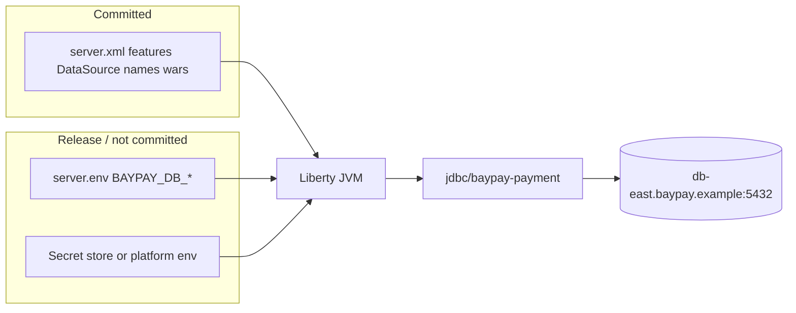

# L-6.4 — Configuration externalization

**Module:** 06 — WebSphere Liberty Modernization  
**Duration:** 30 minutes  
**Case study:** BayPay Financial Services (fictional)

---

## Why this matters

On `BayPayCell`, the password for `jdbc/baypay` lives in J2C alias `baypayDbAlias` inside the master repository. That is still a secret — it is just a secret Morgan Hale’s console owns. Liberty will not improve that story if `server.xml` contains `password="s3cret"` and Jordan Voss commits the file. Avery Chen’s ledger sits behind `db-east.baypay.example`. The 12-factor rule is simple: **XML describes shape; environment supplies values.** This lesson is `server.env`, variables, and `BAYPAY_DB_*`.

---

## Learning objectives

- Split Liberty config into committed `server.xml` and uncommitted (or injected) `server.env` / process environment.
- Use `${BAYPAY_DB_HOST}`, `${BAYPAY_DB_USER}`, `${BAYPAY_DB_PASSWORD}` (and siblings) instead of literals.
- Map the 12-factor config/backing-service rules onto BayPay’s payment and refund replicas.
- State why a cell J2C alias is not a model to recreate as a checked-in XML password.

---

## Concept explanation

**`server.xml`** is the structural document: features, JNDI *names*, context roots, pool *sizes*, which war. It should be identical in staging and production except where a variable changes. Review it in git.

**Variables.** Liberty expands `${NAME}` from `server.env`, `bootstrap.properties`, `jvm.options` adjacent files, and the process environment. Module 6 standardizes on the same names the Boot teaching app already uses where they overlap:

| Variable | Purpose |
|---|---|
| `BAYPAY_DB_HOST` | `db-east.baypay.example` in the fictional estate |
| `BAYPAY_DB_PORT` | `5432` |
| `BAYPAY_DB_NAME` | `baypay` |
| `BAYPAY_DB_USER` | Application role — not a personal id |
| `BAYPAY_DB_PASSWORD` | Secret; never in XML, never in a lesson screenshot |
| `BAYPAY_DB_URL` | JDBC URL form used by Boot; Liberty may use host/port pieces instead |

Payment and refund replicas can share *variable names* and still use **different** DataSource ids (`jdbc/baypay-payment` vs `jdbc/baypay-refund`). Same database, two pools. If a lab needs separate roles later, use `BAYPAY_PAYMENT_DB_USER` — do not invent that split until the assessment says so.

**`server.env`** is `KEY=value` pairs loaded at start. It is the laptop- and VM-friendly injection file. In Kubernetes (later modules) the same keys become a Secret mounted as env. Do not treat `server.env` as “the new cell repository.” It is **release config**, not application source.

**Twelve-factor (the ones that matter here).**

1. **Config** — env, not code or XML literals.  
2. **Backing services** — Postgres is attached via DataSource variables; swapping hosts is a value change.  
3. **Build vs release vs run** — the war is the build; `server.xml` + env is the release; the JVM is the run.  
4. **Port binding** — `httpEndpoint` ports can be variables too (`BAYPAY_HTTP_PORT`) so two replicas on one host do not collide.  
5. **Disposability** — a replica with no local secret file beyond env can die and be replaced.  
6. **Logs** — do not write passwords into `messages.log` at debug.

The Boot app already does this with `application-prod.yml` and `${BAYPAY_DB_URL}`. Liberty is catching up to a rule students have been using since Module 3–4. Do not run two secrets systems.

**What does not belong in XML:** passwords, tokens, merchant-facing TLS private keys, personal hostnames of engineers. Hostnames of the fictional estate (`db-east.baypay.example`) may appear in an example `server.env`, not as the only documented production mechanism.

---

## Visual explanation



Alt text: server.xml is committed structure; BAYPAY_DB secrets come from server.env or a platform secret store into the Liberty JVM.

---

## Architecture

Two Liberty processes means two env files or one template with the same keys. They must not read a cell-wide alias. They must not look up `jdbc/baypay` “because the password is already there.”

`ihs-east` plugin members need host and port. Those can be inventory in the plugin file; they are not secrets. Do not put the database password on the IHS host to “simplify.”

Wave 2 dual-run: ND still uses `baypayDbAlias`; Liberty uses `BAYPAY_DB_PASSWORD`. Same database user is allowed if the role is the app role. Rotating the password then becomes a **two-runtime** change — document that in MODERNIZE-603 so Jordan does not rotate the J2C alias and kill Liberty, or the reverse.

The teaching app’s `.env` / shell exports should use the same `BAYPAY_DB_*` keys so local labs stay one cheat-sheet.

---

## Production example

Jordan Voss opens a pull request: `server.xml` with `password="BayPayApp1!"` and a comment “rotate later.” Priya Nair rejects it. That password is now in git history for a fictional estate — the *habit* is what we grade. Fix: `${BAYPAY_DB_PASSWORD}` in XML; value injected by the runner.

A second hour: staging Liberty points at a shared “dev” database because `server.env` was copied from a wiki and never reviewed. Avery Chen’s synthetic id appears in the wrong environment. Externalization without **environment identity** is just a portable mistake. Name the files `server.env.staging` / platform namespaces, not one sticky file.

Riley sees `messages.log` print the resolved DataSource URL including user/password at fine trace. That is a logging config incident, not a “Liberty is insecure” verdict. Turn down jdbc trace in production.

---

## Code/configuration example

Committed `server.xml` fragment (secrets are references only):

```xml
<dataSource id="baypayPayment" jndiName="jdbc/baypay-payment">
  <jdbcDriver libraryRef="pg"/>
  <connectionManager maxPoolSize="${BAYPAY_POOL_MAX}"/>
  <properties.postgresql
      serverName="${BAYPAY_DB_HOST}"
      portNumber="${BAYPAY_DB_PORT}"
      databaseName="${BAYPAY_DB_NAME}"
      user="${BAYPAY_DB_USER}"
      password="${BAYPAY_DB_PASSWORD}"/>
</dataSource>
<httpEndpoint id="defaultHttpEndpoint" host="*"
              httpPort="${BAYPAY_HTTP_PORT}" httpsPort="${BAYPAY_HTTPS_PORT}"/>
```

Uncommitted `server.env` (laptop / VM example — values are synthetic):

```text
BAYPAY_DB_HOST=db-east.baypay.example
BAYPAY_DB_PORT=5432
BAYPAY_DB_NAME=baypay
BAYPAY_DB_USER=baypay_app
BAYPAY_DB_PASSWORD=injected-by-operator-not-committed
BAYPAY_POOL_MAX=20
BAYPAY_HTTP_PORT=9080
BAYPAY_HTTPS_PORT=9443
```

Boot teaching app — same keys, different consumer:

```yaml
spring:
  datasource:
    url: ${BAYPAY_DB_URL}
    username: ${BAYPAY_DB_USER}
    password: ${BAYPAY_DB_PASSWORD}
```

If `BAYPAY_DB_PASSWORD` is missing, **fail start**. Do not fall back to `jdbc/baypay` or to an empty password.

---

## Trade-offs

| Choice | Why | Cost |
|---|---|---|
| Variables in XML | One file to review for shape | Need a release path for values |
| `server.env` on disk | Simple for paper + VM labs | File can be copied badly; gitignore it |
| Platform Secret later | Rotation and access control | Not required to finish Module 6 |
| Same `BAYPAY_DB_*` as Boot | One operator vocabulary | URL vs host/port impedance |
| Literal hostname in XML | Appears “simpler” | Promotes env drift and secret creep |

---

## Failure modes

- Committing passwords or J2C-equivalent aliases in `server.xml`.
- Falling back to cell `jdbc/baypay` when a variable is unset.
- One `server.env` shared by every environment.
- Logging resolved passwords at JDBC fine trace.
- Different variable names per replica with no table (`BAYPAY_DB_PASS` vs `BAYPAY_DB_PASSWORD`).
- Putting secrets on `ihs-east` because “the plugin is already there.”
- Treating externalization as optional because the course does not start Liberty.

---

## Security/reliability implications

A committed password is a credential leak even when the company is fictional — reviewers will treat it as a fail. Rotation during dual-run must update ND’s `baypayDbAlias` and Liberty’s env in a documented order or payments fail with authentication errors that look like “database down.”

Reliability: missing `${BAYPAY_DB_HOST}` should refuse to start, not bind `localhost`. A replica that starts with a default pool of 50 against the production database because `BAYPAY_POOL_MAX` was unset is how you recreate INCIDENT-503 from a default.

Restrict who can read `server.env` the way you restrict console access to `dmgr-east`. The file is cell-root for that replica.

---

## Interview perspective

**Engineer.** Passwords are not in `server.xml`. I use `BAYPAY_DB_*` in `server.env`. The war still looks up `jdbc/baypay-payment`.

**Senior.** I can map Boot `application-prod.yml` and Liberty variables to the same keys. I fail start on missing secrets. I do not reuse `baypayDbAlias` as a checked-in value.

**Staff.** I plan password rotation across ND and Liberty during dual-run. I keep XML identical across envs and let env files differ.

**Principal.** Config is a release artifact. I will not fund a Liberty port that stores secrets in XML or recreates a cell-wide alias. Twelve-factor here is isolation and rotation, not a slogan.

---

## Key takeaways

- `server.xml` is shape; `server.env` / platform env is values.
- Use `BAYPAY_DB_*` — no passwords in committed XML.
- Payment and refund share key *names*, not a pool and not `jdbc/baypay`.
- Boot already externalizes; Liberty must match that habit.
- Fail start when secrets are missing; do not fall back to the cell.

---

## Knowledge check

1. Where should `BAYPAY_DB_PASSWORD` live, and where must it not live?
2. Why can payment and refund Liberty replicas share `BAYPAY_DB_HOST` but not `jdbc/baypay`?
3. During dual-run, what extra step does a database password rotation require?

<details>
<summary>Spoiler — answers</summary>

1. In `server.env` or a platform secret / process env. Not in committed `server.xml`, not in a lesson dump, not copied onto `ihs-east`.
2. Host is the backing service; `jdbc/baypay` is a shared pool name — each replica still binds `jdbc/baypay-payment` or `jdbc/baypay-refund`.
3. Update both the ND J2C alias `baypayDbAlias` and the Liberty env, in a documented order, or one runtime loses the database.

</details>

---

## Related lab

[MODERNIZE-603 — Externalize configuration](../../../../labs/MODERNIZE-603/README.md). Take the MODERNIZE-602 `server.xml` and remove literals. Paper plus files; no live Liberty required.

---

## Related PAKS

Optional: `docs/14-microservices/service-decomposition-and-ddd.md` (config and context boundaries). Externalization is 12-factor hygiene; this lesson stands alone without a PAKS login.
