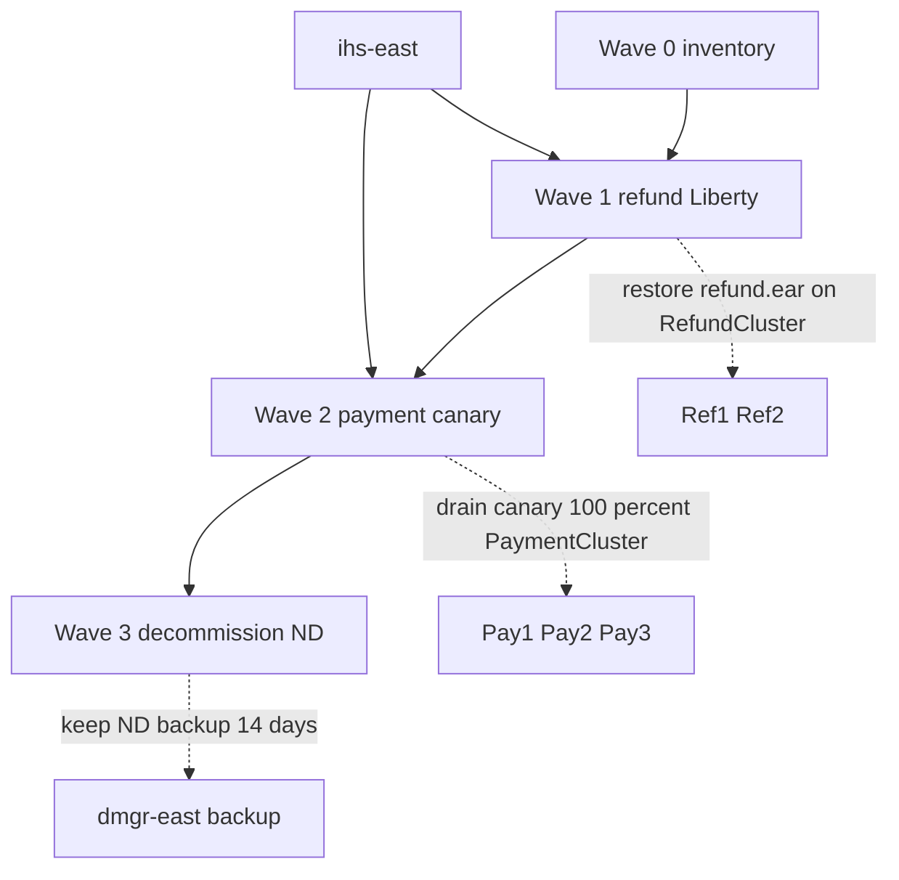

# L-6.5 — Migration strategy and rollback

**Module:** 06 — WebSphere Liberty Modernization  
**Duration:** 30 minutes  
**Case study:** BayPay Financial Services (fictional)

---

## Why this matters

A good `server.xml` does not move Avery Chen’s money. **Waves** do. If Jordan Voss cuts `payment.ear` and `refund.ear` on the same night, `ihs-east` has no safe drain and Riley Okonkwo has no smaller blast radius. BayPay’s locked plan is waves 0–3: inventory, refund first, payment canary, then decommission ND. Rollback is written **before** the plugin weight changes: restore refund on `RefundCluster`, then drain the payment canary back to `PaymentCluster`.

---

## Learning objectives

- Recite waves 0–3 from [TOPOLOGY.md](../../../../datasets/baypay-cell/TOPOLOGY.md) with scope and rollback.
- Explain canary and dual-run for `/payment` behind `ihs-east`.
- Write rollback of **refund then payment** as two rehearsed procedures.
- Refuse a big-bang cell shutdown and refuse a new traditional ND cell as the “safe” alternative.

---

## Concept explanation

**Wave 0 — inventory.** MODERNIZE-601. No merchant traffic moves. Rollback is N/A. Exit criterion: scorecard with blockers (L-6.3) and a file-level Liberty sketch (L-6.2 / L-6.4).

**Wave 1 — refund on Liberty.** Lower volume than payment. `refund-service.war` behind `ihs-east` URI `/refund`. `RefundCluster` (`Ref1`, `Ref2`) still exists. Dual-run is optional here if you switch 100% after a bake; many plans flip refund fully because traffic is smaller. **Rollback:** restore `refund.ear` on `RefundCluster`, point the plugin back at `Ref1`/`Ref2`, stop sending `/refund` to Liberty.

**Wave 2 — payment canary.** One Liberty replica for `/payment` beside `Pay1`/`Pay2`/`Pay3`. That is **dual-run**: two runtimes, one idempotent API, one database `baypay`. `ihs-east` sends a small weight (or a header/canary cookie — still sessionless; do not enable sticky sessions) to Liberty. Avery Chen’s retries must hit the same ledger via `Idempotency-Key`, not via JVM affinity. **Rollback:** drain the canary (weight 0, remove from `plugin-cfg.xml`), 100% `PaymentCluster`. Leave wave-1 refund on Liberty unless refund is also failing.

**Wave 3 — decommission ND.** After an SLO hold, stop `Pay*` / `Ref*` / node agents, then retire `dmgr-east`. **Rollback:** keep the last ND backup until **wave 3 + 14 days**. You cannot “undecommission” if you deleted the cell the same afternoon.

| Wave | Scope | Rollback |
|---|---|---|
| 0 | Inventory + compatibility assessment | N/A |
| 1 | Refund on Liberty (lower volume) | Restore `refund.ear` on `RefundCluster` |
| 2 | Payment canary (one Liberty replica behind IHS) | Drain canary; 100% `PaymentCluster` |
| 3 | Decommission ND nodes after SLO hold | Keep last ND backup until wave 3+14 days |

**Canary** means *a little traffic*, not a little confidence. Probes must check feature start, JNDI `jdbc/baypay-payment`, and a synthetic payment path — not TCP-only (Module 5’s plugin lesson).

**Dual-run** means ND and Liberty both *can* serve the same URI group. Risk: edition skew (4.11 vs 4.12 class of bug, now across brands). Mitigation: same schema, same idempotency, same frozen-account rules for Avery Chen’s frozen USD account (`22222222-2222-2222-2222-222222222222`).

**Rollback of refund then payment** is the document order that matches the waves: you rehearse wave-1 restore first (you will need it sooner), then wave-2 drain. If both are live and you abort the *program*, drain **payment** first (highest money risk, still majority on ND), then restore refund if that wave is also in trouble. Do not decommission in the same window as a rollback drill.

---

## Visual explanation



Alt text: Waves 0 to 3 run in order; refund rolls back to RefundCluster, payment canary drains to PaymentCluster, ND backup lasts fourteen days after wave 3.

---

## Architecture

`ihs-east` is the switch. You never need `dmgr-east` to be up to drain if `plugin-cfg.xml` on disk already lists the members you want (L-5.1). Still, wave 1–2 changes should happen while Morgan can regenerate the plugin.

Liberty replicas sit **beside** the cell, not inside `node-pay-2`. Drawing a canary as `Pay4` is a fail in ARCHITECT-604.

Database is shared; pools are not. Dual-run with one `jdbc/baypay` on both sides is a false cutover. Messaging may stay on `BayPayBus` through wave 1–2 if wave 0 said so — then rollback of HTTP does not require a bus restore.

The Boot teaching app is not a wave target. Do not schedule “cut `reference-apps/baypay` to Liberty” as wave 2.

---

## Production example

Friday 18:00. Jordan sets `/refund` to the Liberty replica after a green wave-0 paper review that skipped SIBus. Saturday, Harbor Bike Co refunds fail on `jms/refundEvents`. Priya pages Riley. **Wave-1 rollback:** plugin back to `Ref1`/`Ref2`, `refund.ear` still installed — because wave 1 forbade uninstalling the ear until wave 3. That is why restore is a plugin + start, not a rebuild.

A worse Friday: Jordan also weighted `/payment` 50/50. Avery Chen sees intermittent `jakarta` errors. Now you execute **payment** drain first (stop the money bleed), then refund restore if needed. The runbook still *documents* refund rollback then payment rollback as the two procedures; the incident commander picks the failing URI.

Morgan asks to “stand up a second cell for safety.” That is a new traditional ND estate. Refuse. Safety is the 14-day backup and the plugin drain, not `BayPayCell2`.

---

## Code/configuration example

Plugin membership sketch (paper — not a live `plugin-cfg.xml`):

```text
# Wave 1 after cutover (rollback = swap these two lines)
/refund  → liberty-ref-1:9080          # active
/refund  → Ref1, Ref2                  # standby until wave 3

# Wave 2 canary
/payment → Pay1, Pay2, Pay3            # majority
/payment → liberty-pay-canary:9080     # low weight; drain = delete this member
```

Wave-2 abort order when *payment* is failing:

```text
1. Set canary weight 0 on ihs-east; confirm 100% PaymentCluster
2. Leave Refund Liberty up if /refund SLOs hold
3. If aborting the program: then restore refund.ear routing to RefundCluster
4. Do not delete dmgr-east or node-pay-* (wave 3 only, after SLO hold)
```

Idempotency check both sides must honor:

```text
Idempotency-Key: same header
customer: 11111111-1111-1111-1111-111111111111
account:  22222222-2222-2222-2222-222222222221
```

A retry that hit Liberty then ND must not double-post.

---

## Trade-offs

| Choice | Why | Cost |
|---|---|---|
| Refund first | Lower volume, smaller blast | Refund blockers can stall the program |
| Payment canary, not 100% | Dual-run evidence | Two runtimes to rotate secrets and compare editions |
| Keep ears installed until wave 3 | Rollback is a plugin change | Capacity and patch surface remain |
| 14-day ND backup after wave 3 | Undo window | You still pay for the cell briefly |
| Big-bang Saturday | Appears cheaper | No drain, no rehearsal, no smaller radius |

---

## Failure modes

- Big-bang: stop `PaymentCluster` and `RefundCluster` the same hour.
- Canary with TCP-only plugin health (STARTED but hung — Module 5 class of miss).
- Uninstalling `refund.ear` in wave 1 so rollback needs a rebuild.
- Enabling sticky sessions so the canary “sticks” Avery Chen to Liberty.
- Deleting `dmgr-east` before the 14-day hold.
- Building `BayPayCell2` as rollback.
- Treating Boot teaching-app deploys as a wave.

---

## Security/reliability implications

Dual-run doubles the admin surface: console users on `dmgr-east` and whoever can edit Liberty env / plugin files. Both are production-root for money paths. Drain procedures must work when the console is down (plugin file on `ihs-east`).

Reliability is SLO hold, not a green deploy ticket. Frozen-account denials and idempotent retries must match on both runtimes before you raise canary weight. Wave 3 without a backup is an irreversible reliability decision dressed as cleanup.

---

## Interview perspective

**Engineer.** Waves are 0 inventory, 1 refund, 2 payment canary, 3 decommission. Refund rollback restores `refund.ear`. Payment rollback drains the canary.

**Senior.** I keep ears installed until wave 3. I will not sticky-session the canary. I can say what `ihs-east` changes in each wave.

**Staff.** I rehearse refund restore then payment drain. If both fail, I drain payment first. I refuse a second ND cell. I keep the 14-day backup.

**Principal.** Migration is a risk sequence, not a product swap. I fund dual-run gauges and rollback time, not a greenfield traditional cell. Liberty (or Boot) is the exit.

---

## Key takeaways

- Waves 0–3 are locked: inventory, refund, payment canary, decommission.
- Canary + dual-run apply to `/payment` behind `ihs-east`; do not use sticky sessions.
- Rollback of refund: restore `refund.ear` on `RefundCluster`. Rollback of payment: drain canary to `PaymentCluster`.
- Keep ND backups through wave 3+14 days.
- Do not recommend a new traditional ND cell.

---

## Knowledge check

1. Why does wave 1 move refund before payment?
2. What is the wave-2 rollback, and what must you *not* do to `payment.ear` yet?
3. What is the wave-3 rollback window, and why is a new `BayPayCell` the wrong safety plan?

<details>
<summary>Spoiler — answers</summary>

1. Refund is lower volume, so blast radius and rollback (restore `refund.ear` on `RefundCluster`) are smaller than Avery Chen’s payment path.
2. Drain the Liberty canary; 100% `PaymentCluster`. Do not uninstall `payment.ear` until wave 3 — rollback is a plugin drain, not a rebuild.
3. Keep the last ND backup until wave 3+14 days. A second traditional cell grows the source estate; safety is drain + backup, not another DMGR.

</details>

---

## Related lab

[ARCHITECT-604 — Migration waves and rollback](../../../../labs/ARCHITECT-604/README.md). Draw waves 0–3 from [TOPOLOGY.md](../../../../datasets/baypay-cell/TOPOLOGY.md), including refund-then-payment rollback. Paper only.

---

## Related PAKS

Optional: `docs/14-microservices/service-decomposition-and-ddd.md` (why refund and payment are separate waves). This lesson stands alone without a PAKS login.
