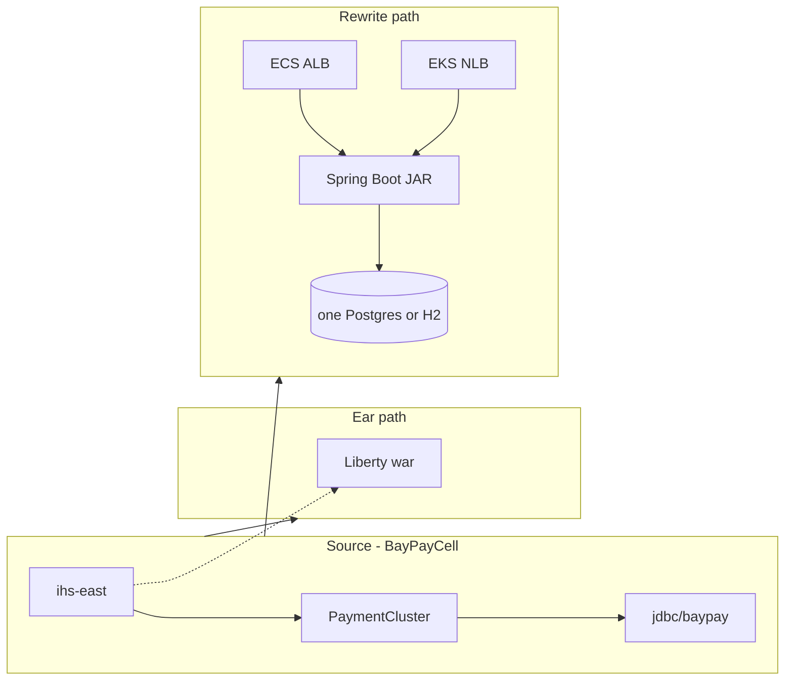

# L-6.6 — Spring Boot on ECS and EKS (the container exit)

**Module:** 06 — WebSphere Liberty Modernization  
**Duration:** 30 minutes  
**Case study:** BayPay Financial Services (fictional)  
**Region:** `us-west-2`

---

## Why this matters

Waves 0–3 (L-6.5) move `payment.ear` / `refund.ear` **beside** `BayPayCell` onto Liberty. That is the **ear-compatible** exit. It is not the only exit. When Jordan Voss can rewrite the money path, the target is the teaching app: Java 21, Spring Boot 3.5, fat JAR in `reference-apps/baypay`. Harbor Market then hits an **ALB** (ECS Fargate) or an **NLB** (EKS pod) — not `ihs-east` → `Pay1`. If you lift `payment.ear` onto EKS and keep cell JNDI, you have not modernized. You have moved the cell into a different bill.

This lesson is **paper plus optional spend**. The graded student apply in later modules is **ECS Fargate only**: public subnets, IGW, **no NAT, no EKS, no RDS**. The folders `student/work/ecs-rds-lab` and `student/work/eks-rds-lab` are a **same-day optional demo**. They bill until `./stop.sh`.

---

## Learning objectives

- Name two exits from `BayPayCell`: Liberty wars (waves 0–3) versus a Boot rewrite on ECS/EKS.
- Map cell concerns to Boot + AWS: `jdbc/baypay` → `BAYPAY_DB_*`, `ihs-east` → ALB or NLB, SIBus → in-process events (until you extract a queue).
- State the **required** apply (ECS Fargate, no NAT/EKS/RDS) versus the **optional** ECS+RDS and EKS-on-shared-RDS labs.
- Refuse `payment.ear` on EKS, `-Xmx` equal to task/pod memory, and leaving the EKS control plane up after the demo.

---

## Concept explanation

**Rewrite, do not rehost the ear.** Compatibility work (L-6.3) still applies: `javax` → `jakarta`, no SIBus lift, no cell-wide JNDI. The Boot app already did that rewrite as a **modular monolith**: one JVM, five Maven modules, constructor injection, `@Transactional` on `PaymentApplicationService`. Picture: [spring-object-lifetime.svg](../../../../diagrams/java/baypay/spring-object-lifetime.svg). Singletons live in the ApplicationContext. Avery Chen’s `Payment` is a request object, then a row.

**Same HTTP contract.** `POST /api/v1/payments` still requires `Idempotency-Key`. Frozen account `…222` is still **422**. List still needs `customerId`. Moving the process to Fargate or a pod does not change those rules.

**Config contract.** L-6.4’s `BAYPAY_DB_URL` / `BAYPAY_DB_USER` / `BAYPAY_DB_PASSWORD` is what ECS Secrets Manager and the EKS Secret `baypay-db` inject. Profiles: `local` (H2), `ecs` / `eks` (Postgres, seeder still on — **not** `prod`). Never bake the password into the image.

**ECS Fargate (first container target).** Task 256 CPU / 512 MiB, public IP, ALB `:80` → `:8080`, liveness `/actuator/health/liveness`. Heap from `MaxRAMPercentage=75` — never `-Xmx=512m` on a 512 MiB task. Required student shape: **no NAT, no RDS, no EKS** (H2 in the task, or paper only). Optional lab: private single-AZ `db.t3.micro` Postgres, same VPC.

**EKS (overlay, not a second bank).** Same image, profile `eks`, one `t3.small` node in the **existing** public subnets, Service type LoadBalancer (NLB). Same RDS as ECS — one table for Avery. Control plane is about **$0.10/hour** from ACTIVE. Stop **EKS first**, then ECS. Destroy is the only honest $0.

| Source (`BayPayCell`) | Liberty path (L-6.2–L-6.5) | Boot path (this lesson) |
|---|---|---|
| `payment.ear` on `Pay*` | `payment-service.war` + `server.xml` | Fat JAR `payment-service` |
| `ihs-east` | Plugin weights to Liberty | ALB (ECS) or NLB (EKS) |
| Cell `jdbc/baypay` | `jdbc/baypay-payment` | `BAYPAY_DB_*` + Hikari |
| `BayPayBus` | Defer or JMS feature | In-process `@EventListener` |
| Node agent sync | Files on disk | Task def / Deployment YAML |
| DMGR console | No DMGR | ECS rollout / `kubectl rollout` |

Do **not** schedule “Boot on Fargate” as Liberty wave 2. Wave 2 is a Liberty canary beside `PaymentCluster`. Boot on ECS is a **later program** (or greenfield) with its own dual-run: IHS still to ND while a small merchant slice hits the ALB, same DB, same idempotency keys.

---

## Visual explanation



Alt text: BayPayCell is the source. Liberty wars stay on the IHS ear path. The Boot JAR is reached by an ECS ALB or an EKS NLB and one database.

Slides: [ecs-rds-network-topology.png](../../../../diagrams/java/baypay/ecs-rds-network-topology.png) · [eks-rds-network-topology.png](../../../../diagrams/java/baypay/eks-rds-network-topology.png) (optional live labs; same VPC `10.20.0.0/16`).

---

## Architecture

**Required apply (Modules 9–11).** Public subnets + IGW + ALB + Fargate. Profile `local` is allowed so RDS is not a homework dependency. Empty ECR still stores images — delete what you push.

**Optional ECS + RDS.** `student/work/ecs-rds-lab/start.sh` in `us-west-2`. Private `baypay-ecsrd-pg`, secret `baypay-ecsrd/db`, ALB printed by the script. `Expiration` tags do not stop the meter. `./stop.sh` is the stop.

**Optional EKS overlay.** `student/work/eks-rds-lab/start.sh` **reuses** that VPC and RDS. Extra `:5432` rule from the cluster SG. ECS `stop.sh` refuses while EKS state still has resources.

Laptop `localhost:8080` is unchanged. Dual-run proof: a payment created on the NLB lists on the ALB — one Avery table.

---

## Production example

Jordan proposes “EKS + Multi-AZ RDS + NAT this weekend” as the Module 6 homework. Priya Nair refuses: that is **optional spend**, not the graded path, and it is not a Liberty wave. Riley Okonkwo asks to copy `payment.ear` into a pod and keep `jdbc/baypay`. Morgan Hale still owns `dmgr-east`. That pod is a cell member without a node agent — worse than ND.

Honest Friday: wave-1 refund stays on Liberty. In parallel, a **canary merchant** (not sticky) posts to the ECS ALB with new `Idempotency-Key`s. If p99 climbs, drain the ALB target; `PaymentCluster` still has the ears. Do not uninstall `payment.ear` because a Fargate task exists.

Monday: demo over. `eks-rds-lab/stop.sh` then `ecs-rds-lab/stop.sh`. An `INACTIVE` ECS cluster name is a tombstone. It does not bill. A leftover ALB does.

---

## Code/configuration example

Boot profile (ECS/EKS — seeder still runs because the profile is not `prod`):

```yaml
# application-ecs.yml / application-eks.yml
spring:
  datasource:
    url: ${BAYPAY_DB_URL}
    username: ${BAYPAY_DB_USER}
    password: ${BAYPAY_DB_PASSWORD}
```

Task / pod (shape only — values from Secrets Manager, not git):

```text
SPRING_PROFILES_ACTIVE=ecs    # or eks
BAYPAY_DB_URL=jdbc:postgresql://…:5432/baypay
JAVA_TOOL_OPTIONS=-XX:MaxRAMPercentage=75
# never: -Xmx512m on a 512 MiB task
```

Kubernetes Secret keys must match the YAML (`BAYPAY_DB_*`). A missing `application-eks.yml` in the image falls back to H2 — the first EKS demo failed that way.

---

## Trade-offs

| Choice | Why | Cost |
|---|---|---|
| Liberty waves first | Ear stays an ear; rollback is a plugin drain | Still a Jakarta server to patch |
| Boot rewrite + ECS | One fat JAR, same teaching app | Rewrite time; optional RDS bills |
| EKS overlay | Same API, kube Deployment story | Control plane ~$0.10/h + node + NLB |
| Ear on EKS | Looks like “cloud” | Cell JNDI, SIBus, class loaders come with you |
| NAT + Multi-AZ on homework | Production-shaped | Breaks the required cheap apply |

---

## Failure modes

- Treating Boot-on-Fargate as Liberty wave 2.
- Shipping `payment.ear` as the container.
- `prod` profile on the demo (seeder off; Avery missing).
- `-Xmx` equal to task or pod memory (OOM, not “more heap”).
- Leaving EKS up after the LinkedIn take.
- Destroying ECS/RDS while the EKS overlay still uses the VPC.
- NAT / EKS / RDS on the **graded** apply.

---

## Security/reliability implications

Secrets stay out of the image (L-6.4, L-9.5). ALB/NLB are internet-facing on the optional labs — heapdump must stay **404**. Dual-run still needs one ledger and one idempotency store. Reliability is drain back to `PaymentCluster` or `desiredCount=0` plus **destroy**, not an Expiration tag.

---

## Interview perspective

**Engineer.** Two exits: Liberty wars behind IHS, or Boot JAR behind ALB/NLB. Same `Idempotency-Key`. `BAYPAY_DB_*` at run time.

**Senior.** I will not put the ear on EKS. Required apply is Fargate without NAT/EKS/RDS. Optional labs are same-day destroy.

**Staff.** I can dual-run ND and the ALB on one database. I stop EKS before ECS. I never set `-Xmx` to the cgroup limit.

**Principal.** Modernization is a contract move (HTTP, config, data), not a scheduler swap. I fund rollback and destroy, not a second cell in Kubernetes.

---

## Key takeaways

- Liberty waves (L-6.5) and Boot-on-ECS/EKS are **different exits**. Do not mix their rollback runbooks.
- The teaching app is already the Boot target. Deploy it; do not wrap the ear.
- Graded AWS: ECS Fargate, `us-west-2`, no NAT / EKS / RDS.
- Optional labs share one RDS; stop EKS first.
- Heap from `MaxRAMPercentage`. Same API on ALB and NLB.

---

## Knowledge check

1. Why is `payment.ear` on EKS not modernization?
2. What is the required student apply, and what three things must it omit?
3. A payment posted on the EKS NLB must appear where, and what do you stop first when the demo ends?

<details>
<summary>Spoiler — answers</summary>

1. The ear still wants cell JNDI, SIBus, and WAS loaders. The scheduler changed; the contract did not.
2. ECS Fargate in `us-west-2`. Omit NAT, EKS, and RDS on the graded path.
3. On the ECS ALB list (shared Postgres). Stop EKS (`eks-rds-lab/stop.sh`) before ECS/RDS.

</details>

---

## Related lab

Paper: finish [ARCHITECT-604](../../../../labs/ARCHITECT-604/README.md) for Liberty waves first.

Optional spend (destroy the same day): [ecs-rds-lab](../../../../student/work/ecs-rds-lab/README.md) then [eks-rds-lab](../../../../student/work/eks-rds-lab/README.md). Module 11 teaches ECR, ECS, and IAM in detail — this lesson only places them on the modernization map.

---

## Related PAKS

Optional: `docs/14-microservices/service-decomposition-and-ddd.md`. This lesson stands alone without a PAKS login.
