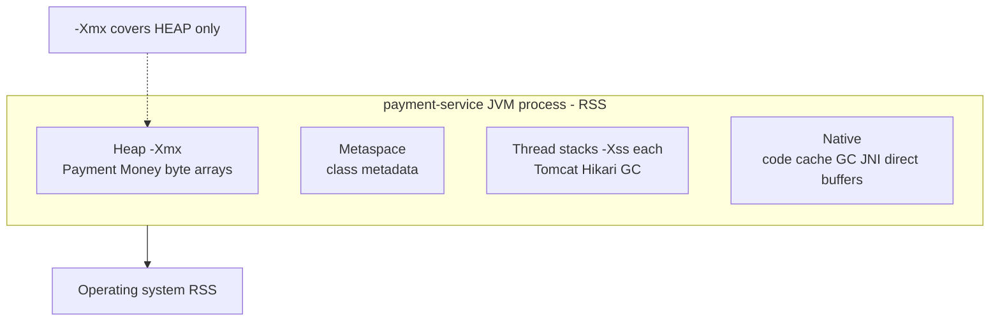

# L-7.1 — Heap, stacks, metaspace and native memory

**Module:** 7 — JVM Internals and Performance  
**Duration:** 30 minutes  
**Case study:** BayPay Financial Services (fictional)

## Why this matters

Riley Okonkwo pages on `pay-prod-east-2` because “the canary is using 1.4 GiB.” `-Xmx` is `1g`. Support wants to know whether Avery Chen’s `$84.00` `Payment` leaked. The useful question is narrower: **which pool** grew? The Java heap holds `Payment` and `Money`. Thread stacks, metaspace, the JIT code cache, and native buffers live **outside** `-Xmx`. Process RSS is what the operating system charges. If you cannot name those regions, you will resize the wrong knob and call every high RSS a heap leak.

---

## Learning objectives

- Name heap, stacks, metaspace, and native memory in a Java 21 HotSpot `payment-service`.
- Contrast `-Xmx` (heap ceiling) with RSS (resident process size).
- Enable Native Memory Tracking (NMT) and read `jcmd <pid> VM.native_memory summary`.
- Decide which pool a BayPay symptom is pointing at before you change a flag.

---

## Concept explanation

HotSpot is one process. Memory is not one number.

**Heap.** Objects the GC manages: `Payment`, embedded `Money` (`BigDecimal` + currency `String`), `IdempotencyRecord`, Jackson trees, Hibernate entities, `byte[]` buffers. `-Xms` is the initial heap. `-Xmx` is the **maximum heap**. Java 21 G1 (BayPay’s default) may not commit the full `-Xmx` at start. A `Payment.received(...)` for customer `11111111-1111-1111-1111-111111111111` allocates here. `OutOfMemoryError: Java heap space` means this pool failed an allocation after GC could not free enough.

**Stacks.** Each **platform** thread has a stack (locals, return addresses, split values). Tomcat request threads, Hikari pool threads, GC and compiler threads all count. `-Xss` sets Java thread stack size (often 1 MiB on 64-bit HotSpot; confirm on your JDK). A thousand worker threads are roughly a gigabyte of reserved stack before the heap is involved. `StackOverflowError` is this region, not the heap.

**Metaspace.** Class **metadata** (not `Payment` instances): bytecodes, method tables, constant pools, annotations. Off-heap. It grows as Spring, Hibernate, and `com.baypay.shared.domain.Payment` load. `-XX:MaxMetaspaceSize` caps it; the default is unlimited. `OutOfMemoryError: Metaspace` is this pool. A later module will treat a **climbing** metaspace across redeploys as a leak *symptom class*. It is not a heap histogram problem.

**Native.** Everything else the process maps: JIT **code cache**, GC bitmaps, zlib/JNI, direct `ByteBuffer`s, NIO, malloc from libraries. NMT attributes much of this. The OS still sees it in RSS.

**Committed vs reserved.** `-Xmx` reserves a *maximum*. G1 may commit less at start (`-Xms` / ergonomics). `GC.heap_info` reports used and capacity per generation; “used 80M, capacity 256M, max 512M” is a healthy lab picture, not a leak. On heaps under about 32 GiB, HotSpot typically uses compressed ordinary object pointers; that is a density detail, not a reason to pick 31g for `payment-service`.

**NMT and RSS.** Start with `-XX:NativeMemoryTracking=summary` (set at launch; you cannot turn it on later). Then `jcmd <pid> VM.native_memory summary`. Categories include Java Heap, Thread, Class (metaspace), Code, GC, Compiler, Internal. **RSS** is resident pages: committed heap *plus* those other categories *plus* memory NMT does not track perfectly. **`-Xmx` is not RSS.** A 1g heap with fat stacks and a warm code cache on `payment-service` 3.8.0 can show 1.4 GiB RSS and still be healthy.

Count threads before you blame the heap: `jcmd <pid> Thread.print` lists Tomcat, Hikari, GC, and compiler threads. Each Java thread’s stack is in NMT Thread, not in `-Xmx`. A mis-sized pool from Module 3 is a stack and RSS story first.

---

## Visual explanation



Alt text: The payment-service RSS includes heap, metaspace, stacks, and native; -Xmx limits only the heap.

Diagram **AEJE-D-028** (heap, stacks, metaspace, and native memory) is the course asset for this picture.

---

## Architecture

`reference-apps/baypay` is one JVM. `BayPayApplication` is the composition root. `shared`, `payment-service`, `refund-service`, `transaction-worker`, and `notification-service` share **one heap**, **one metaspace**, and the **same thread list**.

A live `Payment` on that heap is not “just an id.” After `Payment.received(...)` you retain: two `UUID`s (customer `11111111-1111-1111-1111-111111111111`, account `22222222-2222-2222-2222-222222222221`), an embedded `Money` (`BigDecimal` scale 2 + `USD`), `PaymentStatus`, idempotency key, timestamps, and JPA bookkeeping (`@Version`). The **class** `Payment` is one metaspace resident no matter how many Harbor Bike Co rows you authorize. Histogram count tracks instances; NMT Class tracks metadata.

| What you measure | Typical BayPay owner | Tool |
|---|---|---|
| Live `Payment` / `Money` | Heap | `jcmd <pid> GC.heap_info`, `GC.class_histogram` |
| Loaded `Payment` class | Metaspace | NMT Class; later, class histogram counts |
| HTTP + JDBC threads | Stacks (NMT Thread) | `jcmd <pid> Thread.print` |
| G1 + JIT + direct I/O | Native | NMT GC / Code / Internal |

Local teaching flags live in [datasets/baypay-jvm/RUNTIME.md](../../../../datasets/baypay-jvm/RUNTIME.md). They are for labs, not a required production dump format. Module 5 WAS cells are a different estate; do not bounce `dmgr-east` because a Boot canary RSS looks high.

---

## Production example

Harbor Bike Co retries `POST /api/v1/payments` with `Idempotency-Key: harbor-8841` for Avery Chen’s active account `22222222-2222-2222-2222-222222222221`. Priya Nair’s dashboard shows `pay-prod-east-2` RSS at 1.4 GiB after a canary of `payment-service` 3.8.0. Someone proposes `-Xmx2g` because “memory is 1.4g.” `jcmd` `GC.heap_info` shows a used heap well under 512 MiB. NMT Thread and Class explain the rest: more Tomcat threads than the previous image, a warmer code cache, normal metaspace for Boot 3.5.5.

Raising `-Xmx` would have grown the one pool that was **not** the problem and stolen headroom from native (L-7.6). The correct first artifact is an NMT summary plus heap info, not a heap dump. A histogram that lists `Payment` is expected after load; it is not a leak without a **growth** story.

Module 8 will later page symptom classes: **CPU**, **leak**, **GC**, **heap OOM**, **container OOM**. This lesson’s job is to keep those labels from collapsing into “memory is high.” If `GC.heap_info` is calm and NMT Thread doubled, you are not looking at Avery Chen’s `Money` field. If heap used tracks `-Xmx` and full GCs fail, that is a heap-exhaustion *shape* — still not an RCA until you have a growth series.

---

## Code/configuration example

Lab-only launch (never required on a production dump):

```text
-XX:+UnlockDiagnosticVMOptions
-XX:NativeMemoryTracking=summary
-Xmx512m
-Xlog:gc*:file=gc.log:time,uptime,level,tags
```

```bash
export JAVA_HOME="${JAVA_HOME:-/opt/homebrew/opt/openjdk@21}"
cd reference-apps/baypay
./mvnw -pl payment-service -am spring-boot:run
# another terminal
jcmd | grep BayPayApplication
jcmd <pid> GC.heap_info
jcmd <pid> VM.native_memory summary
jcmd <pid> GC.class_histogram
```

`GC.heap_info` on G1 reports eden, survivors, and old occupancy. `class_histogram` counts live instances (`Payment`, `Money`, `byte[]`). Histogram **count** is not retained size by itself. If NMT was omitted at start, `VM.native_memory` says tracking is not enabled — restart with the flag. `-Xmx512m` here is a **lab ceiling**, not a container limit and not a prod recipe.

---

## Trade-offs

| Approach | Strength | Cost |
|---|---|---|
| Explicit `-Xmx` | Predictable heap ceiling | Wrong value starves the heap or the native remainder |
| NMT summary | Cheap map of pools | Must be on at start; small overhead |
| Heap dump | Shows live `Payment` graphs | Heavy; contains synthetic PII — treat as sensitive |
| “RSS == heap” | Fast (and wrong) | Mis-sizes `-Xmx` and hides stack/metaspace growth |

Prefer the weakest observation that names the pool. Heap info plus NMT beats a dump when you only need “is the heap the 1.4 GiB?”

---

## Failure modes

- **Heap OOM:** live `Payment` / cache / byte buffers fill `-Xmx`. Symptom class you will diagnose later: heap exhaustion.
- **Metaspace OOM:** too many loaded classes or a loader that never unloads. Symptom class: leak — not proven by one histogram.
- **Native / RSS climb:** direct buffers, thread explosion, code cache. `-Xmx` looks “fine.”
- **Stack overflow:** deep recursion or huge frames; `StackOverflowError`.
- **Wrong knob:** raising `-Xmx` because RSS exceeded `-Xmx` (it almost always does).

---

## Security/reliability implications

A heap dump of `payment-service` can contain Avery Chen’s customer id, account id, amounts, and idempotency keys. Treat dumps as payment data even when the course data is synthetic. NMT summaries are safer to share: they name pools, not rows. Reliability: if you set `-Xmx` as if it were the whole process, the OS or a later cgroup (L-7.6) will kill the JVM while the heap still has room. That kill looks like a crash, not `Java heap space`.

---

## Interview perspective

**Engineer:** “`-Xmx` is the max heap. `Payment` objects live there. RSS is the whole process, so it should be larger.”

**Senior:** “I would split heap vs NMT Thread vs Class vs Code before I call it a leak. I would not raise `-Xmx` from RSS alone.”

**Staff:** “I would ask for heap_info, NMT, and thread count on `pay-prod-east-2` versus `pay-prod-east-1`. A canary with more threads is an ops change, not a `Money` leak. I would refuse a dump until the pool is named.”

**Principal:** “Memory is a product SLO only when it threatens posting Avery Chen’s payment. I fund the gauges (heap, RSS, threads, metaspace) and a rule that `-Xmx` never equals the container limit. I do not fund a 1% heap shrink.”

---

## Key takeaways

- Four regions: heap, stacks, metaspace, native. `-Xmx` is only the heap.
- RSS is the OS view; it should exceed `-Xmx` on a warm `payment-service`.
- NMT must be enabled at start; `jcmd` then splits the process.
- One `class_histogram` is a snapshot, not a leak RCA.
- Name the pool before you change a flag.

---

## Knowledge check

1. Avery Chen’s `Payment` instance lives in which JVM region? Which flag caps that region?
2. `pay-prod-east-2` shows RSS 1.4 GiB and `-Xmx1g`. Is the JVM over its heap limit?
3. Why can `jcmd <pid> VM.native_memory summary` fail on a JVM you just attached to?

<details>
<summary>Spoiler — answers</summary>

1. Heap. `-Xmx` (and the current committed heap, which may be below `-Xmx`). The `Payment` **class** metadata is metaspace, not the instance.
2. No. RSS includes stacks, metaspace, code cache, and native. Exceeding `-Xmx` in RSS is expected. Check `GC.heap_info` for heap used vs `-Xmx`.
3. NMT is a start-up flag (`-XX:NativeMemoryTracking=summary`). Attaching later cannot enable it. Restart with the flag.

</details>

---

## Related lab

Work [LAB-701](../../../../labs/LAB-701/README.md) after this lesson. Start `payment-service`, record `GC.heap_info`, NMT summary, and a class histogram while you authorize a synthetic Avery Chen payment. Do not open `solutions/` first. JFR is optional and local.

---

## Related PAKS

Optional: `docs/01-computer-architecture/cpu-and-memory-fundamentals.md` in the Principal Architect Knowledge System. It explains caches and RAM beneath RSS. This lesson is complete without it.
