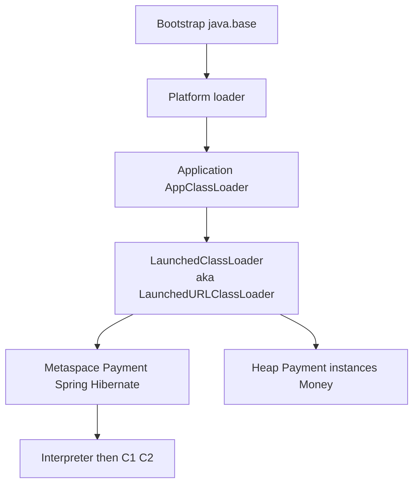

# L-7.2 — Class loading

**Module:** 7 — JVM Internals and Performance  
**Duration:** 30 minutes  
**Case study:** BayPay Financial Services (fictional)

## Why this matters

`Payment.class` is not “on the heap” the way Avery Chen’s `$84.00` instance is. A **class loader** reads the bytes, the JVM verifies them, and **metaspace** holds the metadata. Spring Boot 3.5.5 does not use a plain directory classpath when you launch the fat JAR: `JarLauncher` builds a launched loader that sees `BOOT-INF/classes` and nested `BOOT-INF/lib` jars. If you confuse the instance heap with the loader that defined `Payment`, you will chase a “memory leak” that is really classes that cannot unload — or you will misread `ClassCastException: Payment cannot be cast to Payment`.

---

## Learning objectives

- Sketch Java 21’s built-in loaders (bootstrap, platform, application) and where `com.baypay` sits.
- Explain what Spring Boot’s launched loader (historically `LaunchedURLClassLoader`) is for.
- Separate a `Payment` **instance** (heap) from the `Payment` **class** (metaspace + loader).
- Treat climbing metaspace after redeploy as a later leak *symptom hint*, not as a closed RCA.

---

## Concept explanation

A class in HotSpot is identity **(binary name, defining loader)**. Two `Payment` types from two loaders are not assignable.

Java 21 built-in loaders:

1. **Bootstrap** — core `java.base` (`Object`, `String`, `BigDecimal`). No Java `ClassLoader` object you hold.
2. **Platform** — the module layer that used to be the extension loader (`java.sql`, XML, and other platform modules).
3. **Application** (`AppClassLoader` / `ClassLoaders$AppClassLoader`) — the classpath or module path of the running program.

`./mvnw -pl payment-service -am spring-boot:run` typically loads `com.baypay.shared.domain.Payment` through the **application** loader (Maven’s runtime classpath). `java -jar payment-service-*.jar` is different. `Main-Class` is `org.springframework.boot.loader.launch.JarLauncher`. `Start-Class` is `com.baypay.payment.BayPayApplication`. The launcher builds `org.springframework.boot.loader.launch.LaunchedClassLoader` — the Spring Boot 3.2+ name for the old **`LaunchedURLClassLoader`**. That child sees nested jars the application loader cannot. Parent is still the application/platform chain. Parent-first delegation is the Java SE default: `java.lang.String` comes from bootstrap, not from a shaded copy in `BOOT-INF/lib`.

Delegation is **parent first** unless a loader overrides it. A lookup for `java.math.BigDecimal` walks to bootstrap and stops. A lookup for `com.baypay.shared.domain.Money` misses bootstrap and platform, then hits the application or launched loader. `Class.forName("com.baypay.shared.domain.Payment")` uses the caller’s loader; `loader.loadClass(...)` uses the loader you named. Mixing those in a plugin is how you get two `Payment` types.

Loading `Payment` does this work once (until unload): find bytes → verify → prepare → metaspace metadata → optionally initialize `<clinit>`. After that, `Payment.received(...)` allocates **instances** on the heap. `jcmd GC.class_histogram` counting `com.baypay.shared.domain.Payment` is live objects, not “how many times the class was loaded.”

Spring and Hibernate pull a **graph** of classes on the first authorize: JPA enhancers, Jackson introspectors, Tomcat wrappers. That is why Metaspace jumps during warmup and then flattens. The fifth Maven module does not get a fifth loader. `PaymentApplicationService` and `PaymentPostingService` must see the same `Payment` bytecode.

**Unload.** A class can be collected only if its defining loader is unreachable and no heap object instances that class. Static maps, `ThreadLocal`s on recycled Tomcat threads, and JDBC drivers registered in a parent are the classic pins. L-4.4 introduced that on ears. On Boot you redeploy less often in-process, but a custom plugin loader or a poorly closed `URLClassLoader` can still pin metaspace. **Hint only:** Module 8’s leak *symptom class* may include metaspace growth. A single histogram does not close that case.

---

## Visual explanation



Alt text: Bootstrap, platform, and app loaders sit above Spring Boot’s launched loader; metadata goes to metaspace and JIT, instances to the heap.

Diagram **AEJE-D-029** (class loading and JIT) is the course asset. L-7.3 zooms the JIT half.

---

## Architecture

BayPay’s reference app is a **modular monolith in one loader world**. All five Maven modules become one set of classes in the launched (or App) loader. There is no Java EE EAR isolation and no WAS parent-last policy here. That is a feature: `PaymentApplicationService` and `PaymentPostingService` share one `Payment` type.

| Launch | Defining loader for `Payment` | When you see it |
|---|---|---|
| `spring-boot:run` | Application loader | LAB-701 on a laptop |
| Fat JAR `java -jar` | `LaunchedClassLoader` (`LaunchedURLClassLoader` lineage) | Container image, L-7.6 |
| Tests | Surefire app loader | `MoneyTest`, `PaymentApiIT` |

Do not expect a WAS `payment.ear` loader leak playbook to apply unchanged to this process. Do not bounce `dmgr-east` for a Boot canary class-count change.

---

## Production example

Jordan Voss ships `payment-service` 3.8.0 as a fat JAR to `pay-prod-east-2`. Priya Nair compares class counts to `pay-prod-east-1` and sees thousands of extra classes after the first Harbor Bike Co traffic — Spring, Hibernate, Jackson, Tomcat — then the count **flattens**. Riley Okonkwo files “metaspace leak” because Metaspace used rose 80 MiB from a cold start.

That rise is **warmup loading**, not a leak. Avery Chen’s payment (`customerId` `11111111-1111-1111-1111-111111111111`) did not load a new `Payment` class per `POST`. A leak *hint* would be metaspace that steps up on every **redeploy or dynamic load** and never returns, with a loader still reachable. You will practice evidence discipline in Module 8. This lesson’s job is to stop calling Boot startup “a leak.”

A second canary mistake: copying a WAS “application first” class-loader policy into a Boot image because L-4.4 mentioned parent-last. There is no server class loader holding a second `Money` here. You would only recreate the ear problem. If someone ships a plugin `URLClassLoader` that defines its own `com.baypay.shared.domain.Payment`, `authorize` will throw `ClassCastException` on the first Harbor Bike Co retry (`Idempotency-Key: harbor-8841`) while the ledger still looks empty.

---

## Code/configuration example

```java
public final class PaymentLoaderView {
    public static String describe() {
        ClassLoader paymentLoader = com.baypay.shared.domain.Payment.class.getClassLoader();
        ClassLoader app = ClassLoader.getSystemClassLoader();
        return "Payment defined by "
                + (paymentLoader == null ? "bootstrap" : paymentLoader.getClass().getName())
                + "; system loader "
                + app.getClass().getName();
    }
}
```

On `spring-boot:run` you typically see `jdk.internal.loader.ClassLoaders$AppClassLoader` (or similar) for both. On `java -jar`, `Payment`’s defining loader is `org.springframework.boot.loader.launch.LaunchedClassLoader`. Fat-JAR manifest (shape, not a secret):

```text
Main-Class: org.springframework.boot.loader.launch.JarLauncher
Start-Class: com.baypay.payment.BayPayApplication
```

```bash
jcmd <pid> GC.class_histogram | head
# look for com.baypay.shared.domain.Payment  — instance count, not load count
```

Do not add a second `URLClassLoader` “to isolate Money” inside `payment-service`. You will invent `Payment`/`Payment` cast failures.

In LAB-701, write down **which launch command** you used next to the loader name. Comparing a teammate’s fat-JAR `LaunchedClassLoader` to your Maven `AppClassLoader` without that note looks like a “prod vs laptop” mystery. It is the same `Payment.java`.

---

## Trade-offs

| Approach | Strength | Cost |
|---|---|---|
| One loader for the monolith | One `Payment` type; simple NMT Class | Redeploy is a process restart |
| Fat-JAR launched loader | Nested jars, no exploded `lib/` | Different loader than `spring-boot:run` |
| Custom child loader per plugin | Can unload if the loader dies | Easy metaspace pin; `ClassCastException` |
| Parent-last (WAS-style) | App wins over server copies | Two `Payment` types; not Boot’s model |

---

## Failure modes

- **`ClassCastException: Payment cannot be cast to Payment`:** two defining loaders.
- **`NoClassDefFoundError` / `ClassNotFoundException`:** fat JAR missing a nested jar, or code assuming Maven’s classpath in a `java -jar` image.
- **`UnsupportedClassVersionError`:** bytecode newer than the Java 21 host (L-1.1). Not a leak.
- **Metaspace climb:** loaders pinned after reload. Symptom class for later: leak. Not proven here.
- **Wrong histogram reading:** 50_000 `byte[]` after load is Jackson/Hibernate, not 50_000 Avery Chen customers.

---

## Security/reliability implications

A loader is a trust boundary. Whatever can add URLs to the launched loader can run code in the payment process and see heap data for Avery Chen. Do not download plugins into `payment-service` at runtime. Reliability: class-init deadlocks and slow first request are loader/JIT warmup (L-7.3), not “the account is frozen.” Frozen account `22222222-2222-2222-2222-222222222222` is a domain decline, not a `ClassNotFoundException`.

---

## Interview perspective

**Engineer:** “The app class loader loads `Payment`. The fat JAR uses Spring Boot’s launched loader, the old `LaunchedURLClassLoader`.”

**Senior:** “I would say which launch path I am on. `spring-boot:run` is AppClassLoader. `java -jar` is `LaunchedClassLoader`. I would not call startup metaspace growth a leak.”

**Staff:** “I would treat class identity as (name, loader). I would look for a pinned loader before I dump the heap. I would keep the monolith on one loader so `Money` is one type.”

**Principal:** “Loader policy is an operations model. Boot’s one-process loader is why we do not copy WAS parent-last into Kubernetes. I will fund metaspace and class-count gauges; I will not fund in-process hot-reload of payment code.”

---

## Key takeaways

- Instances are heap; classes are loader + metaspace.
- Java 21: bootstrap, platform, application; Boot fat JAR adds a launched child loader.
- `LaunchedURLClassLoader` is the teaching name; Spring Boot 3.5.5’s type is `LaunchedClassLoader`.
- Startup class growth is normal; unload failures are a later leak hint.
- Do not invent a second loader for `Payment`.

---

## Knowledge check

1. Where does the `Payment` **class** live, and where does Avery Chen’s `Payment` **instance** live?
2. Why might `Payment.class.getClassLoader()` differ between `spring-boot:run` and `java -jar`?
3. Does a rising Metaspace used number in the first five minutes of `pay-prod-east-2` prove a leak?

<details>
<summary>Spoiler — answers</summary>

1. Class metadata is metaspace, defined by a loader. The instance is on the heap.
2. Maven run uses the application loader. The fat JAR’s `JarLauncher` defines application classes in `LaunchedClassLoader` (the `LaunchedURLClassLoader` lineage).
3. No. First-traffic class loading is expected. A leak hint needs growth tied to reload or a pinned loader, plus evidence you will practice later.

</details>

---

## Related lab

In [LAB-701](../../../../labs/LAB-701/README.md), note the defining loader story for your launch mode and record Metaspace / NMT Class next to the `Payment` histogram count. You are observing, not proving a leak. Do not open `solutions/` first.

---

## Related PAKS

Optional: `docs/01-computer-architecture/cpu-and-memory-fundamentals.md`. Useful for “why metadata is RAM.” This lesson stands alone. L-4.4 is the earlier class-loader contract lesson.
