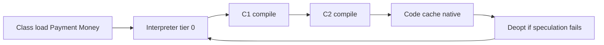

# L-7.3 — JIT compilation

**Module:** 7 — JVM Internals and Performance  
**Duration:** 30 minutes  
**Case study:** BayPay Financial Services (fictional)

## Why this matters

The first `POST /api/v1/payments` for Avery Chen on a fresh `payment-service` is slower than the thousandth. That is not Hibernate “being bad” by default. Java 21 HotSpot **interprets** bytecode, then **C1** and **C2** compile hot methods using profiles. `Money.plus`, `Payment.transitionTo`, and Jackson getters become native code in the **code cache** (native memory, L-7.1). If you “fix warmup” with `-Xcomp` in prod, you compile everything up front, stall startup, and often get **worse** code because C2 never saw real profiles. CPU-high symptom classes in Module 8 may include compile storms or tight interpreted loops. This lesson teaches the mechanism, not those RCAs.

---

## Learning objectives

- Describe interpreter, C1, and C2 in Java 21 tiered compilation.
- Explain warmup and deoptimization in terms of `payment-service` traffic.
- State why `-Xcomp` is not a production warmup strategy.
- Know where compiled code lives (code cache / NMT Code) versus the heap.

---

## Concept explanation

HotSpot does not compile every method at load (L-7.2). After `Payment` is defined, `transitionTo` still starts as **bytecode** in the interpreter.

**Tiered compilation** (Java 21 default on HotSpot):

| Tier | Who | Role |
|---|---|---|
| 0 | Interpreter | First executions; gathers a simple profile |
| 1–3 | **C1** (client compiler) | Fast compile, limited opts; better profiles |
| 4 | **C2** (server compiler) | Slow compile, heavy opts: inlining, escape analysis (L-7.5) |

Invocation and back-edge counters promote methods. `Money.amount().add(...)` inside `plus` becomes hot after Harbor Bike Co traffic; `Payment.fail` on a frozen account may stay C1 or interpreted if rarely hit.

**Warmup** is this promotion plus class init plus C2 queues. A canary that just started on `pay-prod-east-2` has a colder code cache than `pay-prod-east-1`. p99 on the first minute is not the steady SLO.

**Deoptimization (deopt).** C2 speculates: “this `Money` currency is always `USD`,” “this call is monomorphic.” If Jordan Voss’s canary then sees EUR, or a new subclass appears, HotSpot **deopts** back toward interpreter/C1 and may recompile. Deopt is correctness, not a crash. A deopt storm after a deploy can look like a CPU spike (symptom class: CPU). Do not “fix” it with `-Xcomp`.

**`-Xcomp`.** Compile each method to native **before** first execution. Startup becomes a compiler queue. Profiles are thin, so C2 guesses badly. **Do not use `-Xcomp` in production** on `payment-service`. `-Xint` (interpret only) is a lab contrast, not a prod mode. The default tiered policy is the one BayPay observes.

Compiled n-methods live in the **code cache** (native). They are not `Payment` objects. A full code cache can stop further compiles; that is a later performance story, not a heap resize.

C2 **inlines** small callees (`requireSameCurrency`, `Money.amount()`, getters). That is why a tiny `Money` method can disappear from a profile after warmup: it lives inside `PaymentApplicationService.create`. **On-stack replacement (OSR)** can compile a long-running loop mid-method; BayPay’s payment path is request-shaped, so ordinary invocation counts matter more than OSR. Compiler threads (`C1 CompilerThread`, `C2 CompilerThread` in `Thread.print`) share the process with Tomcat. A compile queue backlog after a rolling restart is expected for minutes, not a frozen account `22222222-2222-2222-2222-222222222222`.

---

## Visual explanation



Alt text: After Payment loads, HotSpot interprets, then C1 and C2 compile into the code cache; failed speculations deopt back.

Diagram **AEJE-D-029** covers class loading and JIT together. This lesson is the right-hand path.

---

## Architecture

In the monolith, the methods that must get hot for Avery Chen’s happy path are a short list: `PaymentController.create`, `PaymentApplicationService.create`, `Money` construction, `Payment.transitionTo`, JPA `save`, `PaymentPostingService.postAuthorized`. Cold paths (decline on frozen account `22222222-2222-2222-2222-222222222222`, rare admin) may stay less optimized. That is acceptable.

Compiler threads and the code cache are **process-global**. Five Maven modules share one C2 queue. A logging storm (L-7.5) can keep allocating while C2 tries to compile `toString`. GC safepoints (L-7.4) pause mutators **and** can delay compilers. Do not tune `-XX:CICompilerCount` on a laptop lab because p99 dipped once.

Local JFR (`jdk.Compilation`, `jdk.Deoptimization`) is how you *observe* this in Module 7. You do not need a production recording to finish the lesson. First-request cost on `BayPayApplication` is usually **three** stories stacked: class init (L-7.2), JIT, and pool checkout (Hikari). Split them before you file “Hibernate is slow” or “the JVM is broken.”

---

## Production example

`pay-prod-east-2` takes traffic after a rolling restart. The first twenty Harbor Bike Co checkouts for Avery Chen (`11111111-1111-1111-1111-111111111111`) show p99 at 400 ms. Riley Okonkwo proposes `-Xcomp` “so C2 is done before we open the canary.” Priya Nair watches the same canary: after a few thousand `POST /api/v1/payments`, p99 falls toward `pay-prod-east-1` without a flag change.

`-Xcomp` would have lengthened the **already** slow start (Spring + Hibernate init + compile-everything) and produced native code that had never seen real `Money` shapes. The production-quality answer is: keep the canary closed until warmup, or send a controlled synthetic load — not `-Xcomp`. A later CPU page might be a tight loop or a compile storm; you will not decide that from this paragraph.

Warmup traffic must be **idempotent**. Replaying `GET /api/v1/payments/{id}` is safe. Replaying `POST` without a stable `Idempotency-Key` can create extra `Payment` rows for Avery Chen and then you will debug the ledger instead of the JIT. Synthetic keys in labs are fine; Harbor Bike Co’s production key `harbor-8841` is not a load-generator toy.

---

## Code/configuration example

Default (what BayPay’s Java 21 image should keep):

```text
# no -Xcomp, no -Xint
# tiered compilation is on
```

Lab contrast only — **do not** ship these on `pay-prod-east-*`:

```text
-Xint          # interpret only; slow, useful to feel warmup’s absence
-Xcomp         # compile first; long start; weak profiles — not a prod warmup
```

Hot path that C2 will want to see (already in `shared`):

```java
public Money plus(Money other) {
    requireSameCurrency(other);
    return new Money(amount.add(other.amount), currency);
}
```

After warmup, C2 may inline `requireSameCurrency` and apply escape analysis to short-lived `Money` values that never store into a `Payment` (L-7.5). The method still starts interpreted.

```bash
jcmd <pid> VM.native_memory summary | grep -A2 Code
# optional local JFR — not a prod dump requirement
jcmd <pid> JFR.start name=baypay-jit settings=profile dumponexit=true filename=baypay-jit.jfr
```

---

## Trade-offs

| Approach | Strength | Cost |
|---|---|---|
| Default tiered JIT | Good code from real profiles | First requests slower |
| Synthetic warmup traffic | Canary looks like east-1 | Must be idempotent; do not double-debit Avery Chen |
| `-Xcomp` | Native code exists early | Slow start, weak C2, compiler CPU |
| `-Xint` | Predictable (slow) | No C2; lab only |

Prefer holding a canary or replaying **safe** GETs / idempotent posts. Never warm up by charging real customers twice.

---

## Failure modes

- **Cold canary p99:** interpreted + class init. Not a frozen account.
- **`-Xcomp` in prod:** long start, compiler saturation (CPU symptom class), poorer C2.
- **Deopt loop:** profile changes every request; CPU up, throughput down.
- **Code cache pressure:** compiles stop; hot paths stay C1/interpreter.
- **Blaming Hibernate only:** first-request cost is often JIT + loader + pool, together.

---

## Security/reliability implications

JIT does not change `Payment` invariants. C2 must deopt rather than invent a USD/EUR mix. Reliability: a restart **throws away** the code cache. Rolling deploys re-warm every pod. If you measure SLO only on brand-new replicas, you will page forever. Do not disable tiered compilation to “reduce attack surface”; compiled code is not a BayPay authz control. Authorization is the domain + ledger.

---

## Interview perspective

**Engineer:** “HotSpot interprets first, then C1, then C2. The first payments are slower. I would not set `-Xcomp` in prod.”

**Senior:** “I would call it tiered compilation and name deopt as a failed speculation. Warmup is profiles plus the code cache, not `-Xmx`.”

**Staff:** “I would compare a warm `pay-prod-east-1` to a cold canary before I change compiler flags. I would warm with idempotent traffic, never with duplicate Harbor Bike charges.”

**Principal:** “JIT policy is a rollout concern. I fund canary hold time and gauges for compile CPU and p99, not `-Xcomp` on `payment-service`. CPU incidents stay gated evidence in Module 8.”

---

## Key takeaways

- Java 21 HotSpot default is tiered: interpreter → C1 → C2.
- Warmup is expected; compiled code lives in the native code cache.
- Deopt is correct speculation rollback, not a crash.
- Do not use `-Xcomp` in production.
- Cold p99 is not proof that Avery Chen’s account failed.

---

## Knowledge check

1. After `Payment` is loaded, is `transitionTo` immediately C2-compiled?
2. Why can `-Xcomp` make C2 code *worse* while making startup longer?
3. A canary’s first twenty Avery Chen payments are slower than east-1. What should you try before compiler flags?

<details>
<summary>Spoiler — answers</summary>

1. No. It starts in the interpreter (or quickly C1). C2 waits for counters and a compile queue.
2. `-Xcomp` compiles before a useful profile exists, so C2 speculates poorly, and every method competes for compiler threads at start.
3. Wait for warmup or send controlled idempotent load. Compare to a warm replica. Do not `-Xcomp`.

</details>

---

## Related lab

[LAB-701](../../../../labs/LAB-701/README.md) is where you first attach `jcmd` to a live `BayPayApplication`. Notice heap/NMT **Code** after a few payments versus a cold start. [LAB-703](../../../../labs/LAB-703/README.md) is the better place to watch CPU vs GC once traffic is warm. Do not open `solutions/` first.

---

## Related PAKS

Optional: `docs/01-computer-architecture/cpu-and-memory-fundamentals.md` (why compile CPU and I-cache matter). This lesson stands alone.
