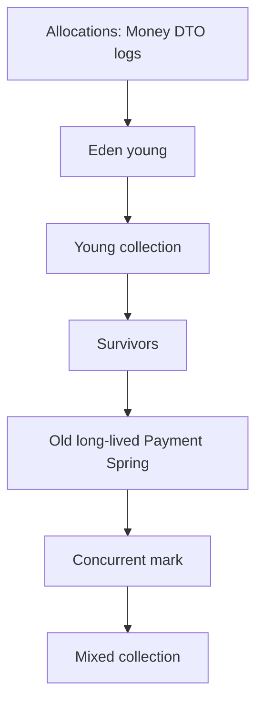

# L-7.4 — Garbage collection

**Module:** 7 — JVM Internals and Performance  
**Duration:** 30 minutes  
**Case study:** BayPay Financial Services (fictional)

## Why this matters

Every `POST /api/v1/payments` for Avery Chen allocates objects that almost immediately die: request DTOs, Jackson trees, short-lived `Money`, log events. G1, Java 21 HotSpot’s **default** collector on BayPay’s `payment-service`, is built for that. If you cannot tell a **young** collection from work in **old**, you will treat a 12 ms pause as an outage and “tune G1” instead of fixing a logging storm (L-7.5). This module observes GC. It does not chase a 1% pause win. Module 8 may later show an **excessive GC** symptom class; this lesson is the map, not that RCA.

---

## Learning objectives

- Explain G1’s young vs old story on a Java 21 `payment-service`.
- Contrast pause time with throughput.
- Enable and read `-Xlog:gc` (unified logging), not the removed `PrintGCDetails` style.
- Decide when a pause is expected allocation vs a reason to look at heap live set.

---

## Concept explanation

G1 (Garbage-First) is the Java 21 default for typical server-class HotSpot. BayPay’s reference app does not select another collector. ZGC and Shenandoah exist on 21; they are not the teaching runtime. Parallel GC optimizes throughput; Serial is for tiny heaps. You will **observe G1**.

G1 splits the heap into **regions**. Generations are logical:

**Young.** Eden + survivor regions. New `PaymentResponse`, `CreatePaymentRequest`, transient `byte[]`, many `Money` copies. A **young collection** (minor / evacuation) copies live young objects to survivors or promotes them. Most Harbor Bike Co request garbage dies in eden. Young pauses should be short if the live survivor set is small.

**Old.** Long-lived objects: the Spring context, JPA `EntityManagerFactory`, cached `Customer`/`Account` rows if you retain them, `Payment` entities still referenced, thread-pool internals. G1 **concurrently marks** old regions, then runs **mixed** collections that include some old regions plus young. A rising old live set is a different story from a high young allocation rate.

**Humongous.** Objects larger than about half a region (large `byte[]`) use special regions. A histogram full of huge arrays is a hint; it is not yet a leak RCA.

**Pause vs throughput.** A pause is stop-the-world time (mutators off). Throughput is the fraction of time **not** in GC. Payments care about both: a 400 ms pause during `AUTHORIZED` → `PROCESSING` can blow p99; spending 40% of CPU in GC starves `PaymentPostingService`. Java 21 G1’s default pause *goal* is on the order of 200 ms (`MaxGCPauseMillis`). That is a **goal**, not a contract. Do not lower it on a laptop because one log line showed 25 ms.

**Full collections.** A well-behaved G1 almost never falls back to a full GC. A full GC line in `gc.log` on `payment-service` is a **red flag** (heap too tight, allocation spike, or live set that mixed collections could not reclaim). It is still not an RCA by itself. Evacuation failure (“to-space exhausted”) is the same family: young live set did not fit. Raise curiosity, not collector flags.

**`-Xlog:gc`.** Since JDK 9, unified logging replaces `-XX:+PrintGCDetails`. BayPay labs use:

```text
-Xlog:gc*:file=gc.log:time,uptime,level,tags
```

Decorators give wall time and JVM uptime. Tags separate `gc`, `gc+heap`, `gc+cpu`. Read Pause Young, Concurrent Mark, Mixed, and heap before/after — not just the word “Pause.”

A teaching line looks like: `Pause Young (Normal) (G1 Evacuation Pause) 12.4ms` with heap `128M->64M`. That is G1 copying live young objects and freeing eden. `Concurrent Mark` running beside traffic is success, not “GC is stuck.” Region size is ergonomic from `-Xmx` (roughly 1–32 MiB). You do not set it in LAB-703.

---

## Visual explanation



Alt text: Short-lived Money and DTOs die in G1 young collections; long-lived Payment and Spring objects are marked and mixed-collected in old.

Diagram **AEJE-D-030** (garbage collection) is the course asset for this picture.

---

## Architecture

One G1 heap serves all five Maven modules. `payment-service` HTTP threads, `transaction-worker` posting, and refund use cases compete for eden. There is no per-module collector.

| Signal | Likely story on BayPay |
|---|---|
| Frequent short young pauses | High allocation rate (`Money`, logs, JSON) |
| Young pause grows | Large survivor / promotion; fat request graphs |
| Old occupancy climbs | Retained `Payment`s, caches, a leak *symptom* |
| Concurrent mark + mixed | G1 doing old-cycle work; not automatically “broken” |
| Throughput collapse | Allocation or live set too large for the heap |

`jcmd <pid> GC.heap_info` snapshots eden/survivor/old. `GC.class_histogram` after a young collection still shows live `Payment` for in-flight and persisted-but-cached entities. Local JFR `jdk.GCPhasePause` is optional. Do not bounce `dmgr-east` because a Boot GC log looks busy.

---

## Production example

`pay-prod-east-2` runs `payment-service` 3.8.0 with G1 and `-Xmx512m` in a lab-like canary. Priya Nair tails `gc.log` while Harbor Bike Co retries Avery Chen’s `$84.00` post (`Idempotency-Key: harbor-8841`, account `22222222-2222-2222-2222-222222222221`). She sees many `Pause Young` lines of 8–15 ms and a stable old occupancy.

Riley Okonkwo asks to switch to a different collector “because there are so many GC events.” Frequency of young GC is how G1 reclaims eden under allocation. The question is pause length, old growth, and application p99 — not event count. If old occupancy **ramps** and mixed collections cannot keep up, you have a live-set or leak *symptom class* for later, not a reason to flip collectors in this module.

Pair the log with one business fact: did Avery Chen’s authorize **complete** (`AUTHORIZED` → `PROCESSING` → `COMPLETED`) inside the SLO while those 12 ms pauses ran? If yes, you are observing a healthy G1. If p99 is 800 ms and pauses are 12 ms, the pause is not the customer’s problem — look at JIT warmup (L-7.3), JDBC, or downstream FX, not `-XX:MaxGCPauseMillis`.

---

## Code/configuration example

```text
# Java 21 unified logging — lab / canary observe
-Xlog:gc*:file=gc.log:time,uptime,level,tags
```

Stdout instead of a file (laptop):

```text
-Xlog:gc*:stdout:time,uptime,level,tags
```

Attach to a running teaching process:

```bash
jcmd <pid> GC.heap_info
jcmd <pid> VM.log what=gc*:output=gc.log
```

Do **not** add `-XX:+UseParallelGC` or `-XX:+UseZGC` to “see if it is faster” in LAB-703. The reference app is G1. Do not set `-Xmx` from a single pause line.

A domain allocation that G1 expects to die young (already in `Money`):

```java
public Money plus(Money other) {
    requireSameCurrency(other);
    return new Money(amount.add(other.amount), currency);
}
```

The returned `Money` becomes old only if something **retains** it — for example the `Payment` entity stored on the heap after `payments.save`.

---

## Trade-offs

| Approach | Strength | Cost |
|---|---|---|
| Default G1 | Matches Java 21 / BayPay teaching runtime | You must learn its log shape |
| Lower `MaxGCPauseMillis` | May shorten pauses | More GC CPU; can hurt throughput |
| Huge `-Xmx` to “stop GC” | Fewer collections for a while | Long pauses later; steals native headroom |
| Change collector in a panic | Feels like action | Loses comparability; hides allocation bugs |

Observe first. Fix allocation or live set second. Change collector last, and not in this module.

---

## Failure modes

- **Allocation stall / frequent young GC:** logging or boxing storm (L-7.5).
- **Promotion + old growth:** retained graphs; later leak or cache symptom.
- **Long pause:** large live set copied, or heap too tight for the rate.
- **Heap `OutOfMemoryError`:** GC could not free enough for a `Payment` allocation.
- **Reading “Pause” as an incident:** young pauses are normal; count and duration matter.

---

## Security/reliability implications

GC pauses delay authorization HTTP threads. A long pause can make a client retry; idempotency must still protect Avery Chen from a double debit (`Idempotency-Key`). GC does not corrupt `Money` scale. Reliability: if liveness probes fire during a long pause, Kubernetes may kill a healthy pod (L-7.6). Do not disable GC logging in a canary because the file “looks noisy”; rotate it. Heap dumps taken “because GC ran” still contain payment data — treat as sensitive.

---

## Interview perspective

**Engineer:** “G1 is the Java 21 default. Young GC cleans short-lived `Money` and DTOs. I would use `-Xlog:gc`.”

**Senior:** “I would separate young allocation rate from old live set. Many young pauses are not a defect. I would not switch collectors from a canary log.”

**Staff:** “I would pair `gc.log` with p99 and heap_info on `pay-prod-east-2` versus east-1. I would look at logging storms before `MaxGCPauseMillis`. Excessive GC is a later symptom class.”

**Principal:** “Collector choice is a platform standard: G1 until evidence says otherwise. I fund logs and allocation hygiene, not a 1% pause project on `payment-service`.”

---

## Key takeaways

- BayPay’s Java 21 HotSpot default is G1: young vs old vs mixed.
- Short-lived payment objects should die in young collections.
- Pause time and throughput are different goals.
- Use `-Xlog:gc*`, not legacy PrintGC flags.
- Observe; do not tune G1 for a 1% win in this module.

---

## Knowledge check

1. A `Money` used only inside one `plus` call and then dropped — which G1 space should usually reclaim it?
2. Why is “we had 200 GC events in five minutes” not enough to change collector?
3. Which log flag should a Java 21 `payment-service` lab use to record GC?

<details>
<summary>Spoiler — answers</summary>

1. Young / eden (then a young collection). It becomes old only if retained (for example stored on a `Payment`).
2. Young GCs are how G1 recycles eden. You need pause duration, old occupancy, throughput, and application p99.
3. Unified `-Xlog:gc*` (for example `-Xlog:gc*:file=gc.log:time,uptime,level,tags`). Not `-XX:+PrintGCDetails`.

</details>

---

## Related lab

Work [LAB-703](../../../../labs/LAB-703/README.md) after this lesson. Turn on `-Xlog:gc*`, drive synthetic Avery Chen payments, and label young vs mixed lines. [LAB-702](../../../../labs/LAB-702/README.md) changes allocation rate so the same log shape moves. Do not open `solutions/` first.

---

## Related PAKS

Optional: `docs/01-computer-architecture/cpu-and-memory-fundamentals.md`. GC is about RAM bandwidth and stalls; the PAKS chapter is background only. This lesson stands alone.
