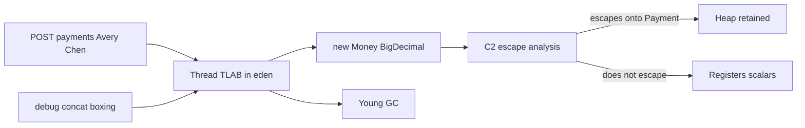

# L-7.5 — Allocation behavior

**Module:** 7 — JVM Internals and Performance  
**Duration:** 30 minutes  
**Case study:** BayPay Financial Services (fictional)

## Why this matters

G1 (L-7.4) is downstream of **how fast** `payment-service` allocates. `Money` is immutable on purpose: `plus` and `minus` return **new** objects wrapping **new** `BigDecimal`s. That is correct money code. It is also allocation. Thread-local allocation buffers (TLABs) make the common path a pointer bump. Escape analysis can sometimes erase an object that never leaves a method. A debug log that builds strings on every Harbor Bike Co `POST` will not be erased. If you “optimize” by making `Money` mutable, you will trade a GC story for a correctness incident on Avery Chen’s `$84.00`.

---

## Learning objectives

- Explain TLAB allocation on a Java 21 HotSpot request thread.
- State what escape analysis can and cannot do for `Money`.
- Recognize `Money` / `BigDecimal` allocation as expected, and logging or boxing storms as optional waste.
- Predict how allocation rate shows up in young GC (L-7.4) before you change `-Xmx`.

---

## Concept explanation

**TLAB.** Each mutator thread (a Tomcat worker handling `POST /api/v1/payments`) gets a **thread-local allocation buffer** in eden. Small objects — a `CreatePaymentRequest` tree, a `Money`, a `UUID` — are allocated by bumping a pointer. No heap lock on the fast path. When the TLAB is exhausted, the thread refills (and may trigger the slow path that leads to a young GC). Huge objects skip TLABs and may be **humongous** (L-7.4).

**Escape analysis (EA).** C2 (L-7.3) proves whether an object **escapes**: stored in a field, returned, published to another thread. If a `Money` is created, used, and dies inside one compiled method, C2 may **scalar-replace** it (keep `amount` and `currency` in registers) or stack-allocate the idea of it. EA is a best effort after warmup. It does **not** apply to `payment.money()` stored on the `Payment` entity. Do not write unreadable code “to help EA.”

`BigDecimal.add` always returns a **new** decimal. There is no “plus in place” that stays honest. Integer autoboxing caches `-128..127`; Avery Chen’s `$84.00` minor units are not a reason to switch the domain to `int` so you can hit that cache. `String` concatenation in Java 21 still allocates builders and `byte[]`s. Parameterized logging (`log.info("authorized {}", payment.id())`) avoids building the string when the level is off — if the API actually lazy-evaluates. Concatenation with `+` does not.

**`Money` allocations.** In `shared`:

- `new Money(request.amount(), request.currency())` in `PaymentApplicationService.create`
- `plus` / `minus` → `new Money(amount.add(...), currency)` plus `BigDecimal.add`’s new decimal
- `toString` / logs that call `payment.money().toString()`

Immutability is the Module 1 invariant. LAB-702 will let you **measure** allocation, not license mutation.

**Logging and boxing storms.** `logger.debug("pay {} {}", id, money)` still evaluates arguments if you do not guard or use parameterized loggers carefully; worse is string concatenation in a loop. Boxing: `map.merge(currency, amount.doubleValue(), Double::sum)` builds `Double`s; `Integer` totals on the hot path do the same. A stream that boxes every ledger minor-unit into `Long` on each authorize is a storm. Correlation-id MDC (`correlationId=...` in BayPay’s console pattern) is cheap next to `payment.toString()` per filter.

Allocation rate ≈ young GC, not “we need more `-Xmx`.” Live set is what stays after GC. Storms raise **rate**. Leaks raise **live set**. Different knobs.

---

## Visual explanation



Alt text: Request threads bump-allocate Money in a TLAB; escape analysis may erase non-escaping values; logging storms still hit young GC.

---

## Architecture

`PaymentApplicationService.create` is the allocation spine for a successful Avery Chen pay: validate key, load `Customer`/`Account`, `new Money`, `Payment.received`, transitions, `authorizer.authorize`, `payments.save`, audit `AuditEvent`, `posting.postAuthorized`. Each step can add DTOs and proxies.

| Source | Expected? | Why |
|---|---|---|
| One `Money` + `Payment` per create | Yes | Domain model |
| `Money.plus` in ledger math | Yes | Immutability |
| Per-request Jackson tree | Yes | HTTP |
| Debug `toString` of full `Payment` | No | Logging storm |
| Boxing in a tight totals loop | No | Boxing storm |
| Growing static `List<Payment>` | No | Live-set / leak *hint* |

Five modules share TLABs per thread, not per module. `transaction-worker` posting on the same JVM allocates on **its** threads’ TLABs. A burst of ledger posts after a canary warmup can look like “G1 got worse” when it is really `PaymentPostingService` creating journal-shaped objects on a second set of TLABs. Measure **per thread group** if you can (JFR allocation samples locally); do not average away the worker.

---

## Production example

`pay-prod-east-2` shows young GCs every few hundred milliseconds after Jordan Voss enables `DEBUG` on `com.baypay` to watch Harbor Bike Co. Each authorize logs the whole `Payment` for customer `11111111-1111-1111-1111-111111111111`, including `Money.toString()` and the idempotency key. Riley Okonkwo sees CPU in GC (symptom class you will meet later) and proposes `-Xmx2g`.

Priya Nair compares a class histogram: `char[]` / `byte[]` / `String` counts explode; `Payment` instance count is flat. Turning DEBUG off returns the young-GC interval toward `pay-prod-east-1`. The `Money` allocations from `create` were never the storm. Do not mutate `Money` to fix a log line. Do not set `-Xmx` equal to anything from this story — you have not even looked at a container yet (L-7.6).

---

## Code/configuration example

Expected allocation (keep this):

```java
Money money = new Money(request.amount(), request.currency());
Payment payment = Payment.received(
        UUID.randomUUID(),
        customer.id(),
        account.id(),
        money,
        request.reference(),
        key,
        now);
```

Storm-shaped logging (do not add this to the hot path):

```java
log.debug("authorize " + payment.id() + " " + payment.money() + " "
        + payment.idempotencyKey() + " " + payment);
Integer boxed = Integer.valueOf(payment.money().amount().intValue());
```

Prefer parameterized logs at INFO/WARN, and keep DEBUG off in the canary. LAB-702 will give you a **controlled** allocator so you can watch TLAB/young GC move without attacking `Money`’s invariants.

Controlled means: you know how many `Money` (or lab stand-in) objects you created per request, you record histogram **before/after** a fixed `POST` count for Avery Chen’s account `22222222-2222-2222-2222-222222222221`, and you change **one** variable (log level, extra `plus` loop, boxing). Uncontrolled is “we ran the app for a while.” That cannot separate TLAB refill from a leak *hint*.

```bash
jcmd <pid> GC.class_histogram | egrep "Money|Payment|String|byte\\[\\]"
jcmd <pid> GC.heap_info
```

Histogram **deltas** under a known request rate are the observation. One snapshot is not a leak.

---

## Trade-offs

| Approach | Strength | Cost |
|---|---|---|
| Immutable `Money` | Safe publication, honest money | Predictable allocations |
| Mutable money fields | Fewer objects | Illegal states; lost Module 1 invariants |
| DEBUG on `com.baypay` | Easy canary story | Allocation + I/O storm |
| Escape-analysis-friendly locals | C2 may erase them | Only after warmup; not a design rule |

Keep `Money` immutable. Cut storms. Measure in LAB-702.

---

## Failure modes

- **Young GC thrash:** allocation rate from logs, JSON, or boxing.
- **Humongous `byte[]`:** oversized payloads or copies; regions waste.
- **False “Money leak”:** histogram shows `Money` because every `Payment` embeds one.
- **Mutating `Money` for speed:** currency/amount races; Avery Chen debited wrong.
- **Trusting EA in tests:** C2 may not have compiled `plus` yet (`-Xint` or cold).

---

## Security/reliability implications

Logging a full `Payment` at DEBUG writes amounts and idempotency keys into disks and aggregators. That is a data-handling problem even with synthetic Avery Chen ids. Boxing storms are availability: GC CPU delays `AUTHORIZED`. Reliability still depends on `Idempotency-Key`; faster allocation does not replace it. Do not disable allocation (or GC logs) to hide a storm.

---

## Interview perspective

**Engineer:** “TLABs make small `Money` allocations cheap. `plus` creates a new `Money`. I would not make it mutable.”

**Senior:** “I would split expected domain allocation from logging/boxing storms. Escape analysis only helps non-escaping objects after C2.”

**Staff:** “I would use histogram deltas and young-GC frequency under a known POST rate. I would turn off DEBUG on `pay-prod-east-2` before I touch `-Xmx`.”

**Principal:** “Immutability of `Money` is a product control. I will fund lab evidence (LAB-702) and log hygiene. I will not fund a mutable-money rewrite for GC.”

---

## Key takeaways

- TLABs make per-thread eden allocation a pointer bump.
- Escape analysis may erase non-escaping objects after JIT warmup.
- `Money` allocations are the cost of immutability; keep them.
- Logging and boxing storms are the usual optional waste.
- Allocation rate drives young GC; live set drives old / OOM stories.

---

## Knowledge check

1. Does `Money.plus` allocate? Should BayPay stop doing that for performance?
2. Why might C2 allocate no `Money` object for a local helper that never stores the value on `Payment`?
3. DEBUG logging of `payment.toString()` on every authorize — which GC symptom do you expect first?

<details>
<summary>Spoiler — answers</summary>

1. Yes: a new `Money` and a new `BigDecimal`. Do not make `Money` mutable; measure and cut storms instead.
2. Escape analysis / scalar replacement: the object does not escape, so C2 can keep fields in registers. Not guaranteed until compiled.
3. Higher young-GC frequency (allocation rate), lots of `String`/`byte[]`/`char[]` on a histogram. Not necessarily a `Payment` leak.

</details>

---

## Related lab

Work [LAB-702](../../../../labs/LAB-702/README.md) after this lesson. Drive a controlled allocator against `payment-service` (or the lab harness) and record histogram + young-GC change. Then use [LAB-703](../../../../labs/LAB-703/README.md) to read the same behavior in `-Xlog:gc`. Do not open `solutions/` first.

---

## Related PAKS

Optional: `docs/01-computer-architecture/cpu-and-memory-fundamentals.md` (caches and why bump allocation is fast). This lesson stands alone.
