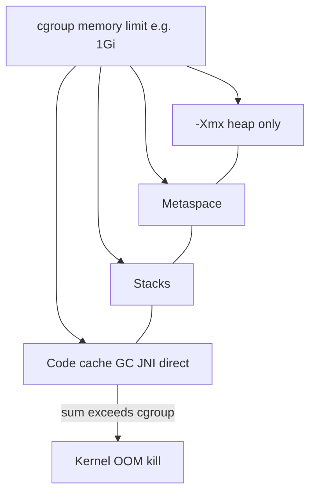

# L-7.6 — JVM in containers

**Module:** 7 — JVM Internals and Performance  
**Duration:** 30 minutes  
**Case study:** BayPay Financial Services (fictional)

## Why this matters

A container (cgroup) memory limit is the **whole process** budget: heap, stacks, metaspace, code cache, direct buffers, glibc, and the OS page cache the JVM cannot use. `-Xmx` is only the heap (L-7.1). If you set `-Xmx` **equal** to the container limit, native headroom is zero and the kernel OOM-kills `payment-service` while the heap still has free eden. Avery Chen’s in-flight `POST` dies with a 137, not `Java heap space`. Java 21 HotSpot **sees** cgroup limits (`UseContainerSupport`). It still will not save you from that sizing mistake.

---

## Learning objectives

- Explain `UseContainerSupport` and `-XX:MaxRAMPercentage` on Java 21 HotSpot.
- Contrast the cgroup memory limit with `-Xmx` and with RSS.
- Leave native headroom; never set `-Xmx` equal to the container limit.
- Know that LAB-704 is the only Module 7 lab that may use Docker, and that paper reasoning is enough.

---

## Concept explanation

**UseContainerSupport.** On Java 21 HotSpot this is **on by default**. The VM reads Linux cgroup v1 or v2 memory and CPU limits instead of the host’s full RAM/CPU. `-XX:-UseContainerSupport` makes the JVM ignore the container — a 512 MiB pod on a 64 GiB node would then size as if it had 64 GiB. Do not turn it off on BayPay images.

**MaxRAMPercentage.** If you **do not** set `-Xmx`, Java 21 sets the **maximum heap** to a **percentage of the memory the VM believes it has** (container limit when support is on). The default **`MaxRAMPercentage` is 25** — twenty-five percent, not 100. A 2 GiB cgroup without `-Xmx` therefore does **not** get a 2 GiB heap. `InitialRAMPercentage` / `MinRAMPercentage` influence initial sizing; teach the 25% max default so you are not surprised. Operators often set `-Xmx` **explicitly** once they have measured, which is clearer than relying on the percentage.

**cgroup vs `-Xmx` vs RSS.**

| Number | What it is |
|---|---|
| Cgroup / Docker `--memory` | Kill / throttle line for the **container** |
| `-Xmx` | Max **Java heap** |
| RSS | What is resident **now** (heap committed + stacks + metaspace + native) |

RSS can exceed `-Xmx` and still be healthy (L-7.1). If RSS plus other cgroup charges hit the **limit**, the kernel kills the process (**container OOM** symptom class). That is a different failure from `OutOfMemoryError: Java heap space`.

**Headroom.** Leave room under the cgroup for: metaspace (Spring 3.5.5 + Hibernate), one `-Xss` per platform thread, code cache, G1 native, direct NIO, thread stacks for Tomcat + Hikari, and the JVM itself. **Do not set `-Xmx` equal to the container limit.** A common teaching picture is “heap is a large fraction, never the whole limit”; the exact fraction is a measurement, not a slogan. LAB-704 is where you *see* the kill vs the heap OOM.

CPU quotas also feed `ActiveProcessorCount`, which sizes GC and compiler threads. A 1-CPU canary with a 4-CPU-sized GC thread list is a later tuning story; do not chase it here.

**Worked headroom (teaching arithmetic, not a recipe).** Limit **1 GiB**. `-Xmx512m`. Budget roughly: ~512 MiB heap max, ~80–150 MiB metaspace for Boot 3.5.5 + Hibernate after warmup, 1 MiB × (Tomcat + Hikari + compiler + GC threads), tens of MiB code cache, G1 native, direct buffers. That remainder is why 512m-on-1g can live and 1g-on-1g dies. If `jcmd VM.flags` shows `MaxHeapSize` ≈ 1073741824 on a 1g cgroup, you made the forbidden choice — change the flag, not the collector.

---

## Visual explanation



Alt text: The container limit wraps heap plus metaspace, stacks, and native; filling -Xmx to that limit leaves no headroom and risks a kernel OOM kill.

Diagram **AEJE-D-031** (JVM in containers) is the course asset for this picture.

---

## Architecture

Teaching path: local `spring-boot:run` has **no** cgroup (unless you add one). Fat JAR in Docker is what LAB-704 may start. Production-shaped names: `pay-prod-east-1` / `pay-prod-east-2` as pods with a stated memory limit in a later pack. This lesson does not need AWS or a cluster.

`JAVA_TOOL_OPTIONS` in a base image can inject `-Xmx` you did not pass on the command line (L-1.1). Always print flags (`java -XshowSettings:vm` or `jcmd VM.flags`) inside the same container you will run. `MaxHeapSize` is the decoded `-Xmx` / ergonomic result in **bytes**. Compare it to the cgroup `memory.max` (v2) or Docker `--memory`, not to host `free -h`.

Module 5’s `Pay1` WAS heap is a different estate. Do not copy a cell `-Xmx` onto a Boot cgroup.

---

## Production example

Jordan Voss sets the canary container to **1 GiB** and, “to use the memory we paid for,” sets `-Xmx1g`. After Harbor Bike Co traffic — Avery Chen `11111111-1111-1111-1111-111111111111`, account `22222222-2222-2222-2222-222222222221` — NMT shows a 1 GiB heap plus threads, metaspace, and code. RSS crosses 1 GiB. The kubelet/cgroup killer sends SIGKILL. Riley Okonkwo sees a restart loop. The heap dump never writes; there was no Java heap OOM.

Priya Nair’s fix shape: **lower `-Xmx`** (or raise the **limit** and still keep `-Xmx` below it), confirm `UseContainerSupport` stayed true, and check `MaxRAMPercentage` only if `-Xmx` is unset. She does **not** set `-Xmx` to 1g again. Module 8 may give you a container-OOM pack; the evidence rule is the same: name whether the kernel or the heap failed.

If the same canary instead throws `OutOfMemoryError: Java heap space` with a dump, the cgroup still had room and G1 could not free eden/old for the next `Payment`. That is L-7.1/L-7.4, not this kill. Students who only look at “OOM” in a dashboard will mix the two and raise `-Xmx` into the limit.

---

## Code/configuration example

Prefer an explicit heap **below** the limit (numbers are teaching examples, not a prod recipe):

```text
# container memory limit: 1g  (Docker --memory=1g or cgroup)
# heap must be smaller — do not use -Xmx1g here
-XX:+UseContainerSupport
-Xmx512m
```

If you omit `-Xmx` on Java 21, know the default percentage:

```text
-XX:MaxRAMPercentage=25.0
# 1g cgroup → max heap about 256m, not 1g
```

Some teams raise `MaxRAMPercentage` (for example 50 or 75) **and still** stay under the cgroup. Raising it to 100 is the same class of mistake as `-Xmx` equal to the limit.

```bash
# optional LAB-704 — not required to finish this lesson
docker run --memory=1g --cpus=1 ...
jcmd 1 VM.flags | egrep "MaxHeapSize|MaxRAMPercentage|UseContainerSupport"
jcmd 1 VM.native_memory summary
```

`jcmd 1` is typical when the JVM is PID 1 in the container. On a laptop without Docker, reason the same arithmetic from L-7.1 NMT.

---

## Trade-offs

| Approach | Strength | Cost |
|---|---|---|
| Explicit `-Xmx` < cgroup | Predictable heap; clear headroom | You must pick a number from evidence |
| Default `MaxRAMPercentage=25` | Safe-ish unset default | Heap may look “too small” on a large limit |
| High `MaxRAMPercentage` | Uses more of the limit for heap | Eats native headroom |
| `-Xmx` = cgroup limit | “Uses all the memory” | Kernel OOM; no dump; lost payments |

Never choose the last row.

---

## Failure modes

- **Container OOM kill:** RSS + unreclaimable mappings hit the cgroup. No Java stack.
- **Heap OOM:** `-Xmx` too small for live `Payment` set. Java exception, dump possible.
- **`-XX:-UseContainerSupport`:** heap sized from the **node**, then cgroup kill.
- **Inherited `JAVA_TOOL_OPTIONS=-Xmx...`:** surprises at start (L-1.1).
- **Blaming G1:** the collector cannot compact your way out of a zero-headroom cgroup.

---

## Security/reliability implications

A SIGKILL during `AUTHORIZED` looks like a client timeout. The merchant retries; `Idempotency-Key` must still make Avery Chen’s debit once. Reliability: probes that only check the process miss a cgroup that is about to kill you — watch RSS vs limit. Security: a tenant that can lower your cgroup without changing `-Xmx` can induce kills (availability attack). Do not run `payment-service` with `--privileged` so it can ignore cgroups.

---

## Interview perspective

**Engineer:** “`UseContainerSupport` is on in Java 21. `-Xmx` is the heap. I would not set it equal to the container limit.”

**Senior:** “Default `MaxRAMPercentage` is 25 if `-Xmx` is unset. RSS includes native. A cgroup kill is not `Java heap space`.”

**Staff:** “I would print VM flags inside the container, compare NMT to the limit, and leave headroom for metaspace, stacks, and code cache. I would treat image `JAVA_TOOL_OPTIONS` as part of the contract.”

**Principal:** “Sizing is an SLO input: we pay for limit, we spend heap plus native. I will not approve `-Xmx` equal to the request/limit. Container OOM stays a gated diagnosis later.”

---

## Key takeaways

- Java 21 reads cgroups by default (`UseContainerSupport`).
- Unset `-Xmx` → max heap is `MaxRAMPercentage` (default 25%) of container memory.
- `-Xmx` is not the cgroup limit and not RSS.
- Leave native headroom; never set `-Xmx` equal to the container limit.
- Kernel OOM and heap OOM are different failures.

---

## Knowledge check

1. A pod limit is 1 GiB and `-Xmx` is 1g. Why can `payment-service` still be OOM-killed?
2. Java 21, 2 GiB cgroup, no `-Xmx`. About how large is the max heap by default, and which flag is that?
3. Should students turn off `UseContainerSupport` so the JVM “sees all host RAM”?

<details>
<summary>Spoiler — answers</summary>

1. Stacks, metaspace, code cache, GC native, and direct buffers sit outside `-Xmx`. Their RSS plus the heap can exceed 1 GiB and the cgroup kills the process.
2. About 25% of 2 GiB, roughly 512 MiB, via default `-XX:MaxRAMPercentage=25`.
3. No. The JVM would size as if the host were the machine and then hit the cgroup anyway.

</details>

---

## Related lab

Work [LAB-704](../../../../labs/LAB-704/README.md) after this lesson. Docker or Podman is **optional**; you can complete the comparison on paper with NMT numbers from LAB-701. If you do run a container, keep `-Xmx` **below** `--memory`. Do not open `solutions/` first. No AWS. Cost $0.

---

## Related PAKS

Optional: `docs/01-computer-architecture/cpu-and-memory-fundamentals.md`. Physical RAM vs virtual vs RSS is the hardware vocabulary under cgroups. This lesson stands alone.
