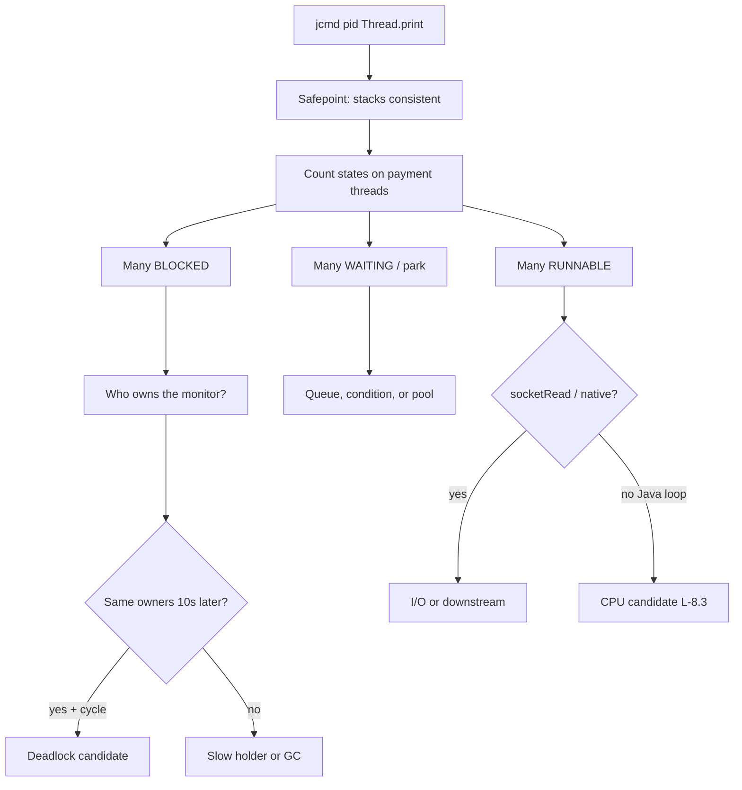

# L-8.1 — Thread-dump analysis

**Module:** 08 — JVM Troubleshooting  
**Duration:** 30 minutes  
**Diagram:** AEJE-D-032  
**Case study:** BayPay Financial Services (fictional)

---

## Why this matters

When `POST /api/v1/payments` hangs on `pay-prod-east-2` and `/actuator/health` still says UP, Riley Okonkwo’s first JVM artifact is a **thread dump**, not a restart. A dump is a snapshot of every Java thread: name, state, stack, and which monitor it holds or wants. Module 2 taught you the *shape* of a hang versus a race. This lesson is the **production method** on the Boot canary. You will use the same method on more than one Module 8 pack. The dump is evidence. It is not a finished RCA, and it is not a reason to bounce `dmgr-east`.

---

## Learning objectives

- Capture a dump with `jcmd <pid> Thread.print` or `jstack` and say what a safepoint costs.
- Classify RUNNABLE, BLOCKED, WAITING, and TIMED_WAITING from a BayPay dump excerpt.
- Separate “Found one Java-level deadlock” (evidence) from a written lock *policy*.
- Decide when a second dump, ten seconds later, is required before you act.

---

## Concept explanation

A thread dump is taken at a **safepoint**: the VM pauses application threads in known states so stacks are consistent. That pause is usually short. On a saturated canary it can add a visible hitch. Prefer `jcmd <pid> Thread.print` (no extra process) over attaching a GUI. `jstack <pid>` is the same idea. Module 7’s `-XX:+UnlockDiagnosticVMOptions` is not required to print threads.

Read every thread as four fields:

| Field | What you write down |
|---|---|
| Name | `http-nio-*`, `boundedElastic-*`, `GC Thread`, `Finalizer` |
| State | RUNNABLE, BLOCKED, WAITING, TIMED_WAITING, NEW, TERMINATED |
| Lock | `waiting to lock <0x…>` vs `locked <0x…>` vs `- parking to wait for` |
| Top frames | First *application* frames, not only `Unsafe.park` |

**RUNNABLE** means the thread is executing Java or is in a native call the VM still labels runnable. A `socketRead` frame is often *blocked on I/O*, not burning a core. A tight Java loop with no I/O is the CPU candidate (L-8.3). **BLOCKED** means the thread wants a `synchronized` monitor another thread owns. **WAITING** / **TIMED_WAITING** usually means `Object.wait`, `LockSupport.park`, a condition, a queue `take`, or a sleep. Those states are normal for an idle Tomcat worker. They are a problem when *every* payment thread is there and completions have stopped.

The VM may append **Found one Java-level deadlock**. Treat that as a strong *candidate*: two or more threads each hold a monitor the other needs. You still quote owners, frames, and whether money work is in those stacks. You do not paste a Module 2 worker story onto this canary. You do not invent a lock-order lecture from the lesson title. The pack’s stacks decide.

One dump is a photograph. Two dumps show whether the same threads are still on the same monitors. If the set rotates, you may be looking at a slow lock or a downstream, not a permanent circle.

---

## Visual explanation



Alt text: AEJE-D-032 style decision tree. Capture a thread dump at a safepoint, count payment-thread states, then follow BLOCKED to lock owners, WAITING to queues, and RUNNABLE to either I/O or a CPU loop.

---

## Architecture

`pay-prod-east-2` is one Spring Boot JVM behind the east load balancer. Tomcat request threads enter `PaymentApplicationService`. They may call JPA, an executor, or a downstream HTTP client. Those are *different* wait points. A dump that shows every `http-nio` thread in `getConnection` is a pool story (you already practiced that class on INCIDENT-402). A dump that shows them parked on a work queue is L-8.6. A dump that shows a monitor cycle is this lesson’s deadlock *method*.

`pay-prod-east-1` staying healthy while the canary pages is architecture: isolate the investigation to the canary JVM. Do not open the WAS cell console. Do not recycle `Pay2`. Jordan Voss’s canary flag tells you *which process* to dump, not *why* it is stuck.

Stabilization uses the dump: drain the canary at the balancer, capture a second print, then recycle *that* replica if the dump shows no progress. Remediation is a code or config change you can defend from frames, not from a bounce.

---

## Production example

Priya Nair pages Riley at 14:12 Pacific: authorize p99 on the canary is off the chart, east-1 is fine, liveness is UP. Riley’s first note is “canary only; requesting Thread.print.” The first dump shows many `http-nio` threads in one state. Riley writes a hypothesis *before* opening the next evidence gate. A second dump either confirms the same owners or shows movement.

That is the habit the labs score. Naming a failure class from the pager title is not diagnosis. Quoting thread names, states, and monitors — then saying what you would do next — is.

If the dump is empty of application frames and full of `VM Thread` / safepoint, you may have caught the JVM in a GC pause (L-8.5). Write that contradiction. Do not force a deadlock sentence onto a GC safepoint.

---

## Code/configuration example

Capture on a host where you are allowed to attach (laptop `payment-service`, or a pack that already printed this for you):

```text
jcmd $PID Thread.print
# equivalent: jstack $PID
```

Synthetic excerpt — illustrative, not a lab answer:

```text
"http-nio-8080-exec-12" #42 prio=5 os_prio=0 tid=0x00007f8a BLOCKED
   java.lang.Thread.State: BLOCKED (on object monitor)
	at com.baypay.payment.service.PaymentApplicationService.authorize
	- waiting to lock <0x00000000c1a00b10> (a java.lang.Object)
	at org.springframework.web.method.support.InvocableHandlerMethod.doInvoke

"http-nio-8080-exec-7" #37 prio=5 os_prio=0 tid=0x00007f91 RUNNABLE
   java.lang.Thread.State: RUNNABLE
	at java.net.SocketInputStream.socketRead0(Native Method)
	at org.springframework.web.client.RestTemplate.doExecute

"http-nio-8080-exec-3" #33 prio=5 os_prio=0 tid=0x00007f77 WAITING
   java.lang.Thread.State: WAITING (parking)
	at jdk.internal.misc.Unsafe.park(Native Method)
	at java.util.concurrent.locks.LockSupport.park
	at java.util.concurrent.LinkedBlockingQueue.take
```

Write three sentences from that excerpt: one BLOCKED (needs the owner of `0xc1a00b10`), one RUNNABLE that is *I/O*, one WAITING on a queue. Do not promote any sentence to “the Module 8 deadlock RCA.”

---

## Trade-offs

| Choice | Gain | Cost |
|---|---|---|
| `jcmd Thread.print` | Fast, scriptable, no GUI | Safepoint hitch; one photograph |
| Two dumps 10s apart | Distinguishes stuck from slow | Extra pause; still not a heap story |
| `jstack -l` / extra lock info | Richer monitors | Slightly heavier; still Java-level |
| Continuous profiler instead | CPU over time (L-8.3) | Not a lock graph |
| Bounce the canary first | Sometimes restores traffic | Destroys the dump you needed |

---

## Failure modes

- Treating every RUNNABLE as a hot loop. Read the top frame.
- Treating every WAITING Tomcat thread as a deadlock. Idle workers wait.
- Calling the VM deadlock section a closed RCA with no owners quoted.
- One dump during a GC safepoint, then “the JVM is deadlocked.”
- Dumping `pay-prod-east-1` because it is “the payment box,” or dumping `dmgr-east`.
- Restarting the canary before a second print when completions are already zero.

---

## Security/reliability implications

A thread dump contains class names, lock identities, and sometimes URL or SQL fragments in frames. Treat pack dumps as synthetic; treat a real dump as restricted. Do not paste production stacks into a public ticket.

Reliability: a health check that does not take the same locks as authorize will stay UP during a hang. Readiness should fail when the canary cannot complete a cheap, lock-safe probe. Communication must say what is stopped (`POST /payments` on east-2), what you captured, and what you have not proven.

---

## Interview perspective

**Engineer.** I take `jcmd Thread.print`, count states, and read the first application frames. BLOCKED means a monitor. WAITING often means a queue. RUNNABLE might be I/O.

**Senior.** I compare two dumps. I quote lock owners. I do not bounce east-1 or the WAS cell for a canary page. I separate deadlock evidence from a pool or downstream wait.

**Staff.** I use dumps to choose the smallest stabilize (drain east-2) and I refuse a root-cause sentence until frames and gauges agree. I will not max a diagnostic score on a title guess.

**Principal.** Thread dumps are a standard operating artifact, not a hero tool. I fund attach permissions, dump retention, and readiness that reflects authorize — and I score on-call on evidence order.

---

## Key takeaways

- Dump the canary JVM (`pay-prod-east-2`), not `BayPayCell`.
- States plus owners plus a second snapshot beat a single adjective.
- Safepoints make dumps consistent and can stall a hot process.
- “Found one Java-level deadlock” is evidence, not a policy.
- A lucky hang label does not max Diagnostic method.

---

## Knowledge check

1. Avery Chen’s create hangs only on `pay-prod-east-2`. Which process do you dump, and which process do you refuse to bounce first?
2. A thread is RUNNABLE with `socketRead0` at the top. Is that proof the canary is CPU-bound?
3. Why take a second `Thread.print` ten seconds later when the first dump shows BLOCKED payment threads?

<details>
<summary>Spoiler — answers</summary>

1. Dump the Boot canary `pay-prod-east-2`. Do not bounce `dmgr-east` or a WAS `Pay*` member for this page.
2. No. That frame is typically I/O wait mislabeled as RUNNABLE. Look at CPU gauges and whether stacks are Java loops.
3. To see whether the same threads still own and wait for the same monitors (stuck) or have moved (slow holder, GC, or load).

</details>

---

## Related lab

[INCIDENT-803](../../../../labs/INCIDENT-803/README.md) — a canary hang whose student guide is symptoms only. Capture the method from this lesson; work the pack gates; do not open `solutions/INCIDENT-803/` until the worksheet is filled. This is not INCIDENT-202.

---

## Related PAKS

Optional: `docs/27-production-failures/failure-analysis-methodology.md` (evidence order, stabilize vs remediate). The dump method stands alone without a PAKS login.
