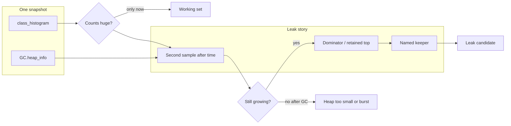

# L-8.2 — Heap-dump reasoning

**Module:** 08 — JVM Troubleshooting  
**Duration:** 30 minutes  
**Case study:** BayPay Financial Services (fictional)

---

## Why this matters

A heap dump is a picture of every live object on `pay-prod-east-2`. A **class histogram** is a count and shallow-size table. Students who wait for a 2 GB `heap.hprof` never finish the lab, and this course will not ship that binary. Module 8 teaches you to reason from **summaries**: `jcmd GC.class_histogram`, `GC.heap_info`, a retained-size top-N, and a second sample after load. A tall `byte[]` line is not a leak. A growing retained set with a named dominator is a leak *candidate*. INCIDENT packs will give you text, not MAT.

---

## Learning objectives

- Contrast a histogram (counts now) with a leak (growth plus a keeper).
- Read shallow size versus retained size, and say why dominators matter.
- Use `jcmd` histogram and heap-info output without opening a binary dump.
- Refuse a closed “memory leak” sentence from a single snapshot.

---

## Concept explanation

`jcmd <pid> GC.class_histogram` lists classes sorted by bytes, then instances. It is cheap relative to `GC.heap_dump`. It answers “what is on the heap *right now*.” Payment-service histograms always show `byte[]`, `char[]`/`byte[]` backing for `String`, `Object[]`, and `HashMap$Node`. That is a live working set, not guilt.

A **leak** is *unbounded growth of objects that remain reachable* after the work that created them should have finished. Proof needs:

1. **Time:** used heap or a class count rises across two samples while traffic is steady or after traffic falls.
2. **Reachability:** something still points at the junk (a static map, a cache, a ThreadLocal, a session, a listener).
3. **Dominator:** one owner whose retained size explains most of the extra heap.

**Shallow size** is the object itself. **Retained size** is what would be freed if that object died. A small `ConcurrentHashMap` can retain hundreds of megabytes of payment payloads. The histogram shows `Payment` × N; the dominator tree shows *who holds the map*.

`GC.heap_info` (G1) tells you Eden / Survivor / Old occupancy. Old gen that does not fall after a full collection is a live-set story. Old gen that falls and then refills is allocation or a small heap (L-8.5), not automatically a leak.

This course never requires you to load a multi-gigabyte dump into Eclipse MAT. If a pack includes a “MAT-style summary,” treat it as the retained-size table an engineer would export. Quote class names and retained megabytes. Do not invent frames that are not in the file.

---

## Visual explanation



Alt text: A histogram or heap-info snapshot only shows the working set. A leak candidate needs a second sample that still grows, plus a dominator that names the keeper.

---

## Architecture

Each canary replica has its own heap. `pay-prod-east-1` at a flat 512 MB used and `pay-prod-east-2` climbing toward `-Xmx` is a canary-only investigation. Shared Postgres does not hold Java objects. The WAS cell does not hold this process’s heap. Do not request a dump of `Pay2` for a Boot page.

Where objects live matters for *what* you dump:

| Holder | Typical symptom | First tool |
|---|---|---|
| Heap (Java objects) | Used heap climbs; GC cannot reclaim | Histogram + retained summary |
| Metaspace | Class-loader growth after hot reload | `jcmd VM.metaspace` / native summary |
| Native / direct | Process RSS high, heap calm | `VM.native_memory` (Module 7, L-8.7) |

Module 8 leak labs stay on the Java heap unless the pack’s gauges say otherwise. Do not “upgrade” to a binary dump because the histogram feels incomplete. Write the question the histogram cannot answer, then open the next **gate** — often a retained-size excerpt, not an `hprof`.

---

## Production example

Jordan Voss flipped the canary at 11:40. By 13:05 Priya sees used heap on `pay-prod-east-2` stepping up after each GC, while east-1 is flat. Riley’s first hypothesis is “leak or heap too small.” Gate 1 is the dashboard. Gate 2 might be a histogram: `String` and `byte[]` dominate, which is true on every JVM. That does **not** close the incident.

The useful move is a second histogram after thirty minutes, plus a retained-size top that names an application holder. If the extra megabytes disappear after a GC when traffic drops, you do not have a leak — you have a live set or an allocation burst (L-8.5). If they remain and one cache-like owner retains them, you have a leak *candidate* for L-8.4.

Avery Chen’s single payment is not the heap. Do not hunt her UUID in a histogram.

---

## Code/configuration example

Flags students already met in Module 7 (optional on a laptop; packs already contain output):

```text
-Xlog:gc*:file=gc.log:time,uptime,level,tags
```

Commands that produce **text**, not a 2 GB file:

```text
jcmd $PID GC.heap_info
jcmd $PID GC.class_histogram
# Do not run GC.heap_dump in these labs. Packs ship summaries.
```

Synthetic histogram fragment — working set, not an RCA:

```text
 num     #instances         #bytes  class name
   1:       1842210      176852160  [B
   2:        410442       32835360  java.lang.String
   3:        198004       12672256  java.util.HashMap$Node
   4:         22110        1768800  com.baypay.payment.domain.Payment
```

What you may write: “`[B` and `String` lead; I need retained owners and a later sample.” What you may not write from this alone: “confirmed leak in payments.”

A retained-size excerpt (the kind a pack may reveal later) looks like:

```text
Retained top (summary, not hprof)
  412 MB  <application holder>
   38 MB  HikariPool-1
   12 MB  Tomcat NioEndpoint
```

The holder line is a pointer for the next hypothesis, not a sentence you copy into comms as root cause.

---

## Trade-offs

| Artifact | Use when | Do not use when |
|---|---|---|
| `class_histogram` | Cheap “what is live” | You need who retains it |
| Two histograms | Growth vs spike | Traffic changed wildly between samples |
| Retained / dominator summary | Naming a keeper | You treat the top row as guilt without growth |
| Full `hprof` | Rare offline forensics | This course; a live canary already near OOM |
| Bounce | Frees *this* heap | You call the bounce the fix |

---

## Failure modes

- Declaring a leak because `byte[]` is row 1.
- Taking one histogram at peak lunch and ignoring that east-1 looks the same.
- Filling the disk with `GC.heap_dump` on a 2 GB heap while Avery Chen is failing.
- Confusing metaspace or native RSS with a Java leak (L-8.7).
- Reading a histogram collected *during* a full GC and treating mid-collection numbers as the live set.

---

## Security/reliability implications

Heap dumps can contain PAN, account ids, and idempotency keys. This course uses synthetic summaries so you never handle a real dump. In a real BayPay-shaped service, dumps are restricted artifacts: encrypt at rest, short retention, no chat paste.

Reliability: dumping a heap on a dying canary can freeze the JVM at a safepoint for seconds to minutes. Prefer histogram plus metrics. If you must dump, drain the instance first. A leak that only lives in one canary is an availability problem for merchants hashed to that replica, not a database outage.

---

## Interview perspective

**Engineer.** A histogram shows counts. A leak needs growth. I would run `GC.class_histogram` twice and look at used heap after GC.

**Senior.** I want retained size, not just shallow `Payment` counts. I will not download a 2 GB dump to finish an on-call. I compare east-1 and east-2.

**Staff.** I separate “heap too small for the live set,” “allocation storm,” and “reachable junk.” I gate deeper summaries. I will not score a lucky “leak” with empty evidence.

**Principal.** I budget for summaries and histogram endpoints in the platform, not for every engineer to run MAT on a laptop. I treat heap dumps as sensitive data.

---

## Key takeaways

- Histogram = snapshot. Leak = growth + reachability + a keeper.
- Dominators explain retained size; shallow size does not.
- Module 8 uses text summaries. Never require a 2 GB `hprof`.
- `byte[]` on top is normal. Compare two samples and the other replica.
- A lucky “leak” label does not max Diagnostic method.

---

## Knowledge check

1. Why is a single `GC.class_histogram` with `byte[]` at row 1 insufficient to close a leak RCA on `pay-prod-east-2`?
2. What is the difference between shallow size and retained size for a cache-like map?
3. Why does this course refuse to make you open a 2 GB binary heap dump?

<details>
<summary>Spoiler — answers</summary>

1. Every JVM’s working set is arrays and strings. Without growth over time and a keeper, it is a snapshot, not a leak.
2. Shallow is the map object; retained is the map plus everything that would die with it (the entries and payloads).
3. It is operationally heavy, often secret-bearing, and unnecessary when a histogram plus a retained summary answers the question.

</details>

---

## Related lab

[INCIDENT-802](../../../../labs/INCIDENT-802/README.md) — heap pressure on the canary, symptoms only. Use histograms and summaries in gate order. Do not open `solutions/INCIDENT-802/` until the worksheet is complete. L-8.4 adds the leak patterns; this lesson is the dump *method*.

---

## Related PAKS

Optional: `docs/27-production-failures/failure-analysis-methodology.md`. Histogram-versus-growth is the same evidence discipline. Not required to finish INCIDENT-802.
