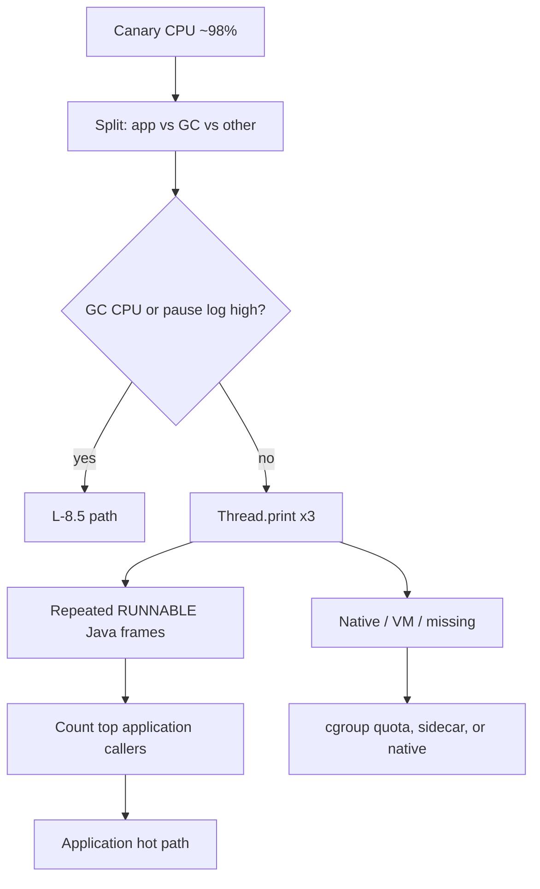

# L-8.3 — CPU saturation

**Module:** 08 — JVM Troubleshooting  
**Duration:** 30 minutes  
**Case study:** BayPay Financial Services (fictional)

---

## Why this matters

Priya Nair’s graph says `pay-prod-east-2` is at 98% CPU. That is a **symptom**. It is not “the GC is broken,” and it is not “add two cores and close the ticket.” CPU is time. Someone is running: application Java, JIT, GC worker threads, or native code. Module 7 showed you G1 can burn CPU during collections. This lesson is how you **attribute** saturation on the Boot canary with runnable stacks and flame-ish reasoning — without a commercial profiler license, and without guessing a hot method from the lesson title.

---

## Learning objectives

- Split process CPU into application, GC, and “other” before you change `-Xmx` or GC flags.
- Use RUNNABLE stacks (and two samples) as a poor engineer’s flame graph.
- Explain why a WAITING dump plus 98% CPU cannot both be the whole story.
- State what you would collect next if stacks are native or the VM thread.

---

## Concept explanation

A container or host CPU percent is **all threads that are scheduled**. On Java 21 / G1, that includes:

| Burner | How it looks |
|---|---|
| Application Java | Many `http-nio` or worker threads RUNNABLE in *your* frames |
| GC | `GC Thread` busy; `-Xlog:gc` shows frequent or long collections; `gc.cpu` up |
| JIT / compiler | Short spikes after a canary deploy (Jordan’s rollout window) |
| Native / encryption / checksum | RUNNABLE in `socketRead`? No — that is idle I/O. Look for `inflate`, digest, or libc |
| Steal / throttle | cgroup CPU quota; process thinks it needs more than the canary limit |

**Flame-ish reasoning** means: sample stacks several times (or read a pack’s collapsed stacks) and ask which *application frames* appear repeatedly at the top. You do not need a colored SVG. A table of “frame → count across five `Thread.print` files” is the same idea. Hot frames that stay in `java.util` or `java.lang` still have an *application caller* a few lines down. Quote that caller.

CPU is **not** GC by default. GC CPU rises when allocation is high or the heap is struggling (L-8.5). If GC time is 4% and the process is at 98%, the remaining 90% is not a collector lecture. Conversely, a canary at 98% with Old gen ping-ponging and `User=…` on GC lines *does* deserve a GC path — after you show those numbers.

RUNNABLE in a Java loop is the CPU candidate. RUNNABLE in `socketRead0` is not. BLOCKED / WAITING threads do not explain a saturated core unless *other* threads are RUNNABLE. If the dump is all parked and CPU is 98%, you are missing threads (GC, native, or another process in the cgroup). Write the contradiction.

---

## Visual explanation



Alt text: High canary CPU splits into GC versus application versus other. Repeated RUNNABLE Java frames become a flame-ish count of application callers; native or missing threads need another gauge.

---

## Architecture

`pay-prod-east-2` is sized as a canary: fewer replicas, often a tighter CPU limit than east-1. Saturation can mean “this replica got unlucky traffic” or “this build does more work per authorize.” Compare **per-request CPU** and **rps**, not only the percent. If east-1 handles the same rps at 25% CPU, the canary build or its noisy neighbor is in scope — not Postgres, and not `BayPayCell`.

Tomcat’s request thread count times a heavy per-request loop will pin every core. Virtual threads (L-2.5) can multiply *runnable* work if the hot path is CPU, not blocking I/O. An executor with an unbounded queue will not cap CPU; it will only delay the same work.

Stabilization is load shed or a canary rollback (Jordan), not a GC flag you cannot defend. Remediation is the hot path once stacks name it.

---

## Production example

At 16:20 Pacific, Avery Chen’s mobile client times out. Priya’s dashboard: east-2 CPU 98%, east-1 22%, authorize rps similar, heap used 45%, GC pause p99 12 ms. Riley’s first written hypothesis is “application CPU on the canary, not GC.” That sentence is allowed because the gauges already split the pie. The next investigation is stacks, not `-XX:G1…`.

Three `Thread.print` samples, twenty seconds apart, show the same application package under `http-nio` RUNNABLE threads. Riley counts callers. A one-word guess that matches a rumor from standup is not the RCA. The counted frames plus the CPU split are.

If the pack later shows GC CPU dominating, you *change* the hypothesis. That is a good diagnostic method score. Sticking to “it is GC” because Module 7 existed is a bad one.

---

## Code/configuration example

Split CPU with what Module 7 already turned on:

```text
# GC log already has user/sys time on collection lines
-Xlog:gc*:file=gc.log:time,uptime,level,tags

jcmd $PID Thread.print
jcmd $PID GC.heap_info
```

Flame-ish tally you can do on paper from three dumps (illustrative counts, not a lab answer):

```text
sample 1-3, http-nio RUNNABLE top application frames
  9  com.baypay.payment....   # same package, three samples
  2  org.hibernate.event.internal...
  1  org.springframework.web...
GC threads RUNNABLE: 0, 1, 0
socketRead0 RUNNABLE: 4, 3, 5   # I/O, not CPU
```

Process-level (container) you might see in a pack:

```text
cpu_usage_seconds  canary  0.98   # of its cgroup quota
jvm_gc_cpu_seconds_total  rate   0.04
```

Write: “~94% is not GC.” Do not write the method name you *hope* is hot until the samples say so.

---

## Trade-offs

| Approach | Gain | Cost |
|---|---|---|
| Three thread dumps | Works in every pack; no extra agent | Coarse; misses 50 ms spikes |
| JFR / async profiler | True flames | Not required here; attach policy |
| Scale the canary CPU | Buys time | Hides a per-request regression |
| Rollback the canary | Restores east-2 | Loses the reproduce if you skip dumps |
| Tune G1 first | Rarely right when GC CPU is low | Wastes the incident clock |

---

## Failure modes

- “CPU = GC” with 12 ms pauses and a calm heap.
- One dump during a safepoint, all threads in `VM Thread`, then “deadlock.”
- Scaling replicas so each is at 40% and calling that a root cause.
- Profiling east-1 because it is easier to attach.
- Treating `socketRead` RUNNABLE as a hot loop (L-8.1).
- Blaming the database when DB CPU is 15% and the canary is 98%.

---

## Security/reliability implications

Profilers and dumps expose method names and sometimes query strings. Keep them in the incident store. A canary at 98% CPU will fail readiness if the probe competes for cores; that is *good* if east-1 can take traffic. It is bad if the load balancer keeps sending Avery Chen to east-2 because liveness is still UP.

Reliability work after the incident is a budget: CPU per authorize, a regression gate on the canary, and a documented rollback. Do not leave the service “fixed” by a permanent extra core that nobody can explain.

---

## Interview perspective

**Engineer.** High CPU means I look at RUNNABLE stacks and whether GC time is high. I do not assume GC.

**Senior.** I split app vs GC vs quota. I tally frames across dumps. I compare east-1. I rollback the canary if the build is the change.

**Staff.** I treat flame-ish counts as evidence, not a brand-name profiler. I will not tune G1 to hide an application loop. I score the path, not the adjective.

**Principal.** I want per-replica CPU, GC CPU, and rps on one dashboard so on-call does not guess. Canary plus rollback is the architecture; hero tuning is not.

---

## Key takeaways

- Saturating CPU is a pie: application, GC, native, quota.
- Repeated RUNNABLE application frames are a flame graph you can draw by hand.
- `socketRead` and parked threads do not explain 98% user CPU.
- Compare `pay-prod-east-2` to east-1 before you touch the cell.
- A lucky hot-method guess does not max Diagnostic method.

---

## Knowledge check

1. Canary CPU is 98%, GC pause p99 is 10 ms, `jvm_gc_cpu` rate is 0.03. What class of explanation is *not* your first?
2. Why is a single RUNNABLE `socketRead0` stack a weak CPU RCA?
3. East-1 is at 20% CPU at the same rps. What architectural question does that raise?

<details>
<summary>Spoiler — answers</summary>

1. A GC-tuning story. Almost all of the pie is not the collector.
2. That thread is likely waiting on I/O; it does not account for saturated cores. Count Java-loop frames and GC CPU.
3. Whether the canary build, its CPU quota, or a noisy neighbor differs from the stable replica — not whether `BayPayCell` should be bounced.

</details>

---

## Related lab

[INCIDENT-801](../../../../labs/INCIDENT-801/README.md) — CPU 98 percent on the canary, symptoms only. Attribute before you name a method. Do not open `solutions/INCIDENT-801/` until the worksheet has a split pie and quoted stacks.

---

## Related PAKS

Optional: `docs/27-production-failures/failure-analysis-methodology.md`. Attribution before action is the same rule. Not required to finish INCIDENT-801.
