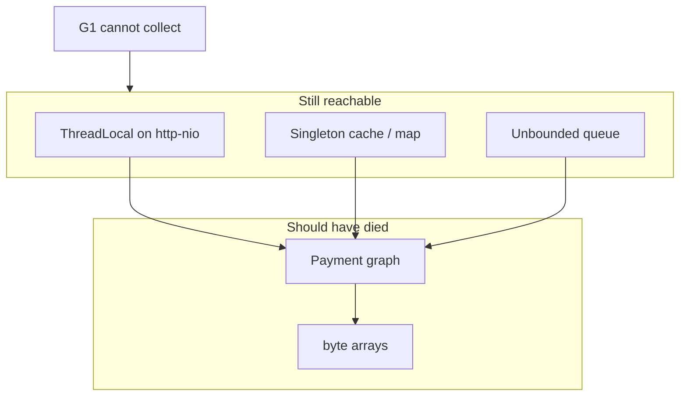

# L-8.4 — Memory leaks

**Module:** 08 — JVM Troubleshooting  
**Duration:** 30 minutes  
**Case study:** BayPay Financial Services (fictional)

---

## Why this matters

Used heap on `pay-prod-east-2` that climbs across hours, survives full collections, and does not climb on `pay-prod-east-1` is the leak *shape*. L-8.2 taught you not to call a histogram a leak. This lesson names the **keepers** BayPay actually ships: ThreadLocals that never get removed, caches without a bound or a TTL, lists that only append, and listeners that pin the class loader. You will meet one of those shapes in a Module 8 pack. The lesson will not tell you which keeper the pack uses. Growth plus a dominator is the method.

---

## Learning objectives

- Define a Java leak as reachable growth after the creating work should have ended.
- Use a dominator / retained-size story to name a keeper class, not a victim `byte[]`.
- Explain ThreadLocal and unbounded-cache leaks in a payment JVM.
- Separate a leak from “the live set is bigger than `-Xmx`” (L-8.5, L-8.7).

---

## Concept explanation

Garbage collection frees **unreachable** objects. A leak is not “GC is off.” It is *you still have a reference*. The reference is often:

| Keeper | How it grows on payment-service |
|---|---|
| Static or singleton map | Every authorize puts, nobody evicts |
| Cache without max size / TTL | “Just for the next retry” becomes forever |
| `ThreadLocal` | Put on a Tomcat worker; thread returns to the pool; value stays |
| Unbounded queue | Executor or event buffer that never drains |
| Class-loader pin | Custom listener / JDBC driver / generated class (L-4.4, Module 7) |

**ThreadLocal** is easy to miss. `http-nio-8080-exec-12` handles Avery Chen, then Harbor Bike Co, then a thousand other merchants. A `ThreadLocal<List<Payment>>` that `set`s and never `remove`s keeps the last graph — or, worse, a list that still *appends* — for the life of the worker. Heap histograms show `Payment` and `byte[]`. The dominator is the thread’s `ThreadLocalMap`.

**Unbounded caches** are the other common keeper. `ConcurrentHashMap` is thread-safe. It is not size-safe. A compound “if absent, put” that uses a unique key per request (correlation id, raw payload, a per-call blob) will grow with traffic. An in-JVM map is a cache only if it has a bound.

Dominators (L-8.2) answer “if this static field died, what megabytes would die with it?” That is how you pick a keeper among a thousand `String`s. Two heap samples an hour apart, same rps, rising retained size on the same owner, is the growth story.

After a bounce, the heap is empty. That is stabilization, not remediation. If the slope returns on the canary only, the keeper shipped in Jordan Voss’s build.

---

## Visual explanation



Alt text: G1 cannot free payment graphs that ThreadLocals, singleton caches, or unbounded queues still reach. The leak is the keeper, not the byte arrays.

---

## Architecture

In the modular monolith, caches and ThreadLocals live in *one* JVM. A canary-only slope means the new code path, not the database. Shared Redis (if you add it later) can leak keys too; that is not this module’s pack shape unless gauges say so.

Design rules you can defend in ARCHITECT reviews:

1. Every in-process cache has a **maximum size** and a documented eviction.
2. Every `ThreadLocal.set` has a `remove` in `finally` (or a scoped wrapper).
3. Request-scoped state stays on the stack or in the request object, not in a static.
4. Durable controls (uniqueness, money) live in the database. Teaching maps in Module 2 were for races, not for production retention.

Do not hunt `BayPayCell` class-loader leaks for a Boot canary. Different estate.

---

## Production example

Used heap on east-2: 400 MB → 700 MB → 1.1 GB over three hours. Full GC reclaims 40 MB and stops. East-1 is flat at 380 MB. Riley writes “reachable growth on the canary.” The first histogram is all `byte[]`. The retained summary, when the gate allows it, names one application holder. That holder is a *candidate*. You still need the put-site (logs, deploy diff, or a stack that calls `put` / `set`).

Comms: “east-2 heap growing; we drained the canary; we have a keeper candidate; we have not closed root cause.” That is honest. “We found the leak, it is X” before the put-site is a guess.

If traffic falls overnight and the heap *does not*, that is stronger leak evidence than a busy afternoon.

---

## Code/configuration example

ThreadLocal without cleanup (do not ship):

```java
static final ThreadLocal<StringBuilder> AUDIT = ThreadLocal.withInitial(StringBuilder::new);

void authorize(PaymentCommand cmd) {
    AUDIT.get().append(cmd); // thread returns to Tomcat pool
}
```

Scoped cleanup:

```java
void authorize(PaymentCommand cmd) {
    AUDIT.get().append(cmd);
    try {
        posting.post(cmd);
    } finally {
        AUDIT.remove();
    }
}
```

Cache that will grow with distinct keys (do not ship unbounded):

```java
// illustration — not a named BayPay component from any INCIDENT pack
private final Map<String, byte[]> recent = new ConcurrentHashMap<>();

void remember(String key, byte[] payload) {
    recent.put(key, payload); // no max, no TTL
}
```

A bound (Caffeine / Guava-style) is the production shape:

```text
maximumSize=10_000
expireAfterWrite=15m
recordStats=true   # so Priya can see evictions vs hits
```

`jcmd` reminder from L-8.2: two `GC.class_histogram` outputs plus a retained top. No `hprof`.

---

## Trade-offs

| Policy | Prevents | Cost |
|---|---|---|
| Bounded cache + TTL | Unbounded retained set | Misses; must hit DB or recompute |
| ThreadLocal `remove` | Cross-request retention | Easy to forget; prefer request scope |
| Soft references | Some cache pressure | Unpredictable; not a money store |
| Bounce canary | Frees *this* heap | Slope returns; merchants flap |
| “Just use a Map” | Nothing | Tomorrow’s INCIDENT-shaped night |

---

## Failure modes

- Calling any `OutOfMemoryError: Java heap space` a leak (heap may be too small; L-8.5).
- Fixing the victim (`Payment` too large) while the keeper still `put`s.
- Soft-reference caches that still pin native buffers.
- ThreadLocal “fixed” by `set(null)` but the map entry remains until `remove`.
- Closing INCIDENT-402’s pool story as a heap leak because both “feel like exhaustion.”

---

## Security/reliability implications

A keeper that retains payloads retains **PAN-shaped fields and account ids** for the life of the JVM. That is a retention-policy failure, not only an OOM. Synthetic packs will not include real PAN; treat the idea seriously.

Reliability: a leak that OOMs the canary fails merchants on that replica and then loops if the keeper is in the boot path. Drain, rollback, then bound the structure. Do not raise `-Xmx` as the fix; you are buying hours.

---

## Interview perspective

**Engineer.** A leak is a reference I forgot. ThreadLocal and maps that only grow are the usual ones. I look at heap after GC.

**Senior.** I want two samples and a dominator. I `remove` ThreadLocals. I bound caches. I will not raise `-Xmx` and walk away.

**Staff.** I separate leak, live-set, and allocation storm. I ask who owns the static. I bounce only to stabilize. I will not close RCA on a histogram row.

**Principal.** In-process caches need SLOs (size, TTL, hit rate) in the design review. Heap growth on a canary is a rollback trigger, not a tuning exercise.

---

## Key takeaways

- Leaks are reachability plus growth; G1 is doing its job.
- Name the keeper (ThreadLocal, cache, queue), not the `byte[]`.
- Dominators and a second sample beat a single histogram.
- Bounce empties the heap; only a bound or a `remove` stops the slope.
- A lucky “leak” word does not max Diagnostic method.

---

## Knowledge check

1. Used heap on east-2 falls to the same baseline after every full GC. Is that the leak shape?
2. Why can a `ThreadLocal` on `http-nio-8080-exec-*` outlive Avery Chen’s request?
3. What two facts turn a large `ConcurrentHashMap` from “a cache” into a leak candidate?

<details>
<summary>Spoiler — answers</summary>

1. No. Reclaim to a stable baseline is a live set or a burst. A leak’s post-GC baseline climbs.
2. Tomcat reuses the worker thread. Without `remove`, the ThreadLocal value stays for the next requests.
3. Unbounded (or growing) distinct keys **and** retained size that keeps climbing after GC / after traffic drops.

</details>

---

## Related lab

[INCIDENT-802](../../../../labs/INCIDENT-802/README.md) — memory-leak *symptoms* on the canary. Apply growth + dominators. Do not name a keeper until the pack’s summaries do. Do not open `solutions/INCIDENT-802/` first.

---

## Related PAKS

Optional: `docs/27-production-failures/failure-analysis-methodology.md`. Keeper-versus-victim is the same “do not skip steps” rule. Not required for the lab.
