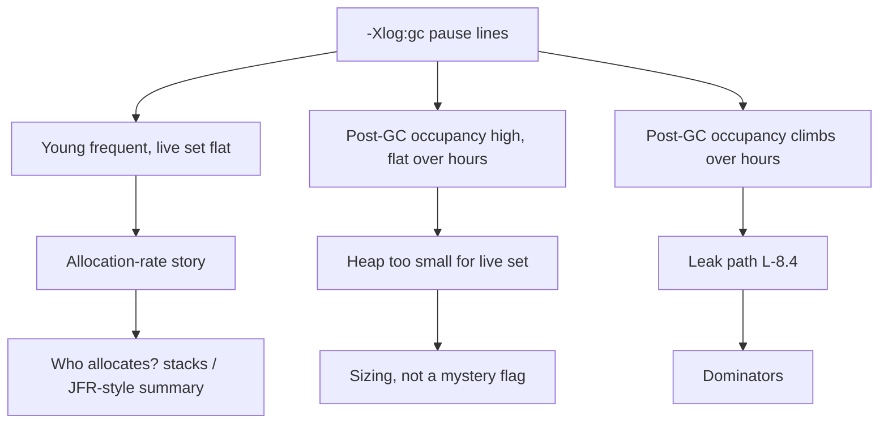

# L-8.5 — GC pauses

**Module:** 08 — JVM Troubleshooting  
**Duration:** 30 minutes  
**Case study:** BayPay Financial Services (fictional)

---

## Why this matters

Merchants feel G1 as **p99 authorize latency**, not as a collector brand. When `pay-prod-east-2` pauses, Riley must tell three stories apart: **allocation rate** too high for the young gen, **heap too small** for the live set, or a **leak** that makes every collection less effective (L-8.4). Module 7 taught you to *observe* GC. This lesson teaches you to *read* `-Xlog:gc` and refuse “tune G1” until the log names which story you are in.

---

## Learning objectives

- Read a G1 pause line: pause time, heap before/after, and which generation worked.
- Separate allocation-rate pain from a heap that cannot hold the live set from a leak.
- Use `User=` / `Sys=` on GC lines so you do not confuse pause with CPU saturation (L-8.3).
- Choose a next measurement (allocation rate, live set, histogram) instead of a flag from memory.

---

## Concept explanation

BayPay’s teaching JVM is **Java 21, G1 by default**. G1 stops application threads for *pauses* (young, mixed, and rare full). Concurrent marking runs beside the app and shows up as GC *CPU*, not always as a stop-the-world hitch.

A typical log line (shape, not a pack answer) carries:

| Token | Meaning |
|---|---|
| `Pause Young (Normal)` / `Mixed` / `Full` | What the collector did |
| `123.4ms` | Stop-the-world pause Avery Chen felt |
| `512M->256M` | Heap before → after |
| `Eden` / `Old` occupancy | Whether you reclaimed young junk or failed to |
| `User` / `Sys` / `Real` | CPU vs wall. Real ≈ pause; User can be higher with parallel GC threads |

**Allocation rate** is bytes allocated per second. High rate + small Eden = frequent young pauses. Each pause may be short (8–20 ms) but p99 authorize climbs because *every* request can hit one. The live set after GC is stable. Histogram between GCs looks like churn: lots of short-lived `byte[]`, not a climbing old gen.

**Heap too small** is a live set that *after* a successful collection still occupies most of `-Xmx`. Pauses get longer; you see mixed/full more often; throughput falls. This is not a leak if the post-GC baseline is flat across hours.

**Leak** is a post-GC baseline that *climbs* (L-8.4). Collections look “worse” because they are succeeding at freeing unreachable objects — there are just fewer of those each hour.

To-space exhaustion, evacuation failure, and full GC are **severity**, not a root cause. They say G1 ran out of room to copy. You still pick allocation vs live-set vs leak from before/after and from a second hour of logs.

CPU 98% with 10 ms pauses is L-8.3, not this lesson. Long pauses with low application CPU is this lesson.

---

## Visual explanation



Alt text: GC logs fork into allocation-rate (frequent young, flat live set), heap too small (high flat post-GC occupancy), or leak (climbing post-GC occupancy).

---

## Architecture

Each replica has its own heap and its own GC log. Canary-only pause inflation points at the canary build or its traffic mix. A shared database stall can *look* like pauses if threads sit in I/O; the GC log will be calm. Always pair `-Xlog:gc` with request latency **and** a thread dump if you might be in L-8.1 / L-8.6.

Container memory (L-8.7) caps the process. If you grow `-Xmx` to chase pauses, you can steal native headroom and get a cgroup kill. Pause remediation and container sizing are one conversation.

Stabilization: drain east-2, rollback the canary if Jordan’s release correlates, or shed a chatty feature flag. Remediation: cut allocation, size the heap to the live set plus headroom, or remove a keeper. “Lower `MaxGCPauseMillis`” without a story is not remediation.

---

## Production example

Authorize p99 on east-2 jumps from 40 ms to 400 ms. Priya sees G1 young pauses every 80 ms at 30–60 ms each. Heap after GC returns to ~300 MB every time, for two hours. Riley’s hypothesis: allocation rate, not a leak. Next investigation: what allocates (log line rate, a histogram of *churn*, a deploy that added chatty per-request work).

A different afternoon: after GC the heap sits at 1.7 GB of a 1.8 GB max, pauses become mixed then full, baseline is the same at 10:00 and 16:00. That is live-set versus `-Xmx`, not L-8.4.

A third shape: baseline 400 MB at noon, 900 MB at 15:00, 1.4 GB at 18:00 after full GCs. That is L-8.4. Tuning G1 will not save Avery Chen overnight.

---

## Code/configuration example

Enable what RUNTIME.md already listed (laptop or pack-provided `gc.log`):

```text
-Xlog:gc*:file=gc.log:time,uptime,level,tags
```

Read with `grep` on a synthetic file:

```text
grep Pause gc.log | tail
```

Illustrative lines — three *shapes*, none of them a pack RCA:

```text
[2026-09-03T16:21:01.200-0700] GC(812) Pause Young (Normal) (G1 Evacuation Pause)
  18M->12M(256M) 9.1ms User=0.04s Sys=0.00s Real=0.01s

[2026-09-03T16:21:02.010-0700] GC(813) Pause Young (Normal) (G1 Evacuation Pause)
  19M->12M(256M) 8.7ms User=0.04s Sys=0.00s Real=0.01s

[2026-09-03T18:05:44.100-0700] GC(2201) Pause Full (G1 Compaction Pause)
  1740M->1690M(1800M) 812.0ms User=2.10s Sys=0.02s Real=0.81s
```

The first pair: frequent, small, live set ~12M — allocation/Eden story if this continues at high rps. The full line: almost no reclaim, heap nearly maxed — live-set or leak; you need the *slope* across hours to tell them apart.

Allocation rate you can estimate:

```text
# (heap_before - heap_after) / time_between_young_pauses
# plus what was already live. Packs may print this already.
```

Do not turn on `PrintGCDetails` folklore flags. Unified logging is `-Xlog:gc*`.

---

## Trade-offs

| Move | Helps | Hurts |
|---|---|---|
| Cut per-request allocation | Pause frequency | Needs a code owner |
| Raise `-Xmx` | Live-set fit | cgroup OOM if you forget native (L-8.7) |
| Larger Eden / pause goal | Sometimes young frequency | Can delay mixed GC; not a leak fix |
| Rollback canary | Stops a chatty build | Must keep the log for RCA |
| Parallel GC threads | User CPU during pause | Starves application cores (L-8.3) |

---

## Failure modes

- Tuning `MaxGCPauseMillis` on a climbing live set.
- Calling every full GC a leak.
- Ignoring `Real=` vs `User=` and arguing with L-8.3’s CPU graph.
- Reading a log from east-1 because the canary disk was full.
- Raising `-Xmx` to the cgroup limit to “stop pauses.”
- Treating a 9 ms young pause as the reason authorize took 5 seconds (look at threads).

---

## Security/reliability implications

GC logs are usually low-secret. They still timestamp deploys and heap sizes; keep them with the incident. Reliability: a canary with 800 ms full pauses will fail readiness if the probe waits on a request thread. That is correct behavior. Do not disable the probe to hide pauses.

SLO design: budget pause time *inside* authorize p99. If you promise 200 ms p99, a 150 ms mixed pause already consumed the budget. That is why allocation and live-set are product issues, not “JVM hygiene.”

---

## Interview perspective

**Engineer.** I read `-Xlog:gc` for pause ms and heap before/after. Frequent young vs full vs climbing baseline are different.

**Senior.** I compute a rough allocation rate and compare post-GC heap over hours. I will not tune G1 to hide a leak or a 2 GB live set in a 1 GB heap.

**Staff.** I pair GC logs with thread dumps when latency ≫ pause time. I will not grow `-Xmx` into the cgroup. I gate the next file.

**Principal.** GC is an SLO input. I fund live-set dashboards and canary rollback, not a culture of mystery flags.

---

## Key takeaways

- Three stories: allocation rate, heap too small, leak. The log plus time tells them apart.
- Pause ms is what merchants feel; GC CPU is L-8.3’s pie.
- Post-GC baseline slope is the leak test.
- Do not chase G1 flags before you name the story.
- A lucky “GC” label does not max Diagnostic method.

---

## Knowledge check

1. Young pauses every 100 ms at 10 ms, post-GC heap 200 MB all afternoon. Allocation, too-small heap, or leak?
2. Why is an 800 ms full GC that reclaims 20 MB of a 1.8 / 1.8 GB heap not yet proof of a leak?
3. Authorize took 4 s; the matching GC line is 11 ms. What do you open next?

<details>
<summary>Spoiler — answers</summary>

1. Allocation-rate (or Eden) story. The live set is flat.
2. It may be a live set that does not fit. You need that baseline over hours (or a dominator) before you say leak.
3. A thread dump / downstream gauges. Pause time does not explain the remaining ~4 s.

</details>

---

## Related lab

[INCIDENT-805](../../../../labs/INCIDENT-805/README.md) — excessive GC *symptoms* on the canary. Read the log in gate order. Do not open `solutions/INCIDENT-805/` until you have named allocation vs live-set vs leak from evidence.

---

## Related PAKS

Optional: `docs/27-production-failures/failure-analysis-methodology.md`. Story-before-flags is the methodology. Not required to finish INCIDENT-805.
